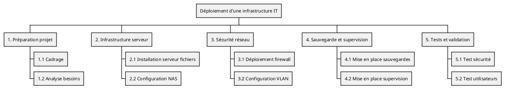

# challenges C01

Ces challenges sont un projet fil rouge a suivre toute la saison C01

## Énoncé E1

### Contexte

Vous êtes responsable de l'informatique au sein d'un campus de formation professionnelle (en présentiel 😁).

Le campus compte en permanence environ 500 personnes, entre les salariés (une quinzaine), les formateurs (freelances, formateurs occasionnels) et les apprenants (formation continue et alternance).

La direction vous demande de moderniser l’infrastructure IT du campus pour accueillir de nouveaux services numériques : serveurs fichiers, NAS, firewall, VLAN et accès sécurisé Wi-Fi.

Dans votre service, vous accueillez actuellement un alternant.

### Consignes

Rédigez la fiche de cadrage du projet comprenant :

- Objectifs du projet
- Périmètre et exclusions
- Parties prenantes (interne / externe)
- Livrables principaux
- Contraintes Qualité / Coût / Délai

### Notes

- Vous pouvez rédiger votre document avec l'outil de votre choix (Google Doc, fichier Markdown...)
- Gardez bien le fichier : il servira pour la suite !
- Prenez le temps de chercher de la documentation sur le sujet
- On ne demande pas d'être exhaustif, chaque partie peut ne contenir que quelques points

À faire également
Lire le Manifeste pour le développement Agile de logiciels: https://agilemanifesto.org/iso/fr/manifesto.html

Commenter le Manifeste (questions, points positifs, critiques…) dans un fichier (libre choix de l’outil).

# Proposition de correction - Challenge E01

## Correction

## Fiche de cadrage du projet

### Contexte

Le campus souhaite moderniser son infrastructure IT afin de supporter de nouveaux services numériques répondant aux besoins des utilisateurs. Ce projet vise à garantir la disponibilité et la sécurité des services informatiques, tout en respectant les contraintes budgétaires et temporelles imposées. L'infrastructure modernisée doit faciliter l'accès aux ressources numériques pour l'ensemble des utilisateurs : apprenants, formateurs et personnel administratif.

### Objectifs du projet

Les objectifs principaux du projet sont les suivants :

- Déployer une infrastructure IT moderne et sécurisée, adaptée aux besoins actuels et futurs du campus.
- Assurer la continuité de service pour garantir un fonctionnement sans interruption des activités pédagogiques et administratives.
- Garantir l'intégrité, la confidentialité et la disponibilité des données hébergées sur l'infrastructure.
- Permettre une meilleure collaboration entre les utilisateurs grâce à un accès simplifié et sécurisé aux services numériques.

### Périmètre du projet

#### Inclus dans le périmètre

Le projet inclut la mise en œuvre des éléments suivants :

- **Serveur de fichiers centralisé** : mise en place d'un serveur permettant le stockage centralisé et le partage sécurisé des documents pour l'ensemble des utilisateurs du campus.
- **NAS (Network Attached Storage)** : déploiement d'une solution de stockage réseau dédiée à la sauvegarde automatique et à la restauration des données critiques.
- **Firewall avec segmentation VLAN** : installation et configuration d'un pare-feu pour sécuriser le réseau, accompagné d'une segmentation en réseaux virtuels (VLAN) pour isoler les différents types de trafic (administration, pédagogie, invités).
- **Accès Wi-Fi sécurisé** : déploiement d'un réseau sans fil couvrant l'ensemble du campus, avec authentification sécurisée et gestion des accès différenciés selon les profils utilisateurs.
- **Supervision et monitoring** : mise en place d'outils de surveillance de l'infrastructure permettant de détecter les incidents et d'anticiper les pannes.

#### Exclus du périmètre

Les éléments suivants sont explicitement exclus du périmètre du projet :

- **Gestion des postes utilisateurs** : l'administration, la maintenance et le support des ordinateurs individuels ne font pas partie de ce projet.
- **Migration d'anciennes applications non critiques** : seules les applications essentielles au fonctionnement du campus seront prises en compte.
- **Développement d'applications métier spécifiques** : aucun développement logiciel sur mesure n'est prévu dans le cadre de ce projet.

### Parties prenantes

Les parties prenantes du projet se répartissent en acteurs internes et externes :

- **Direction du campus** : elle assure le rôle de sponsor du projet, valide les orientations stratégiques et arbitre les décisions importantes concernant le budget et les priorités.
- **Service IT** : composé des administrateurs systèmes et réseaux, ainsi que du responsable technique, ce service pilote la conception, le déploiement et la maintenance de l'infrastructure. L'alternant participe activement au projet sous supervision.
- **Fournisseurs externes** : ils assurent la fourniture du matériel réseau (switchs, routeurs, points d'accès Wi-Fi), des serveurs, du NAS, du firewall et des licences logicielles nécessaires.
- **Utilisateurs finaux** : les apprenants, les formateurs et le personnel administratif sont les bénéficiaires directs des services déployés. Leurs retours d'expérience permettront d'ajuster les solutions mises en place.

### Livrables principaux

Les livrables attendus tout au long du projet sont les suivants :

- **Fiche de cadrage du projet** : document définissant le contexte, les objectifs, le périmètre et les contraintes du projet.
- **WBS (Work Breakdown Structure)** : décomposition structurée du projet en tâches et sous-tâches, accompagnée d'un diagramme de Gantt pour planifier les différentes phases dans le temps.
- **Matrice RACI** : tableau précisant les rôles et responsabilités de chaque partie prenante (Responsable, Autorité, Consulté, Informé) pour chaque tâche du projet.
- **Registre des risques avec plan de traitement** : identification des risques potentiels (techniques, organisationnels, budgétaires) et définition des actions préventives ou correctives associées.
- **Mini-plan de reprise d'activité (PRA) et plan de continuité d'activité (PCA)** : documentation des procédures à suivre en cas d'incident majeur pour assurer la continuité des services critiques.
- **Tableau de bord de suivi de projet** : outil de pilotage permettant de suivre l'avancement du projet, les écarts par rapport au planning, le budget consommé et les indicateurs de qualité.

### Contraintes Qualité, Coût et Délai (QCD)

Le projet est soumis aux contraintes suivantes, qui constituent le triangle QCD :

- **Qualité** : l'infrastructure déployée doit être sécurisée, fiable et conforme aux standards techniques du secteur (normes ISO, bonnes pratiques ITIL, etc.). La solution doit garantir la disponibilité des services et la protection des données.
- **Coût** : le projet doit respecter le budget alloué par la direction. Les achats de matériel et de licences doivent être optimisés en comparant différentes offres et en privilégiant un bon rapport qualité-prix.
- **Délai** : le projet doit être réalisé dans un délai contraint de 5 semaines, de la phase de conception jusqu'à la mise en production de l'infrastructure.

### Méthode de gestion recommandée

Pour mener à bien ce projet, plusieurs approches méthodologiques peuvent être combinées :

- **Cycle en V** : cette méthode séquentielle structure le projet en phases distinctes (analyse des besoins, conception, réalisation, tests, validation). Elle permet de garantir que chaque étape est validée avant de passer à la suivante, ce qui est particulièrement adapté aux projets d'infrastructure où la sécurité et la fiabilité sont critiques.
- **Méthode Agile** : l'utilisation de sprints courts permet d'apporter de la flexibilité au projet. Des ajustements peuvent être réalisés rapidement en fonction des retours terrain ou des contraintes techniques découvertes en cours de route.
- **Approche DevOps** : cette approche favorise l'automatisation de la configuration des serveurs, du déploiement des services et des tests. Elle permet de gagner du temps, de réduire les erreurs humaines et d'assurer une mise en production plus rapide et fiable.

### Commentaires sur l'application des principes Agile

Bien que le projet repose sur une infrastructure technique, certains principes du manifeste Agile peuvent être appliqués avec profit :

- **Priorisation des fonctionnalités critiques** : la sécurité des accès (firewall, VLAN, Wi-Fi sécurisé) et la continuité de service (NAS, sauvegardes) doivent être traitées en priorité. Les fonctionnalités secondaires peuvent être déployées dans un second temps.
- **Collaboration continue** : des échanges réguliers entre l'équipe IT et les utilisateurs finaux (formateurs, apprenants, personnel) permettent de valider que les solutions répondent aux besoins réels et d'ajuster les configurations si nécessaire.
- **Réponse rapide aux changements** : la capacité à réagir rapidement face aux imprévus techniques (incompatibilité matérielle, problème de configuration, changement de priorité) est essentielle pour respecter le délai de 5 semaines.

----

## Énoncé E2

### Contexte

Vous êtes responsable de l'informatique au sein d'un campus de formation professionnelle (en présentiel 😁).

Le campus compte en permanence environ 500 personnes, entre les salariés (une quinzaine), les formateurs (freelances, formateurs occasionnels) et les apprenants (formation continue et alternance).

La direction vous demande de moderniser l'infrastructure IT du campus pour accueillir de nouveaux services numériques : serveurs fichiers, NAS, firewall, VLAN et accès sécurisé Wi-Fi.

Dans votre service, vous accueillez actuellement un alternant.

### Consignes

Hier vous avez créé la note de cadrage du projet.

Aujourd'hui on vous demande de créer un WBS avec plusieurs niveaux de tâches :

- Niveau 1 : grands lots (serveur, NAS, firewall, réseau)
- Niveau 2-3 : tâches et sous-tâches

### Notes

- Vous pouvez utiliser les outils de votre choix pour la représentation graphique
- Gardez bien le fichier : il servira pour la suite !
- Prenez le temps de chercher de la documentation sur le sujet


# Proposition de correction - Challenge E02

## Énoncé

### Contexte

Vous êtes responsable de l'informatique au sein d'un campus de formation professionnelle (en présentiel 😁).

Le campus compte en permanence environ 500 personnes, entre les salariés (une quinzaine), les formateurs (freelances, formateurs occasionnels) et les apprenants (formation continue et alternance).

La direction vous demande de moderniser l'infrastructure IT du campus pour accueillir de nouveaux services numériques : serveurs fichiers, NAS, firewall, VLAN et accès sécurisé Wi-Fi.

Dans votre service, vous accueillez actuellement un alternant.

### Consignes

Hier vous avez créé la note de cadrage du projet.

Aujourd'hui on vous demande de créer un WBS avec plusieurs niveaux de tâches :

- Niveau 1 : grands lots (serveur, NAS, firewall, réseau)
- Niveau 2-3 : tâches et sous-tâches

### Notes

- Vous pouvez utiliser les outils de votre choix pour la représentation graphique
- Gardez bien le fichier : il servira pour la suite !
- Prenez le temps de chercher de la documentation sur le sujet

---

## Correction

### Note 

Le WBS (Work Breakdown Structure) est un outil essentiel en gestion de projet qui permet de décomposer le projet en lots de travail, tâches et sous-tâches. Cette décomposition hiérarchique facilite la planification, l'estimation des charges et l'attribution des responsabilités.

---

### WBS - Structure Work Breakdown

Le WBS du projet de modernisation de l'infrastructure IT se décompose en 5 grands lots, eux-mêmes subdivisés en tâches principales.

#### Structure hiérarchique
```
1. Préparation projet
   1.1 Cadrage
   1.2 Analyse besoins

2. Infrastructure serveur
   2.1 Installation serveur fichiers
   2.2 Configuration NAS

3. Sécurité réseau
   3.1 Déploiement firewall
   3.2 Configuration VLAN

4. Sauvegarde et supervision
   4.1 Mise en place sauvegardes
   4.2 Mise en place supervision

5. Tests et validation
   5.1 Test sécurité
   5.2 Test utilisateurs
```

#### Explication des lots de travail

**Lot 1 - Préparation projet** : ce lot regroupe toutes les activités préalables au déploiement technique. Il comprend la rédaction de la fiche de cadrage (déjà réalisée) et l'analyse détaillée des besoins des utilisateurs pour dimensionner correctement l'infrastructure.

**Lot 2 - Infrastructure serveur** : ce lot concerne la mise en place des solutions de stockage. Il inclut l'installation et la configuration du serveur de fichiers centralisé, ainsi que le déploiement du NAS pour la sauvegarde des données.

**Lot 3 - Sécurité réseau** : ce lot traite de la sécurisation de l'infrastructure réseau. Il comprend le déploiement du firewall pour protéger le campus contre les menaces externes, et la mise en place de VLAN pour segmenter le réseau et isoler les différents types de trafic.

**Lot 4 - Sauvegarde et supervision** : ce lot assure la pérennité et la surveillance de l'infrastructure. Il inclut la configuration des politiques de sauvegarde automatique et la mise en place d'outils de monitoring pour détecter les incidents.

**Lot 5 - Tests et validation** : ce lot final valide le bon fonctionnement de l'infrastructure avant sa mise en production. Il comprend des tests de sécurité (tests d'intrusion, vérification des règles firewall) et des tests utilisateurs pour s'assurer que les services répondent aux besoins.

---

### Représentation graphique avec PlantUML

PlantUML est un outil permettant de générer des diagrammes à partir de code textuel. Voici le code pour générer le WBS du projet :


#### Comment utiliser ce code PlantUML

Pour générer le diagramme à partir de ce code, vous pouvez :

- Utiliser l'éditeur en ligne PlantUML : https://www.plantuml.com/plantuml/uml/
- Installer l'extension PlantUML dans VS Code
- Utiliser un plugin PlantUML dans votre IDE préféré

Le diagramme généré affichera une structure arborescente claire du projet, facilitant la communication avec les parties prenantes.

---

### Points d'attention

Quelques éléments à garder à l'esprit lors de la création d'un WBS :

- Chaque tâche doit être clairement définie et mesurable
- Les lots de travail doivent être exhaustifs et couvrir l'ensemble du périmètre du projet
- La décomposition doit s'arrêter à un niveau permettant une estimation réaliste des charges
- Le WBS servira de base pour créer le planning (diagramme de Gantt) et attribuer les responsabilités (matrice RACI)


--------

# challenge E03

## Énoncé

### Contexte

Vous êtes responsable de l'informatique au sein d'un campus de formation professionnelle (en présentiel 😁).

Le campus compte en permanence environ 500 personnes, entre les salariés (une quinzaine), les formateurs (freelances, formateurs occasionnels) et les apprenants (formation continue et alternance).

La direction vous demande de moderniser l’infrastructure IT du campus pour accueillir de nouveaux services numériques : serveurs fichiers, NAS, firewall, VLAN et accès sécurisé Wi-Fi.

Dans votre service, vous accueillez actuellement un alternant.

### Consignes

Vous avez créé la note de cadrage du projet ainsi que le WBS.

Aujourd'hui on s'attaque à l'analyse des risques !

1. Listez au moins 10 risques du projet (technique, humain, organisationnel)
2. Évaluez chaque risque :
   - Probabilité : faible/moyenne/forte
   - Impact : faible/moyen/critique
   - Criticité = probabilité × impact
3. Classez les risques par criticité

**Livrable attendu** : registre des risques avec évaluation

### Notes

- Vous pouvez utiliser les outils de votre choix pour le registre
- Gardez bien le fichier, ça peut toujours servir !
- Prenez le temps de chercher de la documentation sur le sujet

