# Challenge — Segmentation VLAN & Contrôle d'accès (ACL)

## Contexte

Vous êtes technicien réseau et vous intervenez chez **MédiaSud**, une PME de 45 collaborateurs spécialisée dans l'édition numérique. Jusqu'ici, l'ensemble du réseau interne fonctionnait sur un unique réseau plat (flat network) : tous les postes, serveurs et équipements partagent le même domaine de broadcast.

Suite à un audit de sécurité, plusieurs problèmes ont été identifiés :

- Un stagiaire a accidentellement accédé au serveur de paie depuis son poste.
- Des visiteurs connectés au Wi-Fi pouvaient voir les partages réseau internes.
- Aucune restriction n'existe sur l'accès à l'administration des équipements réseau.

Le responsable IT vous confie la mission de **segmenter le réseau par service** et de **mettre en place des règles de filtrage** pour appliquer une politique d'accès claire et justifiable.

---

## Objectifs pédagogiques

À l'issue de ce challenge, vous devez être capable de :

1. Créer et configurer des VLANs sur un switch de niveau 2.
2. Mettre en place le routage inter-VLAN (router-on-a-stick ou switch L3).
3. Rédiger et appliquer des ACL standard et étendues sur un routeur Cisco.
4. Justifier chaque règle de filtrage par rapport à une politique d'accès donnée.
5. Documenter votre travail de manière professionnelle.

# RENDU :

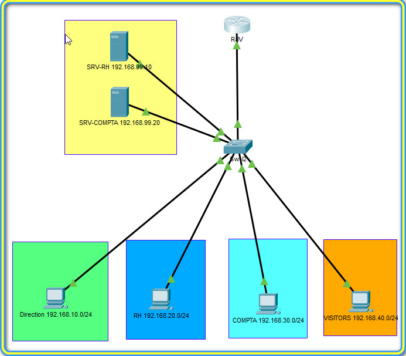

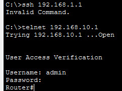

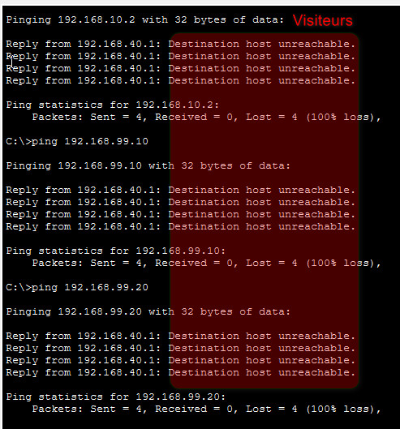

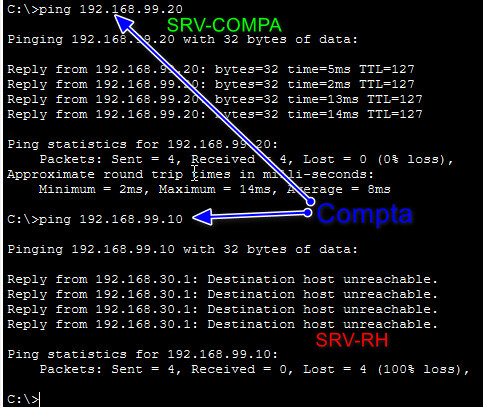


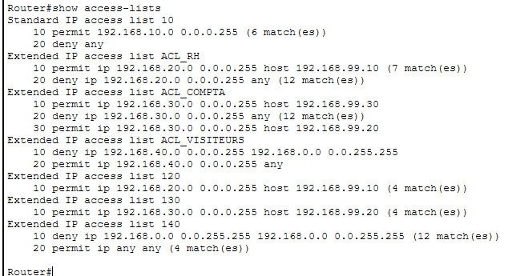

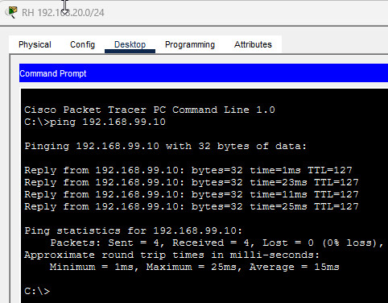

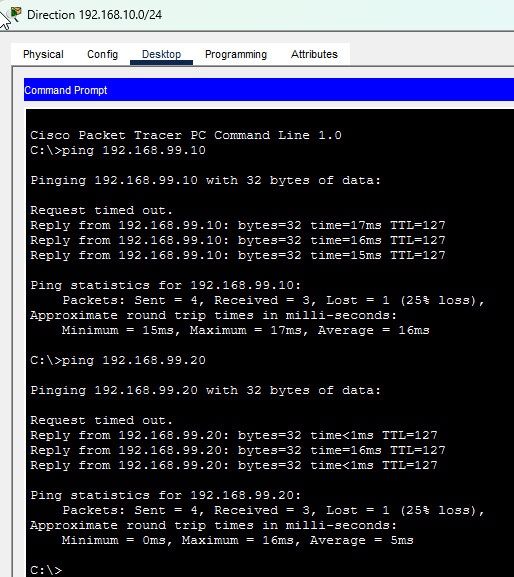

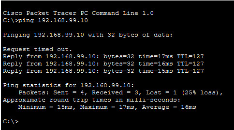

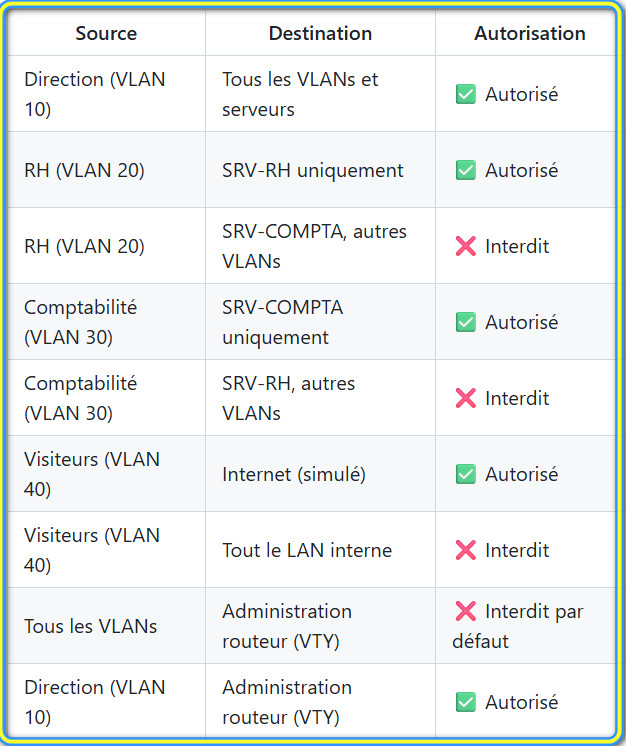

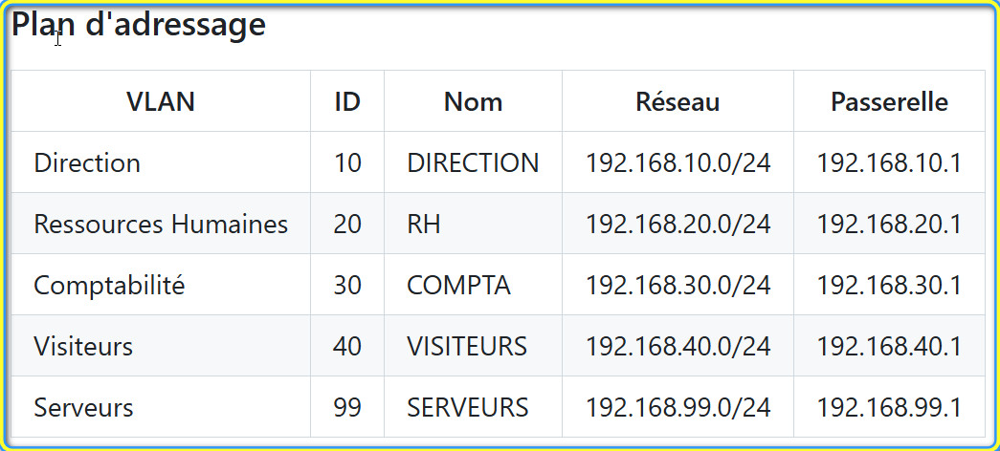

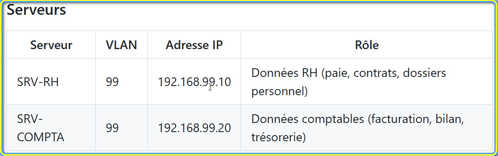


---

## Ressources utiles

- [Documentation Cisco — ACL étendues](https://www.cisco.com/c/en/us/support/docs/security/ios-firewall/23602-confaccesslists.html)

---

## Environnement technique

| Élément | Spécification |
|---|---|
| **Outil** | Cisco Packet Tracer (version 8.x recommandée) |
| **Routeur** | 1× routeur (ex : 2911) pour le routage inter-VLAN |
| **Switch** | 1× switch L2 (ex : 2960) — ou L3 si vous souhaitez aller plus loin |
| **Serveurs** | 2× serveurs : 1 serveur RH, 1 serveur Comptabilité |
| **Postes** | 4× PC : 1 Direction, 1 RH, 1 Comptabilité, 1 Visiteur |

---

## Topologie à réaliser

Vous devez construire la topologie suivante dans Packet Tracer :

```
                    [Routeur Inter-VLAN]
                          │
                    Trunk (802.1Q)
                          │
                     [Switch L2]
                    ┌──┬──┬──┬──┐
                    │  │  │  │  │
                  DIR RH CPT VIS SRV
```

### Plan d'adressage

| VLAN | ID | Nom | Réseau | Passerelle |
|---|---|---|---|---|
| Direction | 10 | DIRECTION | 192.168.10.0/24 | 192.168.10.1 |
| Ressources Humaines | 20 | RH | 192.168.20.0/24 | 192.168.20.1 |
| Comptabilité | 30 | COMPTA | 192.168.30.0/24 | 192.168.30.1 |
| Visiteurs | 40 | VISITEURS | 192.168.40.0/24 | 192.168.40.1 |
| Serveurs | 99 | SERVEURS | 192.168.99.0/24 | 192.168.99.1 |

> **Note :** Vous êtes libre d'adapter les adresses IP, mais le plan doit rester cohérent et documenté.

### Serveurs

| Serveur | VLAN | Adresse IP | Rôle |
|---|---|---|---|
| SRV-RH | 99 | 192.168.99.10 | Données RH (paie, contrats, dossiers personnel) |
| SRV-COMPTA | 99 | 192.168.99.20 | Données comptables (facturation, bilan, trésorerie) |

---

## Politique d'accès à respecter

Voici la politique définie par le responsable IT. **Chaque règle doit être traduite en configuration ACL.**

| Source | Destination | Autorisation | Justification |
|---|---|---|---|
| Direction (VLAN 10) | Tous les VLANs et serveurs | ✅ Autorisé | La direction doit pouvoir accéder à l'ensemble des ressources internes |
| RH (VLAN 20) | SRV-RH uniquement | ✅ Autorisé | Le service RH n'a besoin que des données RH |
| RH (VLAN 20) | SRV-COMPTA, autres VLANs | ❌ Interdit | Principe du moindre privilège |
| Comptabilité (VLAN 30) | SRV-COMPTA uniquement | ✅ Autorisé | Le service compta n'a besoin que des données comptables |
| Comptabilité (VLAN 30) | SRV-RH, autres VLANs | ❌ Interdit | Principe du moindre privilège |
| Visiteurs (VLAN 40) | Internet (simulé) | ✅ Autorisé | Les visiteurs ne doivent accéder qu'à Internet |
| Visiteurs (VLAN 40) | Tout le LAN interne | ❌ Interdit | Isolation stricte du réseau invité |
| Tous les VLANs | Administration routeur (VTY) | ❌ Interdit par défaut | — |
| Direction (VLAN 10) | Administration routeur (VTY) | ✅ Autorisé | Seul le service IT (localisé en Direction) administre les équipements |

---

## Travail demandé

### Étape 1 — Construction de la topologie

- Placez les équipements dans Packet Tracer selon le schéma ci-dessus.
- Câblez correctement (trunk entre switch et routeur, access ports vers les postes/serveurs).
- Configurez les VLANs sur le switch et assignez les ports.

**Commandes de vérification :**

```
show vlan brief              ! Vérifier la liste des VLANs et l'affectation des ports
show interfaces trunk        ! Vérifier que le lien trunk est bien actif
```

### Étape 2 — Routage inter-VLAN

- Configurez les sous-interfaces sur le routeur (encapsulation 802.1Q).
- Attribuez les adresses IP des passerelles.
- Vérifiez que **tous les VLANs communiquent entre eux** avant de passer aux ACL (c'est indispensable pour valider la base).

**Commandes de vérification :**

```
show ip interface brief       ! Vérifier que chaque sous-interface est up/up avec la bonne IP
show running-config           ! Relire la configuration globale
```

> **⚠️ Important :** Ne passez à l'étape 3 que lorsque tous les postes peuvent pinguer tous les serveurs et toutes les passerelles. Si le routage ne fonctionne pas, les ACL ne pourront pas être testées correctement.

### Étape 3 — ACL standard (restriction de l'administration)

**Objectif :** Seul le réseau Direction (192.168.10.0/24) doit pouvoir accéder aux lignes VTY (Telnet/SSH) du routeur. Tous les autres réseaux doivent être refusés.

```
access-list 10 permit 192.168.10.0 0.0.0.255
```

**Rappel — Qu'est-ce qu'une ACL standard ?**

Une ACL standard filtre le trafic **uniquement sur l'adresse IP source**. Elle est identifiée par un numéro entre 1 et 99 (ou un nom). On l'utilise typiquement pour contrôler l'accès à l'administration d'un équipement.

**Syntaxe générale :**

```
access-list <numéro> permit|deny <adresse-source> <wildcard-mask>
```

Le **wildcard mask** est l'inverse du masque de sous-réseau : pour un /24 (255.255.255.0), le wildcard est `0.0.0.255`. Il indique quels bits de l'adresse doivent correspondre (0 = doit correspondre, 1 = indifférent).

**Marche à suivre :**

1. Créez une ACL standard numérotée (ex : `access-list 10 ...`) qui autorise (`permit`) le réseau 192.168.10.0/24.
2. Rappelez-vous qu'il existe un **deny implicite** à la fin de toute ACL : tout ce qui n'est pas explicitement autorisé sera refusé. Vous n'avez donc pas besoin d'ajouter un `deny any`.
3. Appliquez cette ACL sur les lignes VTY du routeur :

```
line vty 0 4
 access-class <numéro-ACL> in
 line vty 0 4
 access-class 10 in

```

> **💡 Astuce :** `access-class` (et non `ip access-group`) est la commande spécifique pour appliquer une ACL sur les lignes VTY.

**Commande de vérification :**

```
show access-lists             ! Afficher toutes les ACL et leurs compteurs (matches)
```

### Étape 4 — ACL étendues (filtrage inter-VLAN)

**Objectif :** Implémenter la politique d'accès du tableau ci-dessus en filtrant les flux entre VLANs.

**Rappel — Qu'est-ce qu'une ACL étendue ?**

Une ACL étendue filtre sur **l'adresse source, l'adresse de destination, le protocole et éventuellement le port**. Elle est identifiée par un numéro entre 100 et 199 (ou un nom). Elle offre un contrôle beaucoup plus fin qu'une ACL standard.

**Syntaxe générale :**

```
access-list <numéro> permit|deny <protocole> <source> <wildcard> <destination> <wildcard> [eq <port>]
```

**Exemples concrets pour vous guider :**

```
! Autoriser tout le trafic IP du réseau 192.168.10.0/24 vers n'importe quelle destination
access-list 110 permit ip 192.168.10.0 0.0.0.255 any

! Autoriser le trafic du réseau 192.168.20.0/24 vers un hôte précis uniquement
access-list 120 permit ip 192.168.20.0 0.0.0.255 host 192.168.99.10

! Refuser tout le reste (implicite, mais peut être écrit pour la lisibilité)
access-list 120 deny ip any any
```

**Règles importantes à connaître :**

- Les ACL sont évaluées **de haut en bas** : la première règle qui correspond est appliquée, les suivantes sont ignorées.
- Il y a toujours un **deny ip any any implicite** à la fin. Si vous voulez que certains flux passent, vous devez les autoriser explicitement **avant**.
- L'ordre des règles est donc crucial : placez les règles les plus spécifiques (`permit` vers un hôte précis) **avant** les règles générales (`deny any any`).

**Où et comment appliquer une ACL étendue ?**

Une ACL étendue s'applique sur une **interface** (ici, les sous-interfaces du routeur) avec un **sens** :

- `in` : le trafic est filtré **à l'entrée** de l'interface (quand il arrive du VLAN vers le routeur).
- `out` : le trafic est filtré **à la sortie** de l'interface (quand il quitte le routeur vers le VLAN).

```
interface GigabitEthernet0/0.20
 ip access-group <numéro-ACL> in
```

> **💡 Bonne pratique :** Appliquez les ACL étendues **le plus près possible de la source** du trafic, c'est-à-dire en `in` sur la sous-interface du VLAN concerné. Cela évite que le trafic indésirable traverse inutilement le routeur.

**Méthodologie recommandée :**

Pour chaque VLAN (sauf Direction qui a accès à tout), procédez ainsi :

1. **Identifiez** ce que le VLAN a le droit d'atteindre (d'après le tableau de politique).
2. **Écrivez les règles `permit`** correspondantes (les plus spécifiques d'abord).
3. **Le `deny any any` implicite** bloquera tout le reste automatiquement.
4. **Appliquez** l'ACL en `in` sur la sous-interface du VLAN source.

**Commandes de vérification :**

```
show access-lists             ! Voir toutes les ACL, leurs règles et le nombre de matches
show ip interface <interface>  ! Vérifier quelle ACL est appliquée sur quelle interface
show running-config           ! Relire la configuration complète
```

> **⚠️ Attention au trafic retour :** Si vous autorisez RH à accéder à SRV-RH, les réponses du serveur (trafic retour) doivent aussi pouvoir passer. Vérifiez que vos ACL ne bloquent pas les réponses. Si nécessaire, ajoutez une règle `permit` pour le trafic retour ou pensez au mot-clé `established`.

### Étape 5 — Tests de validation

Réalisez les tests suivants et consignez les résultats (capture d'écran ou tableau) :

| # | Test | Résultat attendu |
|---|---|---|
| 1 | Ping de Direction vers SRV-RH | ✅ Succès |
| 2 | Ping de Direction vers SRV-COMPTA | ✅ Succès |
| 3 | Ping de RH vers SRV-RH | ✅ Succès |
| 4 | Ping de RH vers SRV-COMPTA | ❌ Échec |
| 5 | Ping de Comptabilité vers SRV-COMPTA | ✅ Succès |
| 6 | Ping de Comptabilité vers SRV-RH | ❌ Échec |
| 7 | Ping de Visiteur vers n'importe quel serveur | ❌ Échec |
| 8 | Ping de Visiteur vers la passerelle Internet (simulée) | ✅ Succès |
| 9 | Telnet/SSH vers le routeur depuis Direction | ✅ Succès |
| 10 | Telnet/SSH vers le routeur depuis RH ou Visiteur | ❌ Échec |

> **💡 Conseil de débogage :** Si un test ne donne pas le résultat attendu, utilisez `show access-lists` pour observer les compteurs de chaque règle. Un compteur qui n'augmente pas signifie que le trafic ne correspond pas à cette règle. Vérifiez aussi le sens d'application (`in`/`out`) et l'interface concernée.


