## Atelier-NextCloud

##### Déploiement Nextcloud sur Ubuntu 24.04 LTS

## Prérequis


- VM Ubuntu 24.04 LTS créée dans Proxmox (8 GB RAM, 4 vCPU, 100 GB disque)
- Accès root ou utilisateur avec `sudo`
- Accès Internet depuis la VM
- Adresse IP de la VM (exemple utilisé dans ce guide : `10.0.0.124`)

------

## Étape 1 — Mise à jour du système


```
sudo apt update && sudo apt upgrade -y
sudo reboot
```


Après le redémarrage, se reconnecter en SSH.

------

## Étape 2 — Installation des paquets nécessaires


### 2.1 — Serveur web Apache


```
sudo apt install apache2 -y
sudo systemctl enable apache2
sudo systemctl start apache2
```


Vérifier qu'Apache fonctionne en accédant à `http://10.0.0.124` depuis un navigateur. La page par défaut d'Apache doit s'afficher.

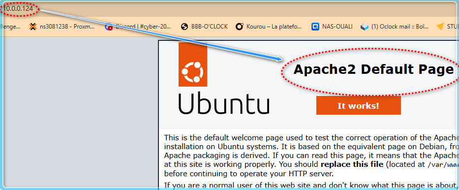

### 2.2 — PHP et ses extensions


Nextcloud nécessite PHP 8.x avec de nombreuses extensions :

```
sudo apt install php php-apcu php-bcmath php-cli php-common php-curl \
  php-gd php-gmp php-imagick php-intl php-mbstring php-mysql \
  php-xml php-zip php-redis php-bz2 libapache2-mod-php -y
```


Vérifier la version installée :

```
php -v
```

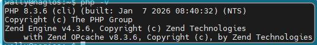

> Attendu : PHP 8.3.x sur Ubuntu 24.04.

### 2.3 — Serveur de base de données MariaDB


```
sudo apt install mariadb-server -y
sudo systemctl enable mariadb
sudo systemctl start mariadb
```


### 2.4 — Outils complémentaires


```
sudo apt install unzip curl wget sudo -y
```


------

## Étape 3 — Sécurisation de MariaDB


Lancer l'assistant de sécurisation :

```
sudo mysql_secure_installation
```

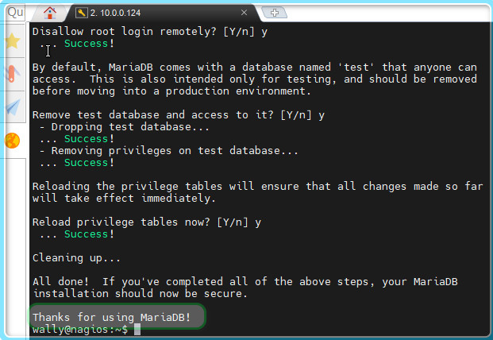

Réponses recommandées :

| Question                              | Réponse                            |
| ------------------------------------- | ---------------------------------- |
| Switch to unix_socket authentication? | `n`                                |
| Change the root password?             | `Y` → définir un mot de passe fort |
| Remove anonymous users?               | `Y`                                |
| Disallow root login remotely?         | `Y`                                |
| Remove test database?                 | `Y`                                |
| Reload privilege tables?              | `Y`                                |

------

## Étape 4 — Création de la base de données Nextcloud


```
sudo mysql -u root -p
```


Exécuter les commandes SQL suivantes (remplacer `MotDePasseSecurise` par un vrai mot de passe) :

```
CREATE DATABASE nextcloud CHARACTER SET utf8mb4 COLLATE utf8mb4_general_ci;
CREATE USER 'wallynextcloud'@'localhost' IDENTIFIED BY 'Rocknroll26!';
GRANT ALL PRIVILEGES ON nextcloud.* TO 'wallynextcloud'@'localhost';
FLUSH PRIVILEGES;
EXIT;
```


> **⚠️ Noter ces identifiants**, ils seront demandés lors de l'installation de Nextcloud.

------

## Étape 5 — Téléchargement de Nextcloud


### 5.1 — Récupérer la dernière version


```
cd /tmp
wget https://download.nextcloud.com/server/releases/latest.zip
```

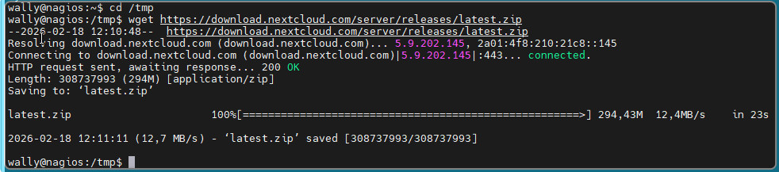

### 5.2 — Extraire et déplacer


```
unzip latest.zip
sudo mv nextcloud /var/www/html/nextcloud
```


### 5.3 — Créer le répertoire de données


```
sudo mkdir -p /var/www/html/nextcloud/data
```


### 5.4 — Appliquer les permissions


```
sudo chown -R www-data:www-data /var/www/html/nextcloud
sudo chmod -R 750 /var/www/html/nextcloud
```


------

## Étape 6 — Configuration d'Apache


### 6.1 — Créer le VirtualHost Nextcloud


```
sudo nano /etc/apache2/sites-available/nextcloud.conf
```


Contenu du fichier :

```
<VirtualHost *:80>
    ServerName 10.0.0.124
    DocumentRoot /var/www/html/nextcloud

    <Directory /var/www/html/nextcloud/>
        Require all granted
        AllowOverride All
        Options FollowSymLinks MultiViews

        <IfModule mod_dav.c>
            Dav off
        </IfModule>
    </Directory>

    ErrorLog ${APACHE_LOG_DIR}/nextcloud_error.log
    CustomLog ${APACHE_LOG_DIR}/nextcloud_access.log combined
</VirtualHost>
```


> **💡 Adapter** `ServerName` avec l'IP réelle de votre VM ou un nom de domaine si disponible.

### 6.2 — Activer le site et les modules nécessaires


```
sudo a2ensite nextcloud.conf
sudo a2dissite 000-default.conf
sudo a2enmod rewrite headers env dir mime setenvif
sudo systemctl restart apache2
```

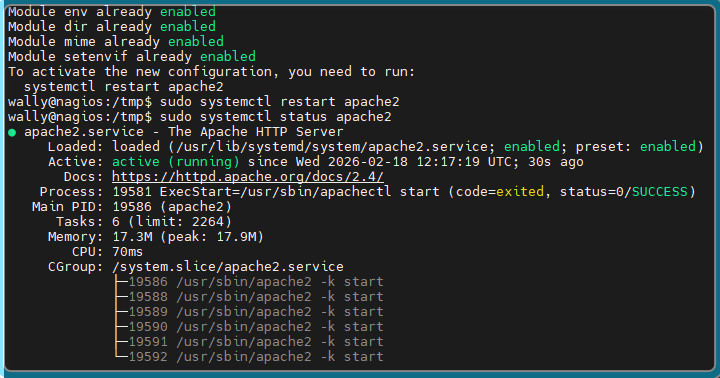

------

## Étape 7 — Configuration PHP recommandée


Éditer le fichier `php.ini` pour Apache :

```
sudo nano /etc/php/8.3/apache2/php.ini
```


Modifier les valeurs suivantes (utiliser `Ctrl+W` pour rechercher) :

```
memory_limit = 512M
upload_max_filesize = 16G
post_max_size = 16G
max_execution_time = 3600
date.timezone = Europe/Paris
output_buffering = Off
```


> Les valeurs élevées de `upload_max_filesize` et `post_max_size` sont nécessaires pour les vidéos pédagogiques d'EduLearn.

Redémarrer Apache :

```
sudo systemctl restart apache2
```


------

## Étape 8 — Installation de Nextcloud via le navigateur


### 8.1 — Accéder à l'interface


Ouvrir dans un navigateur : `http://10.0.0.124`

### 8.2 — Remplir le formulaire d'installation


| Champ                   | Valeur                                   |
| ----------------------- | ---------------------------------------- |
| Nom d'utilisateur admin | `admin`                                  |
| Mot de passe admin      | (choisir un mot de passe fort, le noter) |
| Répertoire des données  | `/var/www/html/nextcloud/data`           |
| Base de données         | **MySQL/MariaDB**                        |
| Utilisateur BDD         | `wallynextcloud`                         |
| Mot de passe BDD        | `MotDePasseSecurise`                     |
| Nom de la BDD           | `nextcloud`                              |
| Hôte BDD                | `localhost`                              |

Cliquer sur **Installer**.

> L'installation prend 1 à 3 minutes. Ne pas fermer le navigateur.
>
> 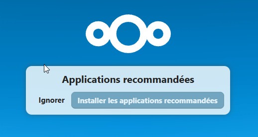

### 8.3 — Première connexion


Après l'installation, Nextcloud propose d'installer les applications recommandées. **Accepter** pour gagner du temps (Talk, Calendar, Contacts, etc. seront installés automatiquement).

------

## Étape 9 — Optimisations post-installation


### 9.1 — Configurer le cache mémoire (APCu + Redis)


Installer Redis :

```
sudo apt install redis-server -y
sudo systemctl enable redis-server
sudo systemctl start redis-server
```

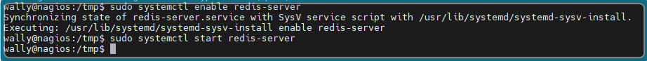

Éditer la configuration Nextcloud :

```
sudo nano /var/www/html/nextcloud/config/config.php
```


Ajouter **avant** la dernière ligne `);` :

```
  'memcache.local' => '\\OC\\Memcache\\APCu',
  'memcache.distributed' => '\\OC\\Memcache\\Redis',
  'memcache.locking' => '\\OC\\Memcache\\Redis',
  'redis' => [
      'host' => 'localhost',
      'port' => 6379,
  ],
```

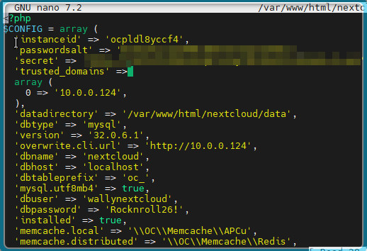

### 9.2 — Configurer le CRON


Nextcloud a besoin de tâches planifiées :

```
sudo crontab -u www-data -e
```


Ajouter cette ligne :

```
*/5 * * * * php -f /var/www/html/nextcloud/cron.php
```

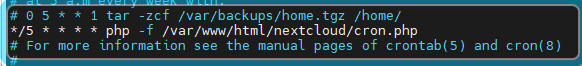

Puis dans Nextcloud : **Paramètres d'administration** → **Paramètres de base** → sélectionner **Cron** comme méthode d'arrière-plan.

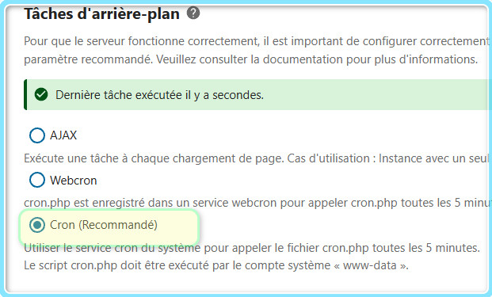

### 9.3 — Ajouter les domaines de confiance

Si la VM est accessible par plusieurs adresses (IP, nom DNS…) :

```
sudo nano /var/www/html/nextcloud/config/config.php
```


Vérifier/compléter le tableau `trusted_domains` :

```
  'trusted_domains' => [
      0 => '10.0.0.124',
      1 => 'nextcloud.edulearn.local',  // si DNS interne configuré
  ],
```


------

## Étape 10 — Installation des applications requises


Se connecter en tant qu'**admin** et aller dans **Applications** (icône en haut à droite → Applications).

### Applications à vérifier / installer


| Application                            | Rôle                            | Catégorie     |
| -------------------------------------- | ------------------------------- | ------------- |
| **Nextcloud Talk**                     | Chat + Visioconférence          | Communication |
| **Calendar**                           | Calendriers partagés            | Organisation  |
| **Contacts**                           | Carnet d'adresses               | Organisation  |
| **Deck**                               | Tableaux Kanban                 | Organisation  |
| **OnlyOffice** ou **Collabora Online** | Suite bureautique collaborative | Bureautique   |
| **Tasks**                              | Gestion de tâches               | Organisation  |

### Installation d'OnlyOffice (option recommandée pour le TP)


Dans **Applications** → rechercher **"Community Document Server"** → **Télécharger et activer**.

Puis rechercher **"OnlyOffice"** → **Télécharger et activer**.

> **⚠️ Community Document Server** est suffisant pour un TP (jusqu'à ~20 utilisateurs simultanés). En production, il faudrait un serveur OnlyOffice dédié.

Aller dans **Paramètres d'administration** → **OnlyOffice** pour vérifier que la connexion au serveur de documents est fonctionnelle.

------

## Étape 11 — Création des groupes


Dans Nextcloud : **Paramètres d'administration** → **Utilisateurs** → colonne de gauche **+ Ajouter un groupe**.

Créer les 5 groupes :

1. `Direction`

2. `Développement`

3. `Pédagogie`

4. `Marketing`

5. `Support`

   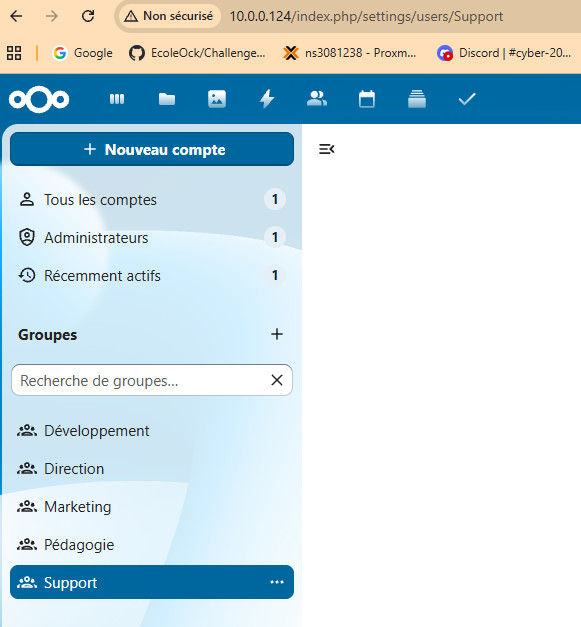

------

## Étape 12 — Création des 15 utilisateurs


Toujours dans **Utilisateurs** → **Nouvel utilisateur**.

Pour chaque utilisateur, renseigner : identifiant, nom affiché, mot de passe initial, groupe, quota.

### Direction


| Identifiant    | Nom affiché  | Groupe    | Quota |
| -------------- | ------------ | --------- | ----- |
| `alice.martin` | Alice Martin | Direction | 10 GB |
| `bob.durand`   | Bob Durand   | Direction | 10 GB |

### Développement


| Identifiant   | Nom affiché | Groupe        | Quota |
| ------------- | ----------- | ------------- | ----- |
| `charlie.dev` | Charlie Dev | Développement | 5 GB  |
| `diana.code`  | Diana Code  | Développement | 5 GB  |
| `ethan.tech`  | Ethan Tech  | Développement | 5 GB  |
| `fiona.web`   | Fiona Web   | Développement | 5 GB  |
| `greg.mobile` | Greg Mobile | Développement | 5 GB  |

### Pédagogie


| Identifiant   | Nom affiché | Groupe    | Quota |
| ------------- | ----------- | --------- | ----- |
| `hannah.prof` | Hannah Prof | Pédagogie | 8 GB  |
| `ivan.teach`  | Ivan Teach  | Pédagogie | 8 GB  |
| `julia.learn` | Julia Learn | Pédagogie | 8 GB  |
| `kevin.edu`   | Kevin Edu   | Pédagogie | 8 GB  |

### Marketing


| Identifiant     | Nom affiché   | Groupe    | Quota |
| --------------- | ------------- | --------- | ----- |
| `laura.market`  | Laura Market  | Marketing | 5 GB  |
| `michael.sales` | Michael Sales | Marketing | 5 GB  |
| `nina.comm`     | Nina Comm     | Marketing | 5 GB  |

### Support


| Identifiant  | Nom affiché | Groupe  | Quota |
| ------------ | ----------- | ------- | ----- |
| `oscar.help` | Oscar Help  | Support | 5 GB  |

> **💡 Conseil** : définir un mot de passe initial commun pour le TP (ex : `EduLearn2025!`) et cocher **"L'utilisateur doit changer son mot de passe à la prochaine connexion"**.
>
> 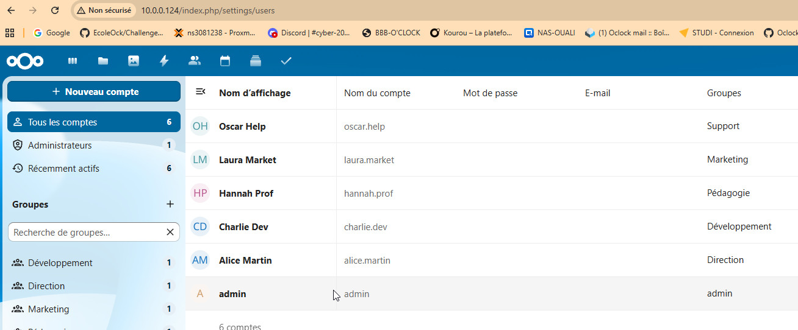

------

## Étape 13 — Création de l'arborescence de dossiers partagés


Se connecter en tant qu'**admin**.

### 13.1 — Créer les dossiers racines


Dans **Fichiers**, créer les dossiers suivants à la racine :

- `1. Direction`

- `2. Développement`

- `3. Pédagogie`

- `4. Marketing`

- `5. Support`

- `Commun`

  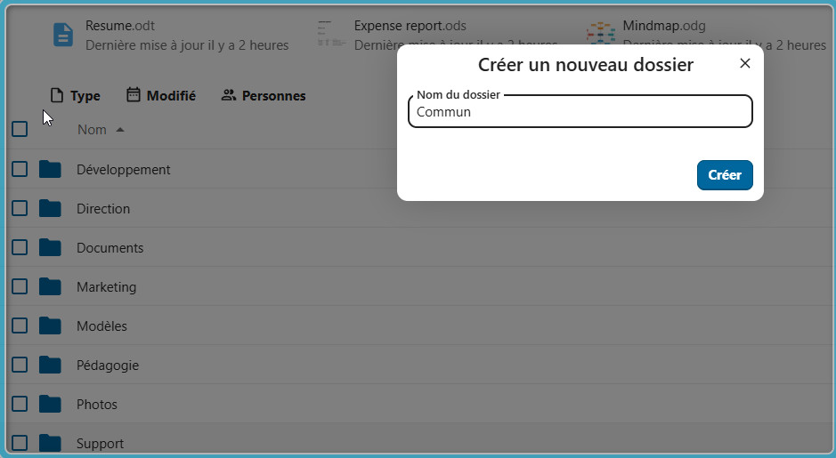

### 13.2 — Créer les sous-dossiers

**1. Direction** :

- `Administratif`
- `Finances`
- `Stratégie`

**2. Développement** :

- `Code Sources`
- `Documentation Technique`
- `Tests`

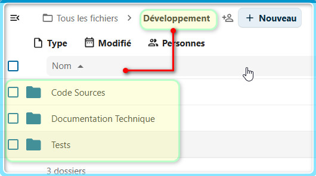

**3. Pédagogie** :

- `Contenus de Cours`
- `Vidéos Pédagogiques`
- `Exercices et Quiz`
- `Templates`

**4. Marketing** :

- `Campagnes`
- `Assets`
- `Présentations`

**5. Support** :

- `Documentation Client`

**Commun** :

- `Modèles Documents`
- `Ressources Partagées`

### 13.3 — Configurer les partages et permissions

Pour chaque dossier racine, cliquer sur **Partager** (icône de partage) :

**1. Direction** :

- Partager avec le groupe `Direction` → **Peut modifier** (lecture/écriture)

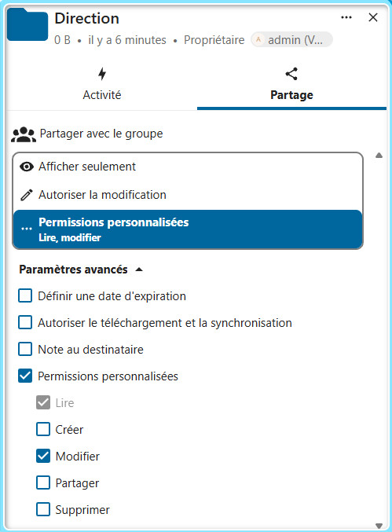

**2. Développement** :

- Partager avec le groupe `Développement` → **Peut modifier**

- Partager avec le groupe `Direction` → **Lecture seule** (décocher "Peut modifier")

  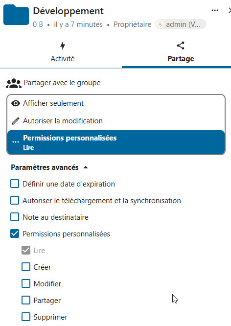

**3. Pédagogie** :

- Partager avec le groupe `Pédagogie` → **Peut modifier**
- Partager avec le groupe `Direction` → **Lecture seule**

**4. Marketing** :

- Partager avec le groupe `Marketing` → **Peut modifier**
- Partager avec le groupe `Direction` → **Lecture seule**

**5. Support** :

- Partager avec le groupe `Support` → **Peut modifier**
- Partager avec le groupe `Direction` → **Lecture seule**

**Commun** :

- Partager avec les groupes `Direction`, `Développement`, `Pédagogie`, `Marketing`, `Support` → **Peut modifier**

> **⚠️ Point clé** : ne PAS partager "2. Développement" avec Marketing, ni "4. Marketing" avec Développement, etc. Seule la Direction a une vue transversale.

------

## Étape 14 — Configuration des conversations Talk


Dans l'application **Talk** (icône bulle de conversation) :

### Créer les 4 conversations

1. **Général EduLearn** (type : groupe)

   - Ajouter : tous les utilisateurs (ou tous les groupes)

2. **Équipe Dev** (type : groupe)

   - Ajouter : groupe `Développement` + groupe `Direction`

3. **Équipe Pédagogie** (type : groupe)

   - Ajouter : groupe `Pédagogie` + groupe `Direction`

4. **Direction** (type : groupe)

   - Ajouter : groupe `Direction` uniquement

     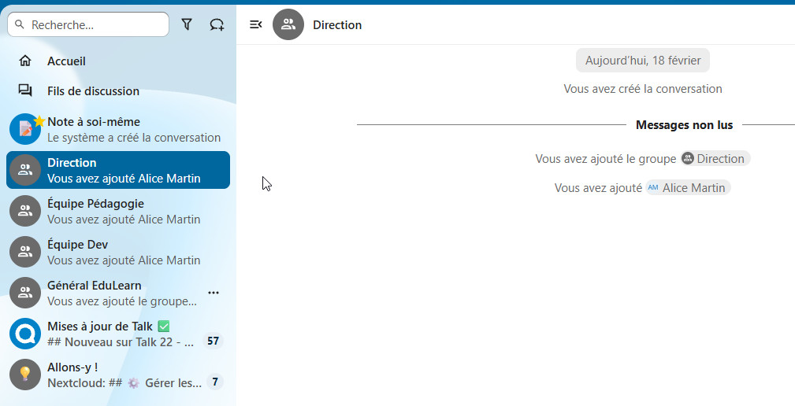

------

## Étape 15 — Création des calendriers partagés


Dans l'application **Calendrier** :

### 15.1 — Créer les calendriers

Cliquer sur **+ Nouveau calendrier** dans la barre latérale :

1. **Réunions Équipe**
2. **Congés et Absences**
3. **Événements Marketing**

### 15.2 — Configurer les partages

Pour chaque calendrier, cliquer sur les **trois points** → **Partager** :

**Réunions Équipe** :

- Partager avec tous les groupes → permission **Peut modifier**

**Congés et Absences** :

- Partager avec tous les groupes → permission **Lecture seule**
- Partager avec le groupe `Direction` → permission **Peut modifier**

**Événements Marketing** :

- Partager avec le groupe `Marketing` → permission **Peut modifier**
- Partager avec les autres groupes → permission **Lecture seule**

### 15.3 — Créer les événements test

Dans le calendrier **Réunions Équipe** :

- **Daily Standup Dev** : lundi au vendredi, 9h30–9h45, récurrent

- **Rétrospective Sprint** : vendredi 16h–17h, récurrence toutes les 2 semaines

  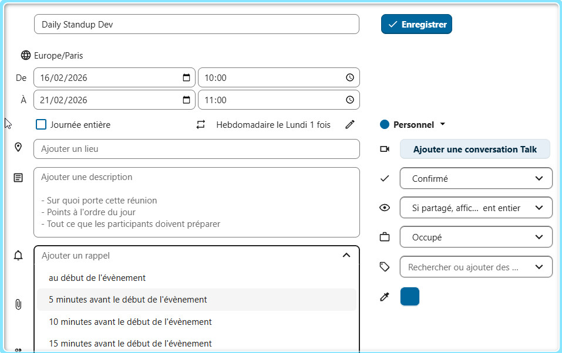

  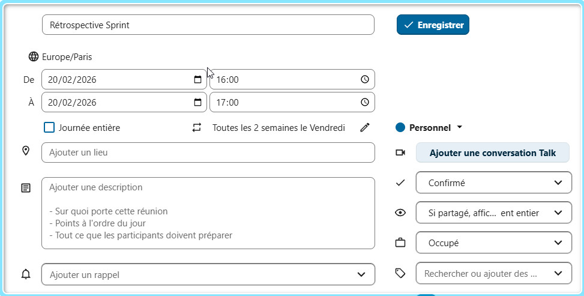

------

## Étape 16 — Création du board Kanban (Deck)

Dans l'application **Deck** :

1. Créer un nouveau tableau : **"Roadmap EduLearn Q1 2025"**
2. Créer les colonnes (listes) :
   - `Backlog`
   - `À faire`
   - `En cours`
   - `Terminé`
3. Ajouter des cartes exemples :

| Carte                       | Colonne  | Assigné à      |
| --------------------------- | -------- | -------------- |
| Refonte page d'accueil      | En cours | `fiona.web`    |
| Module quiz interactif      | À faire  | `charlie.dev`  |
| Tournage vidéo Module 3     | En cours | `hannah.prof`  |
| Campagne réseaux sociaux Q1 | Backlog  | `laura.market` |
| Documentation API v2        | À faire  | `diana.code`   |

1. Partager le tableau avec tous les groupes.

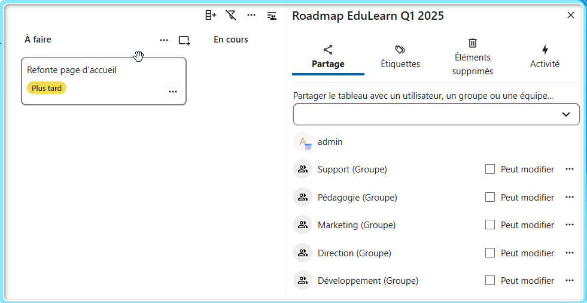

------

## Étape 17 — Sécurisation (bonnes pratiques)

### 17.1 — Politique de mots de passe

**Paramètres d'administration** → **Sécurité** :

-  Longueur minimale : **12 caractères**
-  Imposer les majuscules
-  Imposer les minuscules
-  Imposer les chiffres
-  Imposer les caractères spéciaux *(optionnel mais recommandé)*

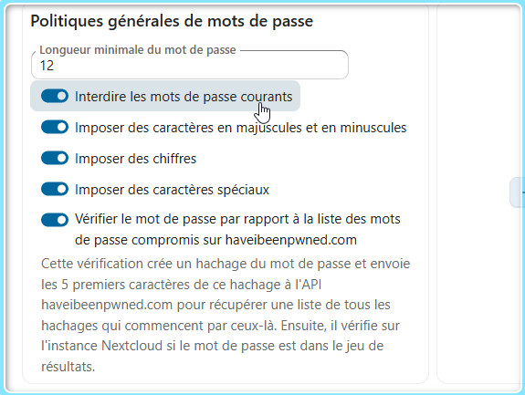

### 17.2 — Partage externe sécurisé

**Paramètres d'administration** → **Partage** :

-  **Forcer la protection par mot de passe** pour les liens de partage public
-  **Date d'expiration par défaut** : 7 jours
-  **Appliquer la date d'expiration** *(empêcher les liens permanents)*

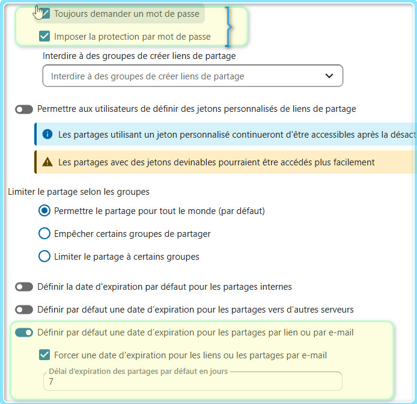

------

## Étape 18 — Tests de validation

### Test 1 — Isolation des permissions

1. Ouvrir un navigateur en **navigation privée**
2. Se connecter avec `hannah.prof` (Pédagogie)
3. Vérifier :
   - ✅ Dossier `3. Pédagogie` visible et modifiable
   - ✅ Dossier `Commun` visible et modifiable
   - ❌ Dossier `2. Développement` **non visible**
   - ❌ Dossier `1. Direction` **non visible**

### Test 2 — Co-édition bureautique

1. Ouvrir 2 navigateurs (ou un navigateur normal + un en privé)
2. Session 1 : `alice.martin` | Session 2 : `bob.durand`
3. Créer un fichier `.docx` dans `Commun`
4. Ouvrir le même fichier depuis les 2 sessions
5. Vérifier que les modifications apparaissent **en temps réel**

### Test 3 — Partage externe avec mot de passe

1. Se connecter avec n'importe quel utilisateur
2. Créer un fichier test dans `Commun`
3. Cliquer sur **Partager** → **Lien de partage** → copier le lien
4. Ouvrir le lien en **navigation privée**
5. Vérifier qu'un **mot de passe est demandé** avant l'accès

### Test 4 — Visioconférence

1. Se connecter avec 2 utilisateurs dans 2 navigateurs
2. Ouvrir la conversation **Général EduLearn** dans Talk
3. Démarrer un **appel vidéo**
4. Vérifier audio et vidéo

### Test 5 — Calendrier partagé

1. Session 1 (`alice.martin`) : créer un événement dans **Réunions Équipe**
2. Session 2 (`charlie.dev`) : ouvrir le calendrier et vérifier que l'événement est visible

------

## Récapitulatif des identifiants à conserver

| Élément          | Valeur                            |
| ---------------- | --------------------------------- |
| IP de la VM      | `10.0.0.124` *(adapter)*          |
| URL Nextcloud    | `http://10.0.0.124`               |
| Admin Nextcloud  | `admin` / *(mot de passe choisi)* |
| Utilisateur BDD  | `nextclouduser`                   |
| Mot de passe BDD | *(mot de passe choisi)*           |
| Nom de la BDD    | `nextcloud`                       |

------

## Dépannage courant

| Problème                         | Solution                                                     |
| -------------------------------- | ------------------------------------------------------------ |
| Page blanche après installation  | Vérifier les permissions : `sudo chown -R www-data:www-data /var/www/html/nextcloud` |
| Erreur "trusted domains"         | Ajouter l'IP/domaine dans `config.php` → `trusted_domains`   |
| OnlyOffice ne se lance pas       | Vérifier que Community Document Server est bien activé, redémarrer Apache |
| Upload échoue pour gros fichiers | Vérifier `upload_max_filesize` et `post_max_size` dans `php.ini`, redémarrer Apache |
| Avertissement CRON en admin      | Vérifier `crontab -u www-data -l` et sélectionner "Cron" dans les paramètres |
| Erreur "module PHP manquant"     | Installer le module indiqué : `sudo apt install php-[module] -y` puis `sudo systemctl restart apache2` |