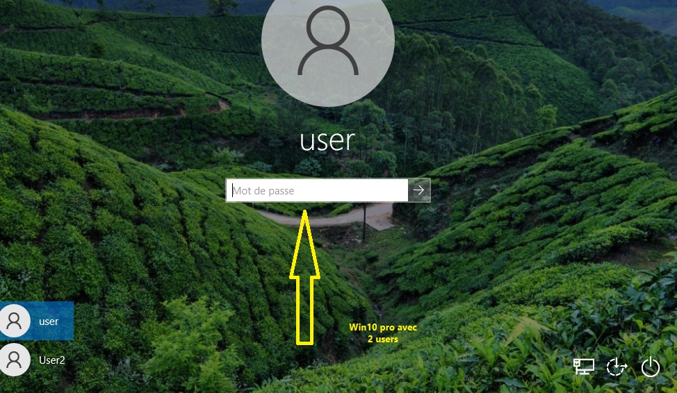
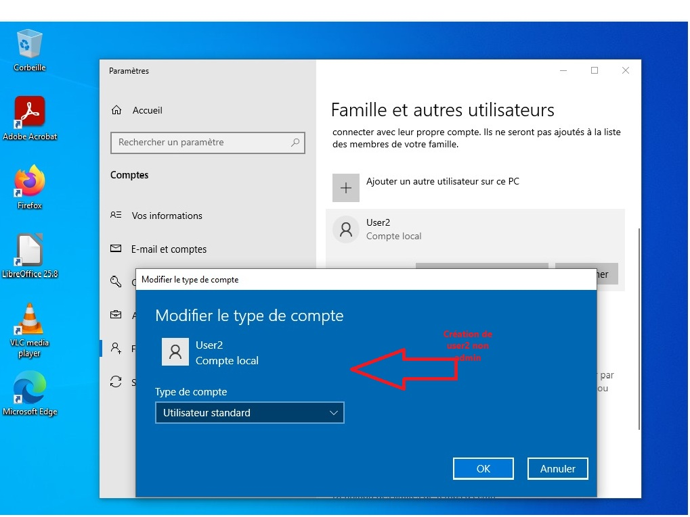

# Challenge_V10oct25
VirtualBox_3VM/
*S01 : Atelier découverte virtualisation/Étape 1 : VirtualBox/Étape 2 : configuration du BIOS/Étape 3 : création de la VM windows 10/Étape 4 : démarrage de la VM/Étape 5 : installation de Windows/Étape 6 : configuration initiale/Étape 7 : installer des logiciels/Étape 8 : créer un deuxième utilisateur/Bonus et Méga-bonus*
# Résultats :

# Fin #

