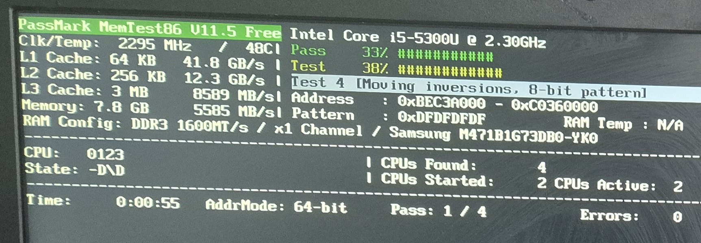
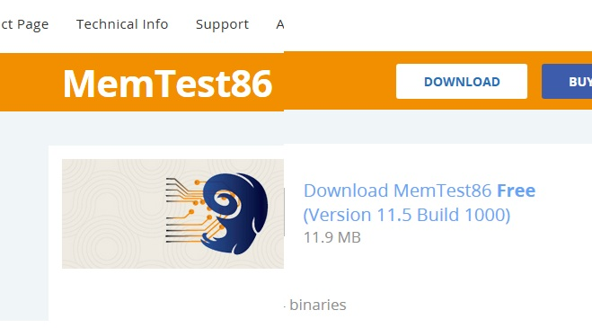
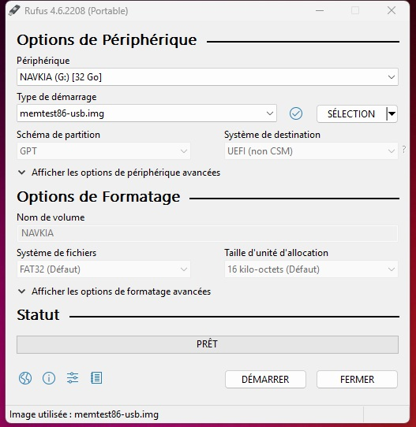
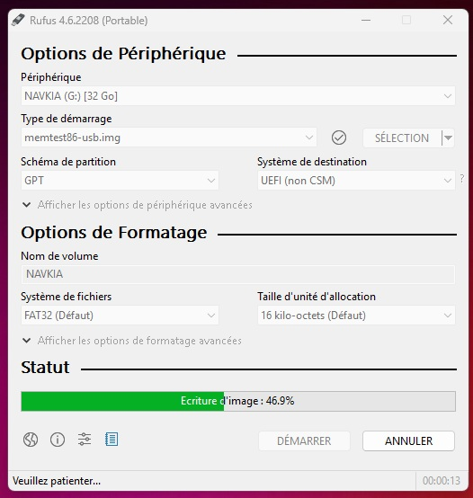
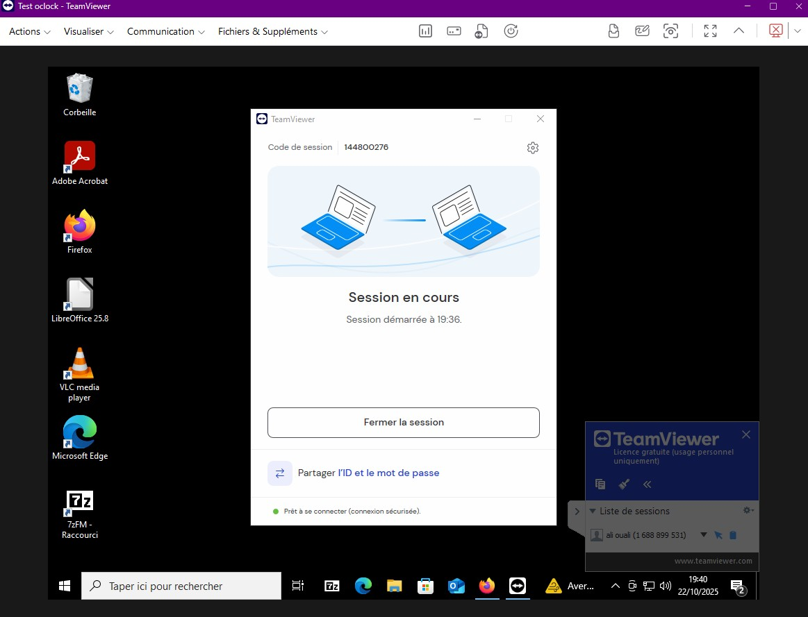
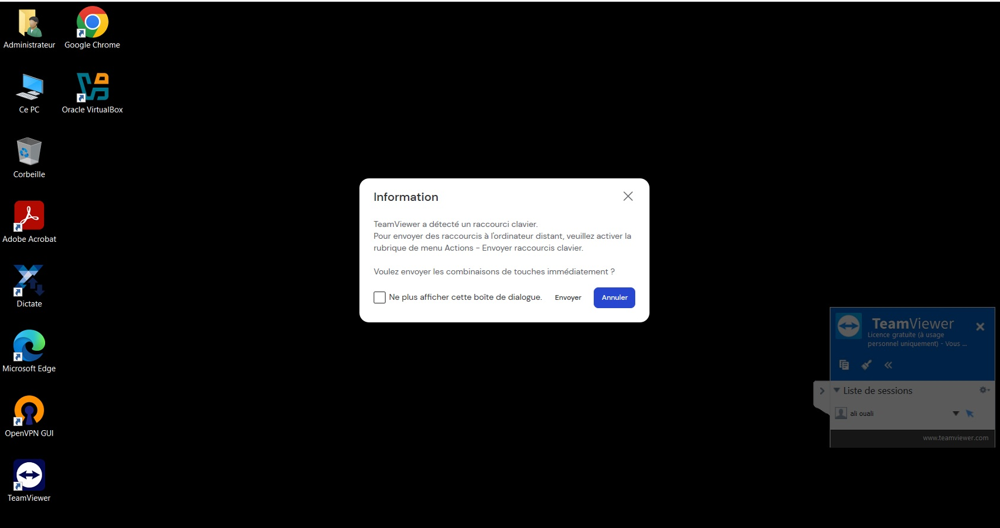
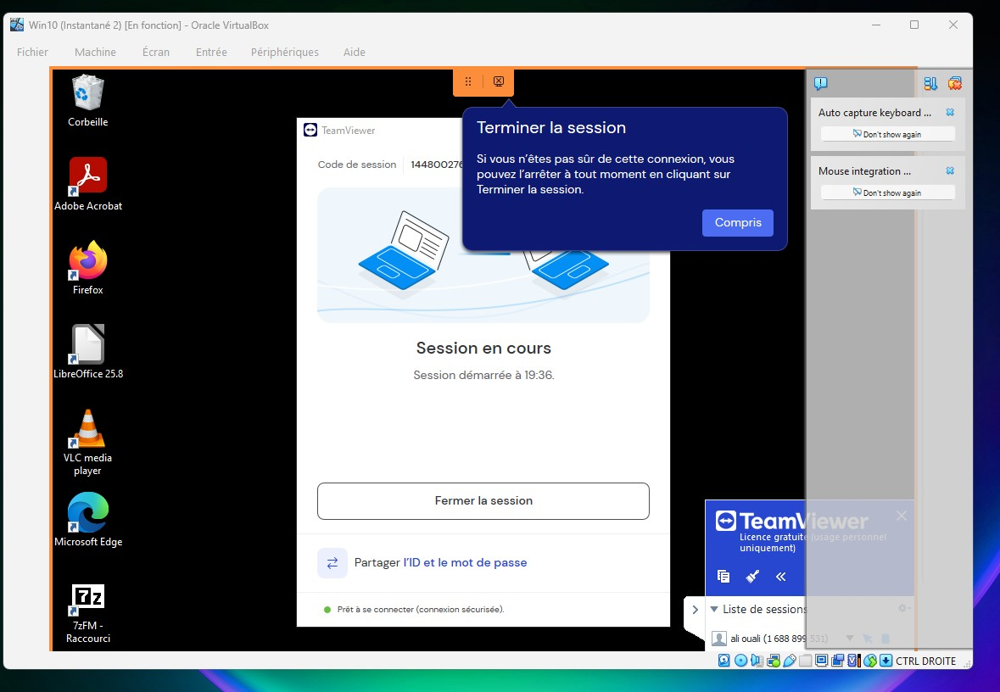

# Prise-en-main-distance
MemTest86 et Prise en main a distance
Essayez l’outil MemTest86 sur votre PC !

Il vous faudra pour cela une clé USB, sauvegardez tout ce que vous avez dessus avant de suivre les instructions ci-dessous ! ⚠️
1 : Téléchargez MemTest86 Free depuis le site officiel :
Dans une première étape avant test de l'application, il fallait télécharger MemTest86 depuis le site officiel suivant les recommandations de sécurité. Il s'agit de la version 11.5 Build 1000 depuis le site PassMARK softwareL'installation

Dans un second temps, j'ai décompressé le contenu dans un dossier avant d'exécuter l'imageUSB sur le programme Rufus. Pour rappel, Rufus est un utilitaire permettant de formater et de créer des média USB démarrables, tels que clés USB, etc.

Une fois la clef USB est prête, l'étape suivante consiste à demarrer le pc Laptop Lenovo sur la clef préparée. Pour cela, j'ai activé cette tâche en pressant au demarrage la touche SUPPR et j'aidonné la Boot priority à la clef usb.
Redémarrez votre PC et bootez sur MemTest !
*Le BIOS suit, en fait, un ordre de prédéfinis, c’est-à-dire une séquence de démarrage.
En effet, il teste les périphériques dans l’ordre : DVD-Rom, Disque dur, Réseau, Clé USB
On appelle cela le « Boot priority » pour priorité de démarrage du PC.*

https://github.com/user-attachments/assets/5a44cc6c-a6fa-4cf0-9c8e-1bad7861bc34

Lancez un test complet de votre RAM.

#🏆 Challenge Bonus#
Rendez-vous avec des outils de prise en main à distance, que ce soit AnyDesk, TeamViewer, ou même les outils natifs de votre système d’exploitation.
L’objectif est simplement d’explorer leurs possibilités et de tester par vous-même différents outils.
Les différentes étapes pour la configuration de l'accès à distance avec Teamviewer :
J'ai téléchargé et installé le logiciel sur les 2 machines hôte Admin la mienne et celle client sur un laptop (en QuickSupport).
J'ai ouvert la session Teamviewer sur la machine Admin et je l'ai nommé ''Test-Oclolck''J'ai obtenu un N° de cession que j'ai donné au client afin d'établir la connexion à distance.

Le client fait la même chose de son côté et valide la connexion. Pour résumer, j'ai utilisé l’identifiant et le mot de passe pour se connecter à mon appareil à distance. J'ai donné le code attribué au client
Le client a partagé avec moi le contrôle de son appareil en cliquant sur le bouton “Autoriser” sur l’écran.
PC hôte Admin

Le laptop client pris en main à distance

#🏆 Challenge Bonus plus Bureau à distance sur VM#
iL FAUT installer le pack extension de Virtualbox et ouvrir l'affichage du panneau de configuration de la VM afin d'activer le serveur.

Sinon en installant Teamviewer sur la vm

