## ⌨️ Challenge

Aujourd’hui, votre mission est double :

1️⃣ **Installer le GLPI Agent** sur une machine virtuelle (ou plusieurs, si vous voulez aller plus loin).

- L’objectif est que vos machines **remontent correctement leurs informations** dans votre instance GLPI (inventaire matériel, logiciels, etc.).
- Vérifiez que la communication entre l’agent et le serveur GLPI fonctionne bien.

2️⃣ **Tester la gestion des tickets dans GLPI** :

- Créez quelques tickets pour simuler des demandes utilisateurs.
- Testez **le cycle de vie complet d’un ticket** : création, attribution, suivi, clôture.
- Explorez les **fonctionnalités utiles au support** : ajout de commentaires, changement de statut, notifications, etc.

OUVERTURE D'UN TICKET :

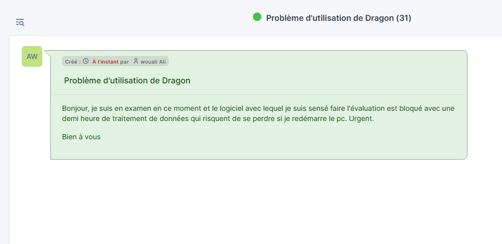

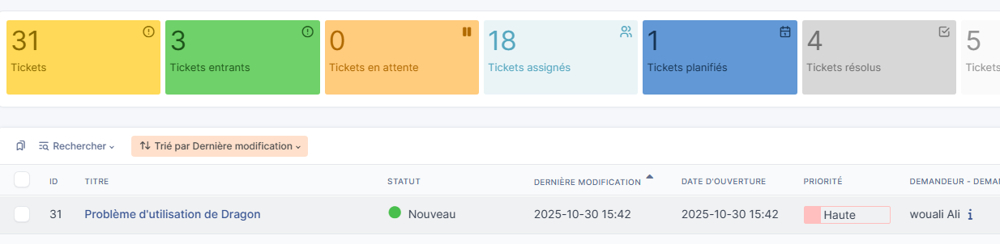

REPONSE ET ATTRIBUTION :

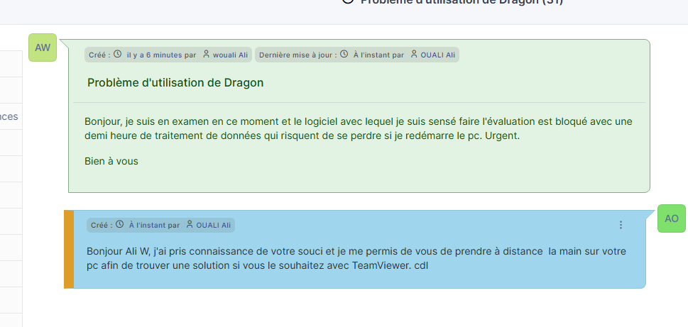

Approbation de la solution :

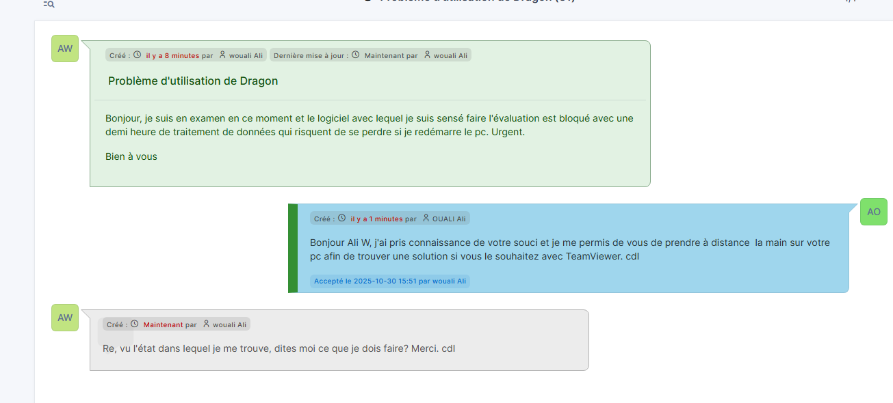

Réouverture du ticket car le travail n'est pas fait complètement :

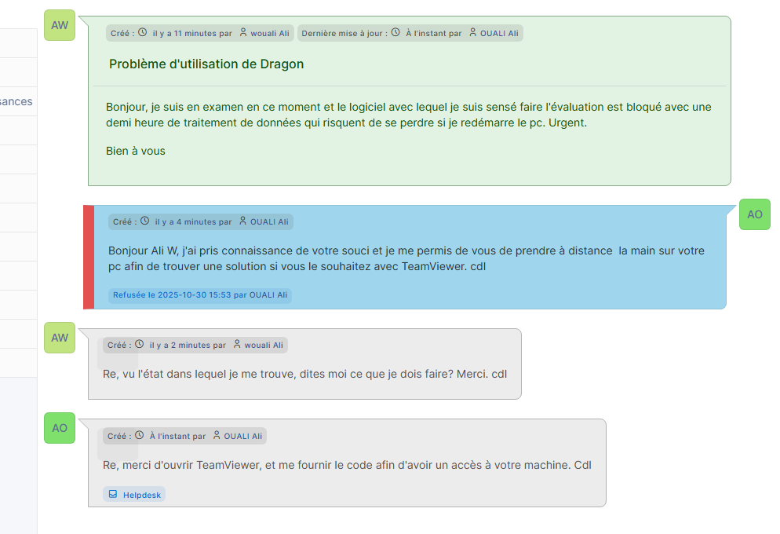

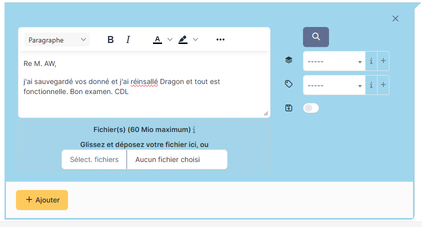

Prise en charge du client et assistance à distance avec Teamviewer :

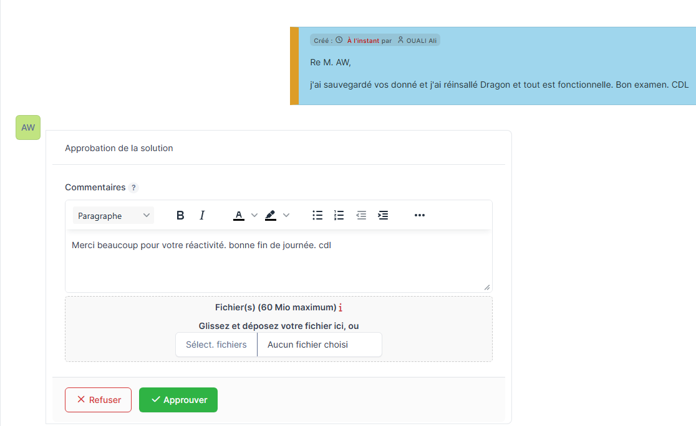

Solution définitive approuvée, ticket clos :

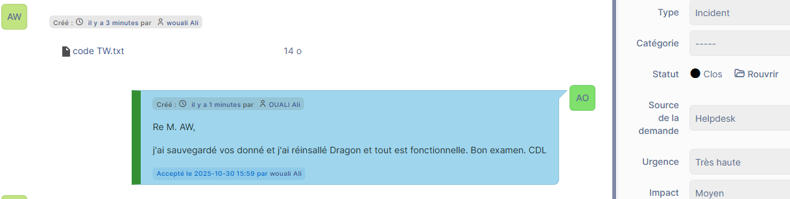

Ajout et documentation dans la base connaissance d'une solution de contournement :

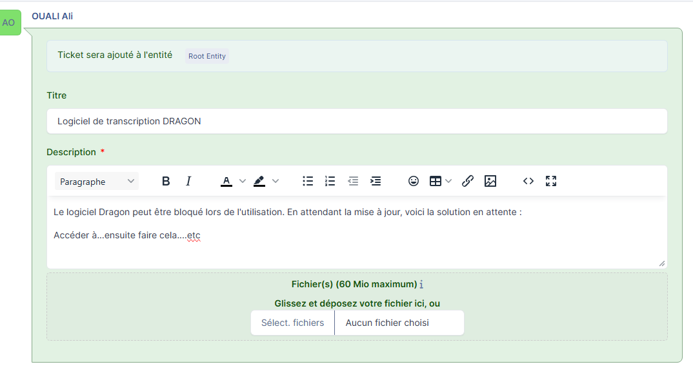

##### Installation de l'outil GLPI sur UBUNTO 5ma 2ème machine sur le lan)

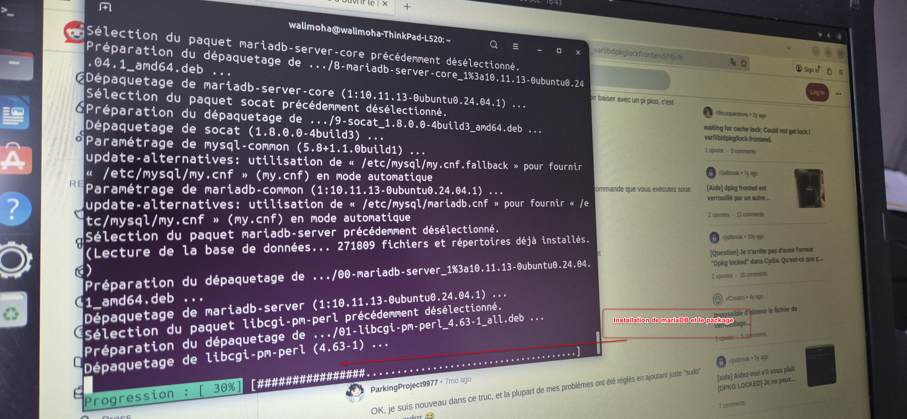

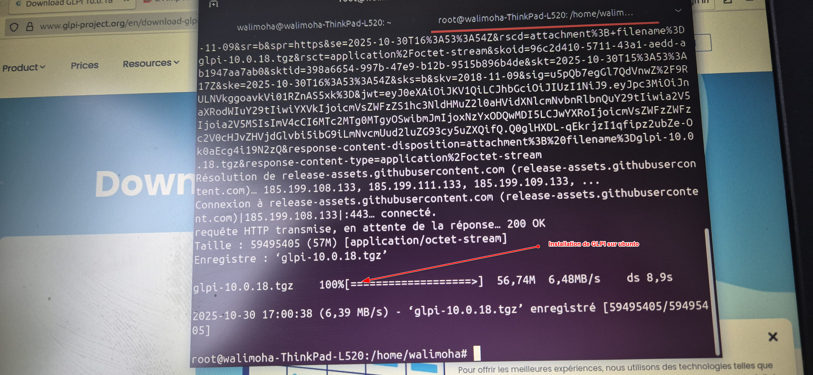

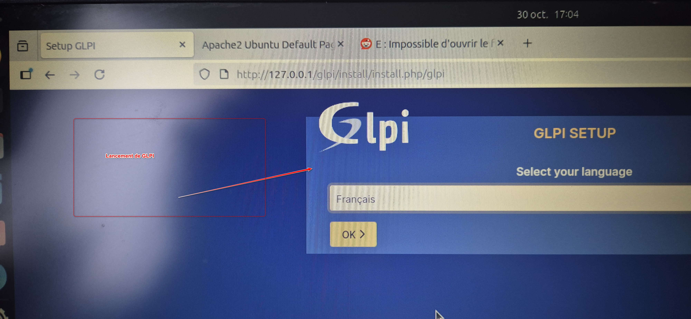

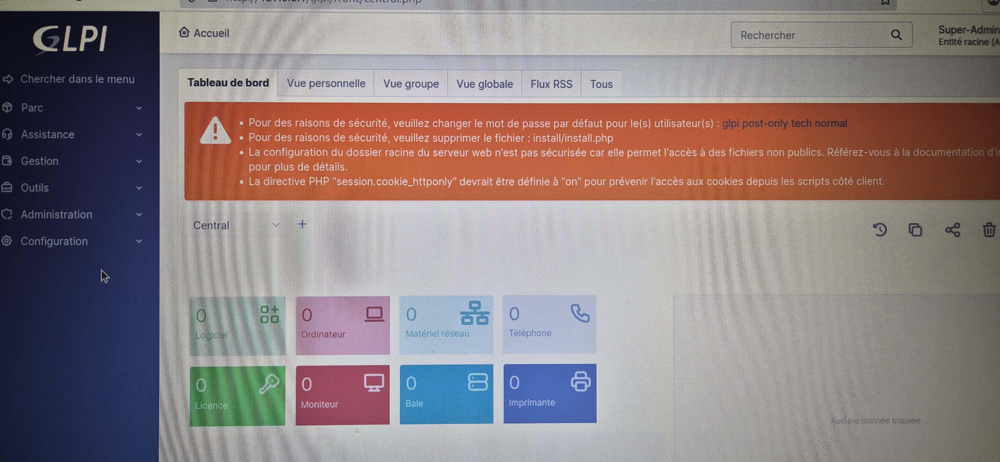

#### Installation de l'agent GLPI sur le pc hôte win 11

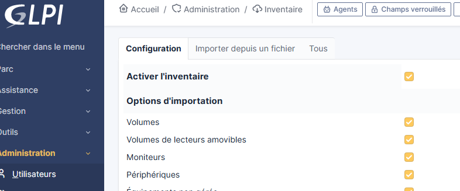

#### Résultat visible depuis mes 2 pc :

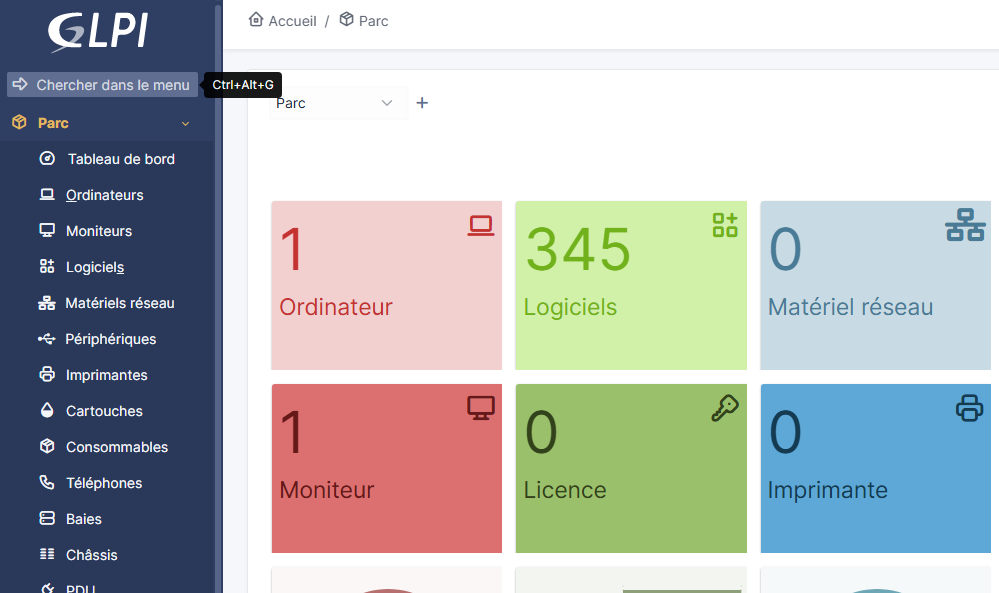