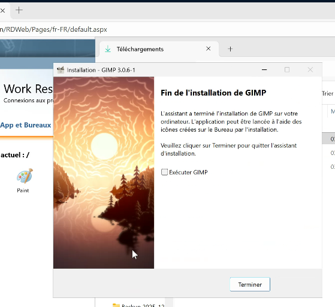
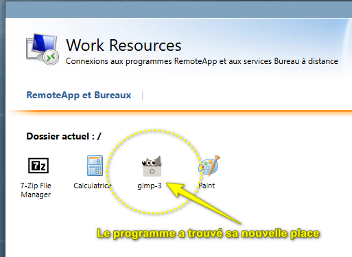
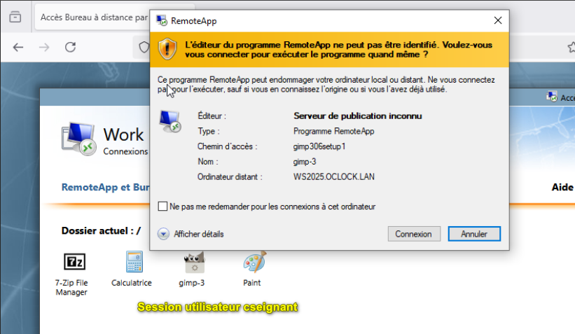
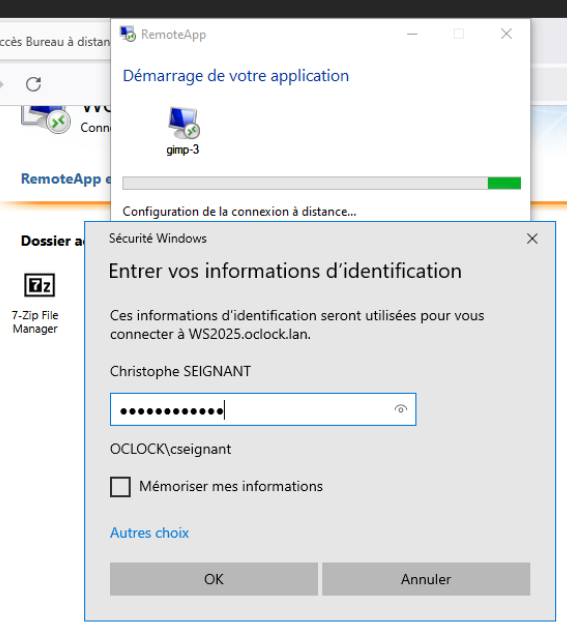

### Challenge RDS (GIMP)

1- Téléchargement de l'application GIMP >>>>Gestionnaire de serveur>>>Service bureau à distance>>>Collections>>>QSC.

2- téléverser le programme Gimp 3 dans le catalogue RemoteApp.

3 - Publier le programme

4 - Je donne la permission d'utilisation aux 4 promotions

Test depuis la machine client cseignant :

Utilisation de l'appli par Cseignant

