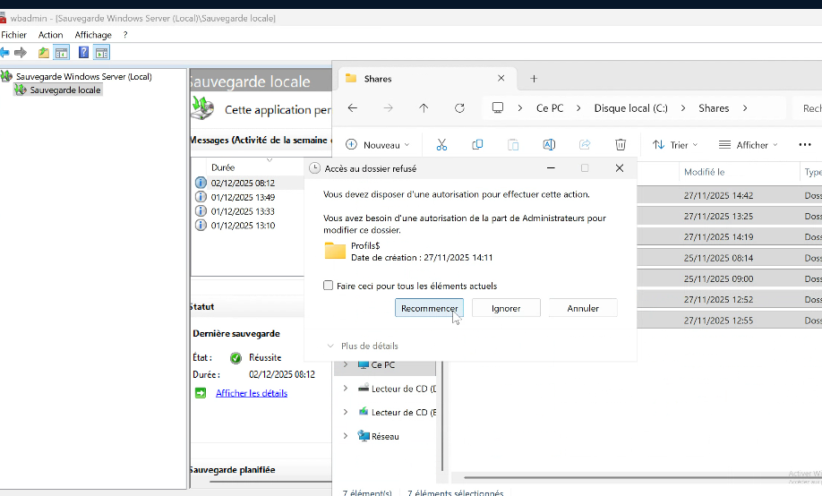

Correction

suppression des sites et des dossiers de partage

Plus de partage

On restaure l'ad et ensuite les partages>>>on passe en mode sans échec car les services tournent toujours. On doit passer par le DSRM.

On passe par Msconfig

et je redémarre le pc et dans ce mode je ne peux me connecter qu'en compte administrateur local. Erreur normal car le domaine est coupé.

Administrateur et mot de passe DSRM ( de récupération de l'AD)

A ce niveau là pas de domaine, on ne peut rien faire sur l'AD.

Je restaure ce qui intéresse :

Soit restaurer le dossier NTDS ou Volume, applications ou état du système.

Si on fait application on aura :

Sélectionner AD ET restaurer à un autre emplacement (je serai forcément sur le pc local administrateur) : Résultats de la restore :s

Copier/coller les fichiers dans le dossier NTDS

En passant par les fichiers et dossiers, on restaure aussi les droits utilisateurs:

Et l'emplacement :

J'écrase dans notre cas car il n'y avait pas bcp de modifs depuis la sauvegarde sinon créer des copies :

les fichiers restaurés :

Récupérer l'état du système (attention si le serveur de réplication a aussi hériter l'erreur il faut activer l'autorité des fichiers ATTENTION) vaut mieux faire une restauration sur chaque domaine.

