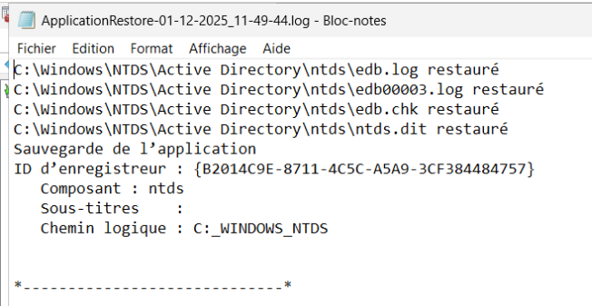

# E09 - IIS & Windows Server Backup

## ⌨️ Challenge

- Identifier l’utilisateur supprimé dans l’Active Directory.

  > > > Suppression de l'utilisateur Christophe SEIGNANT

- Ouvrir Windows Server Backup et localiser une sauvegarde contenant l’utilisateur.

  - > > > Restauration du dossier NTDS contenant les objets dont l'user supprimé

    

    

- Effectuer une restauration de l’état du système.

  

  

  Les fichiers à restaurer :

  

  Solution : Redémarrer en “Mode Restauration des services d’annuaire” (Directory Services Restore Mode – DSRM)

  Avec la commande : bcdedit /set safeboot dsrepair

  Copier/coller les fichiers sauvegardés dans NTDS et écraser les anciens.

  En CMD : bcdedit /deletevalue safeboot pour sortir du mode safe.

  

- Vérifier que l’utilisateur apparaît à nouveau dans l’AD après le redémarrage.

  

  Christophe SEIGNANT est de retour.

  

- Tester la connexion avec le compte restauré.

  

