### RDS (suite)

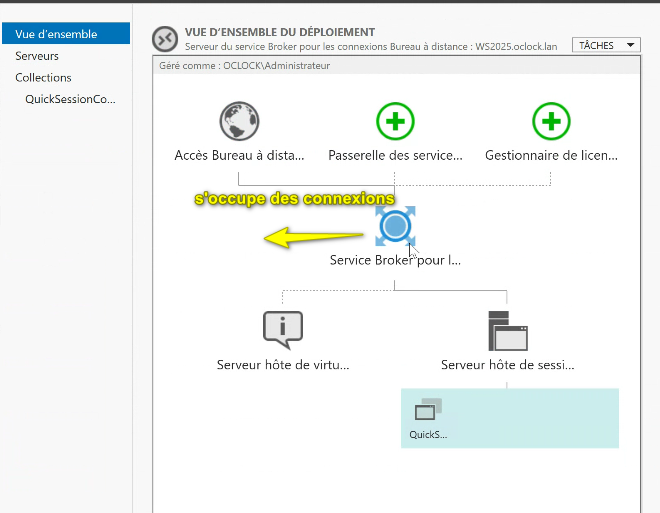

Limiter les accès, fin de cession, déconnexion, etc.

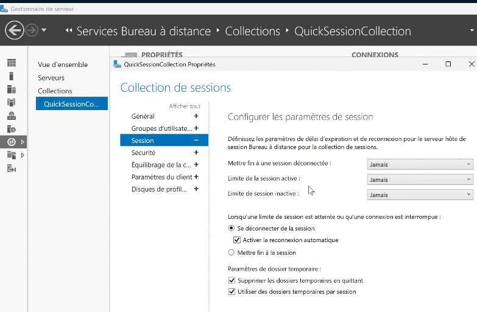

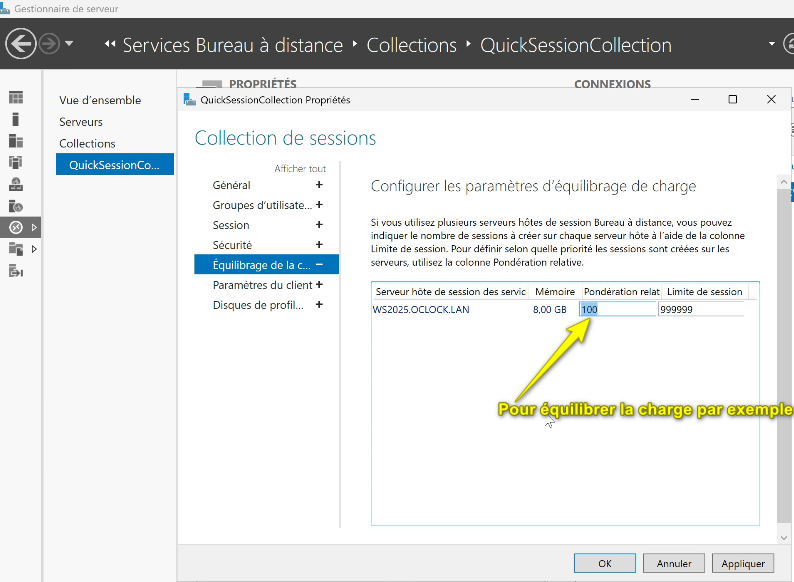

Pour avoir le programme directement sur le pc client :

Par une fonctionnalité native de windows. 

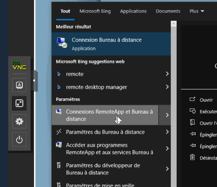

Pour voir les connexions

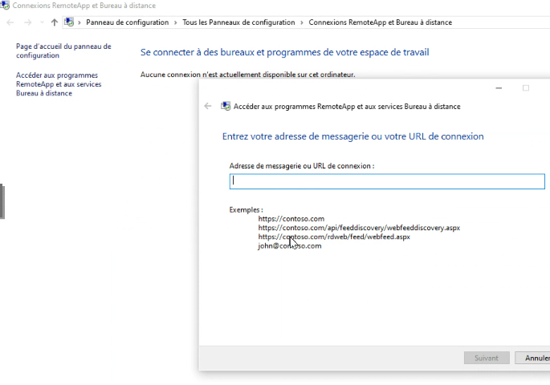

Gérer le certificat côté utilisateur: ouvrir mmc.exe

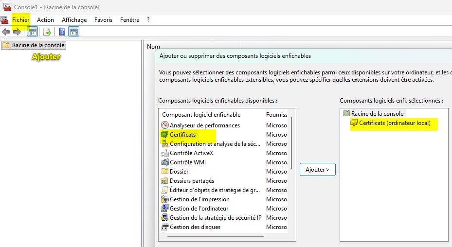

Exporter la clef publique

CER et je le place où je veux

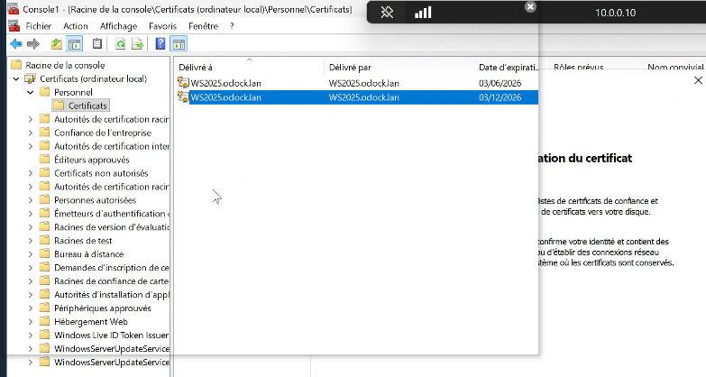

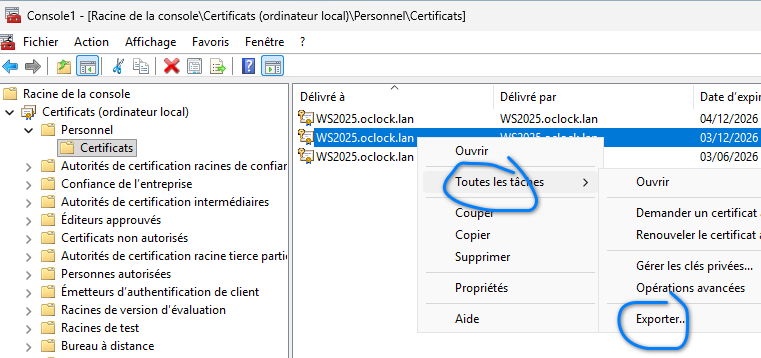

Sur le bureau ou aillleurs :

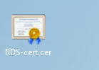

editeur de gestion de stratégie

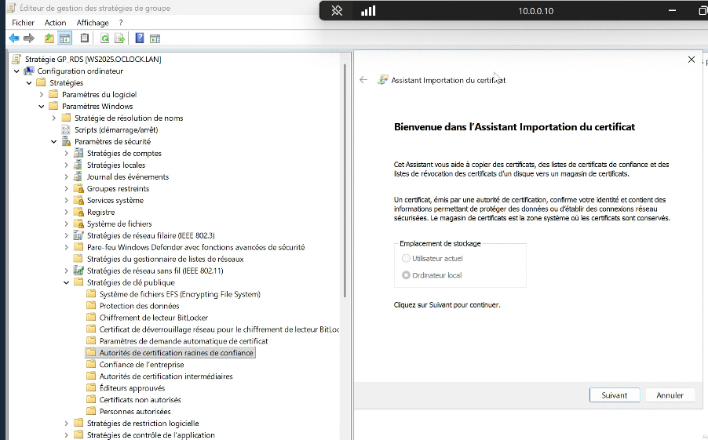

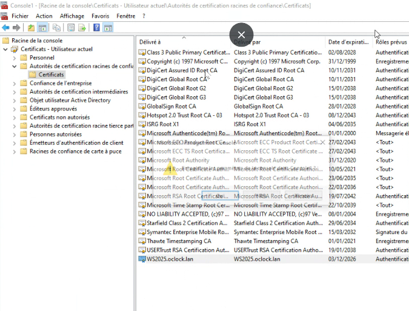

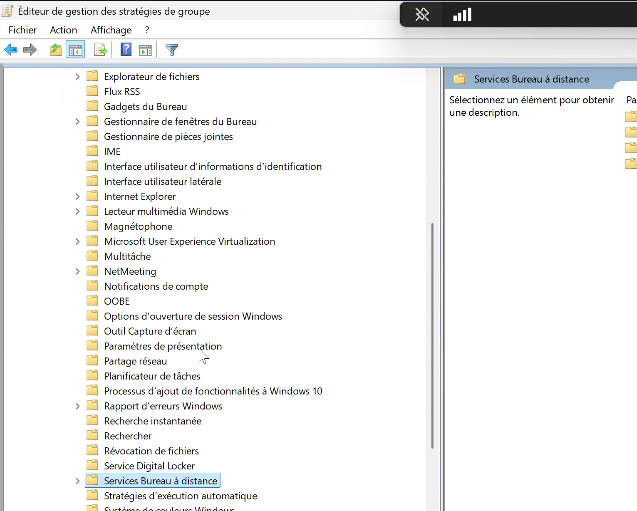

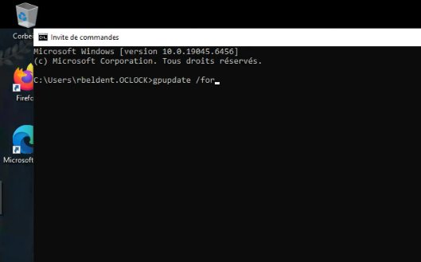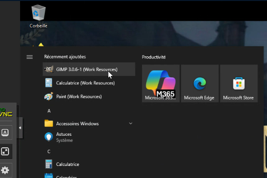

Rôle VDI : une ou plusieurs machines v attribuées à un utilisateur (client légers). De façon permanente ou ponctuelle. Ici ProxMox c'est lui qui gère.

Il faut ajouter un rôle HyperV et machine V:

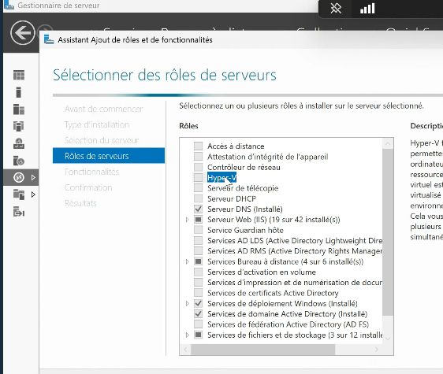

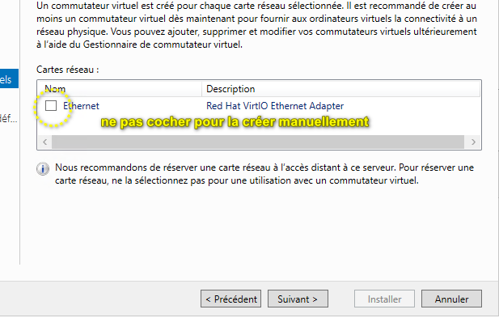

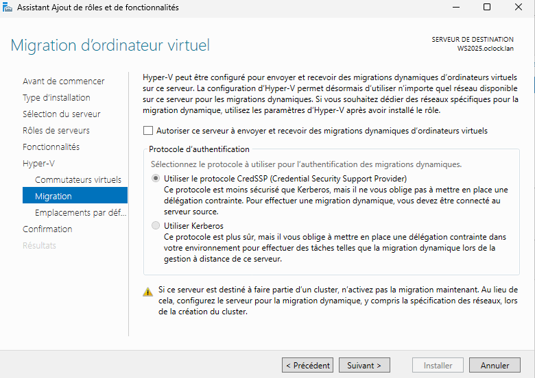

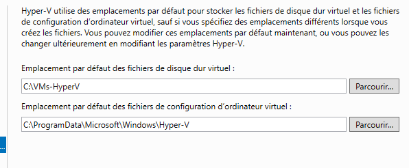

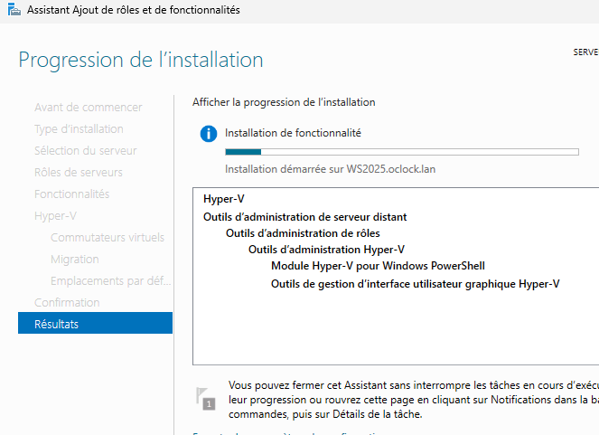

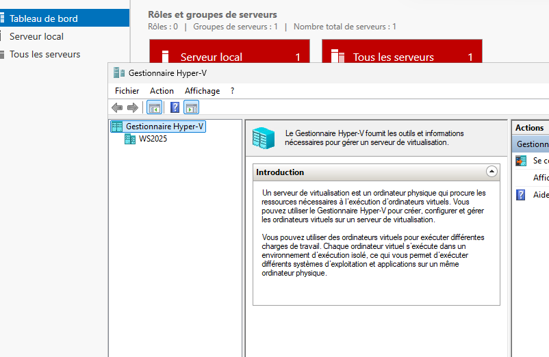

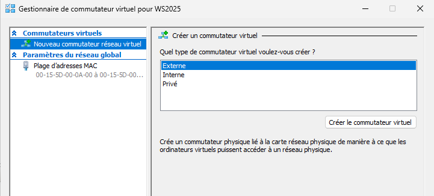

Externe en bridge pour NATER

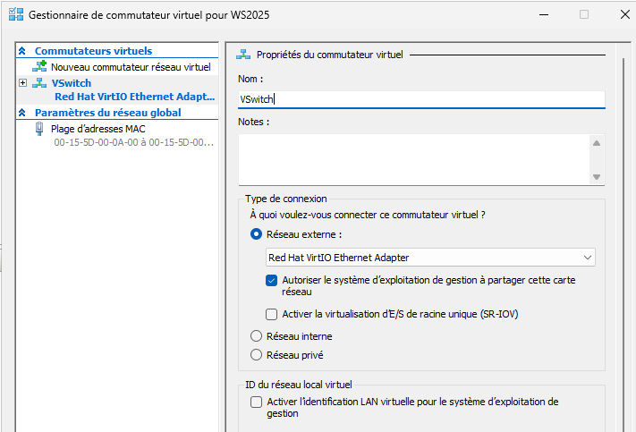

Créer un nouveau ordinateur virtuel

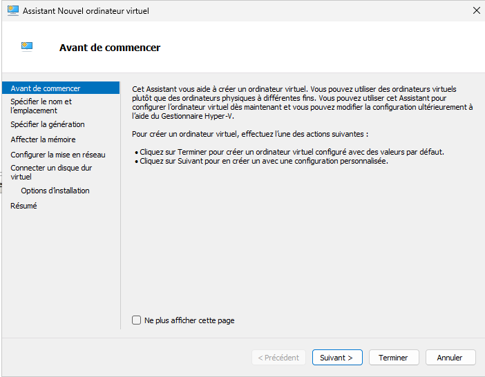

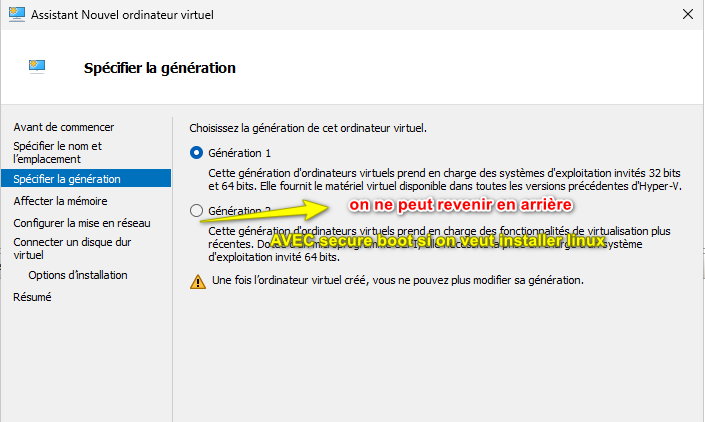

je choisis 2

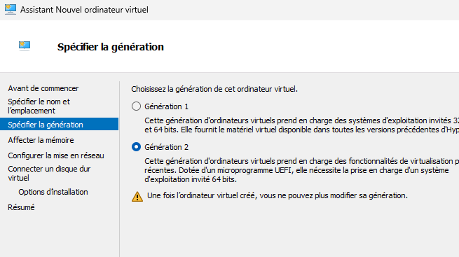

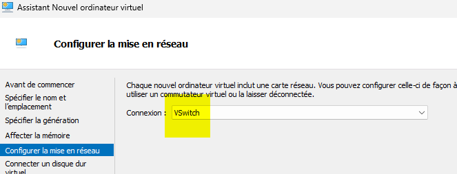