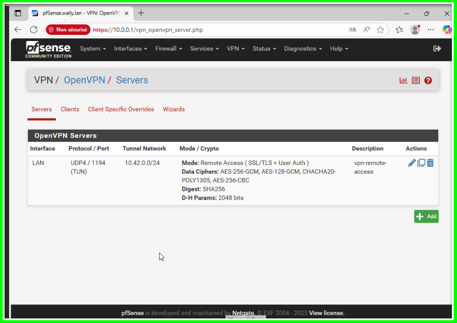
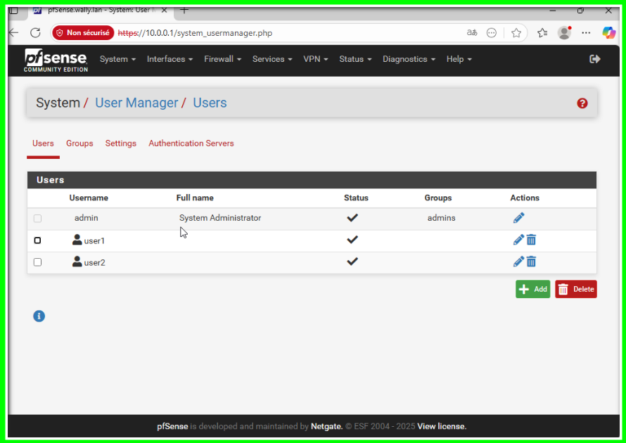
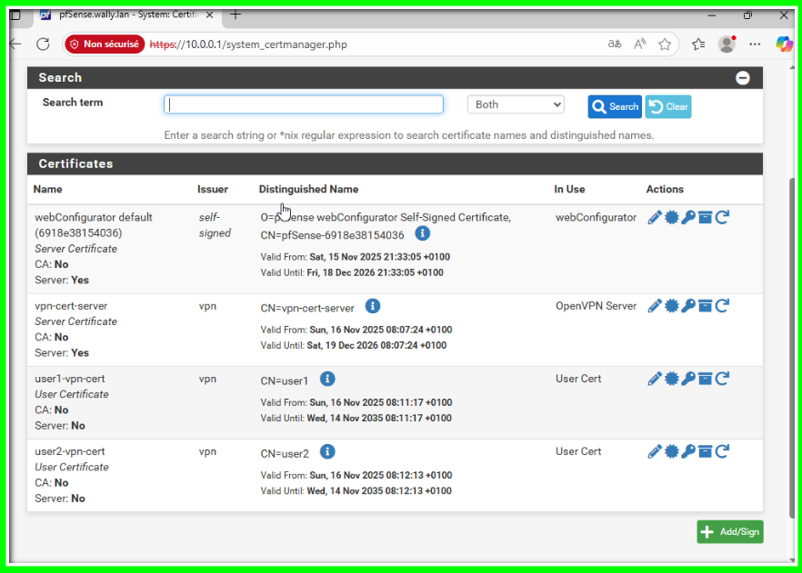
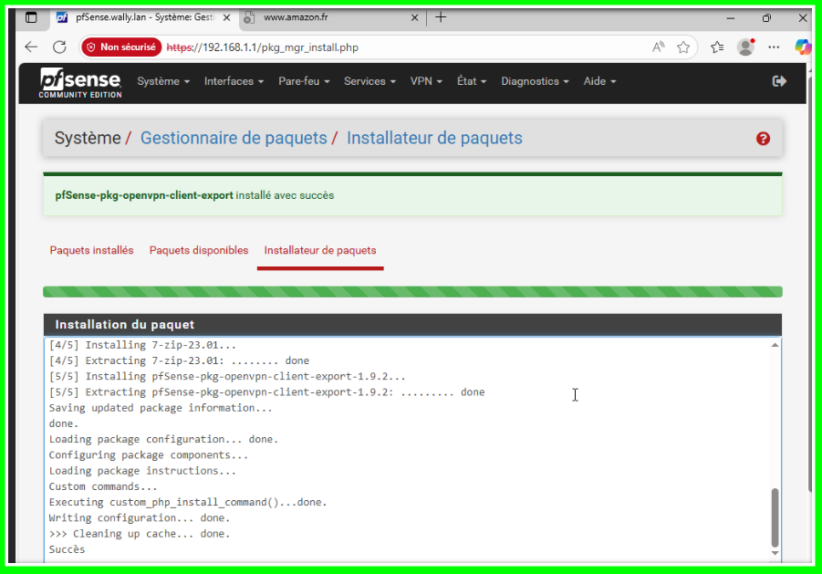

Étape 2.1 - Interfaces bridge

Sur GNU/Linux, on peut créer des interfaces réseaux appelées `bridges` (pont, en français). Ces interfaces virtuelles vont nous permettre d'inter-connecter des interfaces réseau physiques et également les interfaces réseau de nos machines virtuelles.

On peut voir ça comme une sorte de **switch virtuel**, un peu comme les interfaces `réseau interne` sur Virtual Box !

Par défaut, vous n'aurez qu'elle seule interface bridge : `vmbr0`, l'interface réseau physique `eno1` de notre serveur y est connectée. ⚠️ **Ne modifiez pas la configuration de cette interface !**

**Cette interface `vmbr0` sera l'interface de sortie de notre NAT.**

Pour connecter le WAN de la VM pfSense que vous allez devoir créer par la suite, il va nous falloir une nouvelle interface bridge.

`Système > Réseau` de votre serveur Proxmox (après avoir cliqué sur son nom à gauche), cliquez sur le bouton `Créer` puis `Linux Bridge` pour créer cette nouvelle interface.

➡️ Dans le champ `IPv4/CIDR`, saisissez l'adresse IP statique au format CIDR que nous voulons attribuer à notre serveur Proxmox sur cette interface : `192.168.42.1/24`. Vérifiez que la case `Démarrage automatique` est bien cochée, laissez le reste des champs vides et cliquez sur `OK`.

➡️ Refaites la même opération pour créer l'interface `vmbr2`, mais ne mettez pas d'adresse `IPv4/CIDR` ce coup-ci ⚠️

➡️ N'oubliez pas de cliquer sur le bouton `Appliquer la configuration` en haut !

Étape 2.2 - NAT Proxmox

configuration :

- **vmbr0 :** l'adresse IP publique de votre serveur
- **vmbr1 :** `192.168.42.1/24`
- **vmbr2 :** pas d'adresse IPv4

Lancez la commande `sudo nano /etc/sysctl.conf`. Vous voilà dans un éditeur de texte en ligne de commande ! Qui dit ligne de commande, dit... pas de souris 😬 Vous devez déplacer le curseur avec les flèches directionnelles de votre clavier.

Dans ce fichier, vous devez **localiser puis décommenter la ligne `net.ipv4.ip_forward=1`**, en enlevant le caractère `#` au début de la ligne. Quittez et sauvegardez avec le raccourci `Ctrl+X` dans `nano` (il faudra ensuite appuyer sur `Y` pour sauvegarder puis `Entrée` pour valider le nom du fichier).

➡️ Lancez la commande `sudo sysctl -p /etc/sysctl.conf` pour appliquer la modification que nous venons d'effectuer (la commande devrait retourner `net.ipv4.ip_forward = 1`).

💡 Cette modification permet d'**activer l'IP forward**, sorte de "mode routeur" du noyau Linux.

➡️ Pour finir, lancez la commande `sudo iptables -t nat -A POSTROUTING -s 192.168.42.0/24 -o vmbr0 -j MASQUERADE` afin d'activer le NAT.

`-s 192.168.42.0/24` permet de n'autoriser que les paquets en provenance de ce sous-réseau à traverser le NAT.

`-o vmbr0` permet d'indiquer l'interface réseau de sortie.

Vous pouvez lancer la commande `sudo iptables -L -t nat` pour vérifier la configuration du pare-feu `iptables`

## Étape 3 - pfSense

💡 **pfSense est un système d'exploitation** permettant de transformer n'importe quel ordinateur en un **routeur** professionnel. Il n'est pas rare d'en rencontrer en entreprise ! Si vous voulez en savoir plus, jetez un oeil par [ici](https://fr.wikipedia.org/wiki/PfSense).

Sur cette étape, nous allons créer une VM pfSense qui servira de passerelle/de routeur pour toutes nos VMs pour le reste de la formation.

### Étape 3.1 - création VM

➡️ Cliquez sur le bouton `Créer une VM`, tout en haut dans l'interface.

Voici les réglages à utiliser :

- ID : 100
- nom : NAT-pfSense
- iso : pfSense 2.7.2 (déjà disponible sur votre serveur proxmox)
- type : Other (à la place de "Linux")
- disque : 20 Gio
- RAM : 2048 MiB
- CPU : 1
- Pont (bridge) : vmbr1 (⚠️ très important)
- Pare-feu : décochez la case (⚠️ très important)

**Vous pouvez laisser tous les autres réglages par défaut.**

➡️ **Avant de démarrer la VM**, ajoutez une seconde interface réseau depuis la section `Matériel`. Sélectionnez le Pont `vmbr2` cette fois-ci, et décochez également le pare-feu.

Voici ce que vous devriez obtenir dans la partie `Matériel` :

