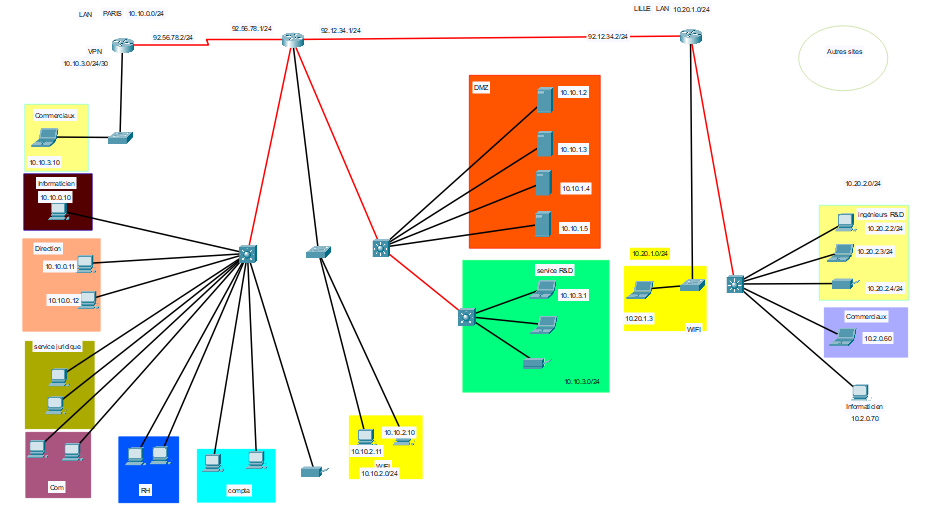
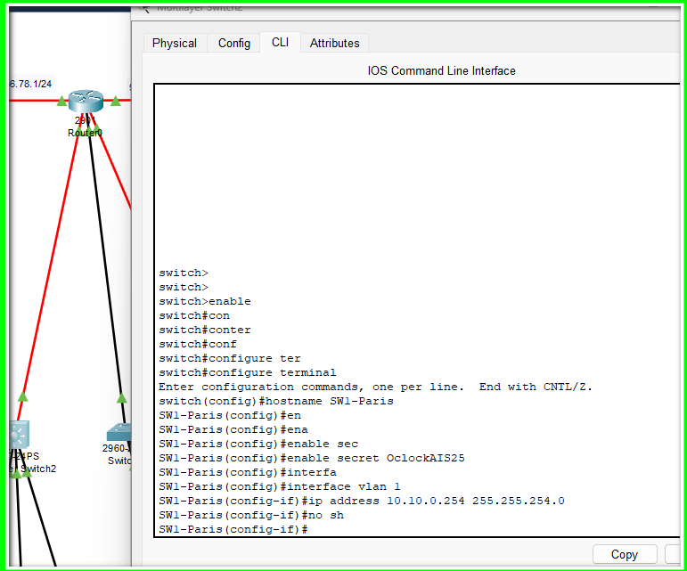
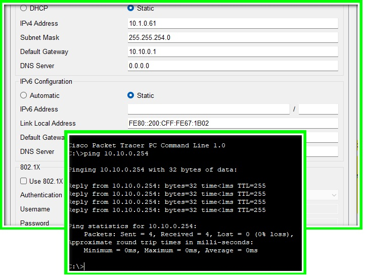
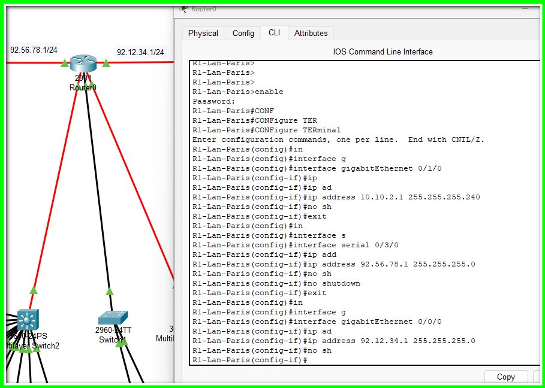

## Premier atelier de S03-Réseau

## **Contexte :** Ouverture d'une nouvelle entreprise avec 7 services sur deux sites distants Paris et Lille.

Le but est de proposer un plan d'adressage pour le réseau de l'entreprise avec un détail important qui est expansion future et  agrandissement partout en France.

Dans un premier temps, afin de permettre le fonctionnement du réseau de l'entreprise, le plan s'appuie sur 4 services à Paris et un VPN et 2 à Lille avec les sous réseaux qui vont avec.

| Site  | Sous-réseau | Plage ip (cidr) | Nbre d'hôtes | passerelles | Usage                     |
| ----- | ----------- | --------------- | ------------ | ----------- | ------------------------- |
| Paris | LAN 1       | 10.10.0.0/23    | 510          | 10.10.0.1   | PC fixes et portables     |
|       | DMZ         | 10.10.2.0/28    | 14           | 10.10.2.1   | Serveurs                  |
|       | Wifi        | 10.10.3.0/25    | 126          | 10.10.3.1   | Accès visiteurs wifi      |
| Lille | LAN 2       | 10.20.0.0/24    | 254          | 10.20.0.1   | PC fixes et portables     |
|       | Wifi        | 10.20.1.0/25    | 126          | 10.20.1.1   | Accès visiteurs wifi      |
| VPN   | Commerciaux | 10.30.0.0/22    | 1022         | 10.30.0.1   | Télétravail, déplacements |

**CHOIX (CIDR) :**

Le site de Paris: 41 salariés aujourd'hui mais à terme jusqu'à 200 et au delà --->> /23

La salle des serveurs en zone DMZ débute par 4 serveurs + équipements futurs -->>/28

Wifi Paris : Les visiteurs en nombre important + la marge -->>/25

Le site de Lille : 18 professionnels actuellement, voire plus à terme -->>/24

Wifi Lille : les visiteurs et une projection + marge -->>/25

et enfin le VPN: actuellement pour le site paris, on peut l'étendre à 400 salariés nomades ou en télétravail -->>/22

#### **Matériel et Câblage :**

- Routeurs :
  - 2x Cisco 2901 (un pour Paris, un pour Lille)
  - 1x Cisco 1941 (pour le VPN)
- Modules et cartes d'extension pour routeurs :
  - 5x cartes HWIC-1GE-SFP, avec 5x modules SFP GLC-LH-SMD
  - 2x cartes HWIC-2T
- Switchs :
  - 4x Cisco 3650-24PS (2 pour le LAN de Paris, un pour la DMZ, un pour le LAN de Lille)
  - 3x Cisco 2960-24TT (1 pour le WiFi de Paris, un pour le WiFi de Lille, un pour le VPN)
- Modules et cartes d'extension pour switchs :
  - 4x alimentations AC-POWER-SUPPLY (une par switch 3650-24PS)
  - 5x modules SFP GLC-LH-SMD
- Autres équipements :
  - 4x Serveurs
  - 3x Copieurs (2 pour Paris dont un pour le bâtiment R&D, un pour Lille)

##### **PACKET TRACER :** Voici la topologie complète avant configuration.

#### Configuration des switchs :

- Je commence par configurer le hostname de chaque switch.

- j'ajoute un mot de passe pour protéger le mode privilégié.

- attribue une adresse IP sur l'interface Vlan1, cette adresse IP est dans le même sous-réseau que les postes connectés au switch. Pour précision, le Vlan 1 est celui assigné par défaut à tous les ports, avec une adresse ip, il peut servir à l'administration à distance via des protocoles (ssh, Telnet, snmp, etc).

  

<u>**Configuration des postes connectés au switch:**</u>

Je connecte ensuite chaque poste en lui attribuant une ip fixe et une passerelle par défaut dans le même réseau et donc le 10.10.0.1.

Je fais le test ping vers le switch pour vérifier la connectivité. Le réseau se met en route : le switch et le pc communiquent.

<u>**Configuration des routeurs:**</u>

Sur chaque routeur, je configure le hostname - j'ajoute un mot de passe - une adresse ip sur chaque interface connectée au sous réseau et inter routeurs.

