## ⌨️ Challenge E03 - Sécurité et administration linux

Pour pratiquer les notions du jour, votre mission est d’installer une VM Rocky Linux (le successeur de CentOS, la version communautaire de Red Hat Entreprise Linux).

Sur cette VM, vous devez :

- créer un nouvel utilisateur
- permettre à cet utilisateur de lancer des commandes avec `sudo`
- faire en sorte qu’aucun mot de passe ne soit demandé pour lancer la commande `rpm`
- créer un groupe, mettre le nouvel utilisateur et l’utilisateur créé lors de l’installation dans ce groupe
- créer un dossier `/home/partage_fichier` et modifier ses permissions pour que les membres du groupe créé précédemment aient les droits de lecture et d’écriture, mais qu’aucun autre utilisateur du système n’y ait accès.
- créer un dernier utilisateur et vérifier qu’il n’a pas accès au dossier créé précédemment

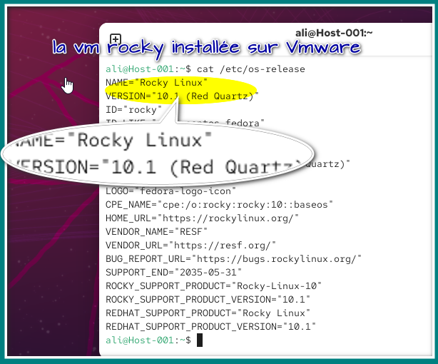

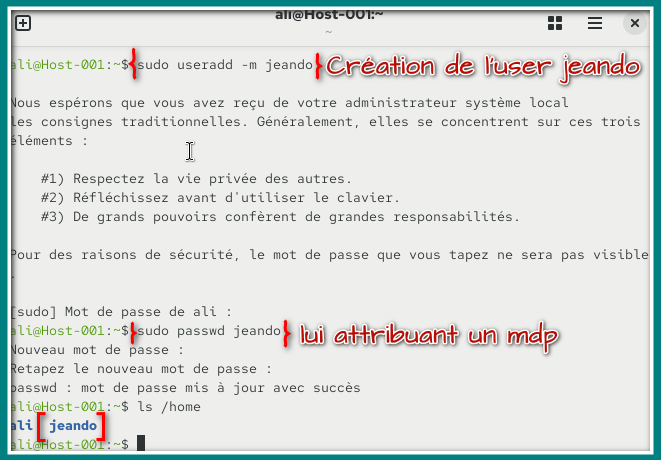

Pour changer les attributions en droits aux utilisateurs, il faut modifier le fichier sudoers  dsans /etc/sudoers par la commande nano.

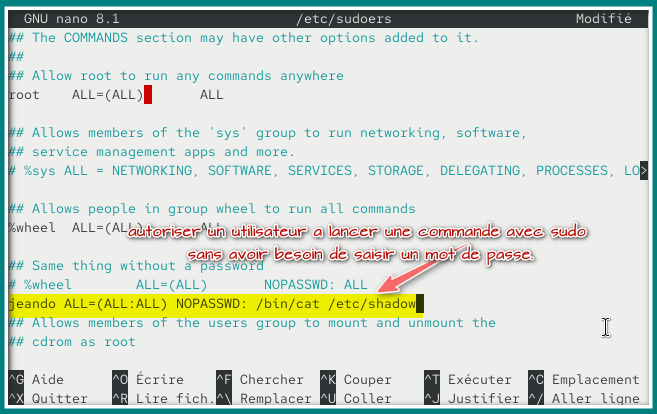

Une autre manière de faire cette modification de droits est de passer par visudo : sudo visudo et modifier les lignes concernés.

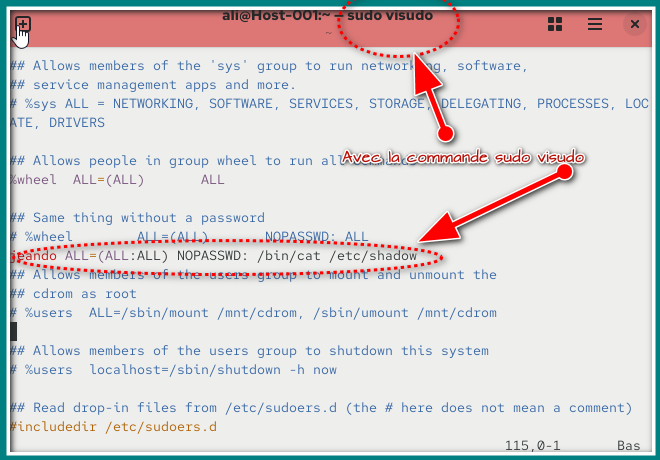

Pour lancer une commande sudo de super utilisateur, il y a une manière simple qui est d'ajouter notre user au groupe sudo.

La commande usermod : (les utilisateurs autorisés à utiliser  appartiennent au groupe sudo, dans mon cas sur Fedora c'est le groupe **wheel**). la commande groups nom_utilisateur (pour vérifier)

 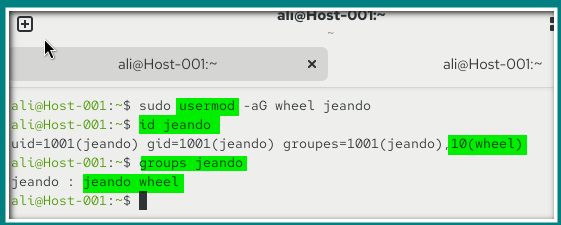

<u>Faire en sorte qu’aucun mot de passe ne soit demandé pour lancer la commande `rpm`</u>

sudo visudo pour ouvrir la configuration sudo en sécurité et ajouter une règle spécifique pour la commande :

sudo visudo -f /etc/sudoers.d/rpm-nopasswd>>>>>jeando ALL=(ALL) NOPASSWD: /usr/bin/rpm

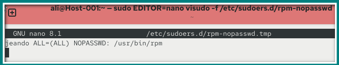

Test commande RPM sans mot de passe, ici pour afficher le paquet firefox :

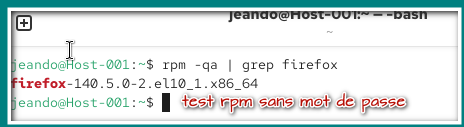

Ajouer un groupe oclock et y ajouter les utilisateurs jeando et ali.

```
groupadd -U jeando,ali oclock
```

 

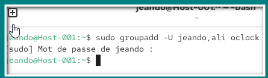

Création d'un dossier de partage et modifier les permissions pour les membres du groupe oclock.

sudo mkdir /home/partage_oclock et rendre propriétaire du dossier le groupe sudo chown : 

```
oclock /home/partage_oclock
```

Attribution des droits de lecture et écriture pour les utilisateurs du Gr oclock :

```
sudo chmod 770 /home/partage_oclock
```

Résultat avec la commande : ls -ld /home/partage_oclock

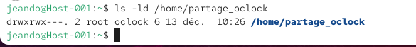

<u>Créer un dernier utilisateur et vérifier qu’il n’a pas accès au dossier créé précédemment ET Test :</u>

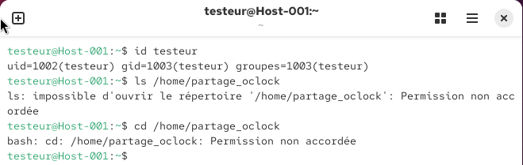

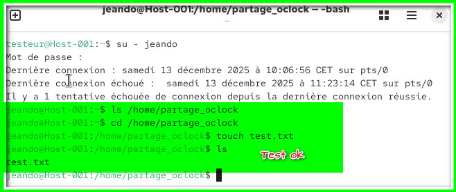