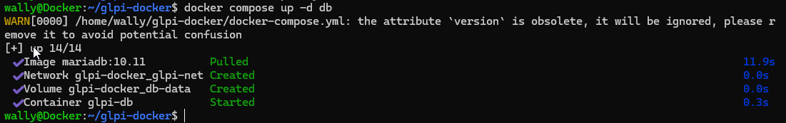
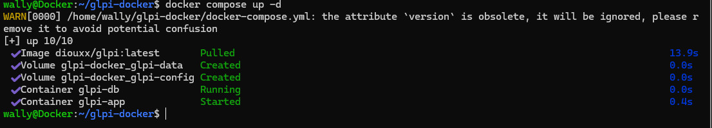
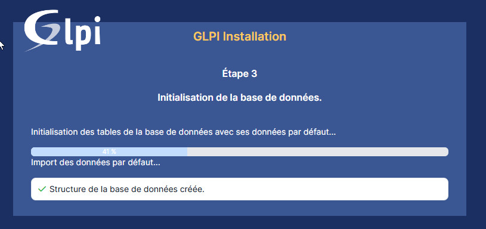
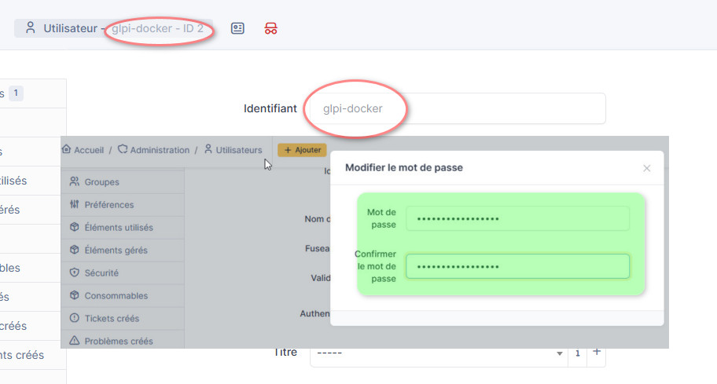
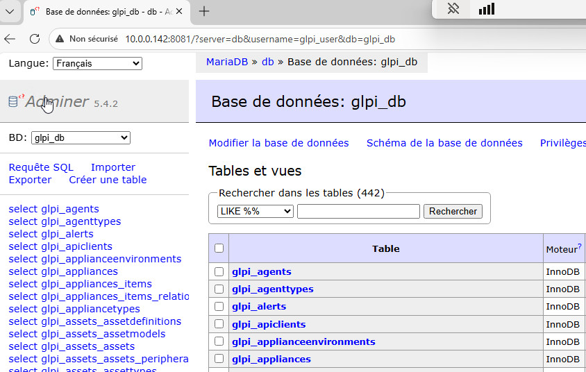
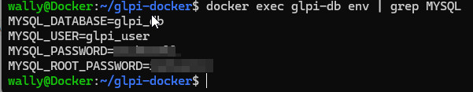
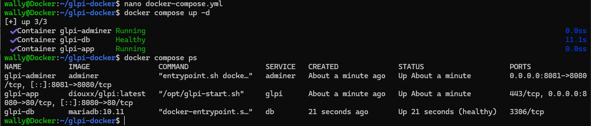

# 🐋 Déployer GLPI avec Docker Compose

> - 

---

## 

### Étape 1 — Mise en place du projet

- Créez un dossier dédié pour votre projet : `mkdir glpi-docker && cd glpi-docker`
- Créez le fichier `docker-compose.yml` vide et préparez la structure de votre projet
- Étape 2 — Service MariaDB

- Ajoutez un service `mariadb` dans votre `docker-compose.yml`

- Définissez les variables d'environnement nécessaires : `MYSQL_ROOT_PASSWORD`, `MYSQL_DATABASE`, `MYSQL_USER`, `MYSQL_PASSWORD`

  

- Montez un volume pour persister les données de la base

- Testez que le conteneur démarre correctement avec : `docker compose up -d db`

  

### Étape 3 — Service GLPI

- Ajoutez le service `glpi` en utilisant l'image `glpi/glpi ou diouxx/glpi`

- Exposez le port 80 du conteneur sur un port de votre machine

- Configurez la dépendance vers le service `db` avec `depends_on`

- Montez les volumes nécessaires pour les fichiers GLPI (config, fichiers uploadés...)

  ```
  glpi:
      image: diouxx/glpi:latest
      container_name: glpi-app
      restart: always
      ports:
        - "8080:80"
      depends_on:
        - db
      volumes:
        - glpi-data:/var/www/html/files
        - glpi-config:/var/www/html/config
      networks:
        - glpi-network
  ```

  Étape 4 — Réseau & Communication

- Créez un réseau Docker dédié pour que vos services puissent communiquer
- Rattachez chaque service à ce réseau
- Vérifiez que GLPI peut joindre MariaDB : le nom d'hôte à utiliser est le **nom du service** `db`

### Étape 5 — Démarrage & Configuration initiale

- Lancez l'ensemble des services : `docker compose up -d`

  

- Ouvrez votre navigateur sur `http://localhost:8080`

- Suivez l'assistant d'installation GLPI en renseignant les informations de connexion à la BDD

- Connectez-vous avec les identifiants par défaut (`glpi` / `glpi`) et changez-les !

  

  

---

## ⭐ Bonus — Aller plus loin

### 🏆 Bonus 1 — Adminer

Ajoutez le service **Adminer** à votre stack. Adminer est une interface web légère pour administrer des bases de données. Exposez-le sur le port `8081` et connectez-vous avec les identifiants de votre base GLPI.



### 🏆 Bonus 2 — Fichier `.env`

Déplacez tous les mots de passe et variables sensibles dans un fichier `.env` et utilisez la syntaxe `${VARIABLE}` dans votre `docker-compose.yml`. Ajoutez `.env` à un fichier `.gitignore` pour ne jamais le commiter.

Test des variables prises en compte :



```
docker compose down -v
docker compose up -d
```


### 🏆 Bonus 3 — Healthcheck

Ajoutez un `healthcheck` sur le service `db` pour que GLPI n'essaie de démarrer qu'une fois que MariaDB est réellement prêt à accepter des connexions.

> Indice : `condition: service_healthy` dans `depends_on`


