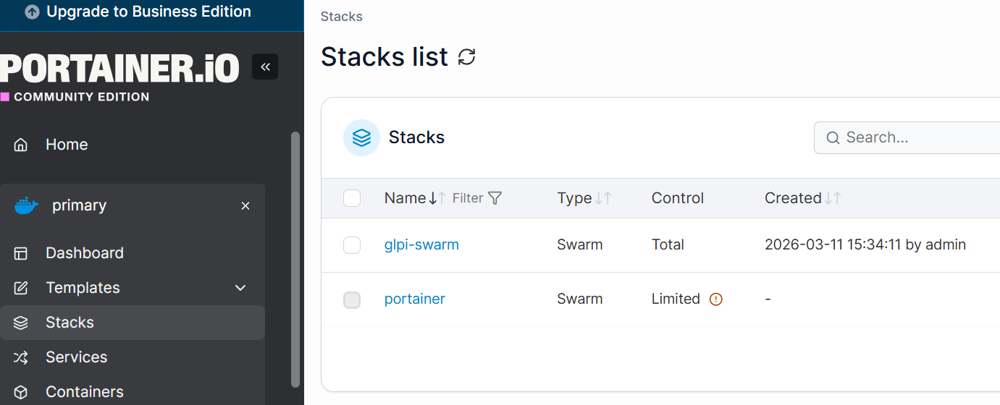
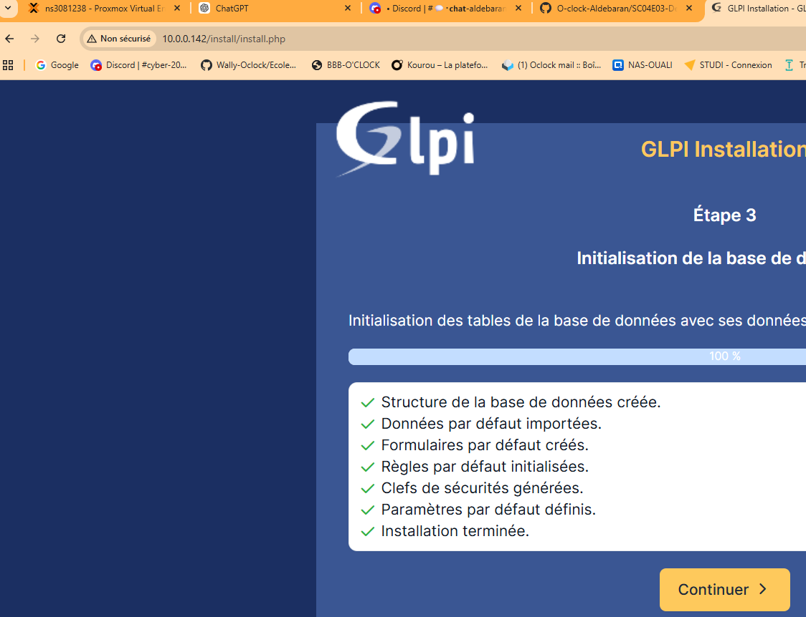
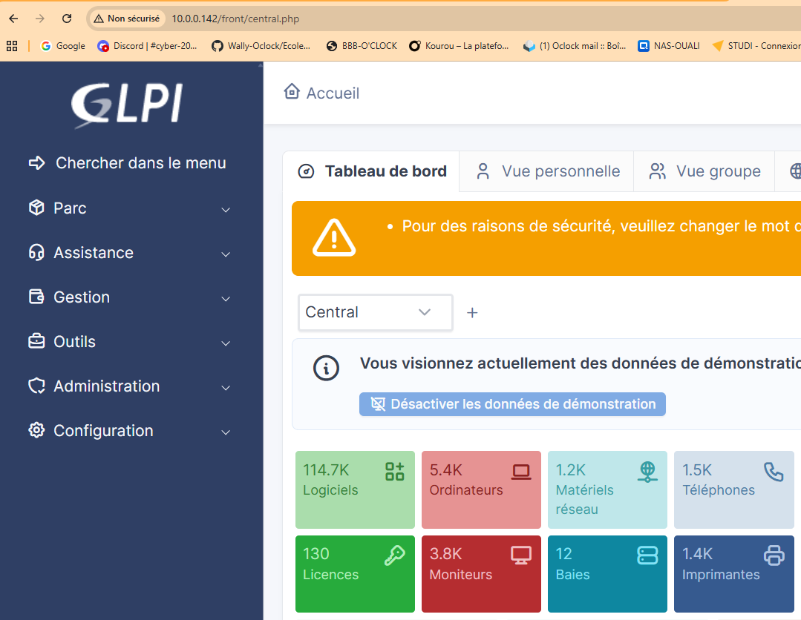
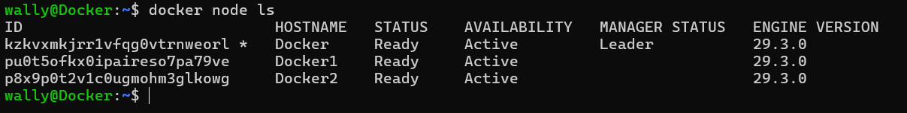
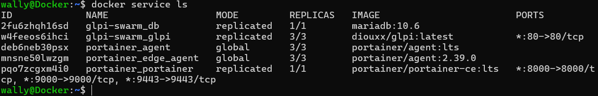
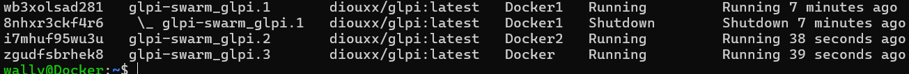
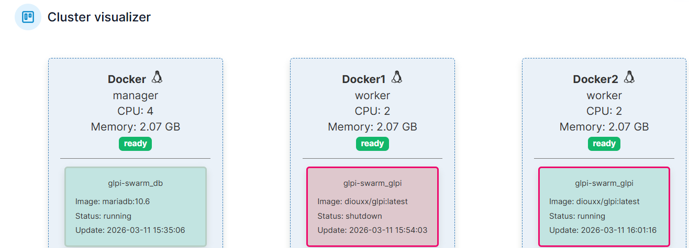

```
version: "3.8"

services:
  glpi:
    image: diouxx/glpi
    ports:
      - "80:80"
    volumes:
      - glpi_data:/var/www/html
    environment:
      - TIMEZONE=Europe/Paris
      - DB_HOST=db
      - DB_NAME=glpi
      - DB_USER=glpi
      - DB_PASSWORD=rocknroll
    depends_on:
      - db
    deploy:
      replicas: 3
      restart_policy:
        condition: on-failure

  db:
    image: mariadb:10.6
    volumes:
      - db_data:/var/lib/mysql
    environment:
      MYSQL_ROOT_PASSWORD: rocknroll
      MYSQL_DATABASE: glpi
      MYSQL_USER: glpi
      MYSQL_PASSWORD: rocknroll
    deploy:
      replicas: 1
      placement:
        constraints:
          - node.role == manager
      restart_policy:
        condition: on-failure

volumes:
  glpi_data:
  db_data:
```













