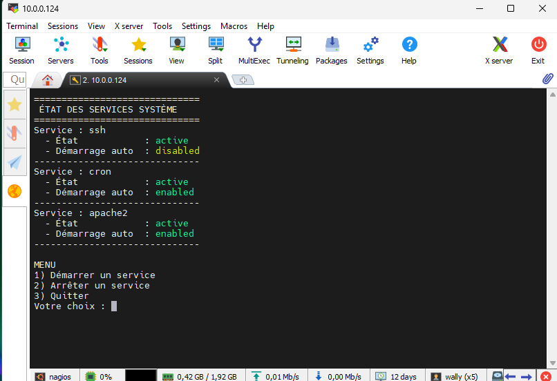
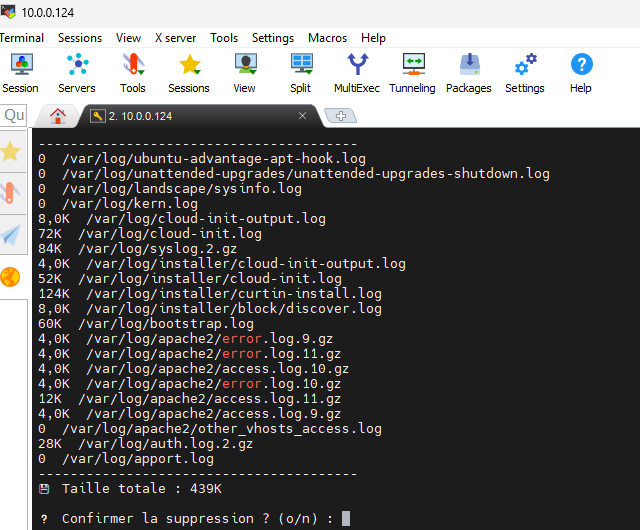
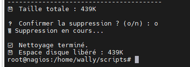
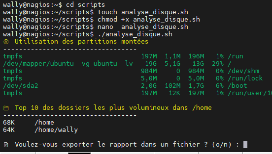
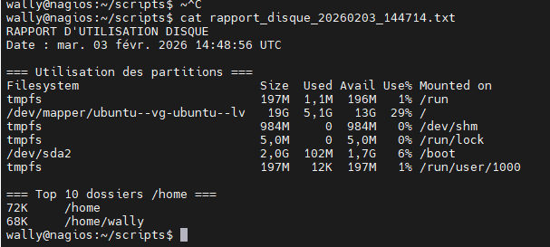
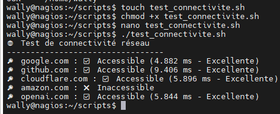
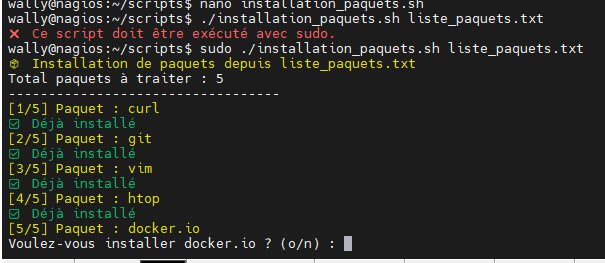
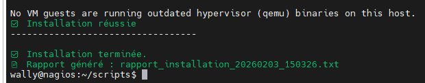
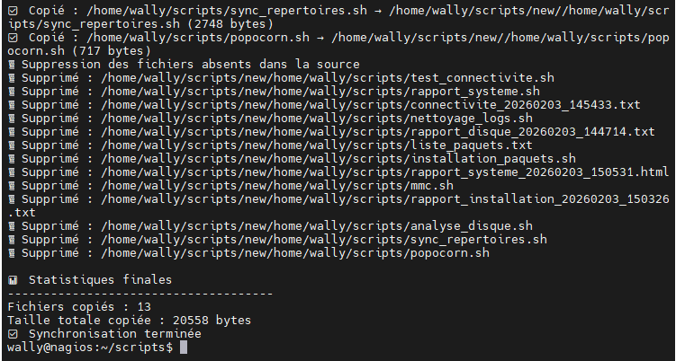

# Exercices complémentaires - Scripts Bash

## Exercice 6 : Gestionnaire de services

### Objectif
Créer un script qui affiche l'état de plusieurs services système et permet de les démarrer/arrêter.

### Consignes
- Le script doit vérifier l'état d'au moins 3 services (ssh, cron, apache2/nginx)

- Afficher pour chaque service : nom, état (actif/inactif), et s'il est activé au démarrage

- Proposer un menu pour démarrer ou arrêter un service

- Gérer les permissions (sudo) correctement

- Afficher des messages de confirmation après chaque action

  ```
  #!/bin/bash
  
  # Vérification des droits sudo
  if [[ $EUID -ne 0 ]]; then
      echo "❌ Ce script doit être exécuté avec sudo."
      echo "👉 Exemple : sudo ./gestion_services.sh"
      exit 1
  fi
  
  SERVICES=("ssh" "cron" "apache2")
  
  # Fonction d'affichage de l'état des services
  afficher_etat() {
      echo "=============================="
      echo " ÉTAT DES SERVICES SYSTÈME"
      echo "=============================="
  
      for service in "${SERVICES[@]}"; do
          if systemctl list-unit-files | grep -q "^$service"; then
              etat=$(systemctl is-active "$service")
              demarrage=$(systemctl is-enabled "$service" 2>/dev/null)
  
              echo "Service : $service"
              echo "  - État            : $etat"
              echo "  - Démarrage auto  : $demarrage"
              echo "------------------------------"
          else
              echo "Service : $service (non installé)"
              echo "------------------------------"
          fi
      done
  }
  
  # Menu principal
  while true; do
      afficher_etat
  
      echo ""
      echo "MENU"
      echo "1) Démarrer un service"
      echo "2) Arrêter un service"
      echo "3) Quitter"
      read -p "Votre choix : " choix
  
      case $choix in
          1)
              read -p "Nom du service à démarrer : " service
              if systemctl start "$service" 2>/dev/null; then
                  echo "✅ Le service '$service' a été démarré avec succès."
              else
                  echo "❌ Impossible de démarrer le service '$service'."
              fi
              ;;
          2)
              read -p "Nom du service à arrêter : " service
              if systemctl stop "$service" 2>/dev/null; then
                  echo "✅ Le service '$service' a été arrêté avec succès."
              else
                  echo "❌ Impossible d'arrêter le service '$service'."
              fi
              ;;
          3)
              echo "👋 Fin du script. À bientôt !"
              exit 0
              ;;
          *)
              echo "⚠️ Choix invalide."
              ;;
      esac
  
      echo ""
      read -p "Appuyez sur Entrée pour continuer..."
      clear
  done
  
  ```

  

---

## Exercice 7 : Nettoyeur de logs

### Objectif
Écrire un script qui nettoie les fichiers de logs anciens d'un système.

### Consignes
- Le script prend en argument le nombre de jours (ex: supprimer les logs de plus de 7 jours)

- Chercher dans `/var/log` les fichiers `.log` et `.gz` correspondants

- Afficher la liste des fichiers qui seront supprimés avec leur taille

- Demander confirmation avant la suppression

- Afficher l'espace disque libéré à la fin

- Écrire un fichier de log de l'opération

  ```
  #!/bin/bash
  
  # ==========================
  # Vérification des arguments
  # ==========================
  if [[ $# -ne 1 ]]; then
      echo "❌ Usage : $0 <nombre_de_jours>"
      exit 1
  fi
  
  NB_JOURS=$1
  LOG_DIR="/var/log"
  LOG_OPERATION="/var/log/nettoyage_logs.log"
  
  # Vérification sudo
  if [[ $EUID -ne 0 ]]; then
      echo "❌ Ce script doit être exécuté avec sudo."
      exit 1
  fi
  
  echo "🧹 Recherche des fichiers de logs de plus de $NB_JOURS jours..."
  echo ""
  
  # ==========================
  # Recherche des fichiers
  # ==========================
  mapfile -t FICHIERS < <(find "$LOG_DIR" -type f \( -name "*.log" -o -name "*.gz" \) -mtime +"$NB_JOURS")
  
  if [[ ${#FICHIERS[@]} -eq 0 ]]; then
      echo "✅ Aucun fichier à supprimer."
      exit 0
  fi
  
  # ==========================
  # Affichage des fichiers
  # ==========================
  TOTAL_AVANT=0
  
  echo "📄 Fichiers concernés :"
  echo "----------------------------------------"
  
  for fichier in "${FICHIERS[@]}"; do
      taille=$(du -b "$fichier" | cut -f1)
      TOTAL_AVANT=$((TOTAL_AVANT + taille))
      echo "$(du -h "$fichier" | cut -f1)  $fichier"
  done
  
  echo "----------------------------------------"
  echo "💾 Taille totale : $(numfmt --to=iec $TOTAL_AVANT)"
  echo ""
  
  # ==========================
  # Confirmation utilisateur
  # ==========================
  read -p "❓ Confirmer la suppression ? (o/n) : " CONFIRM
  
  if [[ "$CONFIRM" != "o" ]]; then
      echo "🚫 Opération annulée."
      exit 0
  fi
  
  # ==========================
  # Suppression + journalisation
  # ==========================
  echo "🗑️ Suppression en cours..."
  DATE=$(date "+%Y-%m-%d %H:%M:%S")
  
  {
      echo "=============================="
      echo "Nettoyage des logs - $DATE"
      echo "Logs supprimés (> $NB_JOURS jours) :"
  } >> "$LOG_OPERATION"
  
  for fichier in "${FICHIERS[@]}"; do
      echo "$fichier" >> "$LOG_OPERATION"
      rm -f "$fichier"
  done
  
  # ==========================
  # Calcul espace libéré
  # ==========================
  echo ""
  echo "✅ Nettoyage terminé."
  echo "💾 Espace disque libéré : $(numfmt --to=iec $TOTAL_AVANT)"
  
  echo "Espace libéré : $(numfmt --to=iec $TOTAL_AVANT)" >> "$LOG_OPERATION"
  
  ```

  

  

---

## Exercice 8 : Analyseur d'espace disque

### Objectif
Créer un script qui analyse l'utilisation de l'espace disque et identifie les gros consommateurs.

### Consignes
- Afficher l'utilisation de chaque partition montée

- Identifier les 10 plus gros dossiers dans `/home`

- Afficher la taille de chaque dossier de manière lisible (Mo, Go)

- Colorier en rouge les partitions utilisées à plus de 80%

- Proposer d'exporter le rapport dans un fichier texte

  ```
  #!/bin/bash
  
  # =====================
  # Couleurs (les tiennes)
  # =====================
  RED='\033[0;31m'
  GREEN='\033[0;32m'
  YELLOW='\033[1;33m'
  NC='\033[0m'
  
  RAPPORT="rapport_disque_$(date +%Y%m%d_%H%M%S).txt"
  
  # =====================
  # Utilisation des partitions
  # =====================
  echo -e "${YELLOW}📀 Utilisation des partitions montées${NC}"
  echo "----------------------------------"
  
  df -h --output=source,size,used,avail,pcent,target | tail -n +2 | while read ligne; do
      usage=$(echo "$ligne" | awk '{print $5}' | tr -d '%')
  
      if [[ $usage -ge 80 ]]; then
          echo -e "${RED}$ligne${NC}"
      else
          echo -e "${GREEN}$ligne${NC}"
      fi
  done
  
  echo ""
  
  # =====================
  # Top 10 des dossiers /home
  # =====================
  echo -e "${YELLOW}📁 Top 10 des dossiers les plus volumineux dans /home${NC}"
  echo "----------------------------------"
  
  du -h /home --max-depth=1 2>/dev/null | sort -hr | head -n 10
  
  # =====================
  # Export du rapport
  # =====================
  echo ""
  read -p "📄 Voulez-vous exporter le rapport dans un fichier ? (o/n) : " REP
  
  if [[ "$REP" == "o" ]]; then
      {
          echo "RAPPORT D'UTILISATION DISQUE"
          echo "Date : $(date)"
          echo ""
          echo "=== Utilisation des partitions ==="
          df -h
          echo ""
          echo "=== Top 10 dossiers /home ==="
          du -h /home --max-depth=1 2>/dev/null | sort -hr | head -n 10
      } > "$RAPPORT"
  
      echo -e "${GREEN}✅ Rapport exporté dans : $RAPPORT${NC}"
  else
      echo -e "${YELLOW}ℹ️ Aucun fichier généré.${NC}"
  fi
  
  ```

  

  

---

## Exercice 9 : Vérificateur de connexion réseau

### Objectif
Écrire un script qui teste la connectivité réseau vers plusieurs serveurs.

### Consignes
- Tester la connexion vers au moins 5 serveurs (ex: google.com, github.com, cloudflare.com, etc.)

- Utiliser `ping` pour vérifier la disponibilité

- Afficher un indicateur de qualité de réponse pour chaque serveur

- Identifier les serveurs inaccessibles

- Afficher un résumé : X/5 serveurs accessibles

- Écrire les résultats dans un fichier

  ```
  #!/bin/bash
  
  # =====================
  # Couleurs
  # =====================
  GREEN='\033[0;32m'
  RED='\033[0;31m'
  YELLOW='\033[1;33m'
  NC='\033[0m'
  
  # =====================
  # Serveurs à tester
  # =====================
  SERVEURS=(
      "google.com"
      "github.com"
      "cloudflare.com"
      "amazon.com"
      "openai.com"
  )
  
  TOTAL=${#SERVEURS[@]}
  OK=0
  
  FICHIER_LOG="connectivite_$(date +%Y%m%d_%H%M%S).txt"
  
  echo "RAPPORT DE CONNECTIVITÉ RÉSEAU" > "$FICHIER_LOG"
  echo "Date : $(date)" >> "$FICHIER_LOG"
  echo "---------------------------------" >> "$FICHIER_LOG"
  
  echo -e "${YELLOW}🌐 Test de connectivité réseau${NC}"
  echo "---------------------------------"
  
  # =====================
  # Test des serveurs
  # =====================
  for serveur in "${SERVEURS[@]}"; do
      echo -n "🔎 $serveur : "
  
      RESULTAT=$(ping -c 2 -W 2 "$serveur" 2>/dev/null)
  
      if [[ $? -eq 0 ]]; then
          LATENCE=$(echo "$RESULTAT" | grep "rtt" | awk -F'/' '{print $5}')
          OK=$((OK + 1))
  
          # Qualité de réponse
          if [[ ${LATENCE%.*} -lt 50 ]]; then
              QUALITE="Excellente"
              COULEUR=$GREEN
          elif [[ ${LATENCE%.*} -lt 100 ]]; then
              QUALITE="Bonne"
              COULEUR=$YELLOW
          else
              QUALITE="Lente"
              COULEUR=$RED
          fi
  
          echo -e "${COULEUR}✅ Accessible (${LATENCE} ms - $QUALITE)${NC}"
          echo "$serveur : Accessible - ${LATENCE} ms ($QUALITE)" >> "$FICHIER_LOG"
      else
          echo -e "${RED}❌ Inaccessible${NC}"
          echo "$serveur : Inaccessible" >> "$FICHIER_LOG"
      fi
  done
  
  #
  
  ```

  

---

## Exercice 10 : Installateur de paquets

### Objectif
Créer un script qui automatise l'installation d'un ensemble de paquets.

### Consignes
- Le script lit une liste de paquets depuis un fichier texte

- Vérifier pour chaque paquet s'il est déjà installé

- Si non installé, proposer de l'installer

- Afficher une barre de progression ou un compteur (X/N paquets installés)

- Gérer les erreurs d'installation

- Créer un rapport final listant les paquets installés avec succès et ceux en erreur

  ```
  #!/bin/bash
  
  # =====================
  # Couleurs
  # =====================
  GREEN='\033[0;32m'
  RED='\033[0;31m'
  YELLOW='\033[1;33m'
  NC='\033[0m'
  
  # =====================
  # Vérification sudo
  # =====================
  if [[ $EUID -ne 0 ]]; then
      echo -e "${RED}❌ Ce script doit être exécuté avec sudo.${NC}"
      exit 1
  fi
  
  # =====================
  # Vérification du fichier de paquets
  # =====================
  if [[ $# -ne 1 ]]; then
      echo -e "${YELLOW}Usage : $0 <fichier_paquets.txt>${NC}"
      exit 1
  fi
  
  FICHIER="$1"
  
  if [[ ! -f "$FICHIER" ]]; then
      echo -e "${RED}❌ Fichier $FICHIER introuvable.${NC}"
      exit 1
  fi
  
  # =====================
  # Initialisation des compteurs et tableaux
  # =====================
  PAQUETS=($(grep -vE '^\s*#|^\s*$' "$FICHIER")) # ignore les lignes vides et commentaires
  TOTAL=${#PAQUETS[@]}
  COUNT=0
  
  declare -a INSTALL_OK
  declare -a INSTALL_FAIL
  
  echo -e "${YELLOW}📦 Installation de paquets depuis $FICHIER${NC}"
  echo "Total paquets à traiter : $TOTAL"
  echo "----------------------------------"
  
  # =====================
  # Traitement de chaque paquet
  # =====================
  for paquet in "${PAQUETS[@]}"; do
      COUNT=$((COUNT + 1))
      echo -e "${YELLOW}[$COUNT/$TOTAL] Paquet : $paquet${NC}"
  
      # Vérification si déjà installé
      if dpkg -s "$paquet" &>/dev/null; then
          echo -e "${GREEN}✅ Déjà installé${NC}"
          INSTALL_OK+=("$paquet (déjà installé)")
          continue
      fi
  
      # Demande confirmation pour installer
      read -p "Voulez-vous installer $paquet ? (o/n) : " REP
      if [[ "$REP" != "o" ]]; then
          echo -e "${RED}❌ Ignoré${NC}"
          INSTALL_FAIL+=("$paquet (ignoré)")
          continue
      fi
  
      # Tentative d'installation
      if apt-get install -y "$paquet"; then
          echo -e "${GREEN}✅ Installation réussie${NC}"
          INSTALL_OK+=("$paquet")
      else
          echo -e "${RED}❌ Échec de l'installation${NC}"
          INSTALL_FAIL+=("$paquet")
      fi
      echo "----------------------------------"
  done
  
  # =====================
  # Rapport final
  # =====================
  RAPPORT="rapport_installation_$(date +%Y%m%d_%H%M%S).txt"
  
  {
      echo "RAPPORT D'INSTALLATION DES PAQUETS"
      echo "Date : $(date)"
      echo ""
      echo "Paquets installés avec succès :"
      for p in "${INSTALL_OK[@]}"; do
          echo "  - $p"
      done
      echo ""
      echo "Paquets en erreur ou ignorés :"
      for p in "${INSTALL_FAIL[@]}"; do
          echo "  - $p"
      done
  } > "$RAPPORT"
  
  echo ""
  echo -e "${GREEN}✅ Installation terminée.${NC}"
  echo -e "${GREEN}📄 Rapport généré : $RAPPORT${NC}"
  
  ```

  

  

  

---

## Exercice 11 : Générateur de rapports système

### Objectif
Développer un script qui génère un rapport HTML complet sur l'état du système.

### Consignes
Le rapport HTML doit contenir :
- Nom de la machine et version du système

- Utilisation CPU et mémoire

- Espace disque

- Services en cours d'exécution

- Dernières connexions utilisateurs

- Mise en page HTML avec CSS basique

- Ouvrir automatiquement le rapport dans le navigateur à la fin

  ```
  #!/bin/bash
  
  # =====================
  # Variables
  # =====================
  DATE=$(date "+%Y-%m-%d %H:%M:%S")
  FICHIER_HTML="rapport_systeme_$(date +%Y%m%d_%H%M%S).html"
  
  # Infos système
  NOM_MACHINE=$(hostname)
  VERSION_OS=$(lsb_release -d | cut -f2-)
  
  # Utilisation CPU et mémoire
  CPU_USAGE=$(top -bn1 | grep "Cpu(s)" | awk '{print 100 - $8"%"}')
  MEM_INFO=$(free -h | awk 'NR==2{printf "%s/%s (%s)", $3, $2, $3*100/$2 "%"}')
  
  # Espace disque
  DISK_USAGE=$(df -h --output=source,size,used,avail,pcent,target | tail -n +2)
  
  # Services en cours d'exécution
  SERVICES=$(systemctl list-units --type=service --state=running --no-pager --no-legend | awk '{print $1}' | head -n 20)
  
  # Dernières connexions utilisateurs
  LAST_USERS=$(last -n 10 | head -n 10)
  
  # =====================
  # Génération du HTML
  # =====================
  cat << EOF > "$FICHIER_HTML"
  <!DOCTYPE html>
  <html lang="fr">
  <head>
  <meta charset="UTF-8">
  <title>Rapport Système - $NOM_MACHINE</title>
  <style>
  body { font-family: Arial, sans-serif; margin: 20px; background-color:#f5f5f5; }
  h1 { color: #333; }
  h2 { color: #555; }
  table { border-collapse: collapse; width: 100%; margin-bottom:20px; }
  th, td { border: 1px solid #999; padding: 8px; text-align: left; }
  th { background-color: #555; color: white; }
  tr:nth-child(even) { background-color: #eee; }
  .section { background-color: white; padding: 15px; margin-bottom: 20px; border-radius: 5px; box-shadow: 1px 1px 5px #ccc; }
  </style>
  </head>
  <body>
  <h1>Rapport Système - $NOM_MACHINE</h1>
  <p><strong>Date :</strong> $DATE</p>
  
  <div class="section">
  <h2>Informations système</h2>
  <p><strong>Nom de la machine :</strong> $NOM_MACHINE</p>
  <p><strong>Version OS :</strong> $VERSION_OS</p>
  </div>
  
  <div class="section">
  <h2>Utilisation CPU et mémoire</h2>
  <p><strong>CPU :</strong> $CPU_USAGE</p>
  <p><strong>Mémoire :</strong> $MEM_INFO</p>
  </div>
  
  <div class="section">
  <h2>Espace disque</h2>
  <table>
  <tr><th>Partition</th><th>Taille</th><th>Utilisée</th><th>Disponible</th><th>%</th><th>Montage</th></tr>
  EOF
  
  # Ajouter les lignes disque
  echo "$DISK_USAGE" | while read line; do
      PART=$(echo $line | awk '{print $1}')
      SIZE=$(echo $line | awk '{print $2}')
      USED=$(echo $line | awk '{print $3}')
      AVAIL=$(echo $line | awk '{print $4}')
      PERCENT=$(echo $line | awk '{print $5}')
      MOUNT=$(echo $line | awk '{print $6}')
      echo "<tr><td>$PART</td><td>$SIZE</td><td>$USED</td><td>$AVAIL</td><td>$PERCENT</td><td>$MOUNT</td></tr>" >> "$FICHIER_HTML"
  done
  
  cat << EOF >> "$FICHIER_HTML"
  </table>
  </div>
  
  <div class="section">
  <h2>Services en cours d'exécution (Top 20)</h2>
  <ul>
  EOF
  
  for s in $SERVICES; do
      echo "<li>$s</li>" >> "$FICHIER_HTML"
  done
  
  cat << EOF >> "$FICHIER_HTML"
  </ul>
  </div>
  
  <div class="section">
  <h2>Dernières connexions utilisateurs</h2>
  <pre>
  $LAST_USERS
  </pre>
  </div>
  
  </body>
  </html>
  EOF
  
  # =====================
  # Ouverture dans le navigateur
  # =====================
  echo "✅ Rapport généré : $FICHIER_HTML"
  xdg-open "$FICHIER_HTML" &>/dev/null || echo "⚠️ Impossible d'ouvrir automatiquement le navigateur"
  
  ```

  

---

## Exercice 12 : Synchronisateur de fichiers

### Objectif
Créer un script qui synchronise deux répertoires.

### Consignes
- Prendre en arguments : répertoire source et répertoire destination

- Comparer les fichiers des deux répertoires

- Copier uniquement les fichiers nouveaux ou modifiés

- Afficher la liste des fichiers copiés

- Afficher les statistiques : nombre de fichiers copiés, taille totale

- Gérer les erreurs (permissions, espace disque)

- Option bonus : supprimer dans la destination les fichiers qui n'existent plus dans la source

  ```
  #!/bin/bash
  
  # =====================
  # Couleurs pour affichage
  # =====================
  GREEN='\033[0;32m'
  RED='\033[0;31m'
  YELLOW='\033[1;33m'
  NC='\033[0m'
  
  # =====================
  # Vérification des arguments
  # =====================
  if [[ $# -lt 2 ]]; then
      echo -e "${YELLOW}Usage : $0 <source> <destination> [--delete]${NC}"
      exit 1
  fi
  
  SOURCE="$1"
  DEST="$2"
  DELETE=false
  
  if [[ "$3" == "--delete" ]]; then
      DELETE=true
  fi
  
  # Vérification des répertoires
  if [[ ! -d "$SOURCE" ]]; then
      echo -e "${RED}❌ Source $SOURCE introuvable${NC}"
      exit 1
  fi
  
  if [[ ! -d "$DEST" ]]; then
      echo -e "${YELLOW}⚠️ Destination $DEST inexistante, création...${NC}"
      mkdir -p "$DEST" || { echo -e "${RED}❌ Impossible de créer $DEST${NC}"; exit 1; }
  fi
  
  # =====================
  # Initialisation
  # =====================
  COPIES=0
  TAILLE=0
  echo -e "${YELLOW}📂 Synchronisation de $SOURCE → $DEST${NC}"
  echo "-------------------------------------"
  
  # =====================
  # Fonction de copie
  # =====================
  sync_file() {
      local src="$1"
      local dst="$2"
  
      # Crée le dossier parent si nécessaire
      mkdir -p "$(dirname "$dst")" 2>/dev/null
  
      # Vérifie si le fichier est nouveau ou modifié
      if [[ ! -f "$dst" || "$src" -nt "$dst" ]]; then
          cp -u "$src" "$dst" 2>/dev/null
          if [[ $? -eq 0 ]]; then
              local size=$(stat -c%s "$src")
              TAILLE=$((TAILLE + size))
              COPIES=$((COPIES + 1))
              echo -e "${GREEN}✅ Copié : $src → $dst (${size} bytes)${NC}"
          else
              echo -e "${RED}❌ Erreur de copie : $src${NC}"
          fi
      fi
  }
  
  # =====================
  # Parcours des fichiers source
  # =====================
  while IFS= read -r -d '' file; do
      REL_PATH="${file#$SOURCE/}"
      DEST_FILE="$DEST/$REL_PATH"
      sync_file "$file" "$DEST_FILE"
  done < <(find "$SOURCE" -type f -print0)
  
  # =====================
  # Option : supprimer les fichiers obsolètes dans DEST
  # =====================
  if $DELETE; then
      echo -e "${YELLOW}🗑️ Suppression des fichiers absents dans la source${NC}"
      while IFS= read -r -d '' dfile; do
          REL_PATH="${dfile#$DEST/}"
          SRC_FILE="$SOURCE/$REL_PATH"
          if [[ ! -f "$SRC_FILE" ]]; then
              rm -f "$dfile" 2>/dev/null
              if [[ $? -eq 0 ]]; then
                  echo -e "${RED}🗑 Supprimé : $dfile${NC}"
              else
                  echo -e "${RED}❌ Impossible de supprimer : $dfile${NC}"
              fi
          fi
      done < <(find "$DEST" -type f -print0)
  fi
  
  # =====================
  # Statistiques finales
  # =====================
  echo ""
  echo -e "${YELLOW}📊 Statistiques finales${NC}"
  echo "-------------------------------------"
  echo -e "Fichiers copiés : ${GREEN}$COPIES${NC}"
  echo -e "Taille totale copiée : ${GREEN}$TAILLE bytes${NC}"
  
  echo -e "${GREEN}✅ Synchronisation terminée${NC}"
  
  ```

  

```
chmod +x sync_repertoires.sh

# Synchronisation simple
./sync_repertoires.sh /chemin/source /chemin/destination

# Synchronisation avec suppression des fichiers obsolètes
./sync_repertoires.sh /chemin/source /chemin/destination --delete

```



---


## Conseils généraux

### Pour tous les exercices

- Commencez toujours par le shebang `#!/bin/bash`
- Ajoutez des commentaires pour expliquer votre code
- Validez les arguments et les entrées utilisateur
- Gérez les erreurs avec des messages clairs
- Testez vos scripts dans un environnement de test

### Commandes utiles

- `du -sh` : taille d'un dossier
- `df -h` : espace disque
- `systemctl status` : état d'un service
- `find` : rechercher des fichiers
- `ping -c 3` : tester une connexion (3 paquets)
- `wc -l` : compter les lignes

### Gestion des couleurs

```bash
# Définir des couleurs
RED='\033[0;31m'
GREEN='\033[0;32m'
YELLOW='\033[1;33m'
NC='\033[0m' # No Color

# Utilisation
echo -e "${GREEN}Succès !${NC}"
echo -e "${RED}Erreur !${NC}"
```

---

## Ressources

- **Guide Bash** : https://fr.wikibooks.org/wiki/Programmation_Bash
- **Conditions** : https://buzut.net/maitriser-les-conditions-en-bash/
- **Explainshell** : https://explainshell.com/ (pour comprendre les commandes)
- **ShellCheck** : https://www.shellcheck.net/ (vérifier la qualité du code)
