# Challenge Git & GitHub - Gestion de versions

## Contexte professionnel

Vous rejoignez l'équipe technique de **TechSecure** en tant qu'administrateur système junior. L'équipe utilise **Git** pour versionner tous les scripts d'administration (Bash, PowerShell, Python) et **GitHub** pour partager ces scripts entre les membres de l'équipe.

Votre manager vous donne accès à ce dépôt GitHub et vous demande de le cloner, d'y contribuer en ajoutant vos propres scripts, et de synchroniser votre travail avec l'équipe.

Cette pratique est **essentielle** : dans le monde professionnel, vous travaillerez toujours sur des dépôts existants partagés avec votre équipe.

## Objectifs du challenge

À l'issue de ce challenge, vous serez capable de :
- Cloner un dépôt Git existant depuis GitHub
- Utiliser les commandes de base (add, commit, status, log)
- Synchroniser votre travail avec un dépôt distant (push, pull)
- Écrire des messages de commit clairs et explicites
- Comprendre le cycle de travail collaboratif avec Git

---

## ÉTAPE 1 - Installation et configuration de Git

### Objectif
Installer Git et le configurer avec votre identité.

### Travail à réaliser

**1.1** - Vérifiez si Git est installé sur votre machine :
```bash
git --version
```


**1.2** - Si Git n'est pas installé, installez-le :

```bash
# Sur Debian/Ubuntu
sudo apt update
sudo apt install git -y

# Sur Windows
# Téléchargez depuis https://git-scm.com/
```

**1.3** - Configurez votre identité (ces informations apparaîtront dans vos commits) :
```bash
git config --global user.name "Votre Nom"
git config --global user.email "votre.email@example.com"
```

**1.4** - Vérifiez votre configuration :

```bash
git config --list
```

---

## ÉTAPE 2 - Clonage du dépôt

### Objectif
Récupérer ce dépôt en local pour commencer à travailler.

### Travail à réaliser

**2.1** - Récupérez l'URL de ce dépôt en cliquant sur le bouton vert **Code** en haut de cette page GitHub, puis copiez l'URL HTTPS.

**2.2** - Positionnez-vous dans un dossier de travail :
```bash
cd ~
mkdir -p projets
cd projets
```

**2.3** - Clonez ce dépôt (remplacez `<URL_DU_DEPOT>` par l'URL que vous avez copiée) :
```bash
git clone <URL_DU_DEPOT>
```

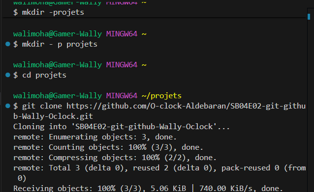

Vous devrez peut-être entrer vos identifiants GitHub.

**2.4** - Entrez dans le dossier du projet :
```bash
cd SB04E02-git-github
```

**2.5** - Explorez le contenu du dépôt :
```bash
ls -la
```

**2.6** - Vérifiez l'état du dépôt :
```bash
git status
```

**2.7** - Consultez l'historique existant :
```bash
git log --oneline
```

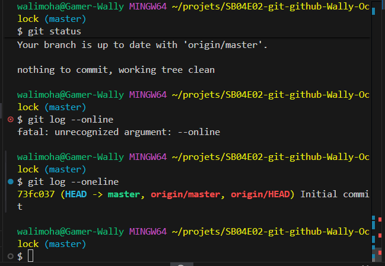

---

## ÉTAPE 3 - Découverte du dépôt

### Objectif
Comprendre la structure du projet existant.

### Travail à réaliser

**3.1** - Lisez le fichier README.md :
```bash
cat README.md
```

**3.2** - Explorez les fichiers existants :
```bash
ls -l
```

**3.3** - Vérifiez la configuration du dépôt distant :
```bash
git remote -v
```

Vous devriez voir l'URL de ce dépôt GitHub associée au nom `origin`.

**3.4** - Vérifiez sur quelle branche vous êtes :
```bash
git branch
```

Vous devriez être sur la branche `main` (ou `master`).

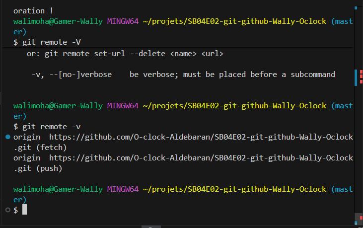

---

## ÉTAPE 4 - Premier script

### Objectif
Ajouter votre premier script au dépôt.

### Travail à réaliser

**4.1** - Créez un script de sauvegarde personnalisé :
```bash
nano backup-users.sh
```

Contenu du script :
```bash
#!/bin/bash
# Script de sauvegarde des répertoires utilisateurs

BACKUP_DIR="/backup/users"
DATE=$(date +%Y%m%d_%H%M%S)

echo "=== Sauvegarde des utilisateurs - $DATE ==="

# Création du dossier de sauvegarde
mkdir -p $BACKUP_DIR

# Sauvegarde
echo "Sauvegarde en cours..."
# tar -czf $BACKUP_DIR/users_$DATE.tar.gz /home/

echo "Sauvegarde terminée : $BACKUP_DIR/users_$DATE.tar.gz"
```

**4.2** - Rendez le script exécutable :
```bash
chmod +x backup-users.sh
```

**4.3** - Vérifiez l'état de votre dépôt :
```bash
git status
```

Vous devriez voir `backup-users.sh` comme fichier non suivi (untracked).

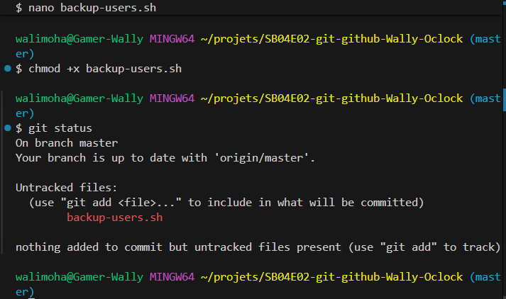

**4.4** - Ajoutez le fichier à l'index :
```bash
git add backup-users.sh
```

**4.5** - Vérifiez à nouveau l'état :
```bash
git status
```

Le fichier devrait maintenant être en vert, prêt à être commiter.

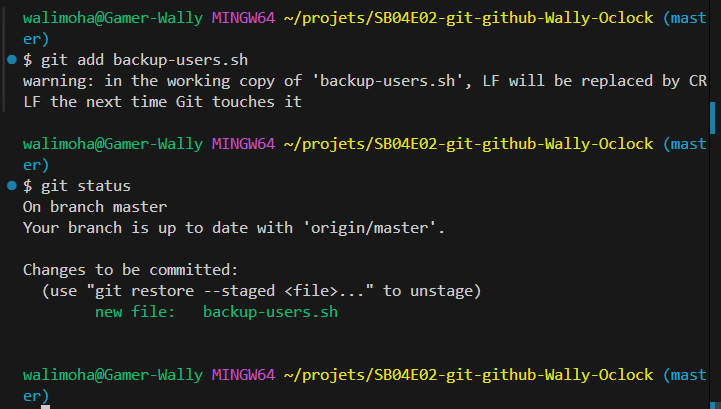

**4.6** - Créez votre premier commit :
```bash
git commit -m "feat: ajout du script de sauvegarde utilisateurs"
```

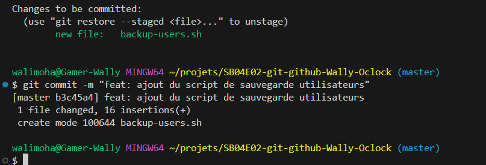

**4.7** - Consultez l'historique :

```bash
git log --oneline
```

Votre commit devrait apparaître en premier.

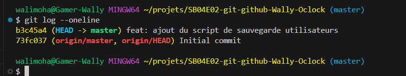

---

## ÉTAPE 5 - Synchronisation avec GitHub

### Objectif
Envoyer vos modifications sur le dépôt distant.

### Travail à réaliser

**5.1** - Avant de pousser vos modifications, récupérez les éventuelles modifications des autres :
```bash
git pull origin main
```

**5.2** - Envoyez maintenant votre commit sur GitHub :
```bash
git push origin main
```

Vous devrez peut-être entrer vos identifiants GitHub.

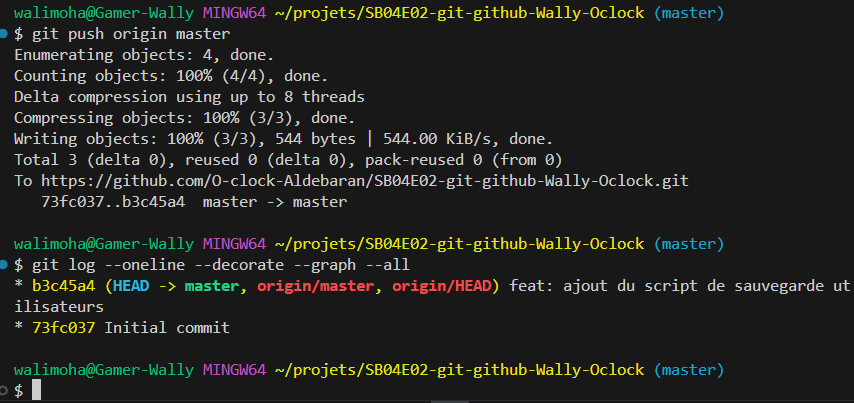

**5.3** - Allez sur GitHub et consultez ce dépôt :
- Votre script devrait apparaître
- Cliquez sur "Commits" pour voir votre contribution
- Cliquez sur votre commit pour voir les modifications

**5.4** - Vérifiez que votre nom apparaît bien comme auteur du commit

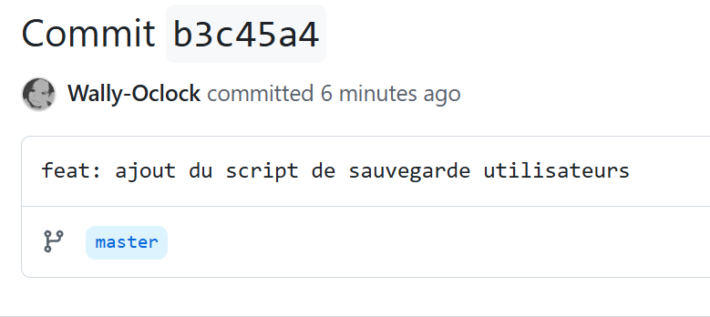

---

## ÉTAPE 6 - Ajout de plusieurs scripts

### Objectif
Contribuer davantage au projet avec plusieurs scripts.

### Travail à réaliser

**6.1** - Créez un script de monitoring réseau :
```bash
nano monitoring-network.sh
```

Contenu :
```bash
#!/bin/bash
# Script de monitoring réseau

echo "=== Monitoring Réseau ==="

echo "--- Interfaces réseau ---"
ip addr show

echo "--- Connexions actives ---"
ss -tuln

echo "--- Test de connectivité ---"
ping -c 3 8.8.8.8
```

**6.2** - Rendez-le exécutable et commitez :
```bash
chmod +x monitoring-network.sh
git add monitoring-network.sh
git commit -m "feat: ajout du script de monitoring réseau"
```

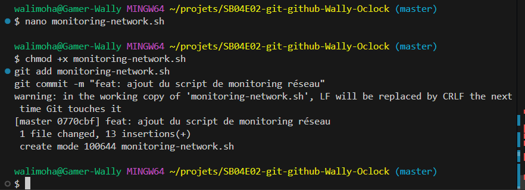

**6.3** - Créez un script de nettoyage système :

```bash
nano cleanup.sh
```

Contenu :
```bash
#!/bin/bash
# Script de nettoyage système

echo "=== Nettoyage du système ==="

echo "Nettoyage des paquets inutiles..."
# sudo apt autoremove -y

echo "Nettoyage du cache..."
# sudo apt clean

echo "Nettoyage des logs anciens..."
# sudo journalctl --vacuum-time=7d

echo "Nettoyage terminé !"
```

**6.4** - Commitez ce nouveau script :
```bash
chmod +x cleanup.sh
git add cleanup.sh
git commit -m "feat: ajout du script de nettoyage système"
```

**6.5** - Créez un fichier de configuration :
```bash
nano scripts.conf
```

Contenu :
```
# Configuration des scripts TechSecure

# Sauvegarde
BACKUP_RETENTION=7
BACKUP_DIR=/backup

# Monitoring
CHECK_INTERVAL=300
LOG_LEVEL=INFO

# Nettoyage
AUTO_CLEANUP=true
```

**6.6** - Commitez la configuration :
```bash
git add scripts.conf
git commit -m "config: ajout du fichier de configuration des scripts"
```

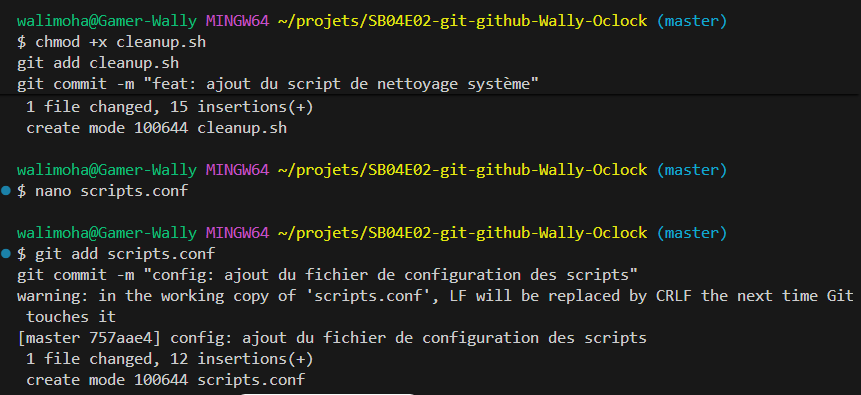

**6.7** - Consultez votre historique local :

```bash
git log --oneline
```

Vous devriez voir vos 4 commits (backup-users, monitoring-network, cleanup, scripts.conf).

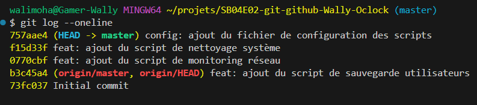

**6.8** - Poussez tous vos commits sur GitHub :
```bash
git pull origin main
git push origin main
```

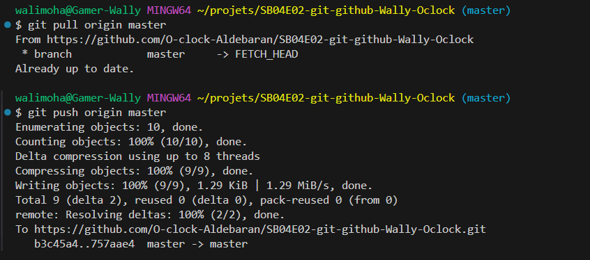

---

## ÉTAPE 7 - Modification de fichiers existants

### Objectif
Modifier des fichiers existants et comprendre le suivi des modifications.

### Travail à réaliser

**7.1** - Modifiez le README.md pour documenter vos scripts :
```bash
nano README.md
```

Ajoutez une section (adaptez selon le contenu existant) :
```markdown

'''## Nouveaux scripts disponibles

### backup-users.sh
Sauvegarde automatique des répertoires utilisateurs.
```bash
./backup-users.sh'''
```

### monitoring-network.sh
Monitoring de l'état réseau du serveur.
```bash
./monitoring-network.sh
```

### cleanup.sh
Nettoyage automatique du système.
```bash
sudo ./cleanup.sh
```
```

**7.2** - Vérifiez les modifications :
```bash
git status
git diff README.md
```

**7.3** - Commitez la modification :
```bash
git add README.md
git commit -m "docs: documentation des nouveaux scripts"
```

**7.4** - Modifiez un de vos scripts précédents (backup-users.sh) pour l'améliorer :
```bash
nano backup-users.sh
```

Ajoutez avant la dernière ligne :
```bash
# Nettoyage des sauvegardes de plus de 7 jours
echo "Nettoyage des anciennes sauvegardes..."
# find $BACKUP_DIR -name "users_*.tar.gz" -mtime +7 -delete
```

**7.5** - Commitez cette amélioration :
```bash
git add backup-users.sh
git commit -m "feat: ajout du nettoyage automatique des anciennes sauvegardes"
```

**7.6** - Synchronisez avec GitHub :
```bash
git pull origin master
git push origin master
```

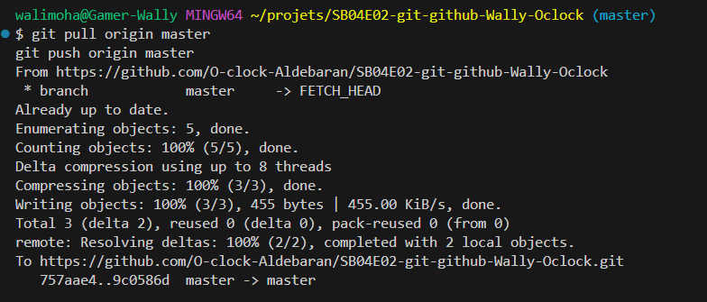

---

## ÉTAPE 8 - Récupération du travail des autres

### Objectif
Comprendre la collaboration et récupérer les contributions des collègues.

### Travail à réaliser

**8.1** - Attendez que d'autres membres de l'équipe (vos collègues apprenants) poussent leurs modifications

**8.2** - Récupérez les dernières modifications du dépôt :
```bash
git pull origin main
```

**8.3** - Consultez les nouveaux commits :
```bash
git log --oneline
```

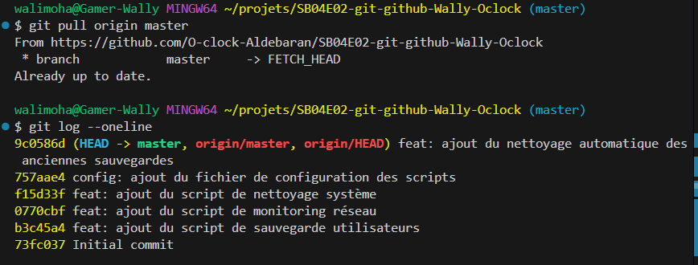

**8.4** - Explorez les nouveaux fichiers ajoutés par vos collègues :

```bash
ls -l
```

**8.5** - Lisez le contenu de quelques scripts ajoutés par vos collègues :
```bash
cat nom-du-script.sh
```

**8.6** - Testez un script d'un collègue (s'il est sans danger) :
```bash
bash nom-du-script.sh
```

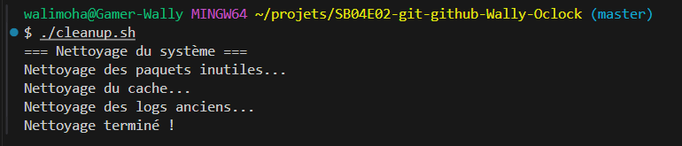

---

## ÉTAPE 9 - Bonnes pratiques

### Objectif
Appliquer les bonnes pratiques Git.

### Travail à réaliser

**9.1** - Créez un fichier `.gitignore` (s'il n'existe pas déjà) :
```bash
nano .gitignore
```

Contenu :
```
# Fichiers à ignorer
*.log
*.tmp
*.swp
backup/
.env
passwords.txt
```

**9.2** - Commitez le .gitignore :
```bash
git add .gitignore
git commit -m "chore: ajout du fichier gitignore"
```

**9.3** - Créez un fichier d'exemple qui sera ignoré :
```bash
echo "Ceci est un test" > test.log
```

**9.4** - Vérifiez que Git l'ignore bien :
```bash
git status
```

Le fichier `test.log` ne devrait PAS apparaître car il est dans le .gitignore.

**9.5** - Poussez votre .gitignore :
```bash
git pull origin main
git push origin main
```

**9.6** - Consultez l'historique complet du projet :
```bash
git log --oneline --graph --all
```

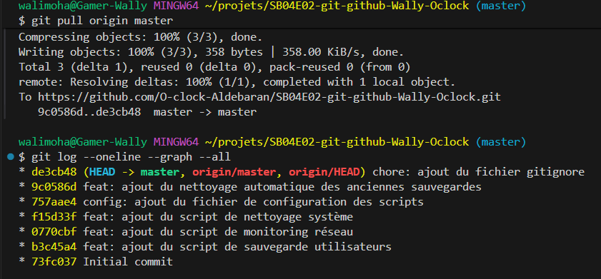

---

## ÉTAPE 10 - Synthèse et réflexion

### Objectif
Consolider vos connaissances Git et GitHub.

### Travail à réaliser

**10.1** - Répondez aux questions suivantes (3-4 lignes maximum par question) :

**Question 1 : Git vs GitHub**
Expliquez la différence entre Git et GitHub. Pourquoi utilise-t-on GitHub en entreprise ?

**Question 2 : Cycle de travail**
Décrivez les étapes pour contribuer à un projet : de la modification d'un fichier jusqu'à son envoi sur GitHub.

**Question 3 : Pull avant Push**
Pourquoi est-il important de faire `git pull` avant `git push` quand on travaille en équipe ?

**Question 4 : Messages de commit**
Donnez 3 exemples de bons messages de commit et 3 exemples de mauvais messages.

**10.2** - **BONUS** (si vous avez terminé en avance) :

- Ajoutez un script d'installation automatique
- Améliorez la documentation du README
- Explorez l'historique complet avec `git log --graph --all --decorate`
- Aidez un collègue qui rencontre des difficultés

---

## Ressources utiles

- **Documentation Git** : https://git-scm.com/doc
- **GitHub Guides** : https://guides.github.com/
- **Aide-mémoire Git** : https://education.github.com/git-cheat-sheet-education.pdf

---

## Aide-mémoire des commandes essentielles

```bash
# Configuration
git config --global user.name "Nom"
git config --global user.email "email"

# Clonage
git clone <url>

# Statut et différences
git status
git diff
git log
git log --oneline

# Ajout et commit
git add <fichier>
git add .
git commit -m "message"

# Synchronisation avec GitHub
git pull origin main    # TOUJOURS avant de push
git push origin main
```

---

## Conseils pour réussir 💡

- **Pull avant Push** : Toujours faire `git pull` avant `git push` pour éviter les conflits
- **Messages de commit clairs** : Utilisez des préfixes comme `feat:`, `fix:`, `docs:`, `config:`, `chore:`
- **Commits fréquents** : Ne gardez pas trop de modifications avant de commiter
- **Vérifiez toujours** : Utilisez `git status` régulièrement pour savoir où vous en êtes
- **Pas de secrets** : Ne commitez jamais de mots de passe ou clés d'API
- **Communiquez** : En cas de doute, demandez à vos collègues ou au formateur

---

**Difficulté** : ⭐⭐☆☆☆

🚀 **Bon courage !** Git est un outil que vous utiliserez quotidiennement dans votre carrière, prenez le temps de bien comprendre les bases de la collaboration !