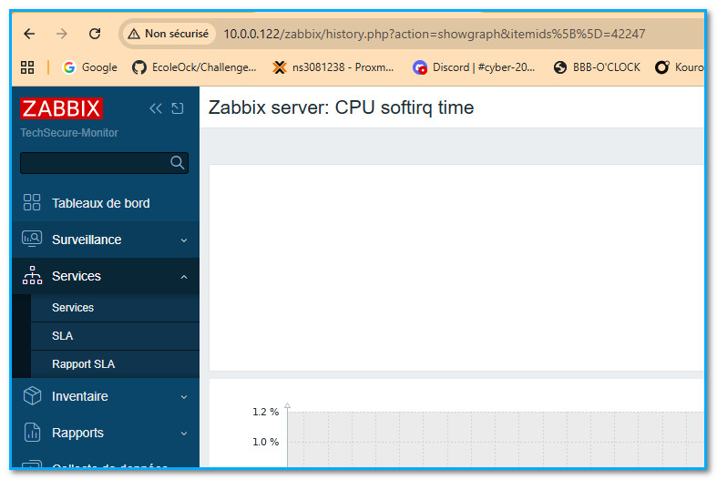

# Challenge - Mise en place d'une supervision réseau

## Objectifs du challenge

À l'issue de ce challenge, vous serez capable de :

- **Configurer et interroger** des équipements via le protocole **SNMP**.
- **Installer et configurer** **Zabbix** comme solution de supervision.
- **Comprendre la différence** entre la supervision **active** et **passive**.
- **Identifier les métriques essentielles** à surveiller pour maintenir la santé d'un parc informatique.

**Question 1** : Supervision(A partir des éléments sondés par le système mis en place pour monitore, on identifie, pour comprendre et mettre en place des réponses) vs Monitoring (C’est comme une sonde qui affiche en temps réél ce qui se passe dans le système au niveau du matériel, trafic, température des DD…)

Exemple : Monitoring : Un dd saturé passe dans le rouge | supervision :  alerté je décide de vider de l’espace ou d’ajouter un espace de stockage.

Question 2 : Méthodes de surveillance L'agent Zabbix installé sur le serveur utilise-t-il une méthode de supervision active ou passive ? Quel est l'avantage de cette approche ?

C’est une méthode active et l’avantage c’est que tout se passe côté agent qui collècte et envoie les données.

Question 3 : Mise en production Citez 2 actions indispensables pour rendre cette infrastructure de supervision vraiment utile en production.

Pour rendre cette infra de supervision utile, il faut définir des seuils d’alerte de chaque objet monitoré et en 2, mieux gérer les fausses alertes.