# Challenge 2 – Supervision avancée avec Zabbix

##### Objectifs pédagogiques

À l’issue de ce challenge, vous serez capable de :

- Installer et configurer un **agent Zabbix** sur un serveur distant

- Ajouter et superviser un **nouvel hôte** dans Zabbix

- Comprendre la **supervision active et passive**

- Créer un **dashboard personnalisé**

- Configurer des **triggers (alertes)** efficaces

- Comprendre le **cycle de vie d’une alerte Zabbix**

  ------

  **1.1** – Créez ou utilisez une VM Debian **différente du serveur Zabbix** ✅

  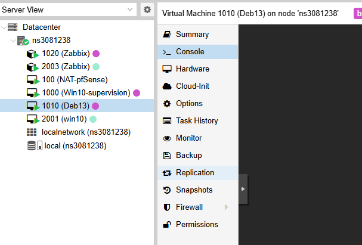

  **1.2** – Vérifiez la connectivité réseau : ping ✅

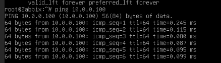

**1.4** – Mettez le système à jour : ✅

```
sudo apt update
sudo apt upgrade -y
```


**1.5 (Optionnel)** – Installez un service web pour enrichir la supervision : ✅

```
sudo apt install apache2 -y
sudo systemctl status apache2
```

## ÉTAPE 2 – Installation de l’agent Zabbix

**2.1** – Ajoutez le dépôt Zabbix (serveur client) : ✅

```
wget https://repo.zabbix.com/zabbix/7.0/debian/pool/main/z/zabbix-release/zabbix-release_latest_7.0+debian12_all.deb
sudo dpkg -i zabbix-release_latest_7.0+debian12_all.deb
sudo apt update
```

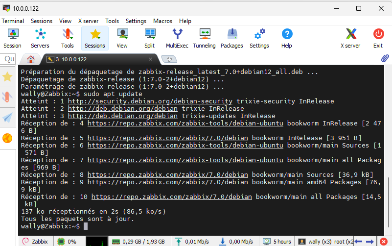

**2.2** – Installez l’agent Zabbix 2 : ✅

```
sudo apt install zabbix-agent2 -y
```

**2.3** – Configurez l’agent : ✅

```
sudo nano /etc/zabbix/zabbix_agent2.conf
```

```
Server=adresse_ip_serveur_zabbix
ServerActive=adresse_ip_serveur_zabbix
Hostname=web-server-01
```

**2.4** – Redémarrez l’agent : ✅ 

```
sudo systemctl restart zabbix-agent2
sudo systemctl enable zabbix-agent2
sudo systemctl status zabbix-agent2
```

**2.5** – Vérifiez l’écoute sur le port 10050 : ✅

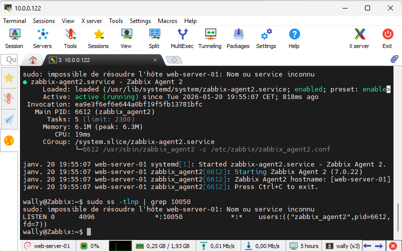

## ÉTAPE 3 – Ajout de l’hôte dans Zabbix : 

###### Objectif - Déclarer le serveur client dans l’interface Zabbix.

**3.1** – Connectez-vous à l’interface web Zabbix ✅

**3.2** – Allez dans **Data collection → Hosts** ✅

**3.3** – Cliquez sur **Create host** ✅

**3.4** – Configurez l’hôte : ✅

- **Host name** : `web-server-01`
- **Templates** : `Linux by Zabbix agent`
- **Groups** : `Serveurs Web` (ou équivalent)
- **Interfaces** : ✅
  - Type : Agent
  - IP : adresse IP du serveur client
  - Port : `10050`

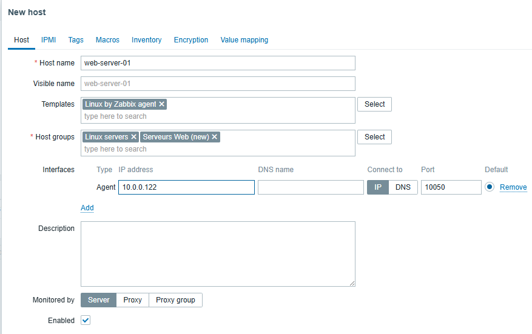

- **3.5** – Cliquez sur **Add** ✅
- **3.6** – Vérifiez la disponibilité de l’hôte :
- Icône **ZBX verte** = OK ✅

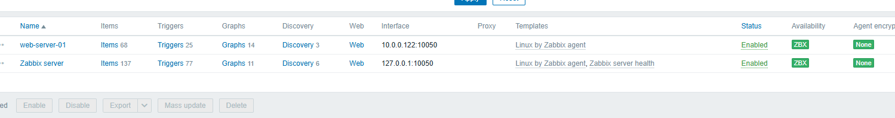

**3.7** – Allez dans **Monitoring → Latest data** et vérifiez les métriques.✅ 

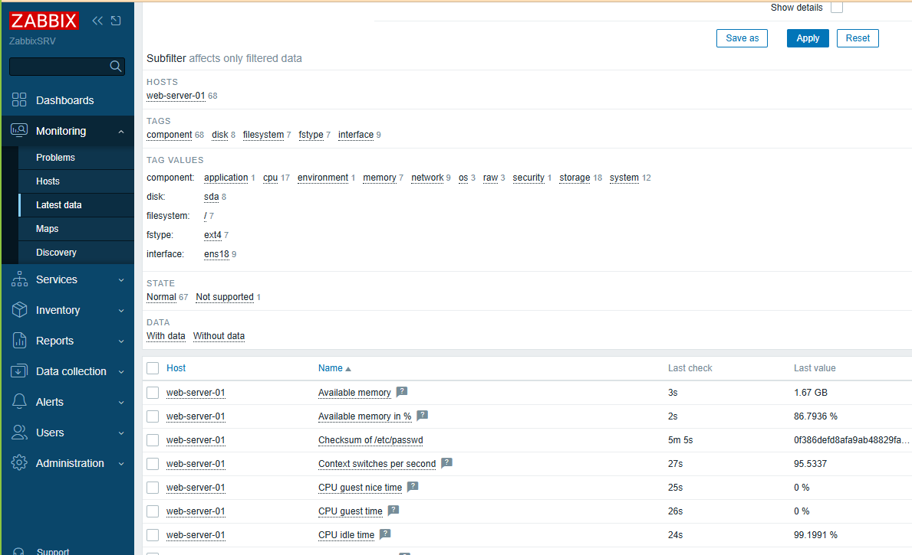

## ÉTAPE 4 – Création d’un dashboard

**4.1** – Allez dans **Monitoring → Dashboards**

**4.2** – Cliquez sur **Create dashboard**

**4.3** – Nom : `Dashboard TechSecure - Production`✅

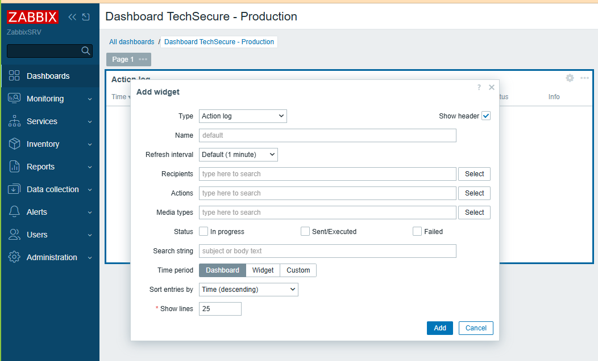

**4.4** – Ajoutez les widgets suivants :

- **CPU** ✅

  - Type : Graph (classic)

  - Item : CPU utilization ou System load

    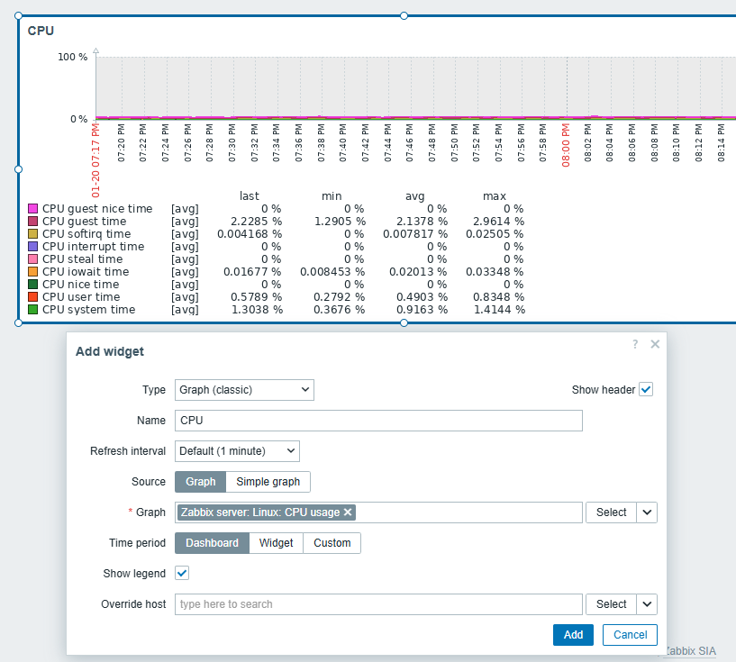

- **Mémoire **✅

  - Type : Graph (classic)
  - Item : Memory utilization ou Available memory

- **Disponibilité **

  - ✅Type : Host availability

    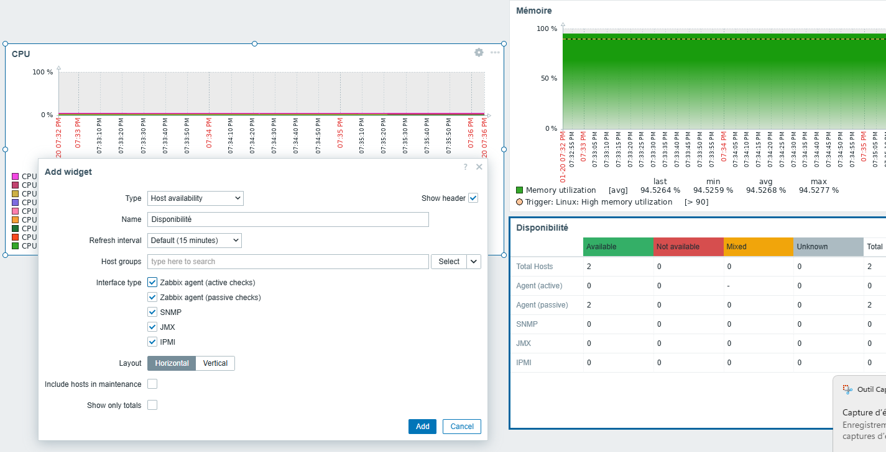

- **Bonus – Problèmes actifs** ✅

  - Type : Problems

**4.5** – Organisez les widgets de manière lisible **4.6** – Enregistrez le dashboard

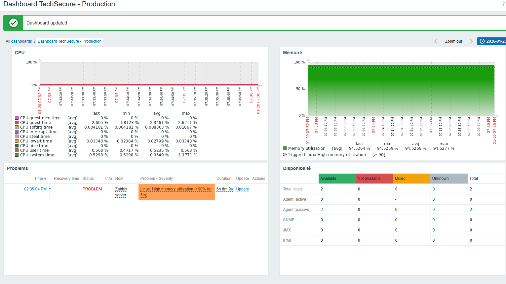

## 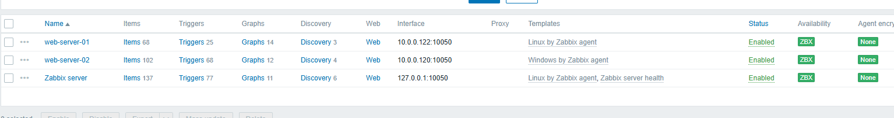

