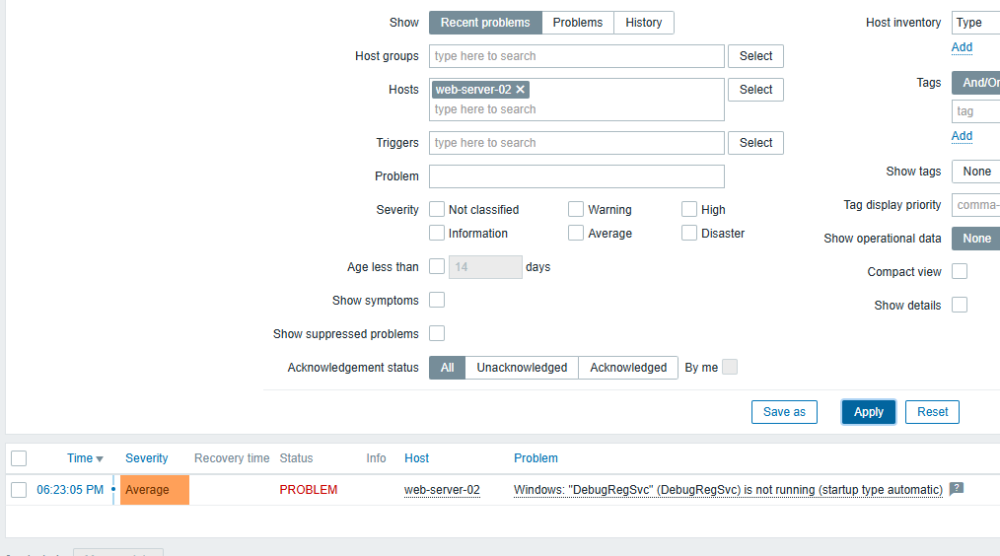
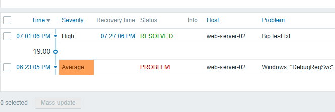

# E03 - Agent Zabbix - challenge 3 Alerts

**Objectif :** 

Mettre en place une alarme dans Zabbix qui doit se déclencher uniquement si le fichier test.txt n’existe pas sur les **machines Windows** surveillées. 🌡️🌡️🌡️📢

**Consignes :**

Le fichier test.txt doit être recherché à la racine du disque C: (ou à un autre emplacement défini).

Tant que le fichier est présent, l’alarme ne doit pas se déclencher (pas d’erreur, pas de problème).

Si l’utilisateur supprime le fichier :

- Zabbix doit remonter une erreur indiquant que le fichier a été supprimé.
- L’alarme doit être visible afin de prévenir l’administrateur.

**Points attendus :**

- Création ou utilisation d’un item Zabbix permettant de vérifier l’existence du fichier.

- Mise en place d’un trigger qui s’active uniquement en cas d’absence du fichier.

- Vérification que l’alarme ne génère pas de faux positifs (elle reste silencieuse tant que test.txt existe).

  ------

  ------

  > Création du fichier test.txt à la racine de c:\

> Création ou utilisation d’un item Zabbix permettant de vérifier l’existence du fichier.

> Monitoring ->>> Latest Data -filtered data : My host web-seerver-02 (ma vm win10 10.0.0.120) 

> Mise en place d’un trigger qui s’active uniquement en cas d’absence du fichier.

> L’alarme n'est pas visible.

> Suppression du fichier test.txt --->>> résultat 

> Annuler la suppression du fichier test.txt -->>> résultat :

