### Linux S04

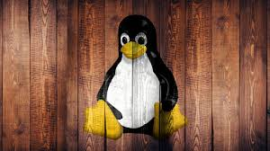

​					**Au programme**

- un peu d'histoire

- les distributions Linux

- notions de base : ligne de commande, système de fichiers, etc.

- composants d'un système GNU/Linux

- sécurité

- gestion des périphériques

- concepts avancés

  Un système d'exploitation (Operating System en anglais, souvent abbrégé OS) est, en quelque sorte, le logiciel "principal" 'un
  ordinateur.
  N'importe quel ordinateur a besoin d'un OS pour fonctionner, que cet ordinateur soit un serveur, un fixe ou portable, et même un ordinateur spécialisé embarqué dans une machine.

  Le système d'exploitation gère les ressources matérielles & les
  périphériques de l'ordinateur.
  Ces ressources matérielles sont mises à disposition aux logiciels
  installés sur l'ordinateur par l'utilisateur.

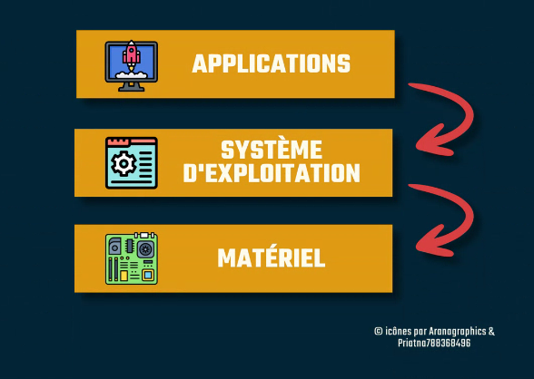

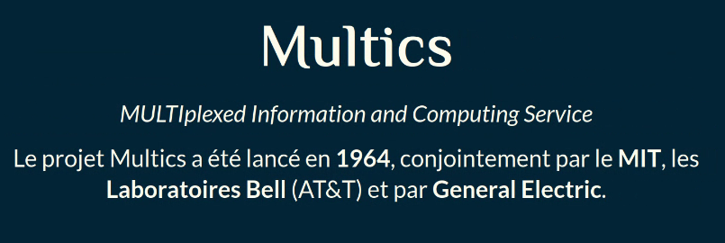

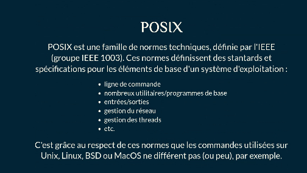

En Septembre 1983, rms annonce qu'il commence à travailler sur un système d'exploitation compatible avec Unix, très populaire à l'époque mais qui avait l'inconvénient d'être propriétaire.
***On dit d'un logiciel qu'il est "propriétaire" (proprietary en anglais) quand son contrat de licence stipule que seul l'auteur du logiciel a le droit d'y apporter des modifications et de le distribuer.*** 

La "compatibilité" avec Unix était nécessaire pour que les utilisateurs de ce dernier puissent facilement basculer sur le nouveau système développé par Richard Stallman.

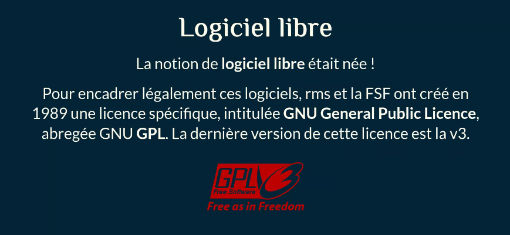

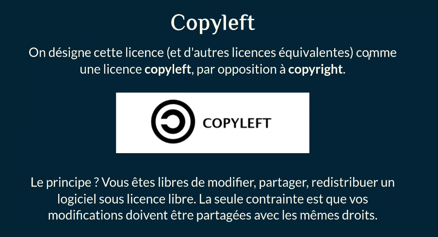

Le message posté par Linus sur le groupe Usenet comp.os.minix, le 25 août 1991 (lien archive)

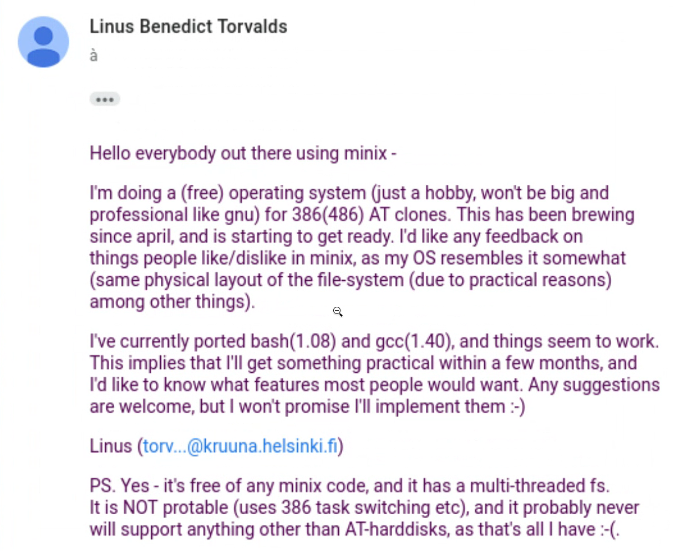

Réponse du prof :

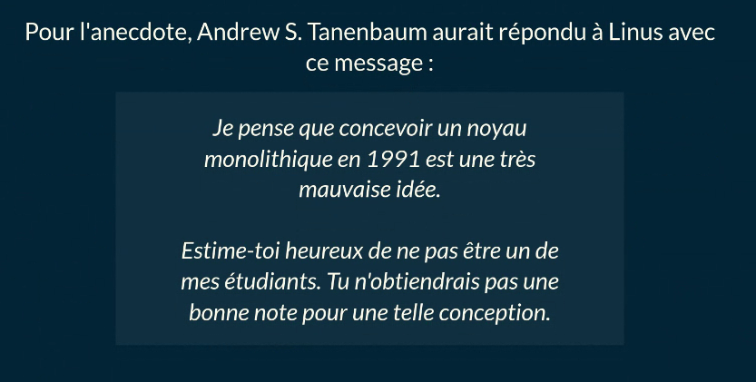

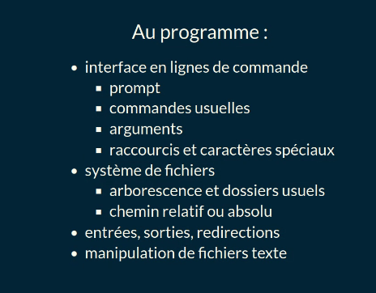

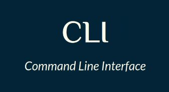

IHM : CLI vs. GUI
Avant l'apogée des interfaces graphiques (GUI - Graphical User Interface) avec l'arrivée de la souris, l'interface homme-machine
(IHM) d'un système informatique était la ligne de commande (CLI -Commande Line Interface).

Sur Windows et MacOS, la CLI est encore présente, mais n'est généralement pas ou peu utilisée par la plupart des utilisateurs.
Sur GNU/Linux, ce n'est pas le cas ! On peut parfois s'en passer dans certains environnements de bureau, mais ce n'est pas tout le temps judicieux : la CLI est souvent plus efficace qu'une interface graphique, pas besoin de chercher où cliquer parmi des dizaines de menus et boutons !

La CLI impose par contre de lire la documentation (RTFM !), ce qui n'est pas forcément le cas pour les GUI.
Une interface graphique est plus intuitive, mais pas nécessairement plus simple que copier/coller une ligne de commande.

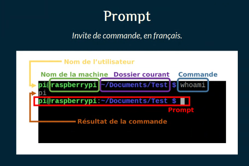

~ tilde

commands : pwd = où je suis

**Commandes usuelles**
Voici quelques commandes fréquemment utilisées (page 1/2) :
• Is (LiSt files) : liste les fichiers et dossiers présents dans un dossier
• pwd (Print Workin Directory) : affiche le chemin absolu du dossier courant
• cd (Change Directory) : changer le dossier courant
• mv (MoVe) : déplacer un ou plusieurs fichiers/dossiers
• rm (ReMove) : supprimer un ou plusieurs fichiers
• rmdir (ReMove DIRectory) : supprimer un ou plusieurs dossiers
• mkdir (MaKe DIRectory) : créer un dossier
• touch : créer un fichier
• sudo (Super user DO) : lancer une commande en tant que super utilisateur (root)
• man (read MANual) : affiche la documentation (appelée manpage) d'une commande

clear = nettoyer le prompt (ctr+l)

• cat : afficher le contenu d'un fichier dans la sortie standard

• less : lire un fichier page par page (alternative : mo re)
• head : afficher la "tête" d'un fichier (les premières lignes)
• tail : afficher la "queue" d'un fichier (les dernières lignes)
• In (LiNk) : créer un lien vers un fichier
• find : rechercher un ou plusieurs fichiers/dossiers (alternative : locate)
• grep (Global Regular Expression Print) : recherche une chaîne de caractères dans des fichiers ou depuis l'entrée standard, souvent utilisée pour "filter" la sortie d'une autre commande 

• shutdown : éteindre l'ordinateur

• reboot : redémarrer l'ordinateur
• df (Disk Free) : afficher l'espace disque libre/utilisé free : affiche la mémoire vive (RAM) libre/utilisée
• uptime : affiche la durée de fonctionnement de la machine (depuis le boot) 
• uname (Unix NAME) : affiche des infos sur le système
file : permet d'identifier un fichier à partir de son type MIME

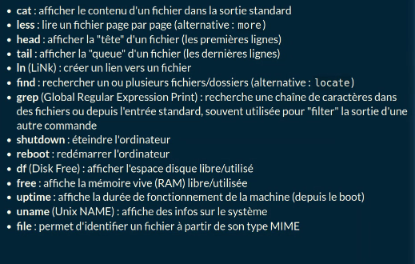

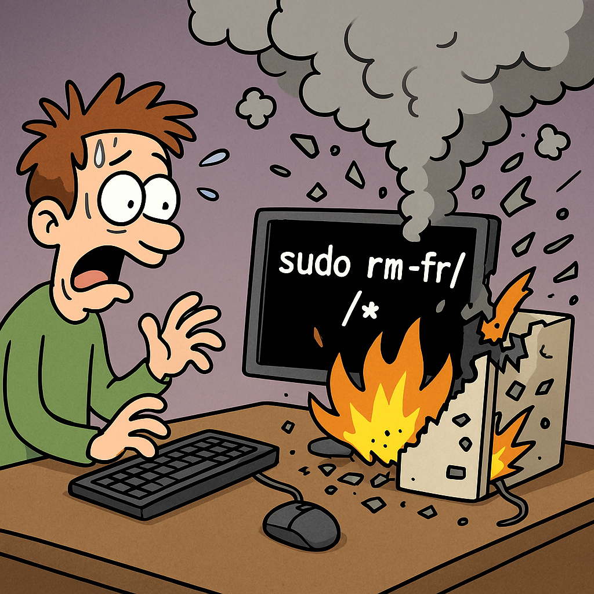

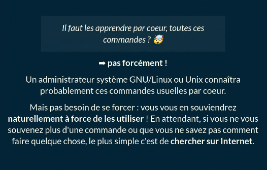

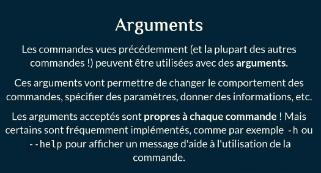

Les arguments sont renseignés directement après la commande, avant d'appuyer sur entrée pour la lancer. La commande et ses
différents arguments sont séparés par des espaces.
Pour connaître les arguments disponibles pour une commande, pas le choix, il faut lire son manuel (ou une doc en ligne, peu importe).

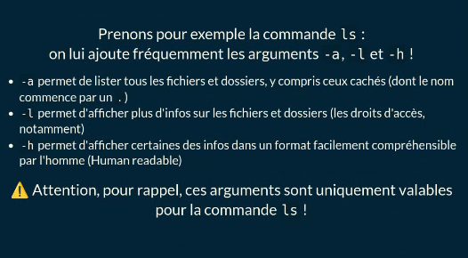

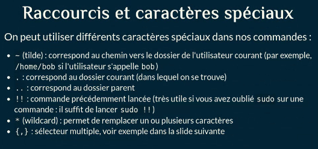

Quelques exemples :
lister uniquement les fichiers avec l'extension . txt dans un dossier :
Is  * . txt  /chemin/vers/dossier
• pour lister les fichiers dans le dossier parent : ls ../
• pour lister les fichiers avec l'extension . txt ou .docx : Is {`*.txt,*.docx`}

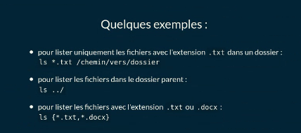

**Système de fichiers**

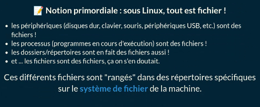

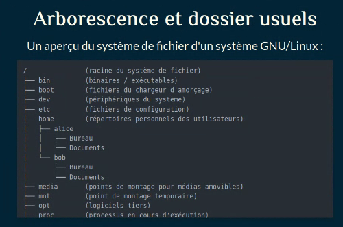

**Chemin relatif ou absolu**

Quand on manipule des fichiers dans l'arborescence d'un système d'exploitation (GNU/Linux ou autre !), on peut cibler un fichier de deux façons différentes :

. par son chemin absolu : c'est le chemin vers le fichier depuis la racine du disque.
. par un chemin relatif : c'est un chemin vers le fichier qui est relatif au dossier courant, dans lequel on se trouve actuellement. 💡

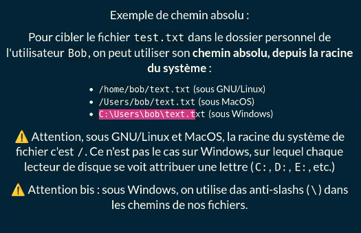

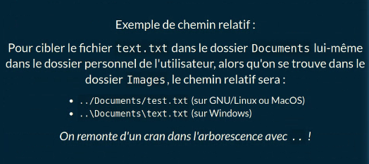

### Entrées, sorties, redirections

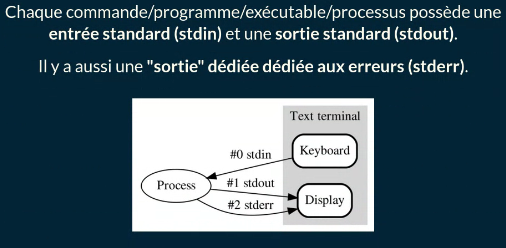

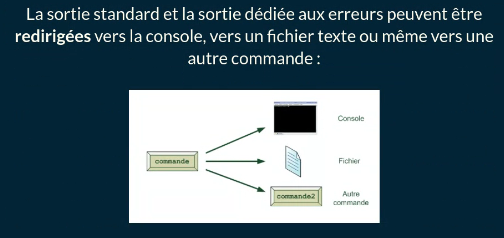

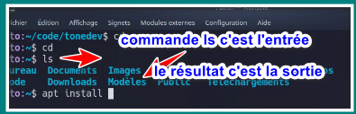

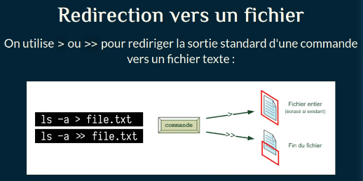

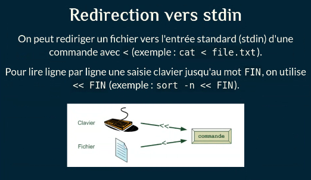

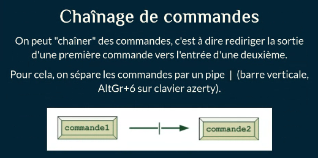

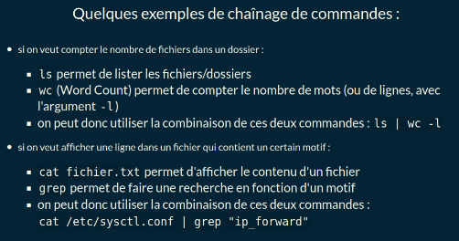

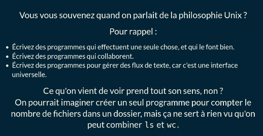

**Manipulation de fichiers texte**
Créer des fichiers, les copier, les déplacer, les supprimer, c'est bien ! Pouvoir écrire dedans, c'est mieux.

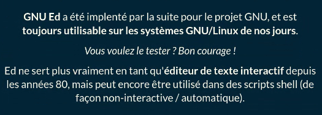

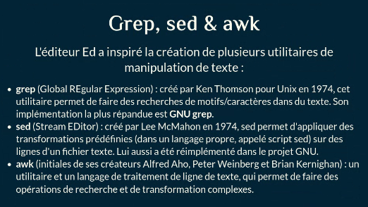

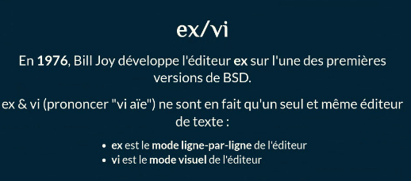

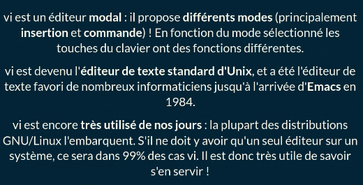

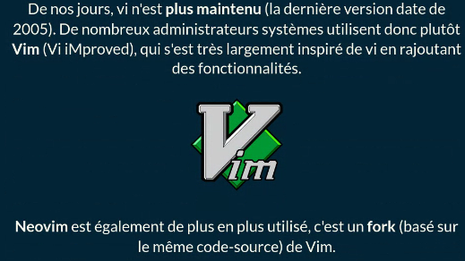

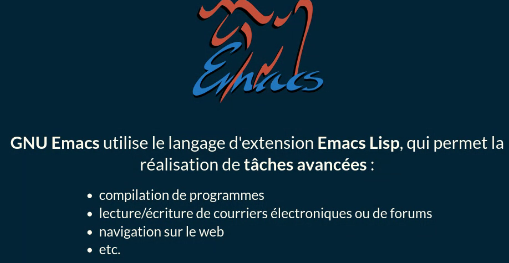

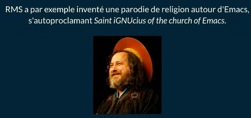

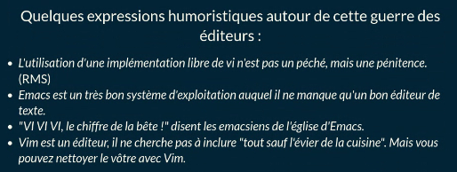

> [!IMPORTANT]
>
> 💡**Nano**💡
> GNU Nano est un éditeur de texte créé en 1999 par Chris Allegretta.
> Il est basé sur la bibliothèque ncurses, qui permet de réaliser des pseudo-interfaces graphiques en ligne de commande.
> Cest un clone libre de l'éditeur Pico, dont il s'efforce de reproduire les fonctionnalités et la simplicité. Il est fréquemment utilisé par les débutants (et pas que !) et présent par défaut sur de nombreuses distributions GNU/Linux pour sa simplicité d'utilisation. Il est beaucoup plus limité que Vim ou Emacs.

