### LINUX S05-2


On en a déjà parlé : un système GNU/Linux est construit en assemblant plusieurs briques. Voici les briques principales :
**• Shell** : Certaines briques sont indispensables dans un système GNU/Linux (ou Unix) : le Shell en fait partie.

Le Shell, interpréteur de commande en français, est le logiciel qui permet d'avoir une interface homme-machine en ligne de commande (CLI). II existe différents shells disponibles sur les systèmes GNU/Linux. Quel Shell sur ma distro ?
Pour connaître la liste des shells installés sur une machine GNU/ Linux, on peut lancer la commande : **cat /etc/shells**

Sur un système GNU/Linux (ou Unix !), chaque utilisateur peut utiliser un Shell différent. Vous pouvez connaître le Shell utilisé par défaut par votre utilisateur en consultant le fichier /etc/pas swd , et en cherchant la ligne avec votre nom d'utilisateur : cat /etc/passwd I grep wally par exemple. contient la liste des utilisateurs du système, on y reviendra.

Vous pouvez également connaître le Shell actif à un instant t en affichant le contenu de la variable d'environnement $SHELL :
echo $SHELL
Les variables d'environnement permettent de stocker des données accessibles par différents processus/programmes sur le
système.

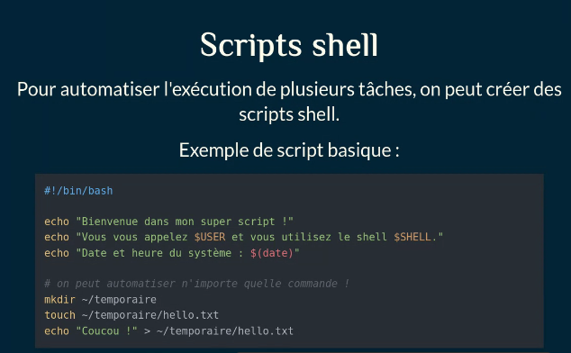

```
#!/bin/bash

echo "Bienvenue dans mon super script !"
echo "Vous vous appelez $USER et vous utilisez le shell $SHELL."
echo "Date et heure du système : $(date)"

# on peut automatiser n importe quelle commande
mkdir ~/temporaire
touch ~/temporaire/hello.txt
echo "Coucou !" > ~/temporaire/hello.txt
```


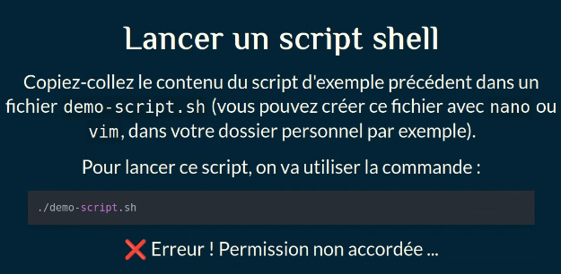

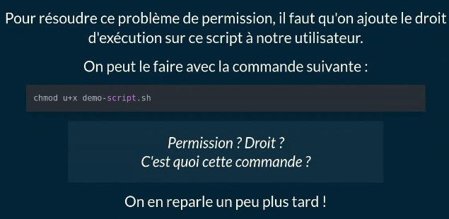

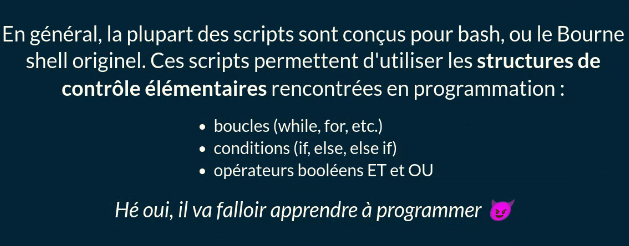

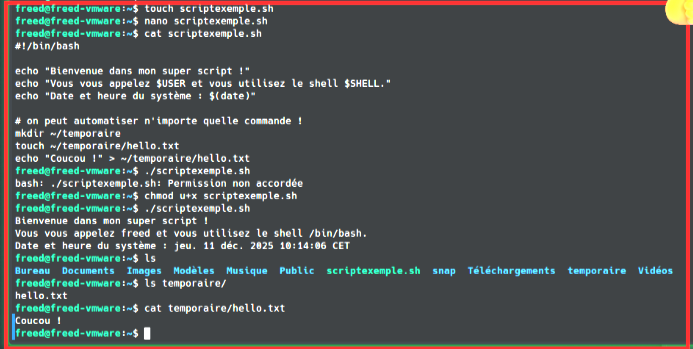

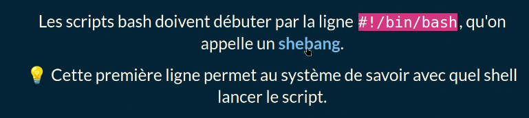


**• Gestionnaire de paquets :** Un gestionnaire de paquets est un outil qui permet d'automatiser le processus d'installation, de désinstallation et de mise à jour d'un programme/application sur un système informatique. Pendant l'installation d'un paquet (= d'un logiciel/programme/ application), ce logiciel va également installer toutes les dépendances (les autres paquets) nécessaires au bon fonctionnement du paquet !


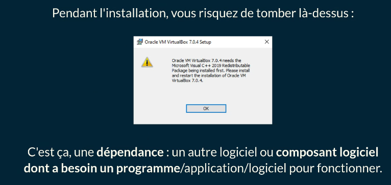

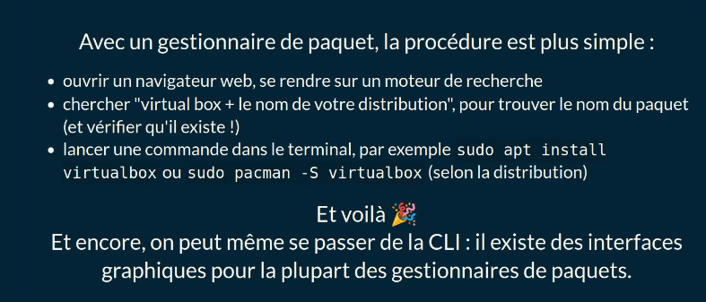

apt search virtualbox pour chercher l'apt et apt show virtualbox -a ou sans -a pour voir la panoplie.


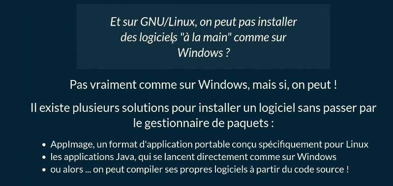

**• Chargeur d'amorçage :** Le chargeur d'amorçage (bootloader) est un logiciel qui permet de démarrer un ou plusieurs systèmes d'exploitation. C'est le premier logiciel lancé au démarrage d'une machine ! **BIOS, UEFI** >> MBR,GPT Avec UEFI, un PC ne lit plus le MBR d'un disque mais sa GUID Partition Table (GPT).

Chargeurs d'amorçage populaires Il existe de nombreux chargeurs d'amorçage libres sur PC, mais les plus populaires sont :
• GRUB : GRand Unified Bootloader, dans sa version 2, est probablement le plus utilisé des bootloaders.
• rEFlnd : fork de rEFlt, uniquement compatible UEFI.
• systemd-boot : fait partie du projet systemd, uniquement compatible UEFI.

**• init / gestionnaire de services :** Si le chargeur d'amorçage est le premier logiciel lancé ...init est le deuxième !

Sur les systèmes Unix et leurs héritiers/successeurs (BSD, GNU/ Linux, MacOS, etc.), init est le premier programme à démarrer
après le chargeur d'amorçage. Souvent le chargeur d'amorçage n'est pas vraiment compté, on dit qu' init est le premier programme. Sur un système Unix, les processus (instance d'un programme en cours d'exécution) se voient attribuer un numéro unique qui permet de les identifier : le PID (Process ID). init possède le PID 1.

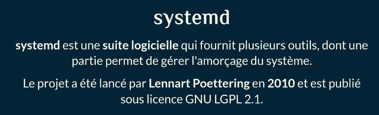

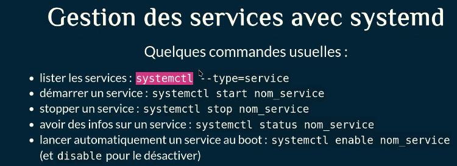


**• Éditeur de texte :** 

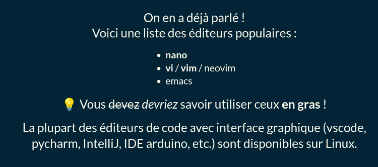

**• Serveur graphique :**

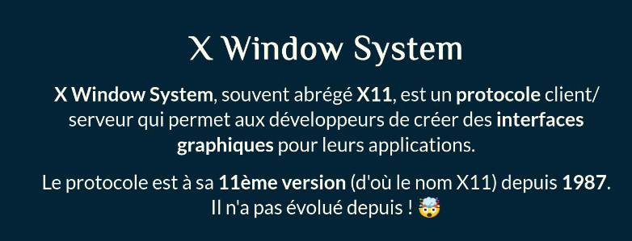

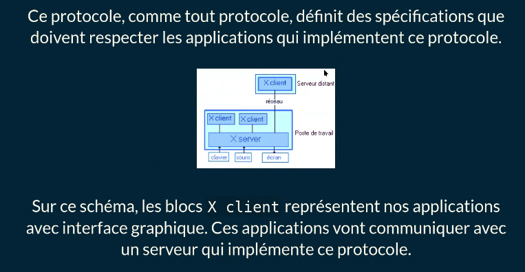

Alternative :

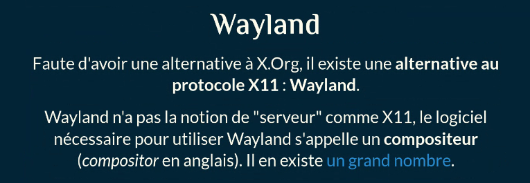

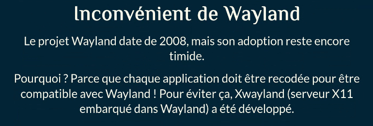

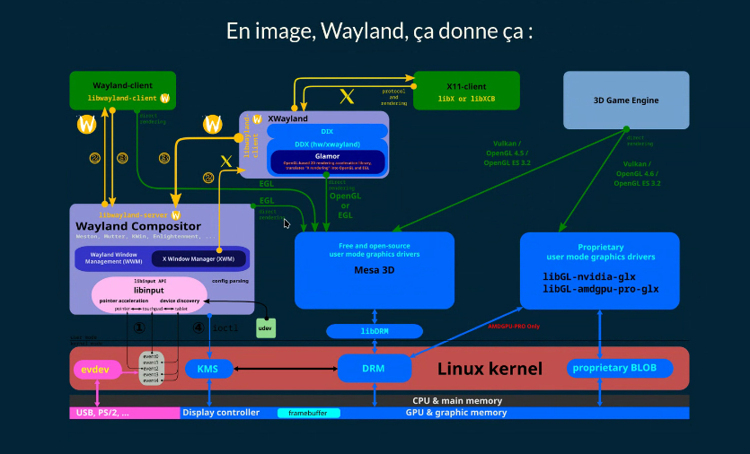

**• Pilotes de périphériques :** Un pilote de périphérique est un programme qui permet à des applications utilisateur d'accéder à des ressources matérielles. Avec Linux, ces pilotes doivent être chargés directement dans le noyau. Jusqu'à la version 1.2 du noyau, le code source de tous les pilotes disponible était directement embarqué dans le noyau, que le périphérique soit présent ou pas. Depuis, les pilotes sont chargés de manière dynamique sous la forme de modules du noyau.

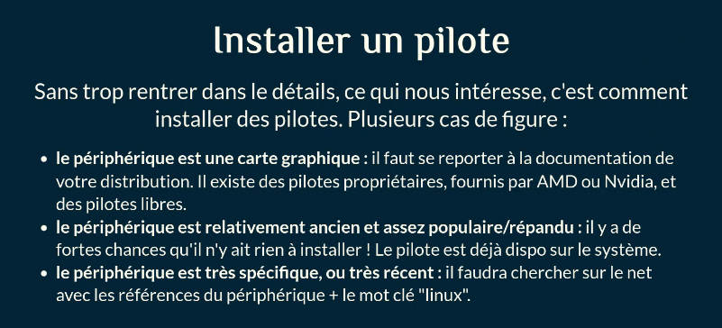

**• Gestionnaire d'affichage :** 

C'est le logiciel qui vous permet de vous connecter avec votre nom d'utilisateur et votre mot de passe. 💡Ce composant est optionnel : un utilisateur peut aussi démarrer le serveur X.Org (et donc l'interface graphique) en lançant la commande startx.

**• Environnement de bureau :** 

L'environnement de bureau est un ensemble de programmes qui permet d'implémenter la métaphore du bureau.
Un environnement de bureau propose tous les composants nécessaires pour utiliser un ordinateur via une interface graphique :
un bureau, un explorateur de fichiers, des icônes, un thème / une bibliothèque pour les fenêtres, des applications pour configurer le fond d'écran, l'écran de veille, d'autres paramètres basiques, etc.

> [!NOTE]
>
> Sur Windows ou MacOS, cet environnement ne peut pas être changé, il n'existe pas d'alternative. Sur GNU/Linux en revanche, il en existe plein ! Les plus connus sont :
> • Gnome (bibliothèque GTK)
> • KDE Plasma (Qt)
> • XFCE (GTK)
> • LXDE (GTK)
> • Mate (GT")
> • Cinnamon (GTK)
> • Budgie (GTK)
>
> 

**• Gestionnaire de fenêtres :** Gestionnaire de fenêtre Window Manager, en anglais, abrégé WM.

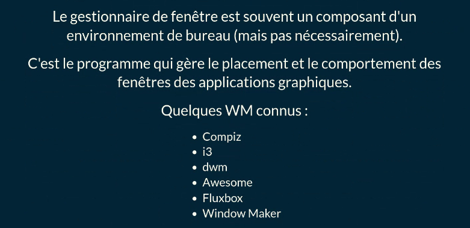


**• Bibliothèques d'interface graphique :**

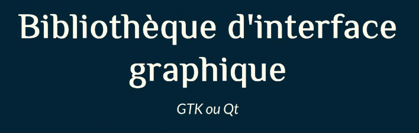

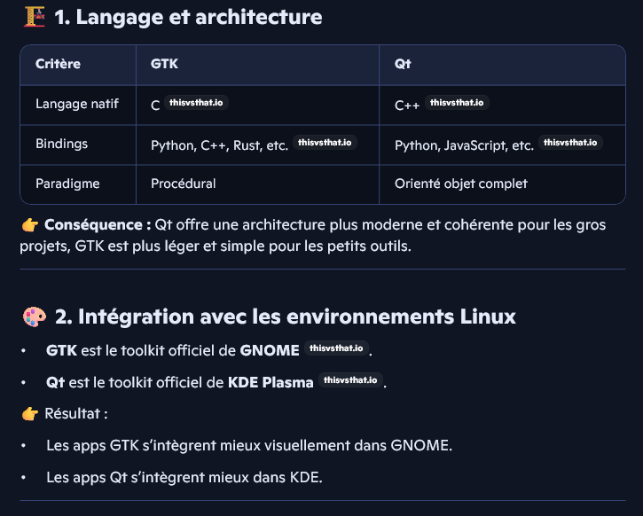

**• Explorateur de fichiers :** GUI
• dolphin (KDE)
• konqueror (KDE)
• krusader (KDE)
• nautilus (Gnome)
• gnome commander (Gnome)
• thunar
• nemo

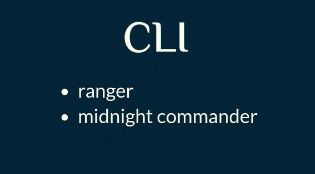

**• Outil de configuration réseau :** 💡

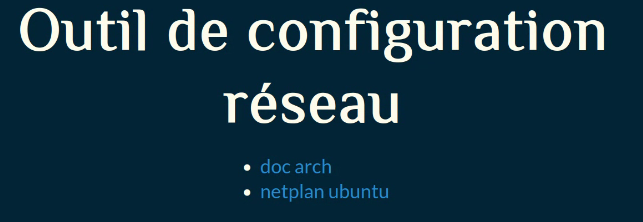

**• Serveur & sous-système audio** :

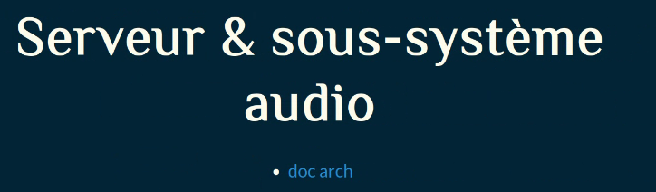

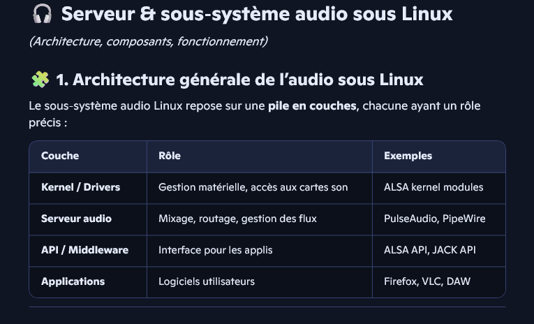