### LINUX_S3-3

**Comptes utilisateurs**
Un utilisateur identifie une personne ou un service sur la machine, Il possède :
• un identifiant numérique (UID)
• un groupe primaire (GID)
• un dossier personnel et un Shell par défaut
• des permissions distinctes de celles des autres utilisateurs.

/etc/passwd

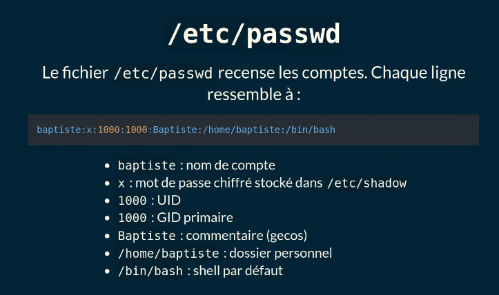

cat /etc/passwd

cat /etc/passwd | echo ali (utilisateur)

(gecos) = complément d'informations n°tel, mail...

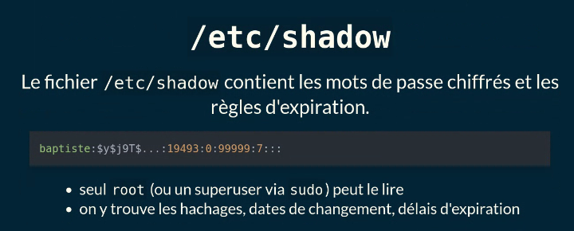

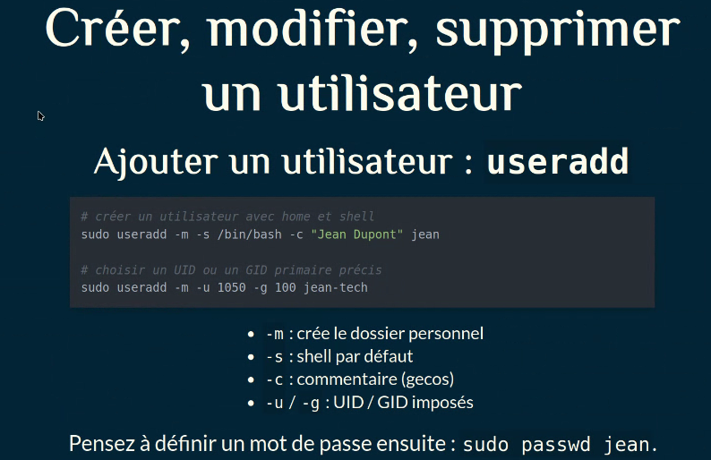

ls  /home et ls -lt /home pour afficher les users créés récemment.

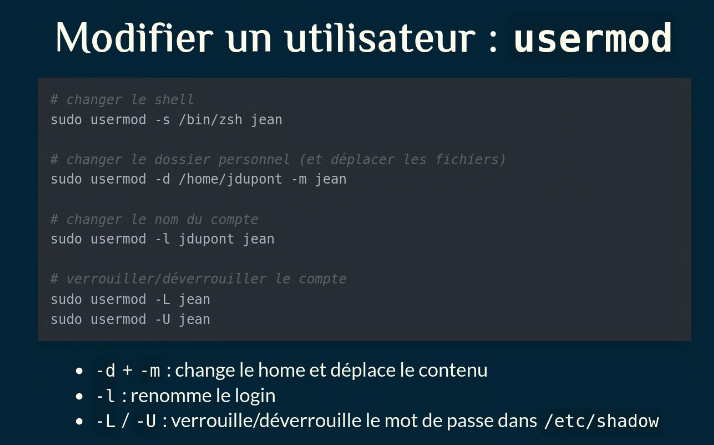

Supprimer un utilisateur : userdel
sudo userdel jean
sudo userdel -r jean
• -r : supprime le home et la boite mail locale(/var/mail/user)
• vérifiez avant de supprimer : aucun processus en cours, pas de fichiers critiques

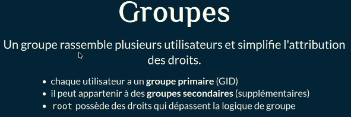

Les groupes servent à gérer les permissions.

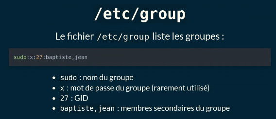

cat /etc/group pour afficher les groupes.

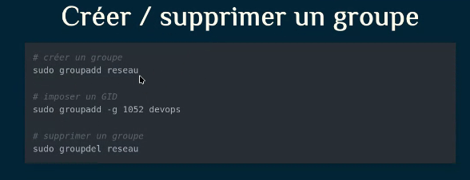

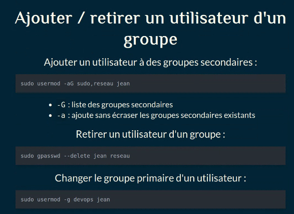

cat etc/passwd = voir les users

cat etc/group = voir les groupes

pour retrouver les fichier son stocker
/etc/passwd = users
/etc/shadow = les pass

Retirer un utilisateur d'un groupe :

```
sudo gpasswd -delete jean reseau
```


Changer le groupe primaire d'un utilisateur :

```
sudo usermod -g devops jean
```

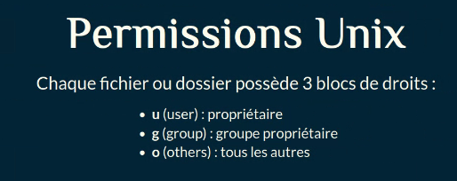

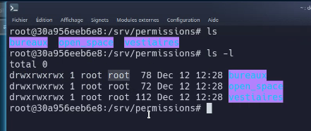

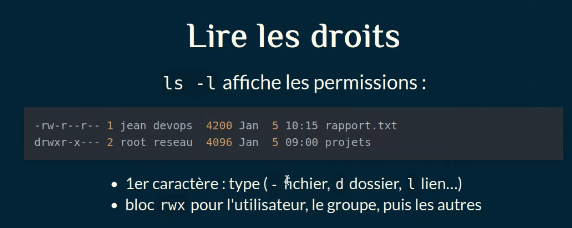

> [!NOTE]
>
> ls -l open_space/
>
> 📌 Ce que tu vas voir dans la sortie
> Chaque ligne correspond à un fichier ou un dossier, avec :
> • 	Droits (rwx)
> • 	Type (d = dossier, - = fichier)
> • 	Nombre de liens
> • 	Propriétaire
> • 	Groupe
> • 	Taille
> • 	Date de modification
> • 	Nom du fichier/dossier

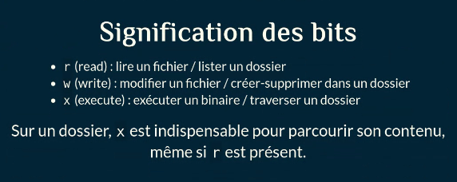

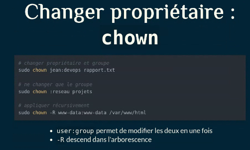

Changer les droits : **chmod**
Deux syntaxes possibles : symbolique ou octale.

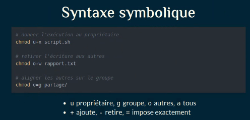

Utilisateurs
useradd, usermod, userdel => commandes utilisateurs
/etc/passwd => liste les utilisateurs
/etc/shadow => liste les mots de passe
Groupes
groupadd, groupdel
/etc/group => liste les groupes
pour ajouter un utilisateur à un groupe, on modifie l'utilisateur, pas le groupe
à la création, chaque user a un GID
Les groupes servent à faire des ensembles d’utilisateurs
Les groupes permettent de gérer les droits
Permissions
Une ressource ça a : un propriétaire, un groupe, et les autres
Les droits s’appliquent pour chacun de ces 3 acteurs
Chown => changer le propriétaire d’un groupe
Chmod => permet de changer les droits

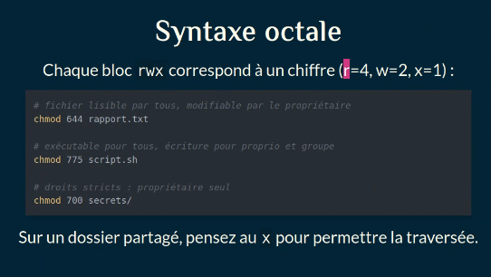


Dans ces slides :

- pourquoi utiliser sudo plutôt que se connecter en root
- le fichier /etc/sudoers etses règles
- visudo , l'outil sûr pour modifier la configuration
- quelques démos à reproduire sur une VM Linux

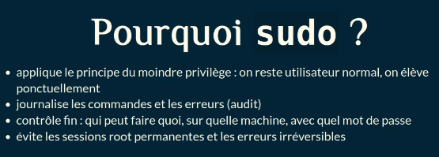


**Comment ça marche ?**

- sudo vérifie l'utilisateur et son mot de passe
- lit /etc/sudoers et les fichiers du dossier /etc/sudoers.d/
- valide la commande demandée selon les règles
- passe l'environnement et le contexte précisés dans la config

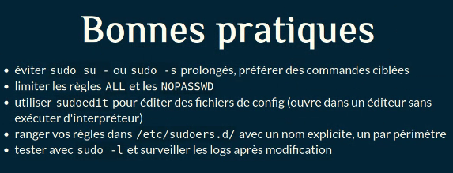

**Points clés à retenir**

- sudo permet une élévation contrôlée et tracée des privilèges
- /etc/sudoers définit qui peut faire quoi et comment
- visudo protège la configuration en vérifiant la syntaxe
- privilégiez des règles minimales, testées, et loggez vos usages

