### Linux_04.md

Correction challenge

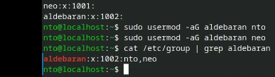

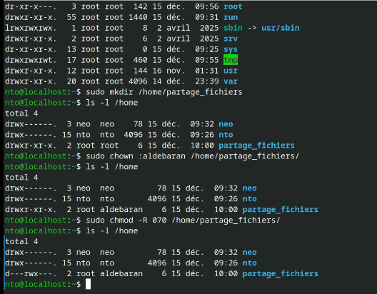

**Gestionnaires de paquets**
Installer, mettre à jour et supprimer des logiciels proprement sur une distribution.

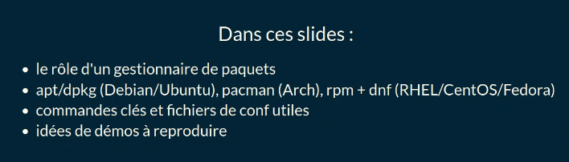

**Rappel : à quoi sert un paquet ?**
• archive contenant binaires, dépendances, scripts de post-install, métadonnées,
• téléchargé depuis des dépôts signés (sources officielles ou internes),
• installé avec vérification d'intégrité et résolution des dépendances,
• permet les mises à jour cohérentes du système (sécurité, correctifs),

**apt / dpkg (Debian & dérivés)**
• dpkg : outil bas niveau pour manipuler des .deb locaux
• apt / apt -get : résout dépendances, parle aux dépôts listés dans /etc/apt/sources . list et /etc/apt/sources . list . d/ * . list
• cache téléchargements dans /var/cache/apt/archives
Commandes clés :

sudo apt update # rafraichir la liste des paquets
sudo apt upgrade # mettre à jour les paquets installés
sudo apt install htop # installer (résolution auto des dépendances)
sudo apt remove htop # désinstaller
sudo apt search docker # rechercher
sudo apt show openssh-server # infos détaillées
sudo dpkg -i fichier. deb # installer un . deb local
sudo dpkg -l | head # lister les paquets Installés
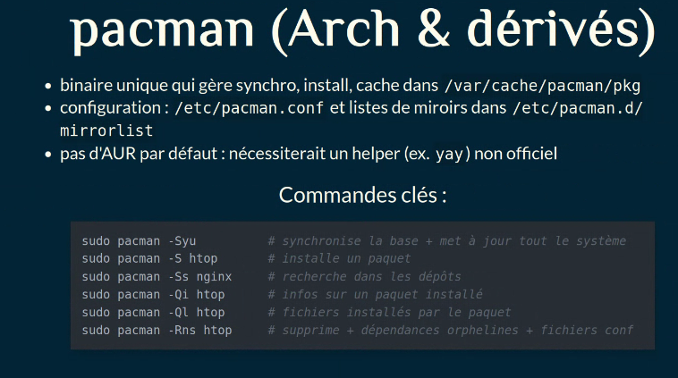

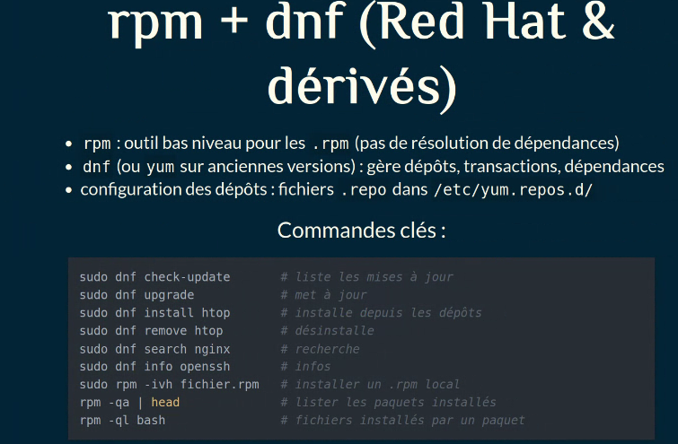

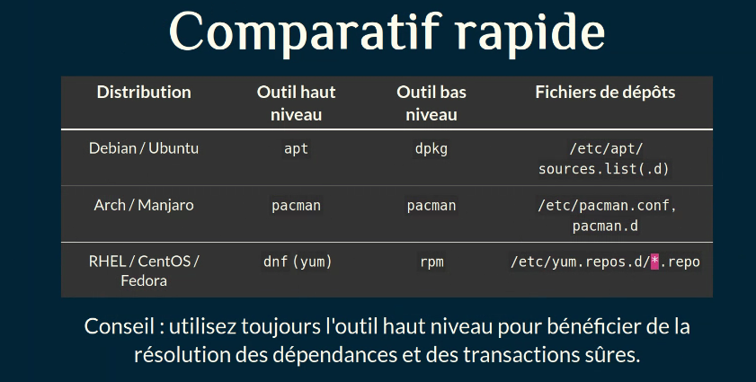

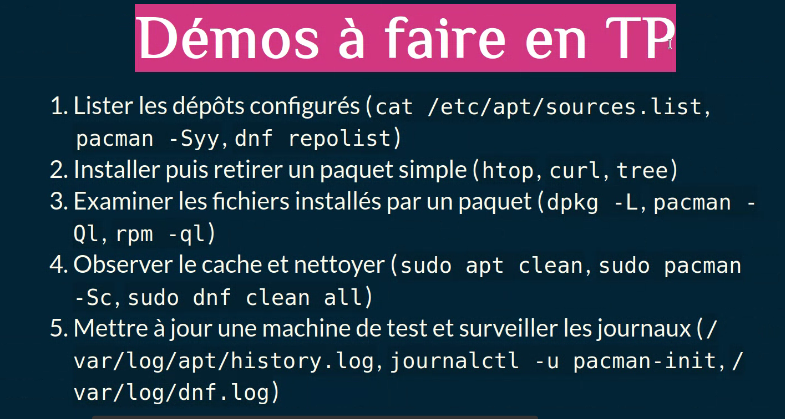

**Périphériques et hardware**: Comprendre et surveiller le matériel sous Linux.

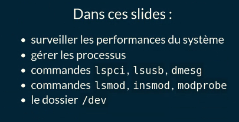

• commandes Ispci, Isusb, dmesg
• commandes Ismod, insmod, modprobe
• le dossier /dev

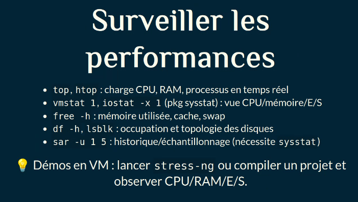

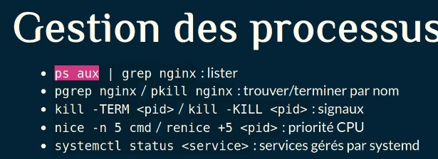

Ispci, Isusb, dmesg
• Ispci -v : périphériques PCI (carte réseau, GPU...)
• I susb -v : périphériques USB (clés, webcams...)
• dmesg I tail -n 50 : messages du noyau (détections, erreurs)
• dmesg -w : suivre en direct un branchement USB/PCI
Démos : suivre dmesg -w pendant un redémarrage de service ou
l'ajout d'une interface réseau virtuelle (NAT/bridged), vérifier Ispci/
Isusb listent les contrôleurs virtio.

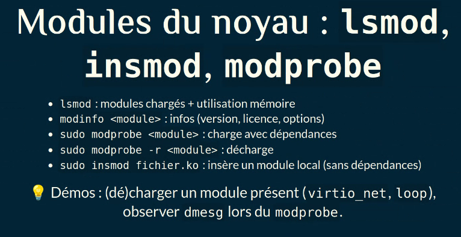

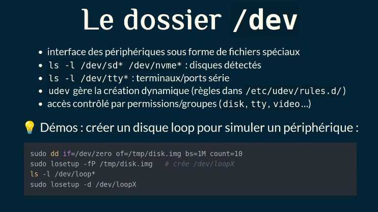

sudo dd if=/dev/zero of=/tmp/disk. img bs=1M count=10
sudo losetup -fP /tmp/disk.img # crée /dev/ loopX
Is -l /dev/loop*
sudo losetup -d /dev/loopX

**Compiler des programmes**
Installer depuis le code source quand un paquet n'existe pas (ou trop ancien).

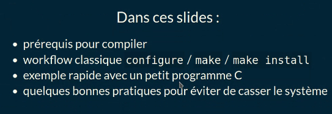

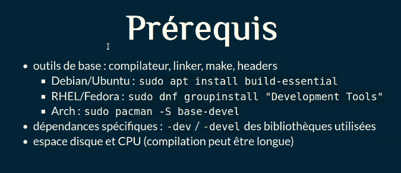

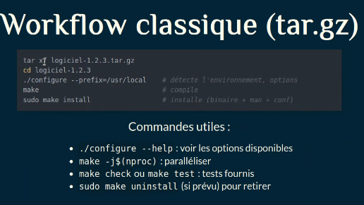Q

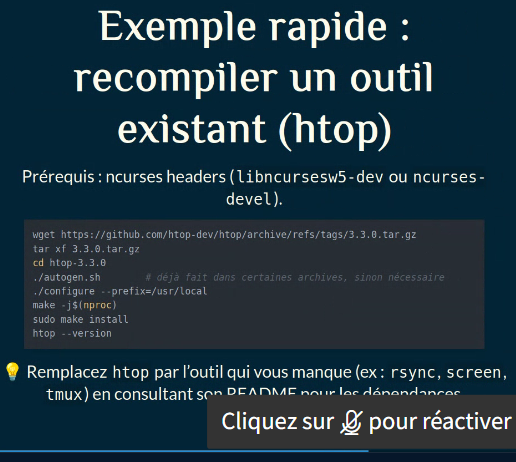