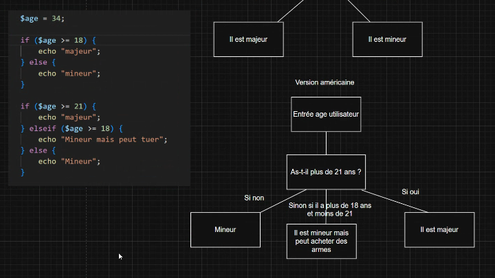
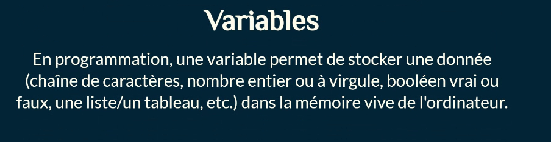
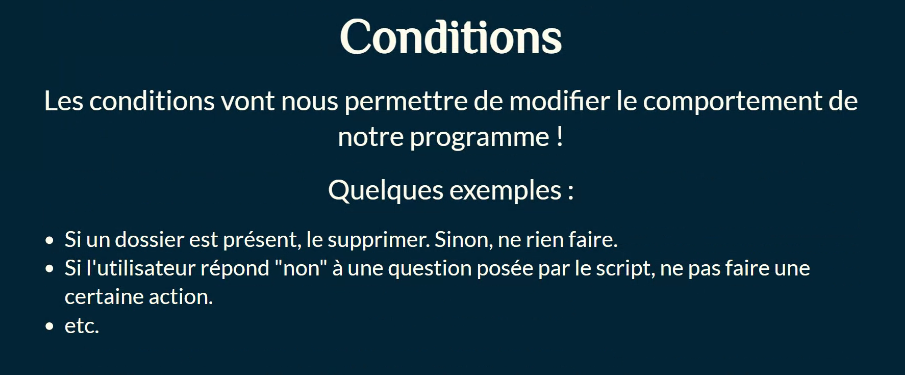

### Scripting

Découvrons les bases de la programmation et apprenons à automatiser des tâches avec des scripts !

<u>C'est quoi, un script ?</u>
En Informatique, un script désigne un programme chargé d'exécuter une ou plusieurs actions pré-définies. C'est souvent une suite de commandes plus ou moins simples, qui permettent d'automatiser des tâches dans un ordre donné. Ces commandes sont écrites dans un fichier texte, qu'on appelle script.

<u>Langage de script</u>
Les scripts sont rédigés dans un langage de programmation interprété (ils n'ont pas besoin d'être compilés, contrairement à un
programme écrit en C par exemple). Historiquement, on parlait même de langage de commande ou
d'enchainement des travaux, ils permettaient simplement d'automatiser une suite de commandes simples, à la manière d'un
script de théâtre. De nos jours, les langages de script offrent des fonctionnalités similaires aux autres langages de programmation.

Quel langage choisir ?
Le langage de script utilisé dépend du système d'exploitation sur lequel le script devra être lancé :
• Sur Windows :
• script "batch", extension de fichier .bat
• script PowerShell, extension . PS1
• Sur GNU/Linux et MacOS :
• script Shell/Bash, extension .sh
Mince, on peut pas faire un script qui fonctionne sur Windows ET sur GNU/Linux?

Si, avec un langage de script compatible avec les deux systèmes, comme Python par exemple ! (extension . PY) Attention, Python tourne sur Windows, Linux et MacOS, mais les commandes à lancer/automatiser restent potentiellement différentes d'un  système à l'autre.

Pourquoi faire ?
Imaginons qu'on ait besoin de créer 5 dossiers sur le disque dur de plusieurs machines dans notre parc. Si le parc est composé de 10 machines, ça va être fastidieux mais on peut le faire à la main. Si le parc est composé de 1000 machines, il va falloir automatiser cette tâche. Et en plus, ça fait partie des compétences que vous devez maitriser pour obtenir votre TP.

Exemple : conditions en php

##### Boucles

Les boucles permettent de répéter une (ou plusieurs) action(s) un certain nombre de fois. On peut également s'en servir pour parcourir une liste d'éléments et effectuer une action pour chaque élément dans la liste.

##### Fonctions

Les fonctions permettent de "regrouper" plusieurs actions dans un "bloc", et ce bloc d'actions pourra être déclenché depuis différents endroits dans notre script.

##### Arguments & paramètres

On peut envoyer des arguments/paramètres (vous pouvez considérer que c'est la même chose) à un script, au moment où on appelle/lance ce script. On peut également envoyer des paramètres à une fonction.

https://scratch.mit.edu/