### Supervision & Monitoring

'Un outil pour les superviser tous"

###### INTRO : Qu'est-ce que la supervision ? 🧐

La supervision informatique consiste à surveiller en continu l'état des systèmes, des applications et des infrastructures. Elle permet de détecter les anomalies et d'assurer un fonctionnement optimal en évitant les interruptions de service.

###### Différence entre supervision et monitoring 🔎

Le monitoring se concentre sur la collecte de données en temps réel pour suivre l'état des composants IT. La supervision, quant à elle, analyse ces données pour prendre des décisions, déclencher des alertes et automatiser certaines actions correctives.

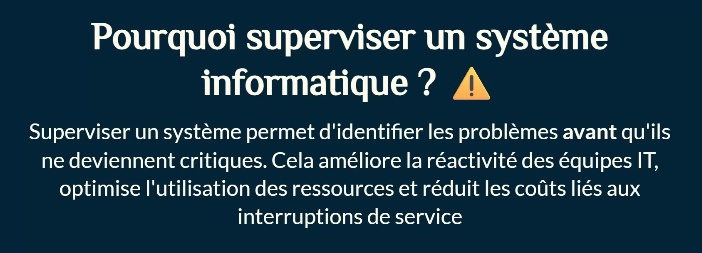

###### Les enjeux de la supervision 🔐

La supervision garantit la sécurité, la performance et la disponibilité des systèmes. Elle impacte directement la productivité des
entreprises en minimisant les pannes et en assurant une expérience utilisateur fluide. L'utilisateur ne s'attend pas à ce que la machine fonctionne correctement, il s'attend uniquement à ce qu'elle soit disponible.

Avant 2000, la supervision consistait uniquement à surveiller les systèmes en exploitation. Entre 2000 et 2010, la supervision s'inspira des solutions de surveillance basées sur les logs. Depuis 2010, la supervision s'inspira des solutions de surveillance
basées sur les données en temps réel.

2. ###### Les fondamentaux de la supervision

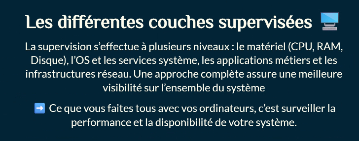

###### <u>Supervision en temps réel</u>...La supervision en temps réel permet de réagir immédiatement aux incidents en déclenchant des alertes instantanées. Par exemple, si un utilisateur tente de s'identifier sur un compte sans avoir fourni son mot de passe, cela peut être déclenchant un incident en temps réel.

###### <u>Supervision différée</u>... La supervision différée, quant à elle, analyse les tendances et aide à comprendre les causes profondes des problèmes. Elle permet de déterminer les causes des incidents, d'enregistrer les données et de les analyser. Par exemple, des utilisateurs tentes de s'identifier sur leurs compte a plusieurs reprises sans avoir fourni de mot de passe, et la supervision différée peut identifier les tendances et aider à comprendre les causes profondes des incidents.

###### Les métriques essentielles 📡

Les principales métriques surveillées incluent le temps de réponse des applications, le nombre de connexions simultanées et l'utilisation des ressources système. Ces mesures permettent de détecter les anomalies et d'optimiser les performances.

###### Types d'alertes et niveaux de criticité 📢

Les alertes sont classées en trois catégories :
• Alerte informative : Simple notification pour suivi.
• Alerte warning : Problème potentiel nécessitant une attention.
• Alerte critique : Incident majeur demandant une intervention immédiate.

###### Approche basée sur les logs vs métriques

La supervision basée sur les logs analyse les événements enregistrés pour identifier des comportements anormaux. La supervision basée sur les métriques suit des indicateurs chiffrés pour détecter des variations inhabituelles.

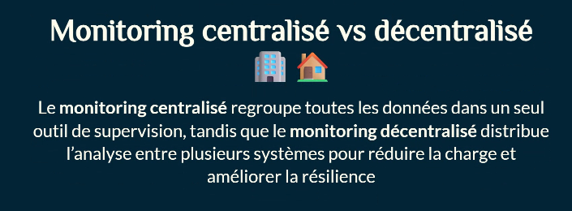

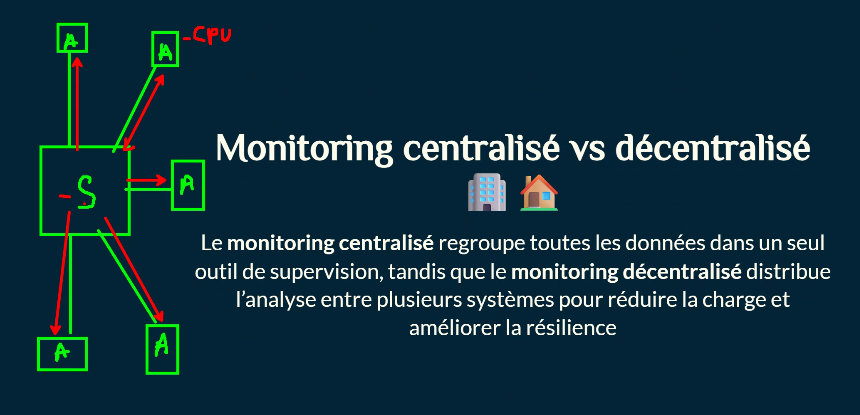

###### Corrélation d'événements et analyse de tendances 📈

L'analyse des événements sur le long terme permet d'identifier des motifs récurrents et d'anticiper les incidents. La corrélation des événements aide à comprendre l'impact d'un problème sur l'ensemble du système il faut de la data pour analyser de la data.

###### Supervision en environnement cloud et hybride ☁️

Les architectures utilisent des environnements cloud et hybrides, ce qui complexifie la supervision. Il est essentiel d'adopter des solutions capables de surveiller des infrastructures distribuées 

• Par exemple, Azure Monitor

4. Collecte et traitement des données

###### Protocoles utilisés 🔌

Plusieurs protocoles sont utilisés pour la supervision : **SNMP** pour la surveillance réseau, **Syslog** pour la gestion des logs et **API REST** pour récupérer des données en temps réel.

###### Agrégation et normalisation des données 🔄

L'agrégation permet de consolider des données provenant de différentes sources. La normalisation assure une interprétation
homogène, facilitant l'analyse des tendances.

###### Stockage et rétention des données supervisées 🗄️

Les bases de données spécialisées, comme les Time Series Databases (TSDBs), permettent de stocker et analyser efficacement les
métriques de supervision.

###### Détection et classification des incidents ⚠️

Chaque incident est classé en fonction de son impact, ce qui permet de prioriser les interventions et d'optimiser les ressources des équipes IT.

###### Escalation et automatisation des alertes 

Les systèmes de supervision avancés automatisent certaines actions, comme le redémarrage d'un service défaillant ou la notification aux équipes concernées.

###### Sécurité et protection des données supervisées 🔐

La supervision doit intégrer des mécanismes de chiffrement et de contrôle d'accès pour garantir la confidentialité des données.

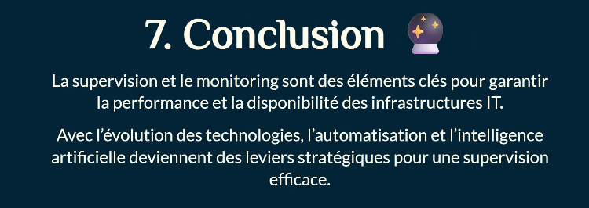

###### Qu'est-ce que SNMP ? 🧐

SNMP (Simple Network Management Protocol) est un protocole standardisé permettant de superviser et gérer les équipements
réseau à distance. Il permet de collecter des informations sur l'état des équipements (routeurs, switches, serveurs, imprimantes...) et de les configurer à distance.

###### Pourquoi SNMP ? 🪧

Sans SNMP, il faudrait se connecter manuellement sur chaque équipement pour vérifier son état ! SNMP permet une supervision centralisée et automatisée de l'ensemble de l'infrastructure réseau. Imaginez devoir vérifier 100 switches un par un...

###### Les 3 composants principaux 🔧

1. Manager SNMP (superviseur) : Collecte et analyse les données.
2. Agent SNMP : Installé sur les équipements supervisés.
3. MIB (Management Information Base) : Base de données des informations disponibles.

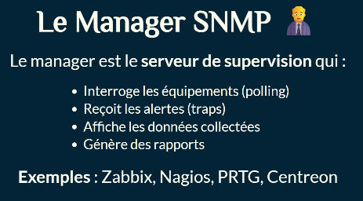

###### L'Agent SNMP 👓

L'agent est un logiciel installé sur chaque équipement supervisé qui :
• Écoute les requêtes du manager
• Répond avec les informations demandées
• Envoie des alertes (traps) en cas de problème
• Peut modifier la configuration (si autorisé)

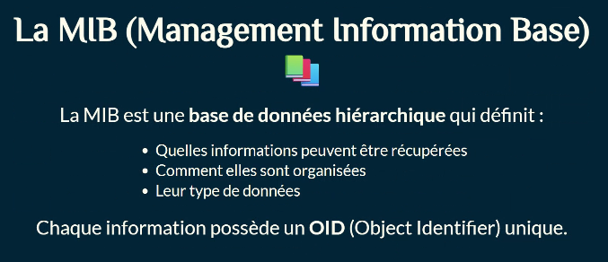

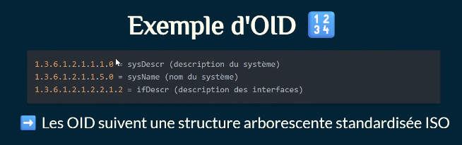

###### Les opérations SNMP 📨

SNMP utilise principalement 5 opérations :

1. GET : Récupérer une valeur
2. GET-NEXT : Récupérer la valeur suivante
3. GET-BULK : Récupérer plusieurs valeurs (v2c/v3)
4. SET : Modifier une valeur
5. TRAP : Alerte envoyée par l'agent

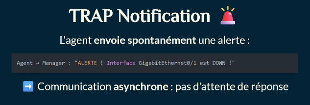

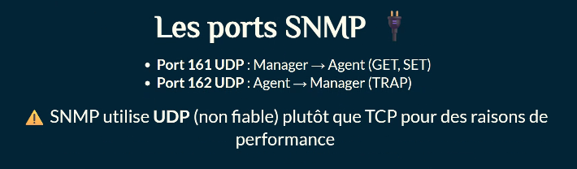

###### SNMPv1 - La première version (1988)

<u>Avantages :</u>
• Simple à implémenter
• Léger et rapide
<u>Inconvénients :</u>
• Aucune sécurité (texte clair)
• Pas d'authentification réelle
• Fonctionnalités limitées
➡️ Obsolète aujourd'hui mais encore présent sur du matériel ancien

###### SNMPv2c - L'amélioration (1993)

Nouveautés :
• GET-BULK pour récupérer plusieurs valeurs d'un coup
• Meilleurs codes d'erreur
• Performances améliorées
Problème : Toujours aucune sécurité !
➡️ Version la plus utilisée actuellement par simplicité

###### SNMPv3 - La version sécurisée (1998) 🔐

Nouveautés majeures :
• Authentification : vérification de l'identité
• Chiffrement : protection des données
• Intégrité : détection des modifications
Inconvénient : Plus complexe à configurer
➡️ Recommandé pour les environnements de production

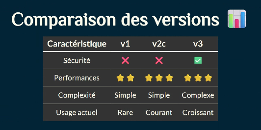

###### Le concept de "Community String" 🗝️

La community est comme un mot de passe partagé :
• Public (lecture seule) : permet GET
• Private (lecture/écriture) : permet GET + SET
⚠️ Problème : transmis en clair sur le réseau !

###### Les risques de sécurité 😨

Avec SNMPv1/v2c :
• Community string visible en clair -9 capture réseau
• Aucune authentification forte
• Possibilité de modifier la config (si community RW)
• Énumération du réseau
➡️Un attaquant peut espionner et modifier les équipements !

SNMPv3 : la solution - Les 3 niveaux de sécurité :
1. noAuthNoPriv : Aucune sécurité (comme v2c)
2. authNoPriv: uthentification uni uemen
3. authPriv : Authentification + Chiffrement
Toujours utiliser authPriv en production !

###### Intégration avec les outils de supervision 🔗

Les outils comme Zabbix, Nagios, PRTG utilisent SNMP pour :
• Découvrir automatiquement les équipements
• Collecter les métriques (CPU, RAM, interfaces...)
• Générer des alertes
• Créer des graphiques

Métriques courantes supervisées via SNMP 📈

- Système : CPIJ, RAM, disque, température-
- Réseau : Trafic entrant/sortant, erreurs, paquets perdus
- Interfaces : État (up/down), bande passante utilisée
- Environnement : Température, alimentation, ventilateurs

###### Avantages de SNMP en supervision 👍

✅Standardisé : fonctionne sur tous les équipements réseau
✅Léger : peu de charge sur les équipements
✅Universel : supporte de nombreux constructeurs
✅Temps réel : collecte rapide des données
✅Sans agent : pas besoin d'installer de logiciel supplémentaire

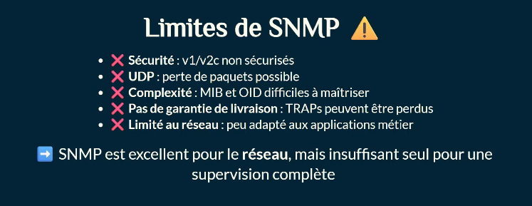

##### Conclusion

Ce qu'il faut retenir 💡
✅SNMP est le protocole standard de supervision réseau
✅Il repose sur Manager, Agent et MIB
✅SNMPv2c est simple mais non sécurisé
✅SNMPv3 apporte authentification et chiffrement
✅SNMP combine polling (GET) et alerting (TRAP)
✅Essentiel pour superviser les équipements réseau

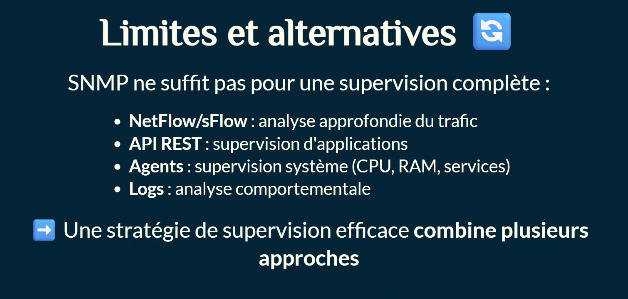