### VDI

## **L’essentiel**

La Virtual Desktop Infrastructure (VDI) est une technologie qui centralise les bureaux virtuels dans un data center, permettant aux utilisateurs d’y accéder depuis n’importe quel appareil connecté, ce qui améliore considérablement la sécurité, la gestion des coûts et la flexibilité des systèmes informatiques.

Les clients légers, servant de terminaux pour ces bureaux virtuels, réduisent les coûts matériels et énergétiques, simplifient la maintenance et renforcent la sécurité en éliminant le besoin de capacités de traitement locales. La configuration d’un client léger implique son branchement et sa connexion au réseau, l’accès à son interface pour régler les paramètres de réseau et d’affichage, ainsi que la configuration de la connexion au serveur VDI, incluant l’adresse du serveur, le protocole de connexion et les identifiants d’accès.

Il est crucial de tester la connexion pour s’assurer de la qualité d’affichage, de la réactivité des applications et de la stabilité de la connexion. Pour maintenir un haut niveau de sécurité, il est recommandé d’utiliser des méthodes d’authentification fortes et de réaliser des mises à jour régulières, tout en évitant les erreurs communes liées à la sécurité du réseau et à l’estimation des besoins en bande passante.

En résumé, la VDI et les clients légers offrent une approche optimisée pour la gestion des environnements de travail virtuels, garantissant sécurité, efficacité et flexibilité.

On parle du principe du Mastering, on crée une VM master avec ses applications joignable pour un utilisateur à distance sur un serveur

A partir de l'hyper V une vm crée avec win10 (master)

GENERALIZATION :  à partir d'une vm créée, les réglages seront uniques donc à nettoyer l'utilisateur : on va sur la vm win10 et gestion de l'ordinateur

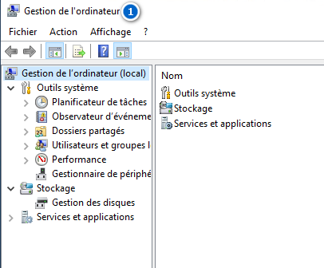

J'active le compte administrateur et je change de mdp

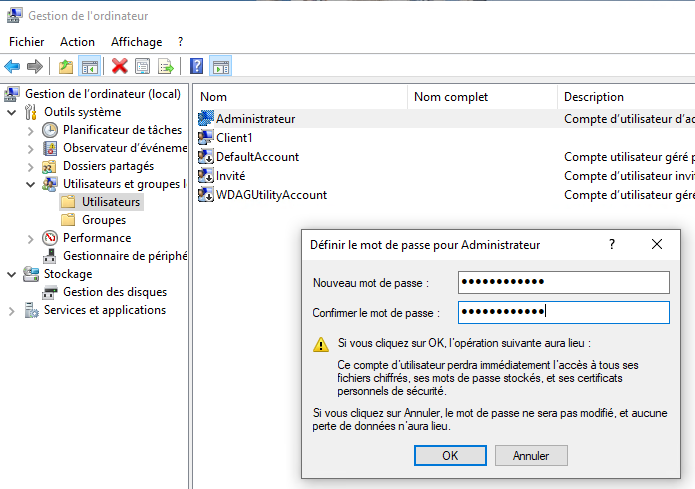

Se déconnecter pour se reconnecter en tant qu'administrateur

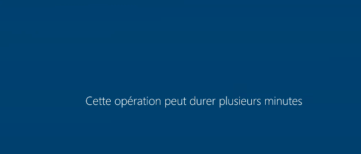

résumé : 

1- clique droit menu démarrer , gestion de l’ordinateur

2- utilisateurs , et réactivé le compte administrateur

8. redefinir le mdp du compte administrateur
9. démarrer compte utilisateur et se deconnecter
10. se connecter sur administrateur

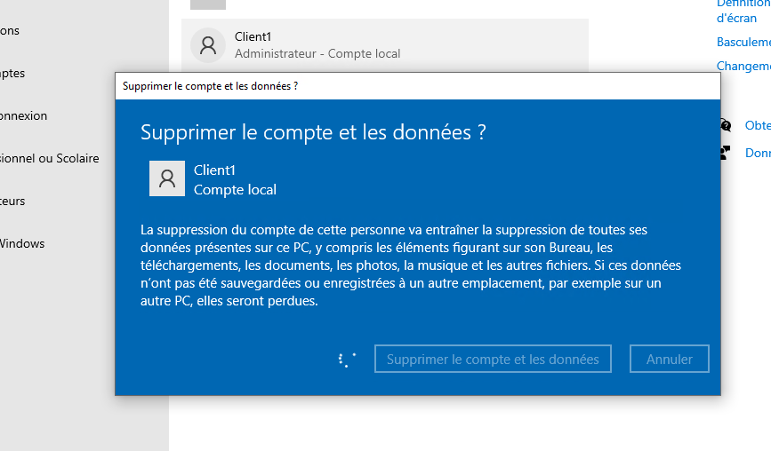

C:\Windows\System32\sysprep

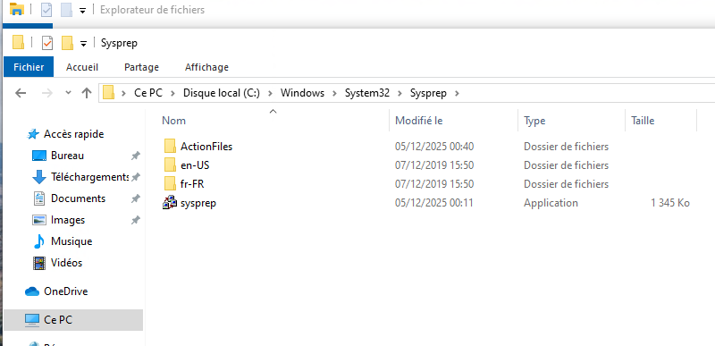

double clique

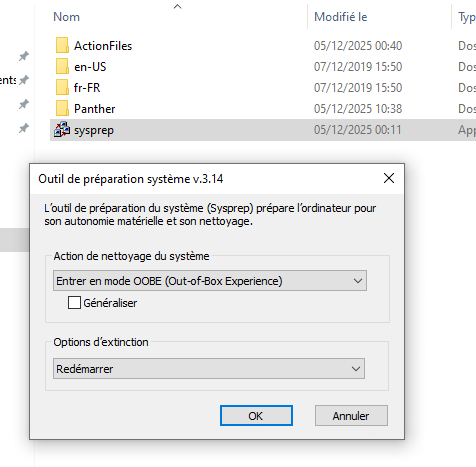

Avant de pouvoir déployer une image Windows sur de nouveaux PC, vous devez d’abord généraliser cette image. La généralisation de l’image supprime les informations spécifiques à l’ordinateur, telles que les pilotes installés et l’identificateur de sécurité (SID) de l’ordinateur. Vous pouvez utiliser [Sysprep](https://learn.microsoft.com/fr-fr/windows-hardware/manufacture/desktop/sysprep--system-preparation--overview?view=windows-11) seul ou Sysprep avec un fichier de réponses [sans assistance](https://learn.microsoft.com/fr-fr/windows-hardware/customize/desktop/unattend/) pour généraliser votre image et la préparer au déploiement.

Mode audit pour rentrer dans le sysprep pour le préparer ou OOBE

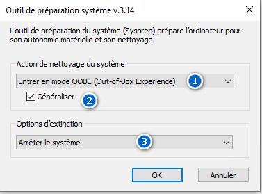

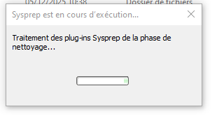

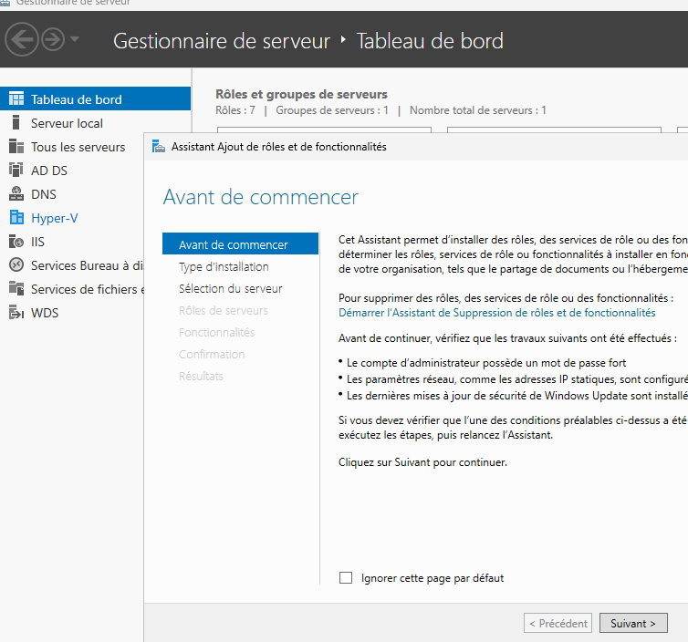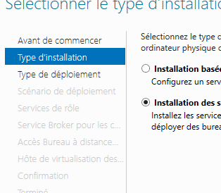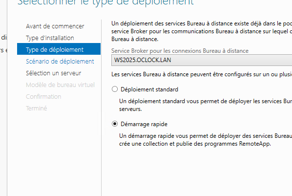

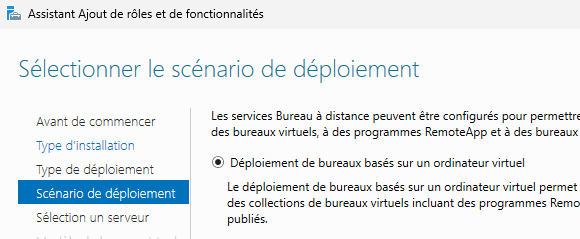

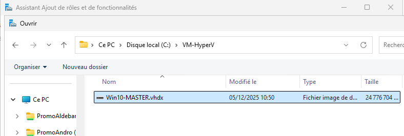

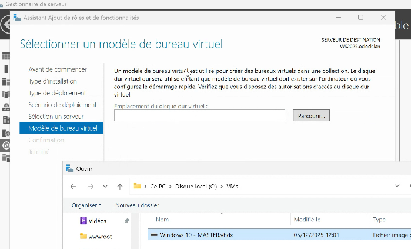

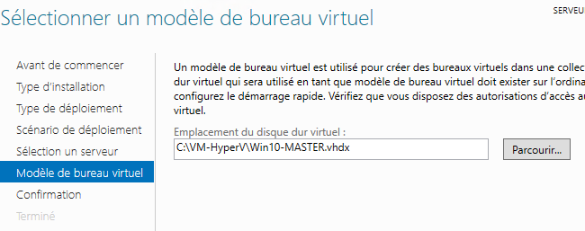

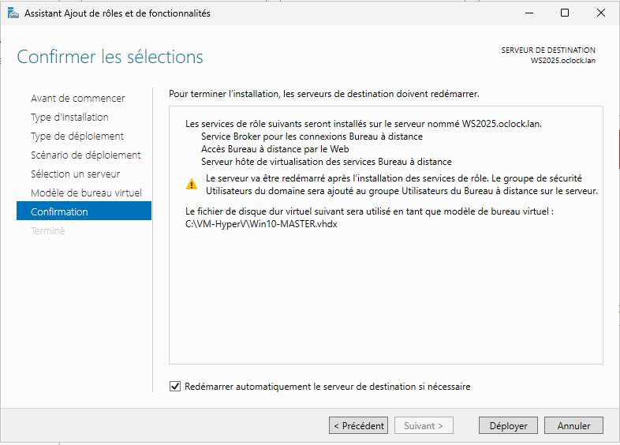

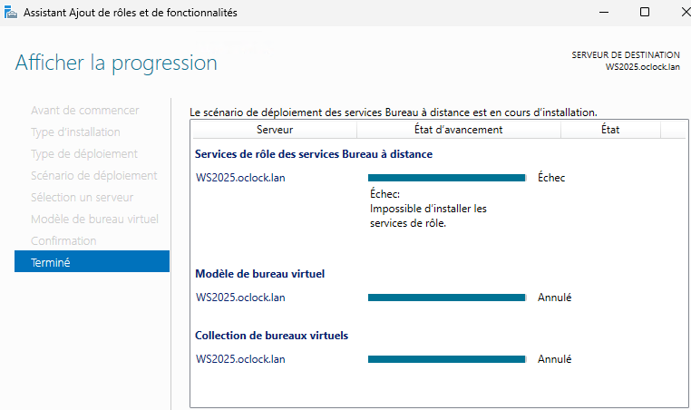

si Echec :

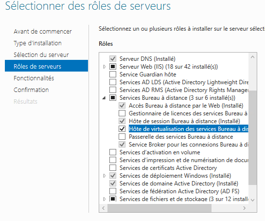

