#### Virtualisation

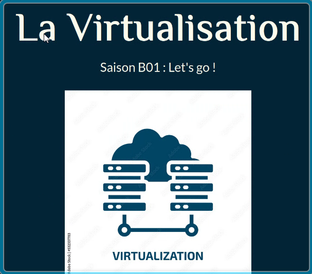

Qu'est-ce que la virtualisation ?
La virtualisation est une technologie qui permet de créer des versions virtuelles de ressources informatiques, telles que des serveurs, des postes de travail, des systèmes d'exploitation et des applications, sur un matériel physique unique.

La virtualisation a ensuite connu une évolution significative avec l'arrivée des processeurs x86 et l'essor des systèmes d'exploitation tels que Linux et Windows.

Principes de la virtualisation La virtualisation repose sur le concept de création d'une abstraction d'un système physique, ce qui permet à un seul système physique de supporter plusieurs systèmes d'exploitation et applications virtuelles.

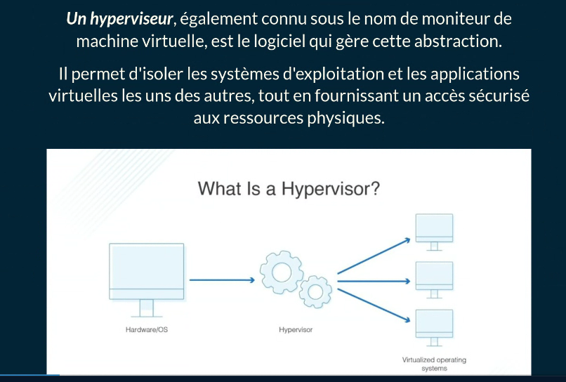

**Hyperviseurs de type 1**
Également appelés hyperviseurs "Bare-Metal", ils s'exécutentdirectement sur le matériel informatique, offrant des performances
supérieures et une meilleure sécurité. Ils sont généralement utilisés dans les environnements de production.

**Hyperviseurs de type 2**
Ces hyperviseurs fonctionnent en tant qu'applications sur un système d'exploitation hôte, simulant le matériel pour les machines
virtuelles. Ils sont souvent utilisés pour la virtualisation de postes de travail, les tests et le développement.

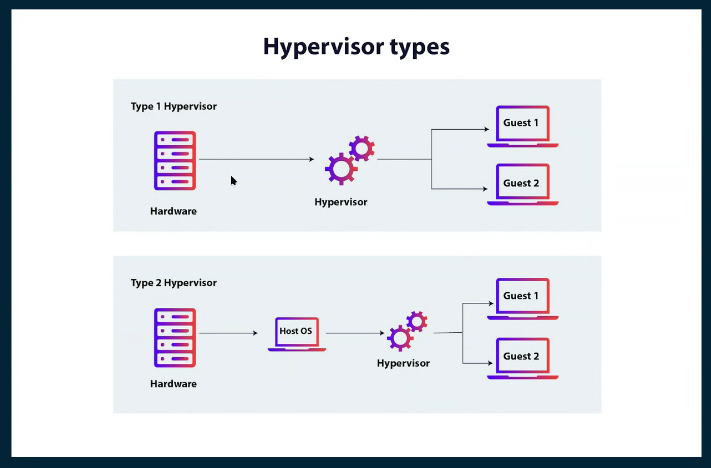

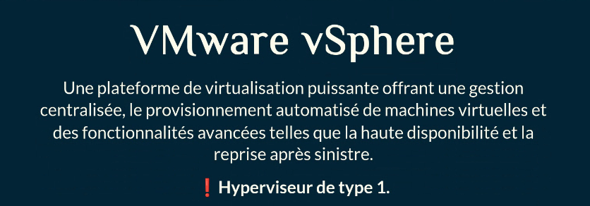

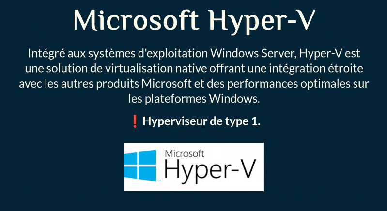

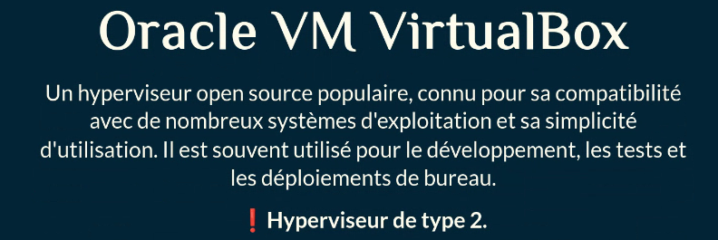

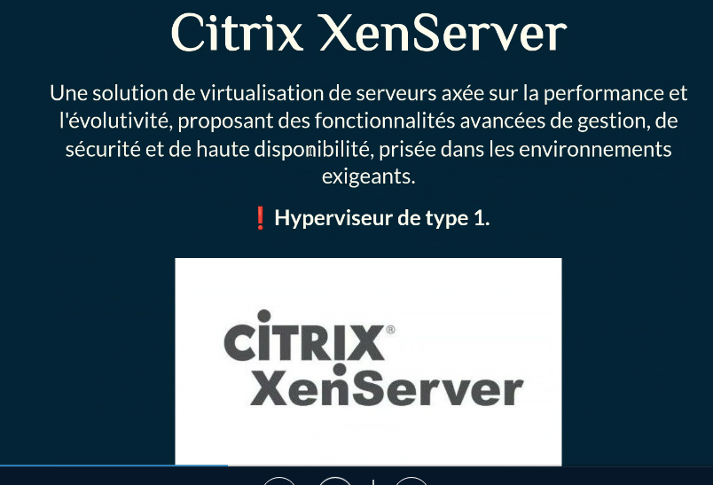

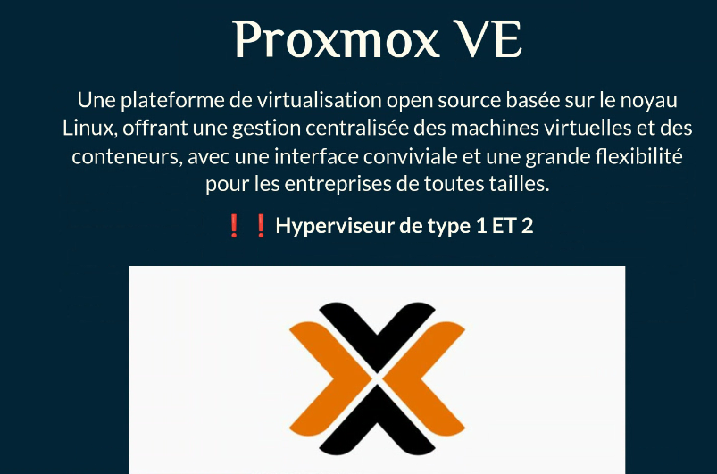

**Définition :**
La virtualisation crée une couche d'abstraction qui permet aux systèmes d'exploitation et aux applications de s'exécuter dans un
environnement virtuel, sans nécessairement exiger le matériel physique sous-jacent. Cela permet aux organisations de mieux utiliser leurs ressources matérielles, d'améliorer l'efficacité et de réduire les coûts d'exploitation.

**Avantages de la virtualisation**

<u>Réduction des coûts</u> La virtualisation permet de réduire les coûts matériels en consolidant plusieurs serveurs physiques sur un seul serveur physique. Cela permet également de réduire les coûts d'électricité, de refroidissement et de maintenance.

<u>Amélioration de la flexibilité</u> et de la rapidité La virtualisation permet de créer et de déployer des machines virtuelles rapidement et facilement, ce qui permet de répondre aux besoins changeants de l'entreprise. Elle permet également de provisionner facilement des ressources supplémentaires pour faire face à une demande accrue.

<u>Sécurité La virtualisation</u> permet de renforcer la sécurité en isolant les machines virtuelles les unes des autres, ce qui limite l'impact des attaques malveillantes. Elle permet également de mettre en oeuvre des politiques de sécurité plus strictes.

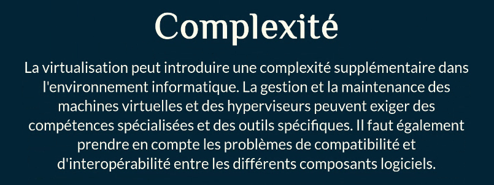

**Performances**
Bien que la virtualisation permette une utilisation plus efficace des ressources matérielles, elle peut également introduire une surcharge, ce qui peut affecter les performances des systèmes virtuels. Il est donc essentiel de bien dimensionner les ressources et de surveiller les performances pour éviter les dégradations.

<u>Coûts de licenc</u>e Certaines solutions de virtualisation nécessitent l'achat de licences, ce qui peut augmenter les coûts. II est important de bien évaluer les besoins et de comparer les différentes solutions disponibles pour choisir celle qui offre le meilleur rapport qualité-prix.

<u>Sécurité</u> Bien que la virtualisation offre des avantages en matière de sécurité, elle peut également introduire de nouveaux risques, notamment en ce qui concerne la gestion des accès et la protection des données entre les machines virtuelles. Il est donc crucial de mettre en place des mesures de sécurité appropriées pour protéger l'environnement virtualisé.

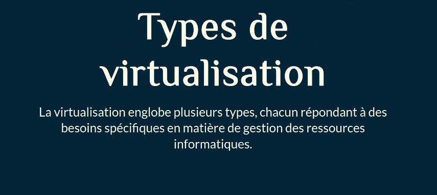

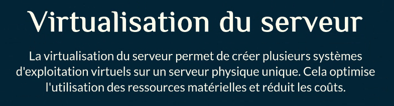

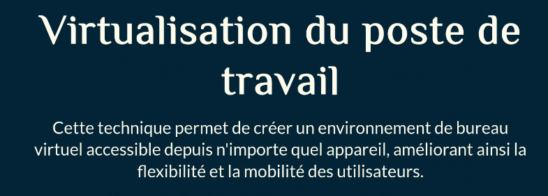

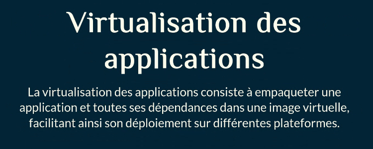

**Virtualisation du réseau**
La virtualisation du réseau permet de créer des réseaux virtuels gérés de manière centralisée, facilitant la configuration et offrant une meilleure isolation des flux de données.

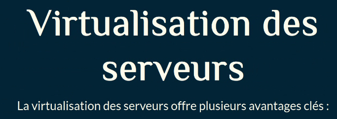

Consolidation du matériel
Elle permet de regrouper plusieurs systèmes d'exploitation et
applications sur un seul serveur physique, optimisant ainsi
l'utilisation du matériel et réduisant les coûts d'énergie et de
maintenance.

Flexibilité et évolutivité
Les serveurs virtualisés offrent une grande flexibilité en termes
d'allocation des ressources, permettant de les ajuster facilement en
fonction des besoins des applications.

Réduction de l'empreinte carbone
En diminuant le nombre de serveurs physiques nécessaires, la
virtualisation contribue à réduire la consommation d'énergie et les
émissions de C02, aidant ainsi les entreprises à atteindre leurs
objectifs environnementaux.

Virtualisation des
postes de travail
La virtualisation des postes de travail (VDI) consiste à exécuter un
système d'exploitation et ses applications sur un serveur distant,
permettant aux utilisateurs d'accéder à leur environnement de
travail depuis n'importe quel appareil.

Virtualisation des
applications
La virtualisation des applications permet de séparer une application
de son environnement physique, facilitant ainsi son exécution sur
différentes machines virtuelles, indépendamment du système
d'exploitation ou de l'architecture matérielle.

Les conteneurs offrent un niveau d'abstraction plus élevé que les
machines virtuelles traditionnelles, encapsulant une application et
ses dépendances dans un environnement isolé pour une exécution
cohérente sur diverses plateformes.

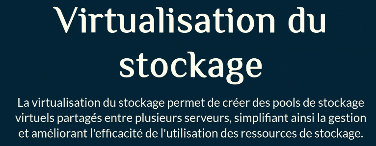

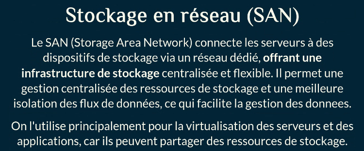

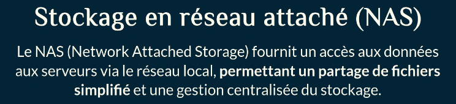

Stockage en réseau attaché (NAS)
Le NAS (Network Attached Storage) fournit un accès aux données
aux serveurs via le réseau local, permettant un partage de fichiers
simplifié et une gestion centralisée du stockage.

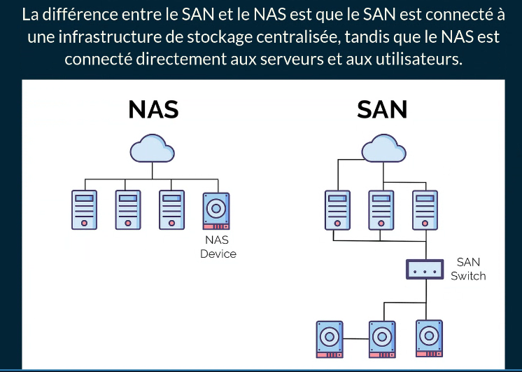

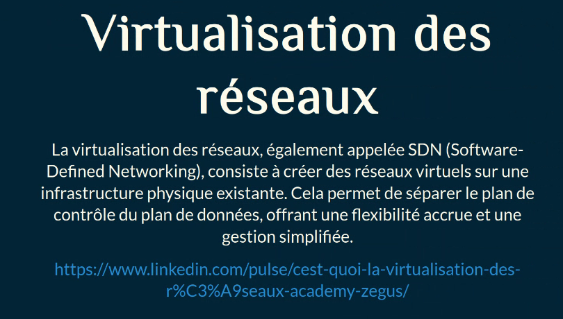

https://www.linkedin.com/pulse/cest-quoi-la-virtualisation-des-r%C3%A9seaux-academy-zegus/

Avantages de la
virtualisation des réseaux
• Flexibilité accrue : Permet de créer, configurer et gérer des réseaux virtuels de manière
programmatique, facilitant l'adaptation aux besoins changeants.
• Gestion centralisée : Offre une vue unifiée pour l'administration des ressources réseau, simplifiant les
opérations.
• Isolation des applications : Assure une séparation efficace entre différentes applications, améliorant la
sécurité et la performance.
• Automatisation des tâches : Facilite l'automatisation des configurations et des déploiements, réduisant
les erreurs humaines.

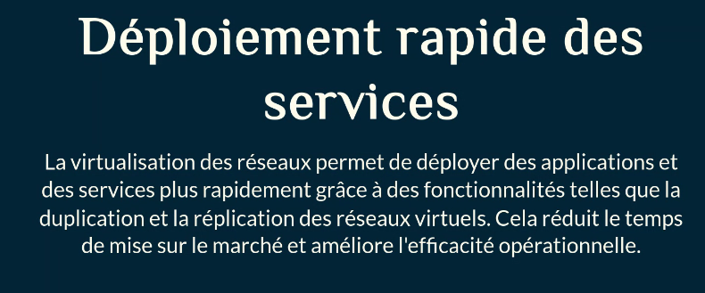

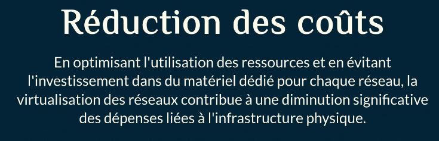

Conclusion
La virtualisation est une technologie puissante qui offre de nombreux
avantages, notamment en termes de réduction des coûts, de
flexibilité, de sécurité et de disponibilité.
Cependant, elle présente également des défis, tels que la complexité
de la gestion, les performances, les coûts de licence et les
considérations de sécurité.
Il est donc essentiel d'évaluer soigneusement les besoins de
l'entreprise et de planifier la mise en oeuvre de la virtualisation de
manière appropriée pour maximiser les bénéfices tout en minimisant
les risques.

### VMware Workstation : Hyperviseur de type 2  & Proxmox : Hyperviseur de type 1

VMware Workstation
Qu'est-ce que c'est ?
VMware Workstation est un hyperviseur de type 2 : un logiciel de
virtualisation qui s'installe sur un système d'exploitation existant
(Windows, Linux).

•
•
Réseaux virtuels
Plusieurs modes disponibles :
NAT : Partage la connexion de l'hôte
Bridge : VM comme un vrai PC sur le réseau
Host-Only : Réseau isolé hôte VM
Custom : Réseaux personnalisés

Intégration VMware
• Connexion à des serveurs ESXi distants
• Gestion de vCenter (avec licence Pro)
• Import/export OVF/OVA (standard industriel)

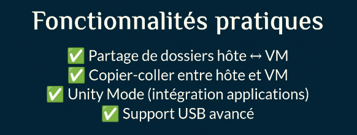

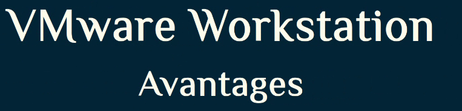

Pour la formation
I nterface professionnelle
Standard de l'industrie IT
Documentation riche
Passerelle vers ESXi/vSphere

Pour les tests
Environnements isolés et sécurisés
Snapshots = expérimentation sans risque
Multiples OS sans multiplier le matériel

Performance et stabilité
Optimisations avancées
Support matériel récent
Virtualisation imbriquée bien supportée

Proxmox VE
Qu'est-ce que c'est ?
Proxmox Virtual Environment est un hyperviseur de type 1 : il
s'installe directement sur le matériel, sans OS intermédiaire.
Plateforme open-source de virtualisation et conteneurisation.

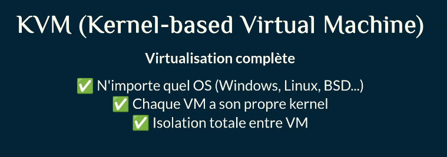

**Proxmox VE Fonctionnalités principales**

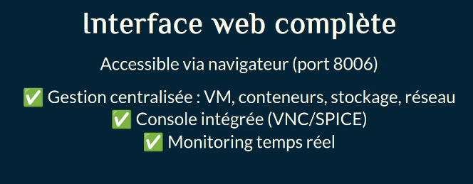

https://hausmer.com/posts/vmware/