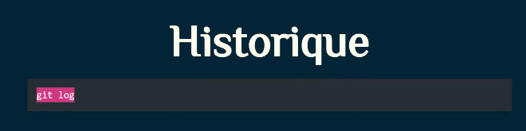

#### Pourquoi Git ?

Pourquoi Git ?
Git est un outil incontournable en informatique :
• suivi des modifications d'un script
• retour à une version précédente
• très utilisé en entreprise

#### Dépôt (repository)

Un dépôt Git est un dossier suivi par Git.


```
git ini
```

#### Vérifier l'état

```
git status
```

#### Ajouter des fichiers

git add
ou
git add .

#### Valider un commit

git commit -m "Message explicatif"



C'est quoi GitHub ?
GitHub est une plateforme en ligne pour héberger des dépôts Git.


#### Envoyer ses modifications

```
git push
```

