**Introduction** : Primordial en sécurité ? 👺
La sécurité absolue (parfaite, inviolable) n'existe pas, aucun système n'est sécurisé à 100%. Il faut se préparer à l'échec des mesures de sécurité que nous avons mis en place.

Prenons un cas de figure très courant : une attaque par ransomware (rançongiciel FR) ! Le serveur de fichiers de l'entreprise est touché 😱. Toutes les données des utilisateurs sont stockées dessus, les informations vitales à l'activité de l'entreprise ne sont plus
accessibles ... quelles solutions s'offrent à nous ?

1. Payer la rançon (très mauvaise idée, aucune garantie)
2. Ne pas payer la rançon
Le deuxième cas de figure est le plus raisonnable, mais il implique de devoir faire une croix sur les données "kidnappées" ...

https://messervices.cyber.gouv.fr/guides/fondamentaux-sauvegarde-systemes-dinformation

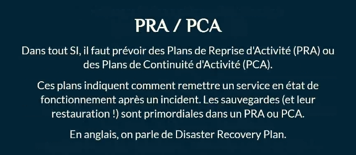

#### Testez ! 💻

Avoir des sauvegarde, c'est bien. Tester leur restauration, c'est mieux ! (des sauvegardes impossibles à restaurer après un incident les rendent caduques)

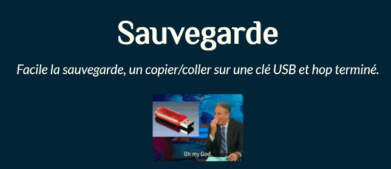

**PDMA & DMA**⌛
La PDMA, Perte de Données Maximale Admissible (RPO, Recovery Point Objective us) est la durée en heures (ou minutes) que l'on  est prêt à perdre en cas d'incident⏱️. La DM IA, Durée Maximale d'Interruption Admissible (RTO, Recovery Time Objective us), est le temps d'interruption toléré en cas d'incident, avant que le service soit à nouveau opérationnel. Ces métriques sont définis par accord de niveau de service (SLA, Service Level Agreement), entre la DSI et la Direction Générale.

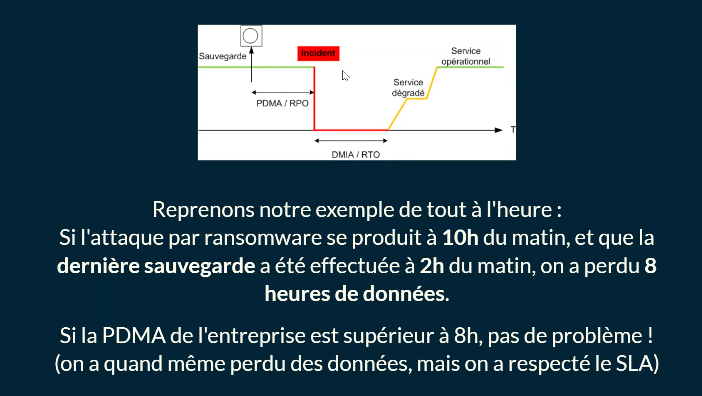

**Quelques exemples :**
• PDMA de 24h : il faut sauvegarder quotidiennement
• PDMA de 12h : il faut sauvegarder 2x par jour
• PDMA de 6h : il faut sauvegarder 4x par jour

• etc.
Quand la PDMA est très basse (quelques minutes seulement, voir aucune perte admissible), la sauvegarde ne suffit plus : il faut mettre en place un système de réplication des données (les deux doivent être combinés).

**Règle "3-2-1"**
Pour sauvegarder dans les règles de l'art, il faut ...
• au moins 3 copies d'un fichier (la production + 2 sauvegardes),
• stockées sur au moins 2 supports de stockage différents,
• dont 1 support hors-site/hors-ligne.

###### On peut aller plus loin, mais la règle ci-dessus est censée être le minimum.

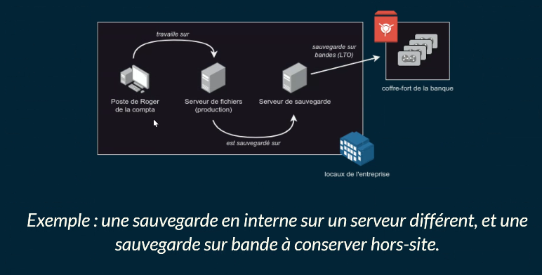

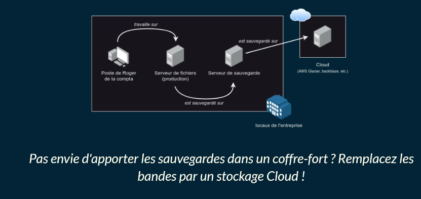

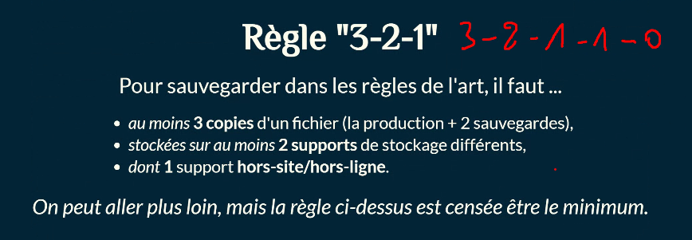

Un support hors site/ligne et 0 sans erreurs car vérifié.

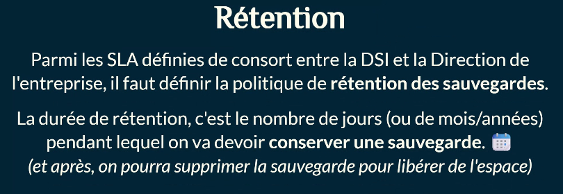

Comme précisé dans les recommandation de IANSSI, cette durée peut varier selon le type de sauvegarde.
Type de sauvegarde ?

Imaginons qu'on veuille sauvegarder un dossier, par exemple la racine de notre serveur de fichiers.
Il existe plusieurs types de sauvegarde, le plus simple est **la sauvegarde complète** : on fait une copie conforme du dossier à
sauvegarder sur un support différent. (si on garde la sauvegarde sur le même serveur, ça perd tout son intérêt)

En cas d'incident, la restauration est facile : il suffit de reprendre la dernière sauvegarde complète ! Inconvénient de la sauvegarde complète ? Elle prend du temps, puisqu'il faut sauvegarder l'ensemble des fichiers ! Pour palier à ce problème, on peut utiliser l'un des deux types de sauvegardes suivant :
• sauvegarde incrémentielle
• sauvegarde différentielle

**Sauvegarde incrémentielle**
Quand on fait une sauvegarde incrémentielle, on sauvegarde uniquement les fichiers ajoutés/modifiés depuis la dernière
sauvegarde complète ou incrémentielle. Cette sauvegarde est <u>beaucoup plus rapide et très légère</u>, mais la restauration est plus complexe : il faut restaurer la dernière sauvegarde complète + toutes les sauvegardes incrémentielles effectuées depuis la dernière sauvegarde complète.

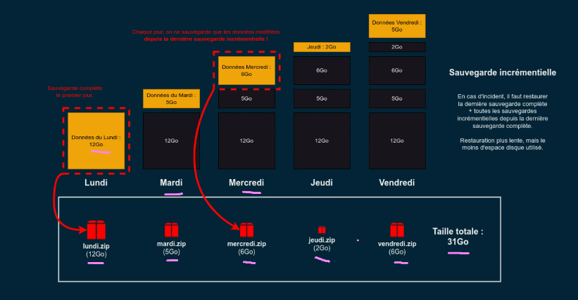

**Snapshot ?**
Un snapshot (instantané FR) est la photographie d'un système de fichiers à un instant t. Ils permettent de pouvoir revenir dans le
passé, à la date à laquelle a été faite le snapshot. Attention : les snapshots ne peuvent pas être considérées comme des sauvegardes, puisque les données ne sont pas copiées ! Seules les données modifiées ou supprimées depuis le dernier snapshot (ou le snapshot initial) sont conservées.

Les snapshots sont rapides (à créer et à restaurer) et relativement légers (individuellement). On peut donc se permettre de faire des snapshots fréquents (toutes les 30min ou 60min, par exemple), pour pouvoir revenir à des versions antérieures de nos fichiers. Cette rapidité a un inconvénient : les snapshots sont stockés sur la même baie de stockage (en général). Et même si ce n'est pas le cas, les snapshots seuls ne permettent pas la restauration des données.

Bonne pratique :
En général, on combine sauvegardes et snapshots. Exemple :

- une sauvegarde complète toute les semaines
- une sauvegarde différentielle ou incrémentielle tous les jours
- un snapshot toutes les heures

**Et la réplication ?**
Pour certaines entreprises, on ne tolère pas d'interruption de service. Dans ce cas, on peut mettre en place de la réplication
Cette réplication peut être synchrone (en "miroir", toutes les entrées/sorties sont faites sur 2 serveurs/disques/supports
simultanément), ou asynchrone (copie des modifications après la fin de l'écriture sur le premier support, ou toutes les 1/5/10 minutes). En cas d'incident, il suffit de basculer sur le réplicat.

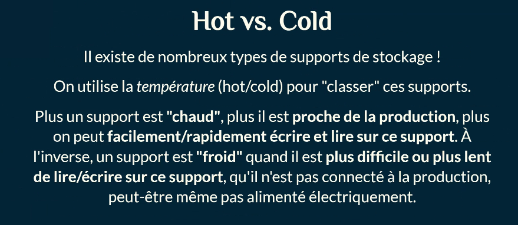

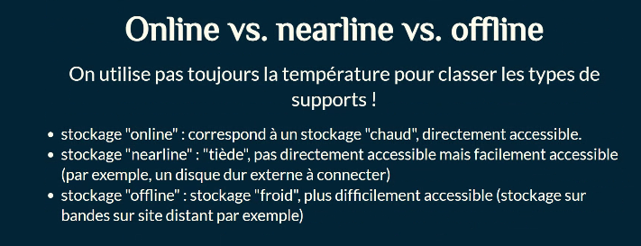

**Médias de stockage**
• bande magnétique (LTO)
• disque dur (mécanique)
• supports optiques (CD, DVD, Blu-ray + M-Disc)
• mémoire flash (disques dur SSD, carte SD/microSD, clés USB)
Liste non exhaustive ! Chaque média a des avantages et des inconvénients, il n'y a pas un média parfait.

Selon le média choisi, différentes mises en œuvre sont possibles :
• DAS (Directly Attached Storage)
• NAS (Network Attached Storage)
• SAN (Storage Area Network)
• Stockage Cloud

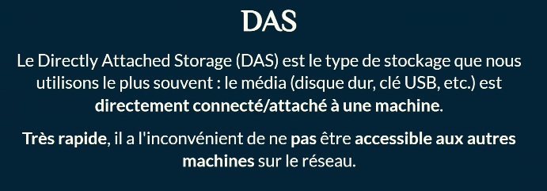

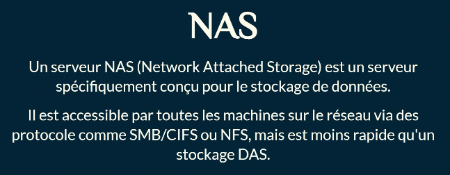

https://www.hpe.com/fr/fr/what-is/san-storage.html

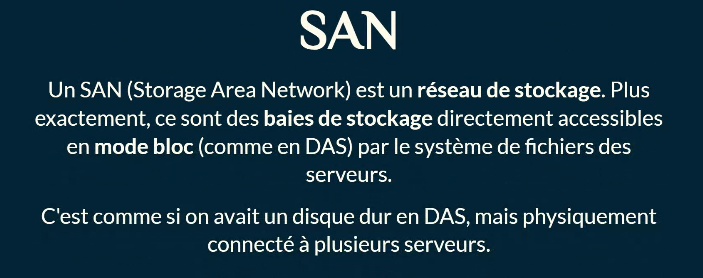

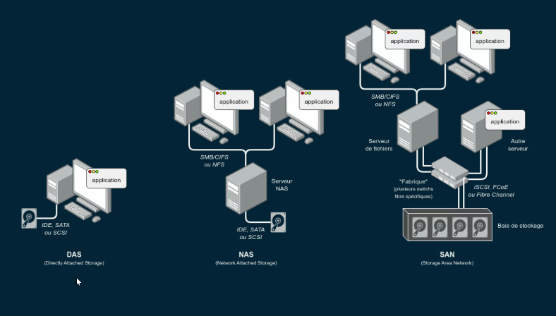

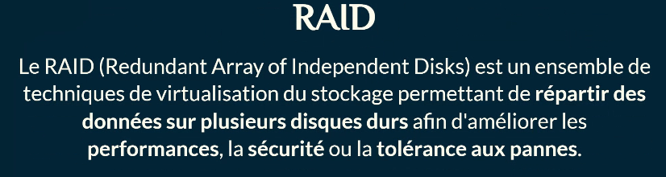

**Intérêt du RAID**
Le RAID permet soit :
• redondance des données sur plusieurs disques pour avoir une certaine tolérance
aux pannes matérielles (exemple : RAID 1)
• répartition des données sur plusieurs disques pour améliorer les performances
(exemple : RAID 0)
• compromis entre redondance et répartition (exemple : RAID 5)

**Niveaux RAID**
Il existe différents "niveaux" d'architecture RAID, numérotés à partir de 0. Les plus connus :
• RAID 1: mise en "miroir" de 2 (ou +) disques (tolère la panne d'un disque)
• RAID 0 : répartition des données sur 2 (ou +) disques (ne tolère aucune panne, mais + performant)
• RAID 5: 3 disques mini, utilisation d'un bit de parité pour reconstruire les données en cas d'incident (tolère la panne d'un disque)
On peut également combiner certains niveaux entre eux (RAID 10 - RAID 1+0, par exemple).

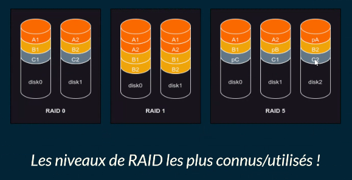

**Matériel vs. logiciel**
On peut faire du RAID de deux façons différentes :
• RAID matériel : nécessite une carte contrôleur PCI spécifique relativement coûteuse, souvent avec une batterie.
• RAID logiciel : assuré par le système d'exploitation

**Fabricants de NAS réputés :**
• Synology
• QNAp
Fabricants de SAN •
• HP Entreprise
• IBM

**NAS DIY**
Il est possible, bien que rarement rencontré en entreprise, de créer son propre NAS. Les OS les plus souvents rencontrés sont :
	• TrueNAS (propose aussi des solutions pro)
	• OpenMediaVauIt
	• Unraid (payant)
	• Rockstor

**Solutions de sauvegarde**
• Veeam
• UrBackup
• Proxmox Backup Server

