# Atelier Bash - Automatisation de l'administration système

## Contexte professionnel

Vous venez d'être recruté(e) en tant qu'administrateur système Linux chez **TechSecure**, une entreprise hébergeant des applications web pour ses clients. L'infrastructure comprend une vingtaine de serveurs Linux (Debian/Ubuntu) répartis sur plusieurs environnements (développement, staging, production).

Actuellement, la plupart des tâches d'administration sont effectuées **manuellement**, ce qui prend beaucoup de temps et génère des erreurs. Votre manager vous demande de créer une **suite de scripts Bash** pour automatiser les tâches récurrentes d'administration système.

Votre mission : développer des outils d'automatisation robustes, réutilisables et bien documentés qui faciliteront le travail quotidien de l'équipe d'exploitation.

## Objectifs de l'atelier

À l'issue de cet atelier, vous serez capable de :
- Créer des scripts Bash professionnels et maintenables
- Automatiser les tâches courantes d'administration système
- Gérer les erreurs et valider les entrées utilisateur
- Produire des rapports et des logs d'exécution
- Documenter vos scripts pour faciliter leur utilisation

---

## Partie 1 : Script de sauvegarde automatisée

### Contexte
Les développeurs perdent régulièrement du travail car les sauvegardes sont faites manuellement et de manière irrégulière. Vous devez créer un script de sauvegarde fiable.

### Objectif
Créer un script `backup.sh` qui automatise la sauvegarde des répertoires critiques.

### Travail à réaliser

**1.1** - Créez un script qui :
- Prend en argument le répertoire à sauvegarder

- Crée une archive tar.gz du répertoire

- Nomme l'archive avec la date et l'heure (format: `backup_YYYYMMDD_HHMMSS.tar.gz`)

- Stocke l'archive dans un dossier `/backup` (à créer s'il n'existe pas)

- Affiche un message de confirmation avec la taille de l'archive créée

  > [!TIP]
  >
  > Serveurs debian
  >
  > création d'un utilisateur avec des droits d'admin
  >
  > création d'un dossier ~/scripts
  >
  > création d'un script backup.sh avec les droits chmod +x 

```
#!/bin/bash

# ==============================================================================
# CONFIGURATION
# ==============================================================================
# Dossiers critiques à sauvegarder par défaut si aucun argument n'est donné
DEFAULT_DIRS="/etc /var/www /home /var/log"
BACKUP_DEST="/backup"
DATE=$(date +%Y%m%d_%H%M%S)
LOG_FILE="/var/log/backup_system.log"

# Si l'utilisateur donne des arguments, on les utilise. 
# Sinon, on utilise la liste par défaut.
DIRS_TO_BACKUP=${@:-$DEFAULT_DIRS}

# ==============================================================================
# PRÉPARATION
# ==============================================================================
# Création du dossier de backup si absent
[ ! -d "$BACKUP_DEST" ] && sudo mkdir -p "$BACKUP_DEST" && sudo chmod 700 "$BACKUP_DEST"

exec > >(tee -a "$LOG_FILE") 2>&1 # Redirige toute la sortie vers le fichier log

echo "--- DÉBUT SAUVEGARDE : $(date) ---"

# ==============================================================================
# BOUCLE DE SAUVEGARDE
# ==============================================================================
for SOURCE in $DIRS_TO_BACKUP; do
    if [ -d "$SOURCE" ]; then
        # Formatage du nom : remplace les '/' par '_' pour le nom de fichier
        CLEAN_NAME=$(echo "$SOURCE" | sed 's/^\///;s/\//_/g')
        FILENAME="backup_${CLEAN_NAME}_${DATE}.tar.gz"
        
        echo "Compression de $SOURCE..."
        
        # Création de l'archive
        sudo tar -czf "$BACKUP_DEST/$FILENAME" "$SOURCE" 2>/dev/null
        
        if [ $? -eq 0 ]; then
            SIZE=$(sudo du -sh "$BACKUP_DEST/$FILENAME" | cut -f1)
            echo "✅ SUCCÈS : $SOURCE sauvegardé ($SIZE)"
        else
            echo "❌ ERREUR : Échec pour $SOURCE"
        fi
    else
        echo "⚠️  IGNORÉ : $SOURCE n'existe pas."
    fi
done

echo "--- FIN DE SAUVEGARDE : $(date) ---"
echo "------------------------------------------------"
```

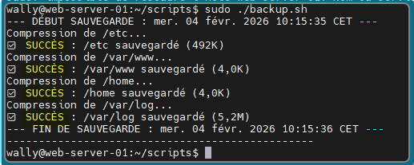

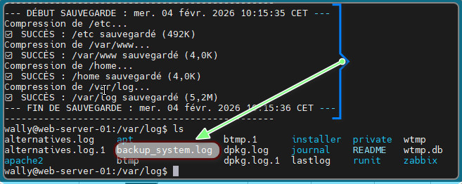

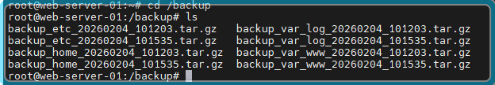

**1.2** - Améliorez le script pour :

- Vérifier que le répertoire source existe avant de commencer
- Vérifier qu'il y a suffisamment d'espace disque disponible
- Créer un fichier de log `/var/log/backup.log` avec date, heure et résultat de chaque sauvegarde
- Gérer les erreurs avec des messages explicites

**1.3** - Ajoutez une rotation des sauvegardes :
- Le script ne garde que les 7 dernières sauvegardes
- Les sauvegardes plus anciennes sont automatiquement supprimées
- Afficher un message indiquant combien de sauvegardes ont été supprimées

**1.4** - Testez votre script avec différents scénarios :
- Sauvegarde d'un dossier existant

- Tentative de sauvegarde d'un dossier inexistant

- Exécutions multiples pour vérifier la rotation

  ```
  #!/bin/bash
  
  # ==============================================================================
  # CONFIGURATION
  # ==============================================================================
  DEFAULT_DIRS="/etc /var/www /home /var/log"
  BACKUP_DEST="/backup"
  DATE=$(date +%Y%m%d_%H%M%S)
  LOG_FILE="/var/log/backup.log"
  MIN_FREE_SPACE=1024 # Seuil en Mo (1 Go)
  
  # Choix des répertoires (Arguments ou Défaut)
  DIRS_TO_BACKUP=${@:-$DEFAULT_DIRS}
  
  # ==============================================================================
  # PRÉPARATION ET VÉRIFICATIONS
  # ==============================================================================
  
  # Création du dossier de backup si absent
  [ ! -d "$BACKUP_DEST" ] && sudo mkdir -p "$BACKUP_DEST" && sudo chmod 700 "$BACKUP_DEST"
  
  # Redirection de la sortie vers le log et le terminal
  exec > >(tee -a "$LOG_FILE") 2>&1
  
  echo "--- DÉBUT SAUVEGARDE : $(date) ---"
  
  # Vérification de l'espace disque disponible sur la partition de destination
  # On récupère l'espace libre en Mo
  FREE_SPACE=$(df -m "$BACKUP_DEST" | awk 'NR==2 {print $4}')
  
  if [ "$FREE_SPACE" -lt "$MIN_FREE_SPACE" ]; then
      echo "❌ ERREUR CRITIQUE : Espace disque insuffisant ($FREE_SPACE Mo restants)."
      echo "Fin du script prématurée."
      exit 1
  fi
  
  # ==============================================================================
  # BOUCLE DE SAUVEGARDE
  # ==============================================================================
  for SOURCE in $DIRS_TO_BACKUP; do
      if [ -d "$SOURCE" ]; then
          CLEAN_NAME=$(echo "$SOURCE" | sed 's/^\///;s/\//_/g')
          FILENAME="backup_${CLEAN_NAME}_${DATE}.tar.gz"
          
          echo "Compression de $SOURCE..."
          
          # Création de l'archive
          sudo tar -czf "$BACKUP_DEST/$FILENAME" "$SOURCE" 2>/dev/null
          
          if [ $? -eq 0 ]; then
              SIZE=$(sudo du -sh "$BACKUP_DEST/$FILENAME" | cut -f1)
              echo "✅ SUCCÈS : $SOURCE sauvegardé ($SIZE)"
          else
              echo "❌ ERREUR : Problème lors de la compression de $SOURCE"
          fi
      else
          echo "⚠️  IGNORÉ : Le répertoire '$SOURCE' n'existe pas."
      fi
  done
  
  # ==============================================================================
  # ROTATION DES SAUVEGARDES (7 JOURS)
  # ==============================================================================
  echo "Nettoyage des sauvegardes de plus de 7 jours..."
  
  # On compte les fichiers qui vont être supprimés pour le rapport
  OLD_BACKUPS=$(sudo find "$BACKUP_DEST" -name "backup_*.tar.gz" -type f -mtime +7)
  NB_DEL=$(echo "$OLD_BACKUPS" | grep -c "backup" || echo 0)
  
  if [ "$NB_DEL" -gt 0 ]; then
      sudo find "$BACKUP_DEST" -name "backup_*.tar.gz" -type f -mtime +7 -delete
      echo "♻️  ROTATION : $NB_DEL ancienne(s) sauvegarde(s) supprimée(s)."
  else
      echo "♻️  ROTATION : Aucun fichier obsolète à supprimer."
  fi
  
  echo "--- FIN DE SAUVEGARDE : $(date) ---"
  echo "------------------------------------------------"
  ```

  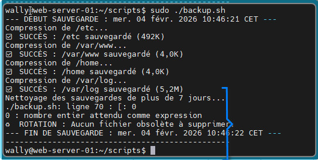

  > [!Tip] 
  >
  > - Tentative de sauvegarde d'un dossier inexistant /dossier_inexistant
  > - Exécutions multiples pour vérifier la rotation ("vieillir" artificiellement un fichier : sudo touch -d "2026-01-01 10:00:00" /backup/backup_home_20260204_105300.tar.gz)

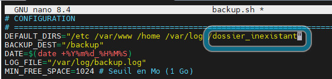

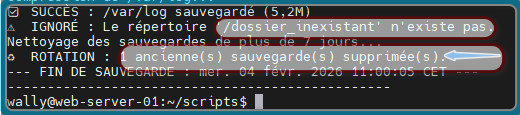


## Partie 2 : Moniteur de ressources système

### Contexte
L'équipe a besoin de surveiller l'état des serveurs pour détecter les problèmes avant qu'ils n'affectent les utilisateurs.

### Objectif
Créer un script `monitor.sh` qui collecte et affiche les informations système importantes.

### Travail à réaliser

**2.1** - Créez un script qui affiche :
- Le nom du serveur (hostname)
- La date et l'heure actuelles
- L'uptime du système
- L'utilisation CPU (en pourcentage)
- L'utilisation mémoire (utilisée/totale en Go et en pourcentage)
- L'utilisation de chaque partition (en pourcentage)
- Le nombre de processus en cours d'exécution

**2.2** - Ajoutez un système d'alertes colorées :
- Vert : utilisation < 70%
- Jaune : utilisation entre 70% et 85%
- Rouge : utilisation > 85%

**2.3** - Créez une option pour générer un rapport texte :
- Le rapport doit être sauvegardé dans `/var/log/monitor_YYYYMMDD.txt`
- Format lisible et structuré
- Inclure toutes les informations collectées

**2.4** - Ajoutez l'affichage des 5 processus consommant le plus de :
- CPU
- Mémoire

```
#!/bin/bash

# ==============================================================================
# NOM DU SCRIPT : monitor.sh
# DESCRIPTION  : Collecte et affiche les indicateurs de santé du serveur.
# ENTREPRISE  : TechSecure
# ==============================================================================

# Couleurs pour la lisibilité
GREEN='\033[0;32m'
BLUE='\033[0;34m'
NC='\033[0m' # Pas de couleur

echo -e "${BLUE}====================================================${NC}"
echo -e "         RAPPORT SYSTÈME - TECHSECURE               "
echo -e "${BLUE}====================================================${NC}"

# 1. Nom du serveur et Date
echo -e "${GREEN}Hostname :${NC} $(hostname)"
echo -e "${GREEN}Date/Heure :${NC} $(date '+%d/%m/%Y %H:%M:%S')"

# 2. Uptime (Temps de fonctionnement)
# On utilise awk pour simplifier la sortie de la commande uptime
echo -e "${GREEN}Uptime :${NC} $(uptime -p)"

# 3. Utilisation CPU (en %)
# On récupère la charge idle et on la soustrait à 100
CPU_LOAD=$(top -bn1 | grep "Cpu(s)" | sed "s/.*, *\([0-9.]*\)%* id.*/\1/" | awk '{print 100 - $1}')
echo -e "${GREEN}Utilisation CPU :${NC} $CPU_LOAD%"

# 4. Utilisation Mémoire (en Go et %)
# free -g donne les valeurs en Go
MEM_TOTAL=$(free -g | awk '/^Mem:/{print $2}')
MEM_USED=$(free -g | awk '/^Mem:/{print $3}')
# Calcul du pourcentage via awk
MEM_PERC=$(free | awk '/^Mem:/{printf("%.2f"), $3/$2*100}')

echo -e "${GREEN}Mémoire RAM :${NC} ${MEM_USED}Go / ${MEM_TOTAL}Go ($MEM_PERC%)"

# 5. Nombre de processus
# ps -e liste tout, wc -l compte les lignes
NB_PROC=$(ps -e | wc -l)
echo -e "${GREEN}Processus en cours :${NC} $NB_PROC"

# 6. Utilisation des partitions (en %)
echo -e "${GREEN}Utilisation Disque :${NC}"
# On affiche les colonnes Système de fichiers, Taille, et Pourcentage Utilisé
df -h --output=source,size,pcent -x tmpfs -x devtmpfs

echo -e "${BLUE}====================================================${NC}"
```

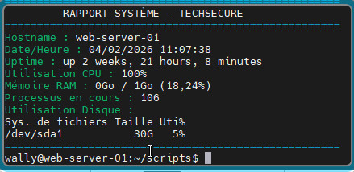

```
#!/bin/bash

# ==============================================================================
# NOM DU SCRIPT : monitor.sh
# DESCRIPTION  : Monitoring système avec alertes couleur et rapport texte.
# ENTREPRISE  : TechSecure
# ==============================================================================

# --- CONFIGURATION ET COULEURS ---
RED='\033[0;31m'
GREEN='\033[0;32m'
YELLOW='\033[0;33m'
BLUE='\033[0;34m'
NC='\033[0m' # Pas de couleur

DATE_LOG=$(date +%Y%m%d)
LOG_FILE="/var/log/monitor_${DATE_LOG}.txt"

# --- FONCTION D'ALERTE COLORÉE ---
# Argument 1: Valeur (nombre) | Argument 2: Symbole (%)
get_color() {
    local val=$(printf "%.0f" "$1") # Arrondi à l'entier
    if [ "$val" -lt 70 ]; then
        echo -e "${GREEN}${1}${2}${NC}"
    elif [ "$val" -ge 70 ] && [ "$val" -le 85 ]; then
        echo -e "${YELLOW}${1}${2}${NC}"
    else
        echo -e "${RED}${1}${2}${NC}"
    fi
}

# --- PRÉPARATION DU RAPPORT (OPTION -r) ---
GENERATE_REPORT=false
if [[ "$1" == "-r" ]]; then
    GENERATE_REPORT=true
    # On vide ou crée le fichier et on redirige la sortie
    sudo touch "$LOG_FILE" && sudo chmod 644 "$LOG_FILE"
fi

# Fonction pour afficher et éventuellement loguer
print_msg() {
    echo -e "$1"
    if [ "$GENERATE_REPORT" = true ]; then
        # On enlève les codes couleurs pour le fichier texte
        echo -e "$1" | sed 's/\x1B\[[0-9;]*[JKmsu]//g' | sudo tee -a "$LOG_FILE" > /dev/null
    fi
}

# --- COLLECTE DES DONNÉES ---
HOSTNAME=$(hostname)
NOW=$(date '+%d/%m/%Y %H:%M:%S')
UPTIME=$(uptime -p)
NB_PROC=$(ps -e | wc -l)

# CPU
CPU_LOAD=$(top -bn1 | grep "Cpu(s)" | awk '{print 100 - $8}')

# RAM
MEM_DATA=$(free | grep Mem)
MEM_TOTAL_GO=$(echo $MEM_DATA | awk '{printf "%.2f", $2/1024/1024}')
MEM_USED_GO=$(echo $MEM_DATA | awk '{printf "%.2f", $3/1024/1024}')
MEM_PERC=$(echo $MEM_DATA | awk '{printf "%.2f", $3/$2*100}')

# --- AFFICHAGE ---
[ "$GENERATE_REPORT" = true ] && sudo truncate -s 0 "$LOG_FILE"

print_msg "${BLUE}====================================================${NC}"
print_msg "         RAPPORT SYSTÈME - TECHSECURE               "
print_msg "${BLUE}====================================================${NC}"

print_msg "${BLUE}[INFO GÉNÉRALE]${NC}"
print_msg "Serveur    : $HOSTNAME"
print_msg "Date/Heure : $NOW"
print_msg "Uptime     : $UPTIME"
print_msg "Processus  : $NB_PROC"

print_msg "\n${BLUE}[RESSOURCES]${NC}"
print_msg "CPU        : $(get_color $CPU_LOAD "%")"
print_msg "Mémoire    : $(get_color $MEM_PERC "%") (${MEM_USED_GO}Go / ${MEM_TOTAL_GO}Go)"

print_msg "\n${BLUE}[STOCKAGE]${NC}"
df -h --output=source,pcent,target -x tmpfs -x devtmpfs | tail -n +2 | while read line; do
    usage=$(echo $line | awk '{print $2}' | sed 's/%//')
    partition=$(echo $line | awk '{print $3 " (" $1 ")" }')
    print_msg "Partition $partition : $(get_color $usage "%")"
done

print_msg "\n${BLUE}[TOP 5 PROCESSUS - CPU]${NC}"
TOP_CPU=$(ps -eo pcpu,pmem,comm --sort=-pcpu | head -n 6)
print_msg "$TOP_CPU"

print_msg "\n${BLUE}[TOP 5 PROCESSUS - MÉMOIRE]${NC}"
TOP_MEM=$(ps -eo pcpu,pmem,comm --sort=-pmem | head -n 6)
print_msg "$TOP_MEM"

print_msg "${BLUE}====================================================${NC}"

if [ "$GENERATE_REPORT" = true ]; then
    echo -e "\n${GREEN}Rapport généré avec succès dans : $LOG_FILE${NC}"
fi
```

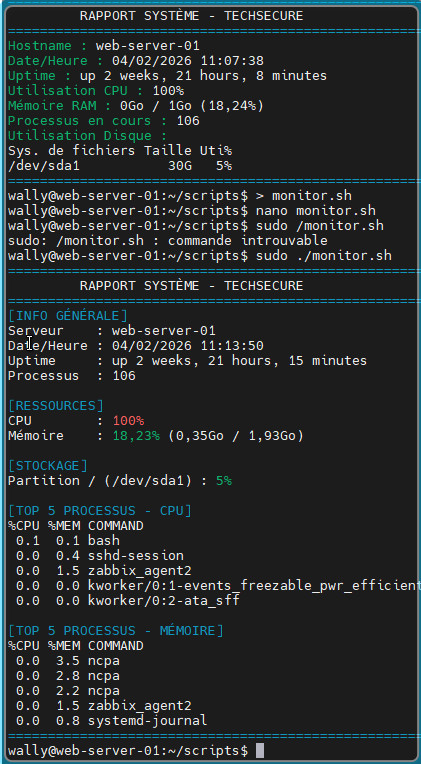

---

## Partie 3 : Gestionnaire d'utilisateurs en masse

### Contexte
L'entreprise recrute 15 nouveaux collaborateurs. Le service RH vous fournit un fichier CSV avec leurs informations. Vous devez automatiser la création de leurs comptes.

### Objectif
Créer un script `create-users.sh` qui crée des utilisateurs depuis un fichier CSV.

### Travail à réaliser

**3.1** - Créez un fichier CSV de test `users.csv` avec la structure suivante :

```
prenom,nom,departement,fonction
Alice,Martin,IT,Developpeur
Bob,Dubois,RH,Recruteur
Claire,Bernard,Commercial,Manager
```
Ajoutez au moins 10 utilisateurs.

**3.2** - Créez le script qui :
- Lit le fichier CSV fourni en argument
- Pour chaque ligne, crée un utilisateur avec :
  - Login : première lettre du prénom + nom (en minuscules)
  - Nom complet : Prénom Nom
  - Groupe principal selon le département
  - Répertoire personnel créé automatiquement
- Génère un mot de passe aléatoire sécurisé pour chaque utilisateur
- Affiche login et mot de passe pour chaque utilisateur créé

**3.3** - Améliorez le script pour :
- Vérifier que l'utilisateur n'existe pas déjà
- Créer les groupes de département s'ils n'existent pas
- Générer un fichier récapitulatif `users_created.txt` avec login et mot de passe
- Logger toutes les opérations dans `/var/log/user-creation.log`
- Gérer les erreurs (CSV invalide, permissions insuffisantes, etc.)

**3.4** - Ajoutez une option de suppression :

- Le script doit pouvoir supprimer les utilisateurs créés depuis le même CSV
- Demander confirmation avant chaque suppression
- Logger les suppressions

```
#!/bin/bash

# ==============================================================================
# CONFIGURATION
# ==============================================================================
LOG_FILE="/var/log/user-creation.log"
SUMMARY_FILE="users_created.txt"

log_action() {
    echo "$(date '+%Y-%m-%d %H:%M:%S') - $1" | sudo tee -a "$LOG_FILE"
}

usage() {
    echo -e "Usage: $0 <fichier.csv>\n"
    echo -e "Le script synchronise le système avec le CSV :"
    echo -e "1. Crée les nouveaux utilisateurs"
    echo -e "2. Identifie et propose la suppression des utilisateurs retirés du CSV"
    exit 1
}

# --- 1. PRÉREQUIS ---
if [ "$EUID" -ne 0 ]; then
    echo "❌ Erreur : sudo requis."
    exit 1
fi

CSV_FILE=$1
if [ ! -f "$CSV_FILE" ]; then usage; fi

# Initialisation
> "$SUMMARY_FILE"
TMP_USERS="/tmp/current_csv_users.txt"
> "$TMP_USERS"

log_action "--- DÉBUT DE LA SYNCHRONISATION ---"

# --- 2. PHASE DE CRÉATION / MISE À JOUR ---
# On parcourt le CSV pour créer/identifier les utilisateurs actifs
tail -n +2 "$CSV_FILE" | while IFS=, read -r prenom nom departement fonction; do
    
    # Formatage
    p_clean=$(echo "$prenom" | xargs | tr '[:upper:]' '[:lower:]')
    n_clean=$(echo "$nom" | xargs | tr '[:upper:]' '[:lower:]' | tr -d ' ')
    username="${p_clean:0:1}${n_clean}"
    groupname=$(echo "$departement" | xargs | tr '[:upper:]' '[:lower:]')

    # On stocke le login pour la phase de comparaison plus tard
    echo "$username" >> "$TMP_USERS"

    if ! id "$username" &>/dev/null; then
        # Création du groupe si besoin
        if ! getent group "$groupname" >/dev/null; then
            groupadd "$groupname" && log_action "📁 Groupe créé : $groupname"
        fi

        # Création de l'utilisateur
        password=$(openssl rand -base64 12)
        useradd -m -g "$groupname" -c "$prenom $nom" -s /bin/bash "$username"
        
        if [ $? -eq 0 ]; then
            echo "${username}:${password}" | chpasswd
            echo "Login: $username | Pass: $password | Dept: $groupname" >> "$SUMMARY_FILE"
            log_action "✅ Utilisateur CRÉÉ : $username"
        fi
    else
        echo "ℹ️  $username est déjà à jour."
    fi
done

# --- 3. PHASE DE SUPPRESSION (SYNCHRONISATION) ---
echo -e "\n🔍 Vérification des utilisateurs supprimés du fichier CSV..."

# On récupère la liste des départements gérés (ceux présents dans le CSV)
DEPT_LIST=$(tail -n +2 "$CSV_FILE" | cut -d',' -f3 | tr '[:upper:]' '[:lower:]' | sort -u)

for dept in $DEPT_LIST; do
    # On liste les membres actuels de ce groupe sur le système
    members=$(getent group "$dept" | cut -d: -f4 | tr ',' ' ')
    
    for user in $members; do
        # Si l'utilisateur système n'est PAS dans notre liste temporaire du CSV
        if ! grep -q "^$user$" "$TMP_USERS"; then
            echo -e "⚠️  L'utilisateur \033[1;31m$user\033[0m a été retiré du CSV."
            read -p "Voulez-vous le supprimer du système ? [o/N] : " confirm < /dev/tty
            
            if [[ "$confirm" =~ ^[oO]$ ]]; then
                userdel -r "$user" 2>/dev/null
                log_action "🗑️  Utilisateur SUPPRIMÉ (absent du CSV) : $user"
            else
                log_action "Saut de suppression pour $user (choix utilisateur)"
            fi
        fi
    done
done

# Nettoyage
rm -f "$TMP_USERS"
log_action "--- FIN DE LA SYNCHRONISATION ---"
```

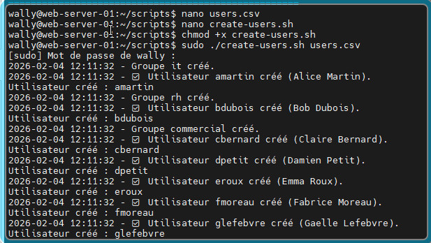

Générer un fichier récapitulatif `users_created.txt` avec login et mot de passe (cat users_created.txt):

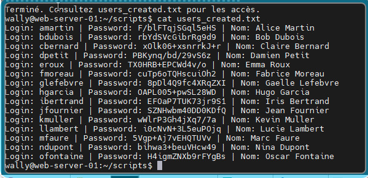

Logger toutes les opérations dans `/var/log/user-creation.log`

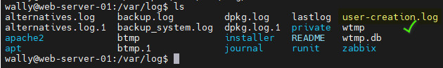

```
# Vérification existence
            if id "$username" &>/dev/null; then
                echo -n "❓ Confirmer la suppression de $username ($fullname) ? [o/N] : "
                read -r confirmation < /dev/tty # Lecture depuis le terminal (important dans une boucle)
                
                if [[ "$confirmation" =~ ^[oO]$ ]]; then
                    userdel -r "$username" 2>/dev/null
                    log_action "🗑️  Utilisateur SUPPRIMÉ : $username"
```


---

## Partie 4 : Nettoyeur de système automatique

### Contexte
Les serveurs accumulent des fichiers temporaires et des logs qui consomment de l'espace disque. Vous devez créer un outil de nettoyage automatique.

### Objectif
Créer un script `cleanup.sh` qui nettoie intelligemment le système.

### Travail à réaliser

**4.1** - Créez un script qui :
- Affiche l'espace disque disponible avant le nettoyage
- Supprime les fichiers dans `/tmp` plus vieux que 7 jours
- Supprime les logs compressés (`.gz`) dans `/var/log` plus vieux que 30 jours
- Vide la corbeille des utilisateurs
- Nettoie le cache APT (`apt clean`)
- Affiche l'espace disque récupéré

**4.2** - Ajoutez un mode sécurisé :
- Par défaut, le script affiche ce qui sera supprimé sans rien supprimer (mode dry-run)
- Option `--force` ou `-f` pour effectuer réellement les suppressions
- Demander confirmation avant toute suppression en mode force

**4.3** - Améliorez avec :
- Un rapport détaillé de ce qui a été nettoyé

- Des statistiques par catégorie (tmp, logs, cache, etc.)

- Un fichier de log `/var/log/cleanup.log`

- Option pour choisir l'âge des fichiers à supprimer (paramètre en jours)

  ```
  #!/bin/bash
  
  # ==============================================================================
  # CONFIGURATION
  # ==============================================================================
  LOG_FILE="/var/log/cleanup.log"
  TMP_AGE=${2:-7}      # 7 jours par défaut ou argument
  LOG_AGE=${3:-30}     # 30 jours par défaut ou argument
  FORCE=false
  
  # Couleurs
  GREEN='\033[0;32m'
  YELLOW='\033[0;33m'
  RED='\033[0;31m'
  NC='\033[0m'
  
  # Vérification root
  if [ "$EUID" -ne 0 ]; then
      echo -e "${RED}❌ Erreur : sudo requis pour nettoyer /var/log et APT.${NC}"
      exit 1
  fi
  
  # Gestion de l'option --force
  if [[ "$1" == "--force" || "$1" == "-f" ]]; then
      echo -e "${RED}⚠️  ATTENTION : Le mode suppression réelle est activé.${NC}"
      read -p "Confirmer le nettoyage ? [o/N] : " confirm
      [[ "$confirm" =~ ^[oO]$ ]] && FORCE=true || exit 1
  fi
  
  # Fonction de log
  log_action() {
      echo "$(date '+%Y-%m-%d %H:%M:%S') - $1" | sudo tee -a "$LOG_FILE"
  }
  
  # --- 1. ÉTAT INITIAL ---
  DISK_BEFORE=$(df / | awk 'NR==2 {print $3}')
  echo -e "${YELLOW}Espace utilisé avant nettoyage : $(df -h / | awk 'NR==2 {print $3}')${NC}"
  
  echo -e "\n--- Début du nettoyage ---"
  [ "$FORCE" = false ] && echo -e "${YELLOW}(MODE SIMULATION - Aucun fichier ne sera supprimé)${NC}\n"
  
  # --- 2. NETTOYAGE /TMP ---
  echo -e "${GREEN}[1/4] Nettoyage /tmp (plus de $TMP_AGE jours)${NC}"
  FILES_TMP=$(find /tmp -type f -mtime +$TMP_AGE)
  SIZE_TMP=$(find /tmp -type f -mtime +$TMP_AGE -exec du -cb {} + | grep total$ | awk '{print $1}')
  if [ "$FORCE" = true ]; then
      find /tmp -type f -mtime +$TMP_AGE -delete
      log_action "Nettoyage /tmp : ${SIZE_TMP:-0} octets libérés."
  else
      echo "$FILES_TMP" | head -n 5
      echo "... (Taille estimée : $(numfmt --to=iec ${SIZE_TMP:-0}))"
  fi
  
  # --- 3. NETTOYAGE LOGS ---
  echo -e "\n${GREEN}[2/4] Nettoyage logs compressés (plus de $LOG_AGE jours)${NC}"
  FILES_LOG=$(find /var/log -name "*.gz" -mtime +$LOG_AGE)
  SIZE_LOG=$(find /var/log -name "*.gz" -mtime +$LOG_AGE -exec du -cb {} + | grep total$ | awk '{print $1}')
  if [ "$FORCE" = true ]; then
      find /var/log -name "*.gz" -mtime +$LOG_AGE -delete
      log_action "Nettoyage logs : ${SIZE_LOG:-0} octets libérés."
  else
      echo "$FILES_LOG" | head -n 5
      echo "... (Taille estimée : $(numfmt --to=iec ${SIZE_LOG:-0}))"
  fi
  
  # --- 4. CACHE APT ---
  echo -e "\n${GREEN}[3/4] Cache APT${NC}"
  SIZE_APT=$(du -s /var/cache/apt/archives | awk '{print $1 * 1024}')
  if [ "$FORCE" = true ]; then
      apt-get clean
      log_action "Cache APT vidé."
  else
      echo "Action : apt-get clean (Taille : $(numfmt --to=iec $SIZE_APT))"
  fi
  
  # --- 5. CORBEILLES ---
  echo -e "\n${GREEN}[4/4] Corbeilles utilisateurs${NC}"
  if [ "$FORCE" = true ]; then
      rm -rf /home/*/.local/share/Trash/*
      rm -rf /root/.local/share/Trash/*
      log_action "Corbeilles vidées."
  else
      echo "Action : Vidage de /home/*/.local/share/Trash/*"
  fi
  
  # --- 6. BILAN ---
  if [ "$FORCE" = true ]; then
      DISK_AFTER=$(df / | awk 'NR==2 {print $3}')
      RECOVERED=$((DISK_BEFORE - DISK_AFTER))
      echo -e "\n${GREEN}✅ Nettoyage terminé !${NC}"
      echo -e "Espace récupéré : ${YELLOW}$(numfmt --to=iec --from=auto $((RECOVERED * 1024)))${NC}"
  else
      echo -e "\n${YELLOW}Simulation terminée. Utilisez -f pour appliquer.${NC}"
  fi
  ```

  ![(Atelier-Bash-Automatisation-administration-système.images/2026-02-04_141053.jpg)

  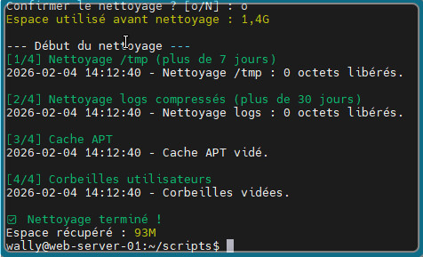

  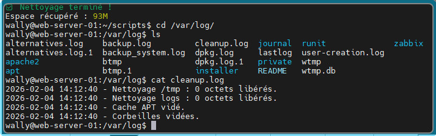

---

## Partie 5 : Vérificateur de santé des services

### Contexte
Plusieurs incidents ont été causés par des services arrêtés sans que personne ne s'en rende compte. Vous devez créer un outil de surveillance.

### Objectif
Créer un script `check-services.sh` qui vérifie l'état des services critiques.

### Travail à réaliser

**5.1** - Créez un fichier de configuration `services.conf` listant les services à surveiller :
```
ssh
cron
apache2
mysql
```

**5.2** - Créez le script qui :
- Lit la liste des services depuis le fichier de configuration
- Vérifie l'état de chaque service (actif/inactif)
- Affiche un rapport coloré :
  - Vert : service actif
  - Rouge : service inactif
- Compte le nombre de services actifs et inactifs

**5.3** - Ajoutez des fonctionnalités avancées :

- Option pour tenter de redémarrer automatiquement les services inactifs
- Envoi d'une alerte (simulation avec echo) si un service critique est down
- Vérification que le service est bien enabled au démarrage
- Création d'un rapport JSON avec tous les détails

**5.4** - Créez un mode monitoring :
- Option `--watch` qui vérifie en boucle toutes les 30 secondes

- Rafraîchissement de l'affichage à chaque itération

- Possibilité d'arrêter avec Ctrl+C

  ```
  #!/bin/bash
  
  # ==============================================================================
  # CONFIGURATION
  # ==============================================================================
  CONF_FILE="services.conf"
  JSON_REPORT="/var/log/services_status.json"
  LOG_FILE="/var/log/check-services.log"
  SLEEP_TIME=30
  
  # Couleurs
  GREEN='\033[0;32m'
  RED='\033[0;31m'
  YELLOW='\033[0;33m'
  BLUE='\033[0;34m'
  NC='\033[0m'
  
  # Vérification root (nécessaire pour redémarrer des services)
  if [ "$EUID" -ne 0 ]; then
      echo -e "${RED}❌ Erreur : Veuillez lancer ce script avec sudo.${NC}"
      exit 1
  fi
  
  # Vérification du fichier conf
  if [ ! -f "$CONF_FILE" ]; then
      echo "❌ Fichier $CONF_FILE introuvable."
      exit 1
  fi
  
  # --- FONCTIONS ---
  
  check_services() {
      local active_count=0
      local inactive_count=0
      local json="{\n  \"date\": \"$(date '+%Y-%m-%d %H:%M:%S')\",\n  \"services\": [\n"
  
      echo -e "${BLUE}--- RAPPORT DE SURVEILLANCE DES SERVICES ---${NC}"
      
      # Lecture du fichier ligne par ligne
      while read -r service || [ -n "$service" ]; do
          [ -z "$service" ] && continue # Ignorer les lignes vides
  
          # 1. Vérification état (ActiveState)
          STATUS=$(systemctl is-active "$service")
          
          # 2. Vérification activation au démarrage (UnitFileState)
          ENABLED=$(systemctl is-enabled "$service" 2>/dev/null || echo "unknown")
  
          if [ "$STATUS" == "active" ]; then
              echo -e "[$service] : ${GREEN}● ACTIF${NC} (Enabled: $ENABLED)"
              ((active_count++))
          else
              echo -e "[$service] : ${RED}○ INACTIF${NC} (Enabled: $ENABLED)"
              ((inactive_count++))
              
              # --- TENTATIVE DE REDÉMARRAGE (5.3) ---
              if [[ "$1" == "--restart" ]]; then
                  echo -e "${YELLOW}  ↪ Tentative de redémarrage...${NC}"
                  systemctl restart "$service"
                  sleep 1
                  if [ "$(systemctl is-active "$service")" == "active" ]; then
                      echo -e "${GREEN}    ✅ Redémarré avec succès.${NC}"
                  else
                      echo -e "${RED}    ❌ Échec du redémarrage.${NC}"
                  fi
              fi
  
              # --- ALERTE (Simulation) ---
              echo "ALERTE : Le service [$service] est arrêté sur $(hostname) !" >> "$LOG_FILE"
          fi
  
          # Construction du JSON
          json+="    { \"name\": \"$service\", \"status\": \"$STATUS\", \"enabled\": \"$ENABLED\" },\n"
  
      done < "$CONF_FILE"
  
      # Finalisation du JSON (on enlève la dernière virgule)
      json=$(echo -e "$json" | sed '$ s/,$//')
      json+="\n  ]\n}"
      echo -e "$json" > "$JSON_REPORT"
  
      echo -e "${BLUE}--------------------------------------------${NC}"
      echo -e "RÉSUMÉ : ${GREEN}$active_count Actifs${NC} | ${RED}$inactive_count Inactifs${NC}"
  }
  
  # --- LOGIQUE PRINCIPALE ---
  
  case "$1" in
      --watch)
          echo "Mode Monitoring activé (Ctrl+C pour arrêter)..."
          trap "echo -e '\nArrêt du monitoring.'; exit" SIGINT
          while true; do
              clear
              check_services
              echo -e "\n${BLUE}Prochaine vérification dans ${SLEEP_TIME}s...${NC}"
              sleep "$SLEEP_TIME"
          done
          ;;
      --restart)
          check_services "--restart"
          ;;
      *)
          check_services
          ;;
  esac
  ```

  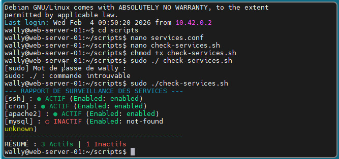

  
      #!/bin/bash
      
      # ==============================================================================
      # CONFIGURATION
      # ==============================================================================
      CONF_FILE="services.conf"
      JSON_REPORT="/var/log/services_status.json"
      LOG_FILE="/var/log/check-services.log"
      SLEEP_TIME=30
      
      # Couleurs pour le rapport
      GREEN='\033[0;32m'
      RED='\033[0;31m'
      YELLOW='\033[0;33m'
      BLUE='\033[0;34m'
      NC='\033[0m'
      
      # Vérification des privilèges
      if [ "$EUID" -ne 0 ]; then
          echo -e "${RED}❌ Erreur : Ce script nécessite sudo pour gérer les services.${NC}"
          exit 1
      fi
      
      if [ ! -f "$CONF_FILE" ]; then
          echo "❌ Erreur : Fichier de configuration $CONF_FILE introuvable."
          exit 1
      fi
      
      # --- FONCTIONS ---
      
      generate_json_item() {
          # $1: nom, $2: status, $3: enabled
          echo -e "    { \"name\": \"$1\", \"status\": \"$2\", \"enabled\": \"$3\" }"
      }
      
      check_logic() {
          local restart_mode=$1
          local active_count=0
          local inactive_count=0
          local json_content=""
          
          echo -e "${BLUE}=== RAPPORT SERVICES - $(date '+%H:%M:%S') ===${NC}"
          printf "%-15s | %-10s | %-10s\n" "SERVICE" "STATUT" "AUTO-START"
          echo "----------------------------------------------------"
      
          while read -r service || [ -n "$service" ]; do
              [ -z "$service" ] && continue
      
              # Récupération des états systemd
              STATUS=$(systemctl is-active "$service")
              ENABLED=$(systemctl is-enabled "$service" 2>/dev/null || echo "N/A")
      
              # Affichage coloré et Alertes
              if [ "$STATUS" == "active" ]; then
                  COLOR=$GREEN
                  ((active_count++))
              else
                  COLOR=$RED
                  ((inactive_count++))
                  # Alerte simulée (5.3)
                  echo "⚠️ ALERTE : Le service $service est DOWN sur $(hostname)" >> "$LOG_FILE"
                  
                  # Tentative de redémarrage (5.3)
                  if [ "$restart_mode" == "true" ]; then
                      echo -e "${YELLOW}[!] Redémarrage de $service...${NC}"
                      systemctl restart "$service"
                      sleep 1
                      STATUS=$(systemctl is-active "$service")
                  fi
              fi
      
              printf "%-15s | ${COLOR}%-10s${NC} | %-10s\n" "$service" "$STATUS" "$ENABLED"
              
              # Préparation du JSON
              item=$(generate_json_item "$service" "$STATUS" "$ENABLED")
              json_content="${json_content}${item},"
      
          done < "$CONF_FILE"
      
          # Export JSON (5.3)
          echo -e "{\n  \"timestamp\": \"$(date -Iseconds)\",\n  \"services\": [\n${json_content%,}\n  ]\n}" > "$JSON_REPORT"
      
          echo "----------------------------------------------------"
          echo -e "BILAN : ${GREEN}$active_count Actifs${NC} | ${RED}$inactive_count Inactifs${NC}"
      }
      
      # --- LOGIQUE DE LANCEMENT ---
      
      case "$1" in
          --watch)
              # Mode Monitoring (5.4)
              trap "echo -e '\n${BLUE}Arrêt du monitoring.${NC}'; exit" SIGINT
              while true; do
                  clear
                  check_logic "true" # On active le restart auto en mode watch
                  echo -e "\nRafraîchissement dans ${SLEEP_TIME}s (Ctrl+C pour quitter)"
                  sleep "$SLEEP_TIME"
              done
              ;;
          --restart)
              check_logic "true"
              ;;
          *)
              check_logic "false"
              ;;
      esac
  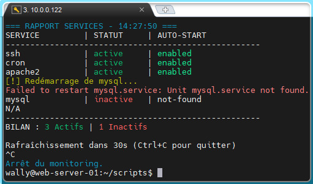

---

## Partie 6 : Outil centralisé de gestion

### Objectif
Créer un menu interactif qui regroupe tous vos outils.

### Travail à réaliser

**6.1** - Créez un script `sysadmin-tools.sh` avec un menu :
```
=================================
    OUTILS D'ADMINISTRATION
=================================
1. Sauvegarde de répertoire
2. Monitoring système
3. Créer des utilisateurs
4. Nettoyage système
5. Vérifier les services
6. Quitter
=================================
Votre choix :
```

**6.2** - Implémentez chaque option du menu :
- Chaque option lance le script correspondant
- Gestion des arguments nécessaires (demander à l'utilisateur)
- Retour au menu après l'exécution de chaque script
- Gestion des erreurs (choix invalide, script manquant, etc.)

**6.3** - Améliorations finales :
- Vérifier que tous les scripts existent avant de lancer le menu

- Afficher un en-tête avec la version et l'auteur

- Logger l'utilisation de l'outil (qui a lancé quoi et quand)

- Ajouter une option "Aide" qui affiche la documentation de chaque outil

  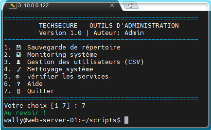

  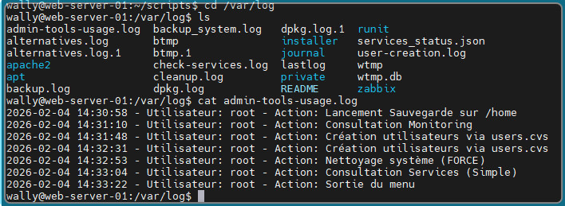

---

## Livrables attendus

À la fin de l'atelier, vous devez avoir créé :

### Scripts
- `backup.sh` - Script de sauvegarde
- `monitor.sh` - Moniteur de ressources
- `create-users.sh` - Gestionnaire d'utilisateurs
- `cleanup.sh` - Nettoyeur de système
- `check-services.sh` - Vérificateur de services
- `sysadmin-tools.sh` - Menu centralisé

### Fichiers de configuration
- `users.csv` - Exemple de fichier utilisateurs
- `services.conf` - Liste des services à surveiller

### Documentation
- `README.md` - Documentation complète de tous vos outils
- Instructions d'installation
- Exemples d'utilisation
- Liste des dépendances

---

## Bonnes pratiques à respecter

### Structure des scripts

Chaque script doit contenir :
- Un shebang `#!/bin/bash` en première ligne
- Des commentaires expliquant le but du script
- Une section d'aide accessible avec `-h` ou `--help`
- Une validation des arguments et des permissions
- Une gestion des erreurs propre
- Des messages clairs pour l'utilisateur

### Gestion des erreurs

- Vérifier les codes de retour des commandes importantes
- Afficher des messages d'erreur explicites
- Arrêter le script en cas d'erreur critique avec `exit 1`
- Logger les erreurs dans un fichier de log

### Sécurité

- Ne jamais stocker de mots de passe en clair dans les scripts
- Valider toutes les entrées utilisateur
- Utiliser des chemins absolus pour les commandes critiques
- Vérifier les permissions avant d'exécuter des actions sensibles

### Lisibilité

- Utiliser des noms de variables explicites
- Indenter correctement le code
- Commenter les parties complexes
- Utiliser des fonctions pour éviter la duplication de code

---

## Ressources utiles

### Commandes importantes

- `tar` - Créer des archives
- `df`, `du` - Espace disque
- `free` - Mémoire
- `top`, `ps` - Processus
- `systemctl` - Gestion des services
- `useradd`, `groupadd` - Gestion des utilisateurs
- `find` - Recherche de fichiers
- `awk`, `sed`, `cut` - Manipulation de texte

### Documentation

- `man bash` - Manuel Bash complet
- `help` - Aide sur les commandes intégrées
- https://fr.wikibooks.org/wiki/Programmation_Bash

---

## Conseils pour réussir

**Organisation** :
- Créez un dossier `~/scripts/` pour tous vos scripts
- Créez un dossier `~/scripts/logs/` pour les fichiers de log
- Testez chaque script au fur et à mesure

**Développement** :
- Commencez simple, puis ajoutez des fonctionnalités
- Testez après chaque ajout de fonctionnalité
- Utilisez `set -x` pour déboguer (affiche les commandes exécutées)

**Permissions** :
- N'oubliez pas `chmod +x` pour rendre vos scripts exécutables
- Certaines opérations nécessitent `sudo` (création d'utilisateurs, services, etc.)

**Tests** :
- Testez vos scripts dans un environnement de test
- Testez les cas d'erreur (fichier inexistant, permissions insuffisantes, etc.)
- Vérifiez que vos scripts fonctionnent même avec des entrées inattendues

