# Atelier : IDS/IPS & SIEM


## **Étape 1.3 : Vérifier la connectivité**


Quelle que soit l'option choisie (CT ou VM), vérifiez la connectivité :

```
ping 10.0.0.1      # Gateway pfSense
ping 8.8.8.8       # Internet (via pfSense)
```


Attention !

Si le ping vers Internet ne fonctionne pas, vérifiez que pfSense autorise le trafic sortant depuis le LAN et que le NAT est actif sur l'interface WAN. C'est nécessaire pour télécharger les paquets Suricata.

⚠️ **Ne testez pas avec `ping 10.0.0.10` (Win11)** à ce stade : par défaut, le pare-feu Windows bloque les requêtes ICMP (ping). Un timeout ne signifie pas que le réseau ne fonctionne pas ! Si vous voulez vérifier, vous pouvez autoriser le ping côté Windows dans les règles du pare-feu, ou simplement tester avec la gateway pfSense qui répond toujours.

## **Étape 1.4 : Installer Suricata**


```
apt update && apt upgrade -y
apt install -y suricata suricata-update
```


Vérifiez l'installation :

```
suricata --build-info | head -5
```

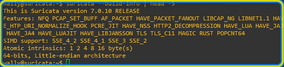

## **Étape 1.5 : Configurer Suricata**


Éditez le fichier de configuration principal :

```
nano /etc/suricata/suricata.yaml
```


**1. Définir le réseau à protéger (HOME_NET) :**

Cherchez la section `vars` → `address-groups` :

```
vars:
  address-groups:
    HOME_NET: "[10.0.0.0/16]"
    EXTERNAL_NET: "!$HOME_NET"
```


💡 HOME_NET doit correspondre à votre réseau LAN. Suricata utilise cette variable pour savoir quel trafic est "interne" et quel trafic est "externe". Si HOME_NET est mal défini, les règles ne se déclencheront pas correctement.

**2. Définir l'interface d'écoute :**

Cherchez la section `af-packet` :

```
af-packet:
  - interface: eth0
    cluster-id: 99
    cluster-type: cluster_flow
    defrag: yes
```

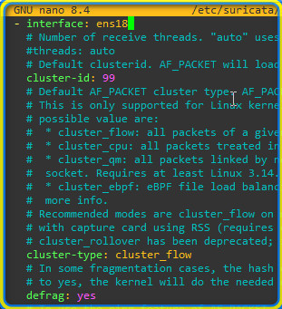

💡 Vérifiez le nom de votre interface avec `ip a`. Dans un CT c'est généralement `eth0`, dans une VM Proxmox avec VirtIO c'est `ens18`. Adaptez en conséquence.

**3. Activer les détails dans les logs EVE JSON :**

Cherchez la section `outputs` → `eve-log` → `types` → `alert`. Par défaut, les options intéressantes sont commentées :

```
- alert:
    # payload: yes             # enable dumping payload in Base64
    # payload-printable: yes   # enable dumping payload in printable (lossy) format
    # packet: yes              # enable dumping of packet (without stream segments)
```


Décommentez les lignes `payload`, `payload-printable` et `packet` pour obtenir :

```
- alert:
    payload: yes
    payload-printable: yes
    packet: yes
    tagged-packets: yes
```

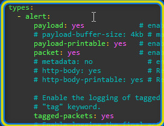

Attention ! Vous devez respecter l'indentation ! YAML est très sensible à l'indentation. Les options `payload`, `payload-printable` et `packet` doivent être au même niveau d'indentation que `tagged-packets` (4 espaces).

💡 **Pourquoi décommenter ces lignes ?** Par défaut, Suricata ne log que le minimum (signature, IP, port). En activant `payload` et `payload-printable`, vous aurez le contenu du paquet qui a déclenché l'alerte — très utile pour investiguer dans Wazuh. Le fichier `eve.json` est le format de log structuré que Wazuh lira pour récupérer les alertes.

💡 Vérifiez aussi que `eve-log` est bien activé (`enabled: yes`) plus haut dans la section. C'est normalement le cas par défaut, mais mieux vaut vérifier :

```
outputs:
  - eve-log:
      enabled: yes
      filetype: regular
      filename: eve.json
```

## **Étape 1.6 : Télécharger les règles**


Suricata utilise des jeux de règles communautaires. Le plus courant est **Emerging Threats Open** :

```
suricata-update
```

Cette commande télécharge et installe les règles dans `/var/lib/suricata/rules/suricata.rules`.

Vérifiez le nombre de règles chargées :

```
grep -c "^alert" /var/lib/suricata/rules/suricata.rules
```

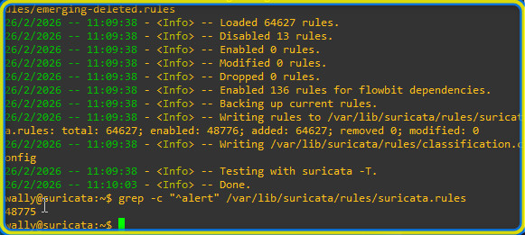

## **Étape 1.7 : Démarrer Suricata**


```
systemctl enable suricata
systemctl start suricata
systemctl status suricata
```


Vérifiez les logs de démarrage :

```
tail -f /var/log/suricata/suricata.log
```


Attendez de voir la ligne :


Cela signifie que Suricata écoute activement le trafic sur l'interface réseau.

Attention !

Au premier démarrage, Suricata peut mettre 30 secondes à 2 minutes pour charger toutes les règles. Soyez patient et surveillez les logs. Si Suricata ne démarre pas, vérifiez la syntaxe de votre fichier yaml avec :

```
suricata -T -c /etc/suricata/suricata.yaml
```

# Étape 2 : Générer un événement de test


## **Étape 2.1 : Déclencher une règle connue**


Depuis la VM/CT Suricata, exécutez :

```
apt install curl -y
curl http://testmynids.org/uid/index.html
```

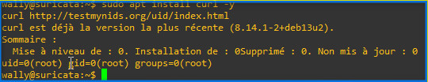

Cette URL retourne volontairement la chaîne `uid=0(root)` dans sa réponse HTTP, ce qui déclenche la règle **ET ATTACK_RESPONSE** (SID 2100498).

L'alerte pour information ressemble a ça dans les régles Suricata :

```
alert ip any any -> any any (msg:"GPL ATTACK_RESPONSE id check returned root"; content:"uid=0|28|root|29|"; classtype:bad-unknown; sid:2100498; rev:7;)
```


## **Étape 2.2 : Vérifier l'alerte dans les logs**


Installez `jq` pour lire le JSON facilement :

```
apt install -y jq
```


Puis vérifiez les alertes :

```
cat /var/log/suricata/eve.json | jq 'select(.event_type=="alert")'
```


Vous devriez voir quelque chose comme :

```
{
  "timestamp": "2025-XX-XXTXX:XX:XX.XXXXXX+0000",
  "event_type": "alert",
  "src_ip": "10.0.0.50",
  "dest_ip": "XXX.XXX.XXX.XXX",
  "alert": {
    "action": "allowed",
    "signature_id": 2100498,
    "signature": "GPL ATTACK_RESPONSE id check returned root",
    "category": "Potentially Bad Traffic",
    "severity": 2
  }
}
```

Vous pouvez aussi consulter le log simplifié :

```
cat /var/log/suricata/fast.log
```


> Si vous voyez cette alerte, Suricata fonctionne correctement ! 🎉

> Il a détecté le contenu `uid=0(root)` dans la réponse HTTP et a déclenché la règle correspondante.

## **Étape 2.3 : Autres tests possibles**


| Test                 | Commande                                   | Règle déclenchée         |
| -------------------- | ------------------------------------------ | ------------------------ |
| Scan de ports        | `nmap -sS 10.0.0.50` (depuis une autre VM) | ET SCAN / GPL SCAN       |
| Requête DNS suspecte | `dig @8.8.8.8 testmynids.org`              | Possible ET DNS          |
| Ping ICMP            | `ping -c 5 10.0.0.50`                      | ICMP rules (si activées) |

💡 Le test `curl testmynids.org` est le plus fiable pour un premier test car la règle est présente dans quasiment tous les jeux de règles ET.

# Étape 3 : Installer Wazuh (SIEM)


## **Étape 3.1 : Un SIEM c'est quoi ?**


Un **SIEM** (Security Information and Event Management) est une plateforme qui collecte les logs de multiples sources (IDS, pare-feu, serveurs...), les normalise, les corrèle pour détecter des attaques, et alerte les analystes via un tableau de bord centralisé.

**Wazuh** est un SIEM open-source composé de trois briques :

| Composant           | Rôle                                                         | Port              |
| ------------------- | ------------------------------------------------------------ | ----------------- |
| **Wazuh Manager**   | Reçoit les logs des agents, applique les règles de détection | 1514, 1515, 55000 |
| **Wazuh Indexer**   | Stocke et indexe les événements (basé sur OpenSearch)        | 9200              |
| **Wazuh Dashboard** | Interface web de visualisation et d'investigation            | 443               |

```
       Sources                          SIEM Wazuh
    ┌──────────┐                   ┌──────────────────┐
    │ Suricata │──── eve.json ────>│  Wazuh Manager   │
    │  (IDS)   │   via agent       │        │         │
    └──────────┘                   │        ▼         │
                                   │  Wazuh Indexer   │
    ┌──────────┐                   │        │         │
    │  Win11   │──── syslog ──────>│        ▼         │
    │ (cible)  │   via agent       │ Wazuh Dashboard  │
    └──────────┘                   └──────────────────┘
```


## **Étape 3.2 : Créer la VM Wazuh**


Dans Proxmox → **Créer VM** :

| Onglet  | Champ     | Valeur                             |
| ------- | --------- | ---------------------------------- |
| Général | VM ID     | 401 (ou autre libre)               |
| Général | Nom       | Wazuh                              |
| OS      | ISO Image | debian-13 (ou ubuntu-24.04 server) |
| Système | Type      | Linux                              |
| Disque  | Taille    | 50 Go                              |
| CPU     | Cœurs     | 2 (idéalement 4)                   |
| Mémoire | RAM       | **8192 Mo (8 Go)**                 |
| Réseau  | Bridge    | **vmbr2**                          |
| Réseau  | Modèle    | VirtIO                             |

Attention !

**8 Go de RAM est le minimum recommandé** pour une installation tout-en-un (Manager + Indexer + Dashboard). L'Indexer (OpenSearch) est très gourmand. En dessous de 4 Go, l'installation échouera.

⚠️ **Wazuh nécessite une VM, pas un CT.** Les composants Wazuh (notamment l'Indexer basé sur OpenSearch) ont besoin d'un accès système complet et de paramètres kernel spécifiques (`vm.max_map_count`) qui ne sont pas disponibles dans un conteneur LXC.

Cliquez **Terminer** → **Démarrez** → installez le système.

## **Étape 3.3 : Configurer le réseau**


```
nano /etc/network/interfaces
```


```
auto ens18
iface ens18 inet static
    address 10.0.0.40
    netmask 255.255.0.0
    gateway 10.0.0.1
    dns-nameservers 8.8.8.8
```


```
systemctl restart networking
```


Vérification :

```
ping 10.0.0.1       # Gateway
ping 10.0.0.50      # Suricata
ping 8.8.8.8        # Internet
```


## **Étape 3.4 : Installer Wazuh (tout-en-un)**


L'installation tout-en-un déploie les trois composants sur la même VM :

```
su -
curl -sO https://packages.wazuh.com/4.14/wazuh-install.sh
sudo bash ./wazuh-install.sh -a
```

Attention !

L'installation prend entre **5 et 15 minutes** selon les performances de votre serveur. Ne l'interrompez pas !

À la fin de l'installation, le script affiche les **identifiants par défaut** :

```
INFO: --- Summary ---
INFO: You can access the web interface https://<wazuh-dashboard-ip>:443
    User: admin
    Password: <mot_de_passe_généré>
```

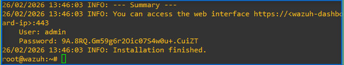


⚠️ **NOTEZ CE MOT DE PASSE.** Il est généré aléatoirement et ne sera plus affiché. Si vous le perdez :

```
tar -xvf /home/wazuh-install-files.tar wazuh-install-files/wazuh-passwords.txt
cat wazuh-install-files/wazuh-passwords.txt
```


## **Étape 3.5 : Vérifier les services**


```
systemctl status wazuh-manager
systemctl status wazuh-indexer
systemctl status wazuh-dashboard
```


Les trois services doivent être **active (running)**.

## **Étape 3.6 : Accéder à l'interface web**


Depuis Win11 (ou toute machine du LAN), ouvrez un navigateur :

```
https://10.0.0.40
```


- **Utilisateur** : admin
- **Mot de passe** : celui noté à l'étape 3.4

💡 Le certificat SSL est auto-signé. Votre navigateur affichera un avertissement de sécurité. Cliquez **Avancé** → **Accepter le risque** pour continuer.

Vous devez voir le tableau de bord Wazuh avec le menu à gauche (Security Operations, etc.). L'onglet **Agents Management** doit être vide pour l'instant (aucun agent connecté).

# Étape 4 : Connecter les sources


## **Étape 4.1 : Installer l'agent Wazuh sur Suricata**


L'agent Wazuh est un programme léger qui collecte les logs locaux et les envoie au Manager. Depuis la machine Suricata (10.0.0.50) :

```
apt install gpg -y

curl -s https://packages.wazuh.com/key/GPG-KEY-WAZUH | gpg --no-default-keyring --keyring gnupg-ring:/usr/share/keyrings/wazuh.gpg --import && chmod 644 /usr/share/keyrings/wazuh.gpg

echo "deb [signed-by=/usr/share/keyrings/wazuh.gpg] https://packages.wazuh.com/4.x/apt/ stable main" | tee /etc/apt/sources.list.d/wazuh.list

apt update

WAZUH_MANAGER="10.0.0.40" apt install -y wazuh-agent
```

💡 La variable `WAZUH_MANAGER="10.0.0.40"` indique à l'agent l'adresse du serveur Wazuh. Sans cette variable, l'agent ne saura pas où envoyer les logs.

Activez et démarrez l'agent :

```
systemctl daemon-reload
systemctl enable wazuh-agent
systemctl start wazuh-agent
systemctl status wazuh-agent
```

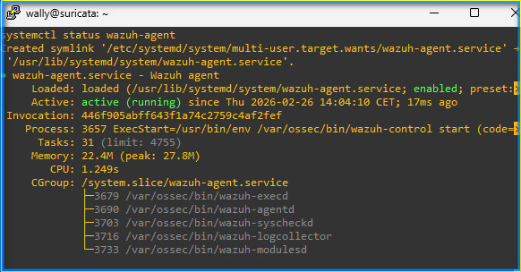

## **Étape 4.2 : Vérifier la connexion de l'agent**


**Côté Wazuh Manager** (10.0.0.40) :

```
/var/ossec/bin/manage_agents -l
```


Vous devez voir l'agent Suricata avec le statut **Active**.

**Côté Dashboard** : Allez dans **Agents Management** → vous devez voir l'agent avec son nom, son IP (10.0.0.50) et le statut **Active** (point vert).

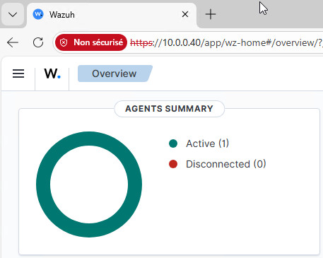

## **Étape 4.3 : Configurer la collecte des logs Suricata**


Par défaut, l'agent Wazuh collecte les logs système (auth.log, syslog…). Il faut lui dire de lire aussi le fichier **eve.json** de Suricata.

Sur la machine Suricata, éditez la configuration de l'agent :

```
nano /var/ossec/etc/ossec.conf
```


Ajoutez le bloc suivant **dans la section `<ossec_config>`**, avant la balise fermante `</ossec_config>` :

```
<!-- Collecte des alertes Suricata -->
<localfile>
  <log_format>json</log_format>
  <location>/var/log/suricata/eve.json</location>
</localfile>
```

Voici les points importants à vérifier :

- Le `log_format` doit être **json** (pas syslog). Wazuh sait parser nativement le format EVE JSON de Suricata.
- Le chemin doit correspondre exactement au fichier configuré dans `suricata.yaml`.
- L'utilisateur `wazuh` (ou `ossec`) doit avoir les droits de lecture sur le fichier : `chmod 644 /var/log/suricata/eve.json`

Redémarrez l'agent pour prendre en compte la modification :

```
systemctl restart wazuh-agent
```


## **Étape 4.4 : Vérifier la réception des événements**


Retournez sur le **Dashboard Wazuh** ([https://10.0.0.40](https://10.0.0.40/)) :

1. Allez dans **Explore => Discover**
2. Sélectionnez une plage de temps récente (ex : « Last 15 minutes »).

1. Vous devez voir des événements apparaître avec `agent.name: Suricata`.

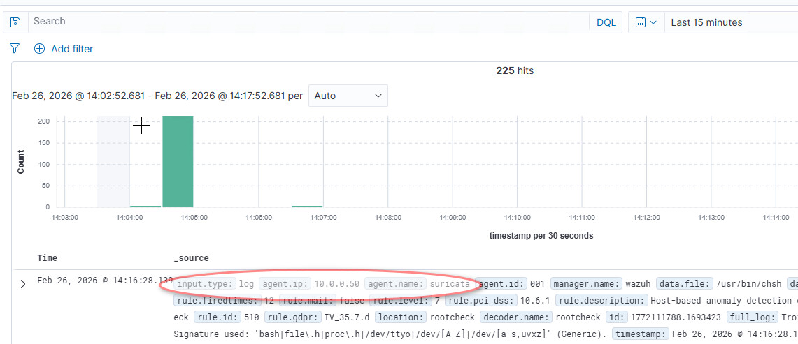

💡 Si vous ne voyez rien, générez du trafic sur la machine Suricata (`curl testmynids.org`, `apt update`, navigation web…) et attendez 1-2 minutes que les logs soient transmis.

## **Étape 4.5 : (Optionnel) Installer un agent sur Win11**


Pour enrichir le SIEM avec les logs de la VM cible :

1. Depuis Win11, téléchargez l'agent Wazuh Windows : `https://packages.wazuh.com/4.x/windows/wazuh-agent-4.13.3-1.msi`
2. Installez avec l'adresse du manager :

```
wazuh-agent-4.13.3-1.msi /q WAZUH_MANAGER="10.0.0.40"
```


1. Démarrez le service :

```
NET START Wazuh
```


Verifiez aussi dans les services Windows que le service Wazuh est bien démarré.


Vous verrez alors deux agents dans le Dashboard : Suricata et Win11.

# Étape 5 : Valider la détection de bout en bout


## **Étape 5.1 : Provoquer un événement de test**


Depuis la machine Suricata :

```
curl http://testmynids.org/uid/index.html
```


## **Étape 5.2 : Vérifier l'alerte locale (Suricata)**


```
tail -5 /var/log/suricata/fast.log
```


Vous devez voir l'alerte `GPL ATTACK_RESPONSE id check returned root`.

## **Étape 5.3 : Vérifier l'alerte dans Wazuh**


Dans le **Dashboard Wazuh** ([https://10.0.0.40](https://10.0.0.40/)) :

1. Allez dans **Discover**.
2. Dans la barre de recherche, filtrez par : `rule.groups: suricata`
3. Ou recherchez : `data.alert.signature_id: 2100498`
4. Vous devez voir l'alerte avec tous les détails :

| Champ Wazuh         | Valeur attendue                                              |
| ------------------- | ------------------------------------------------------------ |
| rule.description    | Suricata: Alert - GPL ATTACK_RESPONSE id check returned root |
| data.alert.severity | 2                                                            |
| data.src_ip         | 10.0.0.50 (ou l'IP source)                                   |
| agent.name          | Suricata                                                     |

> Si vous voyez cette alerte dans Wazuh, votre chaîne de détection est complète ! 🎉

> Le flux complet fonctionne : Trafic réseau → Suricata détecte → eve.json → Agent Wazuh → Manager → Indexer → Dashboard

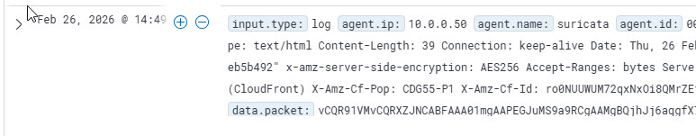

# Bonus : Règle personnalisée et corrélation


### **B.1 : Créer une règle Suricata personnalisée**


Créez un fichier de règles custom sur la machine Suricata :

```
nano /var/lib/suricata/rules/local.rules
```


Ajoutez une règle qui détecte un mot-clé spécifique dans le trafic HTTP :

```
alert http any any -> any any (msg:"CUSTOM - Mot secret detecte dans le trafic HTTP"; flow:established,to_server; content:"SuperSecret2025"; nocase; sid:1000001; rev:1; classtype:policy-violation;)
```


Voici un résumé de la règle :

- `alert http` : déclencher une alerte sur le trafic HTTP
- `any any -> any any` : quelle que soit la source et la destination
- `content:"SuperSecret2025"` : chercher cette chaîne dans le contenu
- `nocase` : insensible à la casse
- `sid:1000001` : identifiant unique (les SID custom commencent à 1000001)
- `classtype:policy-violation` : catégorie de l'alerte

### **B.2 : Activer la règle**


Éditez la configuration Suricata pour inclure le fichier de règles locales :

```
nano /etc/suricata/suricata.yaml
```


Dans la section `rule-files`, ajoutez :

```
rule-files:
  - suricata.rules
  - local.rules
```

Redémarrez Suricata :

```
systemctl restart suricata
```


Vérifiez que la règle est chargée :

```
cat /var/log/suricata/suricata.log
```


Depuis n'importe quelle machine du LAN, envoyez une requête contenant le mot-clé :

```
curl http://10.0.0.50/SuperSecret2025
```


💡 Même si le serveur web n'existe pas sur 10.0.0.50, Suricata analyse le trafic au niveau réseau et détectera le contenu `SuperSecret2025` dans la requête HTTP.

Si l'alerte ne se déclenche pas, essayez avec netcat pour simuler un échange :

Sur Suricata : `nc -l -p 8080`

Depuis une autre VM : `echo -e "GET /SuperSecret2025 HTTP/1.1\r\nHost: test\r\n\r\n" | nc 10.0.0.50 8080`

### **B.4 : Vérifier dans Suricata**


```
cat /var/log/suricata/eve.json | jq 'select(.alert.signature_id==1000001)'
```


Vous devriez voir :

```
{
  "alert": {
    "action": "allowed",
    "signature_id": 1000001,
    "signature": "CUSTOM - Mot secret detecte dans le trafic HTTP",
    "category": "Potential Corporate Privacy Violation",
    "severity": 3
  }
}
```

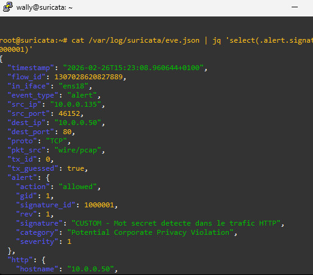

### **B.5 : Vérifier la corrélation dans Wazuh**


Dans le **Dashboard Wazuh** :

1. **Discover** → recherchez `data.alert.signature_id: 1000001`

2. L'alerte custom doit apparaître avec le message `CUSTOM - Mot secret detecte dans le trafic HTTP`

   

> Vous avez démontré la corrélation complète ! 🎉

> Une règle **personnalisée** dans Suricata détecte un pattern spécifique, l'alerte remonte automatiquement dans le **SIEM Wazuh**, et un analyste SOC peut voir, filtrer et investiguer cette alerte depuis le Dashboard centralisé.

# Dépannage


### Suricata ne démarre pas


| Vérification                           | Action                                             |
| -------------------------------------- | -------------------------------------------------- |
| Erreur de syntaxe dans suricata.yaml ? | `suricata -T -c /etc/suricata/suricata.yaml`       |
| L'interface existe-t-elle ?            | `ip a` → vérifiez le nom (eth0 en CT, ens18 en VM) |
| Permissions sur les logs ?             | `chown suricata:suricata /var/log/suricata/`       |
| Pas assez de RAM ?                     | `free -m` → minimum 1 Go libre                     |

### Suricata tourne mais aucune alerte


| Vérification                               | Action                                                    |
| ------------------------------------------ | --------------------------------------------------------- |
| HOME_NET est-il correct ?                  | Doit correspondre à votre réseau (10.0.0.0/16)            |
| Les règles sont-elles chargées ?           | `grep "rules loaded" /var/log/suricata/suricata.log`      |
| L'interface est-elle la bonne ?            | Vérifiez `af-packet: interface` dans suricata.yaml        |
| Le trafic passe-t-il par cette interface ? | `tcpdump -i eth0 -c 10` (ou ens18 en VM)                  |
| Le test est-il correct ?                   | `curl http://testmynids.org/uid/index.html` (pas HTTPS !) |
| (CT) Le mode promiscuous est-il activé ?   | Vérifiez la config LXC (voir étape 1.2)                   |

### Wazuh ne s'installe pas


| Vérification | Action | | --------------------------------- | ----------------------------------------- | --------- | | Pas assez de RAM ? | `free -m` → minimum 4 Go, idéalement 8 Go | | Pas assez de disque ? | `df -h` → minimum 20 Go libres | | Pas d'accès Internet ? | `curl -s https://packages.wazuh.com` | | Le port 443 est-il déjà utilisé ? | `ss -tlnp                                 | grep 443` |

### L'agent ne se connecte pas au Manager


| Vérification | Action | | ------------------------------------- | ---------------------------------------------------------- | -------------------------- | | Le Manager écoute-t-il ? | `ss -tlnp                                                  | grep 1514` sur la VM Wazuh | | L'adresse Manager est-elle correcte ? | Vérifiez `/var/ossec/etc/ossec.conf` → `<server><address>` | | Le pare-feu bloque-t-il ? | `nc -zv 10.0.0.40 1514` depuis l'agent | | L'agent est-il enregistré ? | `/var/ossec/bin/manage_agents -l` sur le Manager |

### Les alertes Suricata n'apparaissent pas dans Wazuh


| Vérification                          | Action                                                  |
| ------------------------------------- | ------------------------------------------------------- |
| Le bloc `<localfile>` est-il ajouté ? | Vérifiez `/var/ossec/etc/ossec.conf` sur l'agent        |
| Le chemin eve.json est-il correct ?   | `ls -la /var/log/suricata/eve.json`                     |
| L'agent peut-il lire le fichier ?     | `chmod 644 /var/log/suricata/eve.json`                  |
| L'agent a-t-il été redémarré ?        | `systemctl restart wazuh-agent`                         |
| Le format est-il `json` ?             | Vérifiez `<log_format>json</log_format>` (pas `syslog`) |