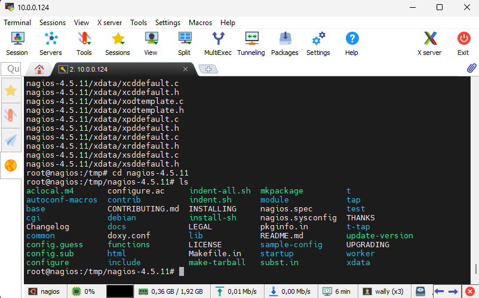
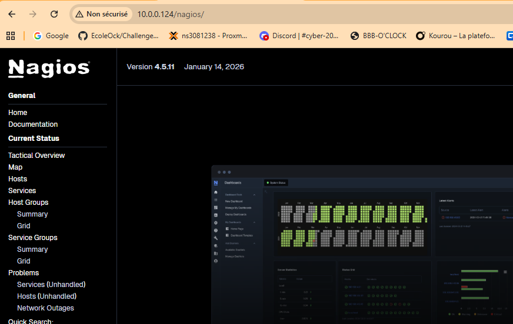
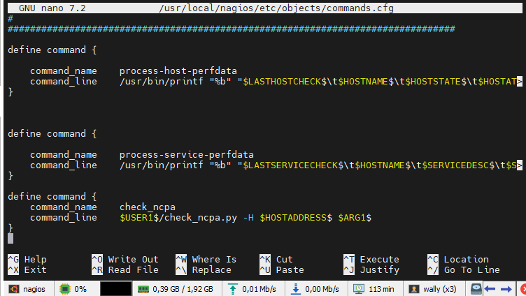
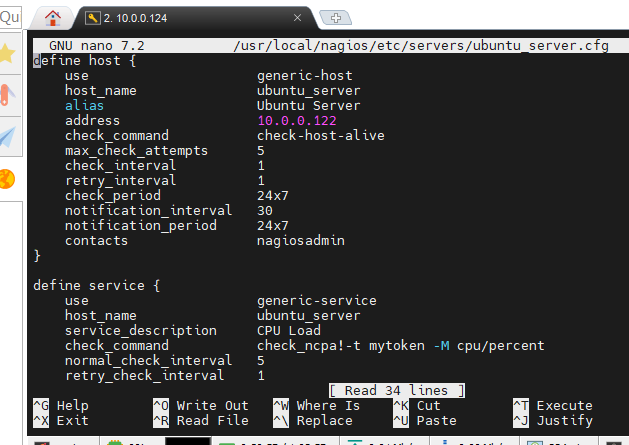

> # Atelier Nagios

**Eléments utilisés pour l'atelier :**

- Une VM avec Ubuntu 24.04 installé. **10.0.0.124/16**
- Une VM Windows Client. **10.0.0.120/16** 
- Une VM Debian (pour simuler un agent sur linux) **10.0.0.122/16**
- Un accès root ou des privilèges sur les machines.
- Une connexion internet pour télécharger les paquets nécessaires.

Nous allons simuler de l’activité sur les 2 VM à savoir la VM Windows Server et la VM Debian “Client”. Nous aurons également une VM/CT Ubuntu afin de faire l’installation de Nagios Core.

### Etape 1 : Installation du Nagios Core

#### **Étape 1.1 : Mise à jour de votre système**

Je m'assurer que mon système est à jour avant d'installer de nouveaux paquets, cela garantit que tous les paquets existants sont à jour,  commandes suivantes :

```
apt update
apt upgrade -y
```

#### **Étape 1.2 : Installation des dépendances**

Nagios Core nécessite plusieurs dépendances, y compris Apache, PHP, et des outils de compilation. Pour cela, je dois utiliser la commande qui suit :

```
apt install -y build-essential libgd-dev openssl libssl-dev unzip apache2 php libapache2-mod-php libperl-dev libpng-dev
```

Voici un résumé des paquets installés :

- `build-essential` : Contient les outils nécessaires pour la compilation.
- `libgd-dev` et `libpng-dev` : Bibliothèques graphiques nécessaires pour les graphiques dans Nagios.
- `openssl` et `libssl-dev` : Bibliothèques de sécurité pour la communication.
- `apache2` : Serveur web nécessaire pour afficher l'interface web de Nagios.
- `php` et `libapache2-mod-php` : PHP pour la gestion des scripts web.
- `libperl-dev` : Nécessaire pour le support des plugins Nagios en Perl.

#### Étape 1.3 : Téléchargement de Nagios Core 4.5.11

Pour continuer l'installation, je télécharge l'archive source de Nagios Core depuis le site officiel. Cette archive contient tous les fichiers nécessaires pour compiler et installer le logiciel sur le système :

```
cd /tmp
wget https://go.nagios.org/get-core/4-5-11
```




#### **Étape 1.4 : Décompression de l'archive et installation de Nagios Core**

Une fois l'archive téléchargée, je décompresse et accède au dossier :

```
tar -xvzf 4-5-11
cd nagios-4.5.11
```

Maintenant je crée un utilisateur nagios et l'ajoute au groupe nagcmd. Ces commandes permettent de créer les utilisateurs et groupes nécessaires pour que Nagios fonctionne correctement avec les bonnes permissions.

```
useradd nagios
groupadd nagcmd
usermod -G nagcmd nagios
usermod -G nagcmd www-data
```

Je compile et installe Nagios Core en exécutant les commandes suivantes :

```
./configure --with-httpd-conf=/etc/apache2/sites-available --with-command-group=nagcmd
```


Je lance l’installation avec la commande :

```
make all
```

Je remarque une série d’erreurs, mais à la fon du prompt on a la réponse **"Enjoy"**


Une fois la compilation terminée, je dois exécuter certaines commandes afin d'installer Nagios et  ses fichiers de configuration.

```
make install-groups-users

make install
make install-init
make install-daemoninit

make install-config
make install-commandmode
```

#### Étape 1.5 : Installation de l'interface web de Nagios

L'interface web de Nagios est un outil essentiel qui offre une vue d'ensemble détaillée et en temps réel de l'état de vos systèmes supervisés.

Cette interface permet de surveiller facilement les performances, les alertes et les métriques de tous les équipements et services depuis un tableau de bord centralisé, (Monitoring ET un outil de supervision)

Pour l'installer, j'exécute les commandes suivantes toujours dans le même répertoire :

```
make install-webconf
```


Et pour terminer cette étape, j'active le module Apache nécessaire, ainsi que le site et redémarre Apache :

```
a2enmod cgi
a2ensite nagios
systemctl restart apache2
```

#### Étape 1.6 : Création d'un utilisateur Nagios pour l'accès à l'interface web

Pour accéder à l'interface web, je crée un utilisateur et je configure un mot de passe avec la commande :

```
htpasswd -c /usr/local/nagios/etc/htpasswd.users nagiosadmin
```

Je rentrer et confirme un mot de passe pour l’utilisateur "nagiosadmin" qui sera l'utilisateur pour se connecter à l'interface web de Nagios.

#### Étape 1.7 : Démarrage de Nagios

Je démarre et active Nagios Core, avec la commande suivante : 

```
systemctl start nagios
systemctl enable nagios
```

Cela lance Nagios et configure le service pour qu'il démarre automatiquement au démarrage de la machine.

#### **Étape 1.8 : Vérification du bon fonctionnement de Nagios**

Accédez à l'interface web de Nagios via votre navigateur en vous rendant à l’adresse suivante :

> http://10.0.0.124/nagios

Nom d'utilisateur "nagiosadmin"  et le mot de passe que j'ai configuré.



#### Étape 1.9 : Installation des plugins

Les plugins Nagios sont essentiels car ils fournissent les fonctionnalités de base pour effectuer des vérifications sur les hôtes et services. J'installe les prérequis, pour certains, ils sont déjà installés :

```
apt install -y autoconf gcc libc6 libmcrypt-dev make libssl-dev wget bc gawk dc build-essential snmp libnet-snmp-perl gettext
```

Pour les installer, je télécharge d'abord la dernière version des plugins Nagios et lance l’installation :

```
cd /tmp
wget -O nagios-plugins.tar.gz $(wget -q -O - https://api.github.com/repos/nagios-plugins/nagios-plugins/releases/latest  | grep '"browser_download_url":' | grep -o 'https://[^"]*')
tar zxf nagios-plugins.tar.gz
cd /tmp/nagios-plugins-*/
./configure
make
make install
```

Une fois l'installation terminée, les plugins seront disponibles dans le répertoire `/usr/local/nagios/libexec/`.

Une vérification s'impose pour s'assurer de l'installation des plugins dans le répertoire :

```
ls -l /usr/local/nagios/libexec/
```

Je vois une liste de fichiers exécutables correspondant aux différents plugins disponibles pour Nagios. 


Une difficulté s'est posée, pour résoudre ce problème, j'ai exécuté cette commande en tant que root :

```
chmod u+s /bin/ping
```

Le ping fonctionne correctement.


#### **Étape 1.9 : Configuration du pare-feu (facultatif)**

J'ai vérifié si le firewall est activé sur mon serveur avec la commande : **sudo ufw status**


Si le pare-feu est actif, j'aurai autoriser l'accès à Apache sur votre serveur Ubuntu. Cela permettra d'autoriser l'accès au serveur web depuis l'extérieur : la commande est :

```
ufw allow 'Apache Full'
```

#### Étape 2 : Installation de l'Agent NCPA sur une VM Windows Client/Server

NCPA est un agent Nagios universel qui simplifie la configuration et prend en charge Windows, Linux et macOS.

Il expose une API RESTful pour l'interrogation des données, et son installation est plus simple et plus flexible que NRPE.

#### 2.1 : Télécharger l'agent NCPA pour Windows

1. Depuis la page officielle de **NCPA** : [Téléchargement de NCPA](https://www.nagios.org/projects/ncpa/#downloads).
2. Je sélectionne **Windows** et je télécharge le fichier d'installation NCPA-Latest.exe.
3. J'exécutez le fichier `.exe` pour démarrer l'installation.

### **2.2 : Installation de l'Agent NCPA**

Les paramètres :

1. **Accepter les termes de la licence**. ✅
2. **Install NCPA as a service** pour que l'agent démarre automatiquement. ✅
3. Je définie un token, entrez un token (c’est un mot). Ce token sera utilisé pour les connexions sécurisées à l'API de NCPA. ✅


4. J'accepte les paramètres par défaut pour l'agent (comme l'activation du port `5693` pour la communication). Pas d'activation non plus les checks passives vous pouvez directement faire next.

5. Terminez l'installation en cliquant sur **Install**.

#### **2.3 : Vérification de l'installation de NCPA**

Une fois l'installation terminée, l'agent NCPA est en cours d'exécution en tant que service sur votre serveur Windows.

1. Sur le **Gestionnaire des tâches**, dans l'onglet **Services**, **"En cours d'exécution"**.


### **Configuration du pare-feu Windows (facultatif)**

Si le pare-feu est activé sur votre serveur Windows, assurez-vous d'ouvrir le port **5693** pour permettre la communication avec le serveur Nagios. Vous pouvez le faire en exécutant les commandes suivantes dans une fenêtre PowerShell avec des privilèges administratifs :

```
New-NetFirewallRule -DisplayName "NCPA" -Enabled True -Direction Inbound -Protocol TCP -Action Allow -LocalPort 5693
```

J'ai vérifié l'ouverture du port 5693 sur win10 est il est ouvert :


### **2.5 : Test de l'agent NCPA**

L'agent NCPA expose une interface Web accessible via l'adresse IP de votre serveur Windows. Vous pouvez tester cette interface en ouvrant un navigateur et en accédant à :

https://10.0.0.120:5693

J'ai rentré "mytoken" défini lors de l'installation pour accéder à l'interface web. Je peux consulter les informations de performance de Windows 10 client.


#### **2.6 : Configuration de NCPA sur le serveur Nagios**

Maintenant que l'agent NCPA est installé et fonctionne, je configure le serveur Nagios pour surveiller le Windows 10.

1. J'accéde à la configuration de Nagios sur le serveur Nagios dans `/usr/local/nagios/etc/`.
2. Je crée un fichier de configuration pour le serveur Windows dans le dossier **servers** , `windows_server.cfg`.

```
cd /usr/local/nagios/etc/
mkdir servers
nano /usr/local/nagios/etc/servers/windows_server.cfg
```




#### **2.7 : Vérification dans l'interface Web de Nagios**

J'accède à l'interface web de Nagios via l'URL suivante :

```
http://10.0.0.124/nagios
```

Le serveur Windows est bien ajouté et les services configurés aussi. La charge CPU et l'utilisation de la mémoire sont correctement surveillés.


### **Étape 3 : Installation de l'Agent NCPA sur un Serveur Debian**

#### **3.1 : Télécharger l'agent NCPA pour Debian**

###### Add to the apt sources list : j'ajoute les packages apt à la source liste

```
echo "deb [signed-by=/usr/share/keyrings/nagios.gpg] https://repo.nagios.com/deb/$(lsb_release -cs) /" \
> /etc/apt/sources.list.d/nagios.list
```


###### Add missing package : et les packages supplémentaires

```
apt install gnupg gnupg2 gnupg1
```

###### Add our public GPG key : et la clef GPG

```
wget -O /usr/share/keyrings/nagios.gpg https://repo.nagios.com/GPG-KEY-NAGIOS-V3
```

###### Je fais un update des repositories

```
apt update
```

#### **3.2 : Installation de NCPA sur Debian**

Une fois que le dépôt a été correctement ajouté et mis à jour dans debian, je procéde à l'installation de l'agent NCPA.

Pour installer l'agent NCPA, j'exécute la commande suivante dans votre terminal  :

```
apt install ncpa
```

#### **3.3 : Configuration de NCPA sur debian**

L'agent NCPA est maintenant installé, mais avant de pouvoir l'utiliser pour la surveillance via Nagios, je dois configurer. Cela inclut la configuration du mot de passe de l'API et la vérification des paramètres de connexion.

1. **Configurer le mot de passe de l'API** : À l'installation de NCPA, un mot de passe d'API est généré automatiquement. Pour définir votre propre mot de passe sécurisé, modifiez le fichier de configuration :

2. `nano /usr/local/ncpa/etc/ncpa.cfg` Puis remplacez la ligne : `community_string = mytoken` par votre mot de passe

   Cela vous permettra de modifier le mot de passe pour l'accès à l'API NCPA. Assurez-vous de choisir un mot de passe sécurisé, car il sera utilisé pour toutes les connexions API de Nagios.

   

3. **Vérifier le port d'écoute** : NCPA écoute par défaut sur le port **5693**. Si vous avez un pare-feu en place, vous devez vous assurer que ce port est ouvert.

   Pour ouvrir le port sur **UFW**, vous pouvez exécuter la commande suivante :

```
ufw allow 5693/tcp
```

Démarrer le service NCPA : NCPA doit être exécuté en tant que service sur votre serveur Ubuntu. Il est généralement démarré automatiquement après l'installation, mais pour vérifier ou démarrer le service manuellement, utilisez :

```
systemctl start ncpa
systemctl enable ncpa
```


###### 3.4 : Tester l'interface Web de NCPA

https://10.0.0.122:5693


3.5 : Configuration de NCPA pour Nagios

1. Sur votre serveur Nagios, allez dans le répertoire des configurations Nagios, généralement situé dans `/usr/local/nagios/etc/servers/`.

2. Créez un fichier de configuration pour votre serveur Ubuntu dans le dossier **servers** (par exemple, `ubuntu_server.cfg`).

   ```
   cd /usr/local/nagios/etc/
   mkdir servers (normalement c'est fait dans l'étape Windows)
   nano /usr/local/nagios/etc/servers/ubuntu_server.cfg
   ```

   



1- Rechargez la configuration de Nagios pour appliquer les modifications :

```
systemctl reload nagios
```

2- Vous devez maintenant installer le script check_ncpa.py, qui est un composant essentiel permettant à Nagios de communiquer avec l'agent NCPA et d'effectuer les vérifications des services. Ce script agit comme une interface entre Nagios Core et l'agent NCPA, facilitant la collecte et la transmission des données de surveillance.

- On télécharge Check_ncpa

```
wget https://raw.githubusercontent.com/NagiosEnterprises/ncpa/master/client/check_ncpa.py -O /usr/local/nagios/libexec/check_ncpa.py
```

- On change les droits du fichier, on met le 777, on devrait affiné les droits pour plus de sécurité

```
chmod 777 /usr/local/nagios/libexec/check_ncpa.py
```

- NCPA fonctionne avec python, mais avec la commande "python", sur les nouvelles distribution # Nous n'avons plus "python" seul, mais "python3" le paquet suivant permet de faire fonctionner # "python" avec "python3" 

```
apt install python-is-python3
```


#### **3.6 : Vérification de la surveillance dans l'interface Web de Nagios**

Accédez à l'interface web de Nagios pour vérifier que votre serveur Ubuntu et ses services sont maintenant surveillés. Ouvrez un navigateur et allez à l'adresse suivante (en remplaçant `<votre_adresse_ip>` par l'adresse de votre serveur Nagios) :

http://10.0.0.124/nagios/

