# Atelier PowerShell & Active Directory

Vous êtes administrateur système chez **TechSecure**, une entreprise de 200 employés. L'entreprise utilise Active Directory pour gérer les comptes utilisateurs, les groupes et l'organisation de son infrastructure.

Actuellement, toutes les opérations AD se font manuellement via l'interface graphique (ADUC - Active Directory Users and Computers), ce qui prend beaucoup de temps et génère des erreurs. Votre direction souhaite **automatiser** la gestion de l'Active Directory avec PowerShell.

Votre mission : maîtriser PowerShell pour gérer efficacement l'Active Directory et créer des outils d'automatisation pour les tâches courantes.

## Objectifs de l'atelier

À l'issue de cet atelier, vous serez capable de :

- Installer et utiliser le module ActiveDirectory

- Gérer les utilisateurs AD en PowerShell

- Gérer les groupes et leurs membres

- Organiser l'annuaire avec des Unités Organisationnelles

- Importer des utilisateurs en masse depuis CSV

- Créer des scripts d'automatisation pour l'onboarding/offboarding

- Générer des rapports sur l'état de l'AD

  ## Partie 1 : Découverte du module ActiveDirectory

  

  ### Objectif

  Installer et découvrir le module PowerShell pour Active Directory.

  ### Travail à réaliser

  **1.1 - Installation du module (si nécessaire)**

  Vérifiez si le module ActiveDirectory est disponible sur votre système. Si ce n'est pas le cas, installez-le.

  ```
  Get-Module -ListAvailable ActiveDirectory
  ```

  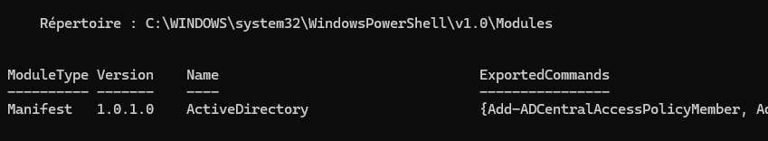

  **1.2 - Exploration du module**

  - Listez toutes les cmdlets disponibles dans le module ActiveDirectory

    ```
    Get-Command -Module ActiveDirectory
    ```

    Combien de cmdlets sont disponibles ?

    ```
    (Get-Command -Module ActiveDirectory).Count
    ```

    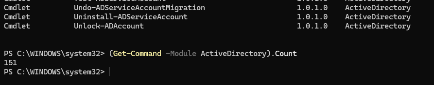

  - Listez uniquement les cmdlets qui commencent par `Get-ADUser`

    ```
    Get-Command -Module ActiveDirectory -Name "Get-ADUser*"
    ```

    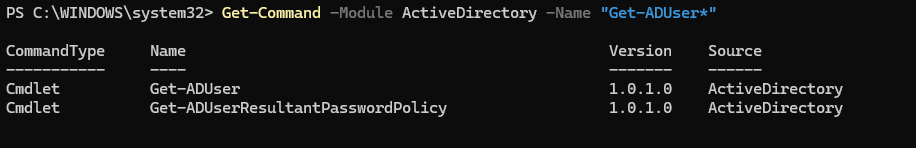

  - Affichez l'aide complète de la cmdlet `Get-ADUser`

    ```
    Get-Help Get-ADUser -Full
    ```

    **1.3 - Connexion à l'Active Directory**

  - Testez votre connexion à l'AD en récupérant des informations sur le domaine

    ```
    $domain = Get-ADDomain
    $domain.Name
    $domain.DomainMode
    ```

    Affichez le nom du domaine, le niveau fonctionnel et les contrôleurs de domaine

    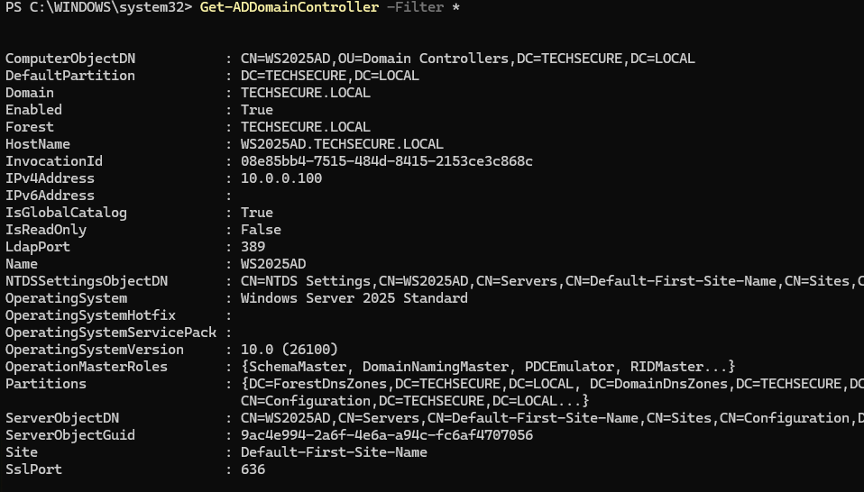

**1.4 - Premier utilisateur**

- Récupérez les informations de votre propre compte utilisateur AD
- Affichez toutes ses propriétés
- Affichez uniquement son nom, son email et son titre

------

## Partie 2 : Gestion des utilisateurs


### Objectif


Maîtriser les opérations CRUD (Create, Read, Update, Delete) sur les utilisateurs AD.

### Travail à réaliser

**2.1 - Créer des utilisateurs**

Créez les utilisateurs suivants dans l'OU de votre choix :

| Prénom | Nom     | Login    | Email                                                        | Titre                  |
| ------ | ------- | -------- | ------------------------------------------------------------ | ---------------------- |
| Alice  | Martin  | amartin  | [alice.martin@techsecure.fr](mailto:alice.martin@techsecure.fr) | Développeuse           |
| Bob    | Dubois  | bdubois  | [bob.dubois@techsecure.fr](mailto:bob.dubois@techsecure.fr)  | Administrateur Système |
| Claire | Bernard | cbernard | [claire.bernard@techsecure.fr](mailto:claire.bernard@techsecure.fr) | Chef de Projet         |

Pour chaque utilisateur :

- Définir un mot de passe initial (ex: "P@ssw0rd123!")

- Le compte doit être activé

- Le mot de passe doit être changé à la première connexion

  ```
  New-ADOrganizationalUnit -Name "TechGP" -Path "DC=TECHSECURE,DC=LOCAL"
  
  New-ADUser -Name "Alice Martin" -GivenName "Alice" -Surname "Martin" -SamAccountName "amartin" -UserPrincipalName "amartin@techsecure.local" -EmailAddress "alice.martin@techsecure.fr" -Title "Développeuse" -Path "OU=TechGP,DC=techsecure,DC=local" -AccountPassword (ConvertTo-SecureString "P@ssw0rd123!" -AsPlainText -Force) -Enabled $true -ChangePasswordAtLogon $true
  
  New-ADUser -Name "Bob Dubois" -GivenName "Bob" -Surname "Dubois" -SamAccountName "bdubois" -UserPrincipalName "bob.dubois@techsecure.fr" -EmailAddress "bob.dubois@techsecure.fr" -Title "Administrateur Système" -Path "OU=TechGP,DC=techsecure,DC=local" -AccountPassword (ConvertTo-SecureString "P@ssw0rd123!" -AsPlainText -Force) -Enabled $true -ChangePasswordAtLogon $true
  
  New-ADUser -Name "Claire Bernard" -GivenName "Claire" -Surname "Bernard" -SamAccountName "cbernard" -UserPrincipalName "claire.bernard@techsecure.fr" -EmailAddress "claire.bernard@techsecure.fr" -Title "Chef de Projet" -Path "OU=TechGP,DC=techsecure,DC=local" -AccountPassword (ConvertTo-SecureString "P@ssw0rd123!" -AsPlainText -Force) -Enabled $true -ChangePasswordAtLogon $true
  
  ```

  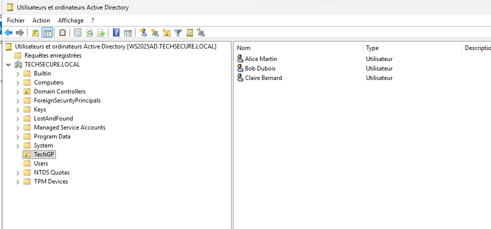

**2.2 - Rechercher des utilisateurs**

- Listez tous les utilisateurs de votre domaine

  ```
  Get-ADUser -Filter * -SearchBase "DC=TECHSECURE,DC=LOCAL"
  ```

  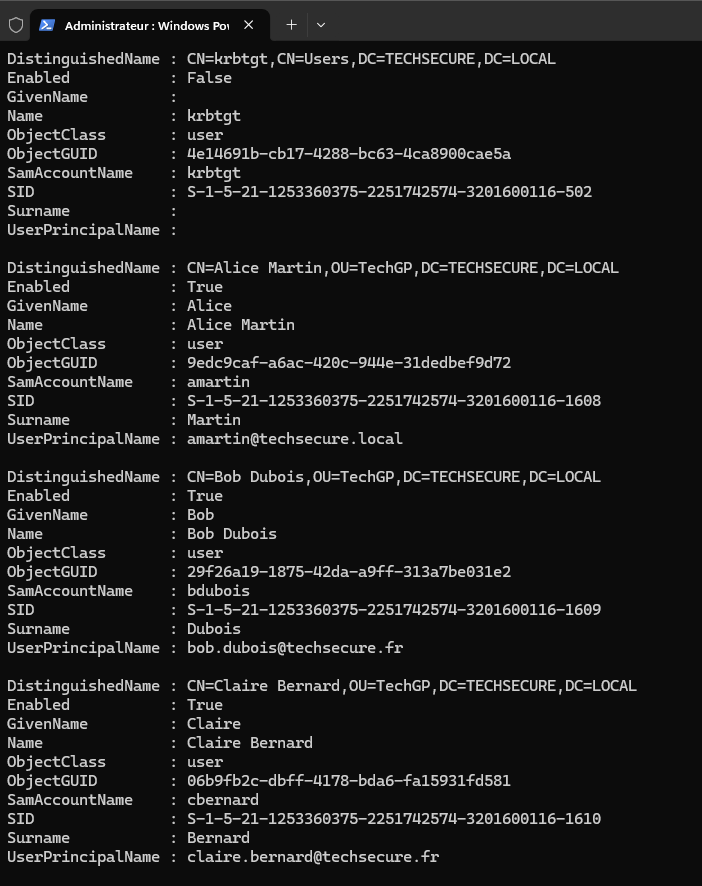

- Trouvez l'utilisateur dont le login est "amartin"

  ```
  Get-ADUser -Identity "amartin"
  ```

  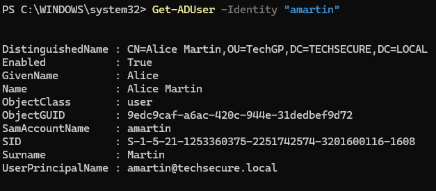

- Trouvez tous les utilisateurs dont le nom commence par "B"

  ```
  Get-ADUser -Filter "Name -like 'B*'"
  ```

  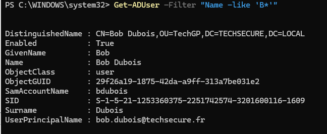

- Trouvez tous les utilisateurs qui ont "Administrateur" dans leur titre

  ```
  Get-ADUser -Filter "Title -like '*Administrateur*'" -Properties Title | Select-Object Name, Title
  ```

  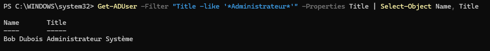

- Comptez le nombre total d'utilisateurs dans votre domaine

  ```
  (Get-ADUser -Filter *).Count
  ```

  **2.3 - Modifier des utilisateurs**

Pour l'utilisateur "amartin" :

- Changez son numéro de téléphone (ajoutez: "01 23 45 67 89")

- Ajoutez une description ("Membre de l'équipe développement")

- Changez son titre en "Développeuse Senior"

  ```
  Set-ADUser -Identity "amartin" -OfficePhone "01 23 45 67 89" -Description "Membre de l'équipe développement" -Title "Développeuse Senior"
  ```

  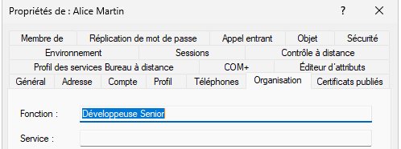

  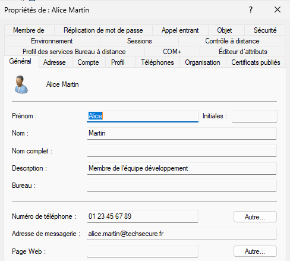

**2.4 - Désactiver et supprimer**

- Désactivez le compte "bdubois"

  ```
  Disable-ADAccount -Identity "bdubois"
  Get-ADUser -Identity "bdubois" | Select-Object Name, Enabled
  ```

  Vérifiez qu'il est bien désactivé

  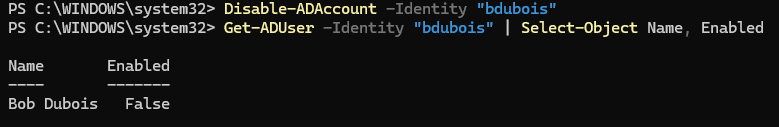

- Supprimez le compte "cbernard" (attention : demander confirmation avant)

  ```
  Remove-ADUser -Identity "cbernard" -Confirm:$true
  ```

  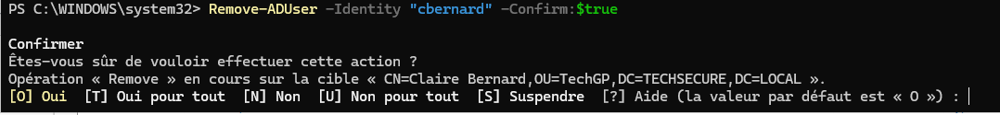

------

## Partie 3 : Gestion des groupes

### Objectif

Créer des groupes de sécurité et gérer les appartenances.

### Travail à réaliser


**3.1 - Créer des groupes**

Créez les groupes de sécurité suivants :

| Nom du groupe      | Type     | Portée | Description                |
| ------------------ | -------- | ------ | -------------------------- |
| GRP_Developpeurs   | Security | Global | Équipe de développement    |
| GRP_Admins_Systeme | Security | Global | Administrateurs système    |
| GRP_Chefs_Projet   | Security | Global | Chefs de projet            |
| GRP_IT             | Security | Global | Ensemble du département IT |

```
# Création du groupe Développeurs
New-ADGroup -Name "GRP_Developpeurs" -GroupCategory Security -GroupScope Global -Description "Équipe de développement" -Path "OU=Groupes,DC=techsecure,DC=local"

# Création du groupe Admins Système
New-ADGroup -Name "GRP_Admins_Systeme" -GroupCategory Security -GroupScope Global -Description "Administrateurs système" -Path "OU=Groupes,DC=techsecure,DC=local"

# Création du groupe Chefs de Projet
New-ADGroup -Name "GRP_Chefs_Projet" -GroupCategory Security -GroupScope Global -Description "Chefs de projet" -Path "OU=Groupes,DC=techsecure,DC=local"

# Création du groupe IT
New-ADGroup -Name "GRP_IT" -GroupCategory Security -GroupScope Global -Description "Ensemble du département IT" -Path "OU=Groupes,DC=techsecure,DC=local"
```

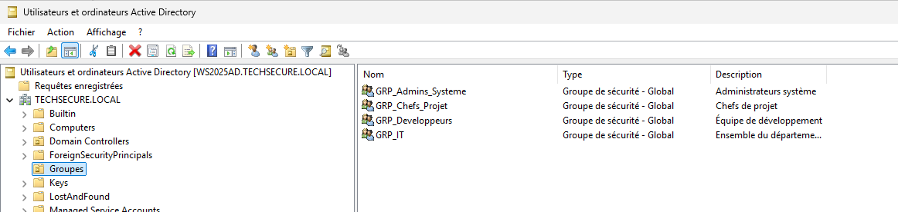

**3.2 - Ajouter des membres**

- Ajoutez "amartin" dans le groupe "GRP_Developpeurs"

- Ajoutez "bdubois" dans le groupe "GRP_Admins_Systeme"

  ```
  Add-ADGroupMember -Identity "GRP_Developpeurs" -Members "amartin"
  Add-ADGroupMember -Identity "GRP_Admins_Systeme" -Members "bdubois"
  ```

  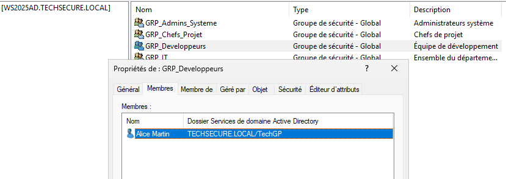

  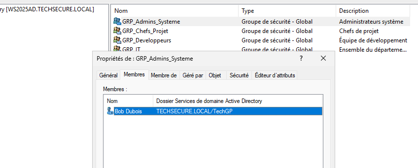

- Créez 2 nouveaux utilisateurs et ajoutez-les dans "GRP_Developpeurs"

  ```
  New-ADUser -Name "Daniel Durand" -GivenName "Daniel" -Surname "Durand" -SamAccountName "ddurand" -UserPrincipalName "ddurand@techsecure.local" -EmailAddress "daniel.durand@techsecure.fr" -Title "Développeuse" -Path "OU=TechGP,DC=techsecure,DC=local" -AccountPassword (ConvertTo-SecureString "P@ssw0rd123!" -AsPlainText -Force) -Enabled $true -ChangePasswordAtLogon $true
  
  New-ADUser -Name "Emmanuelle Dupont" -GivenName "Emmanuelle" -Surname "Dupont" -SamAccountName "edupont" -UserPrincipalName "edupont@techsecure.local" -EmailAddress "emmanuelle.dupont@techsecure.fr" -Title "Ingeener" -Path "OU=TechGP,DC=techsecure,DC=local" -AccountPassword (ConvertTo-SecureString "P@ssw0rd123!" -AsPlainText -Force) -Enabled $true -ChangePasswordAtLogon $true
  
  Add-ADGroupMember -Identity "GRP_Developpeurs" -Members "ddurand"
  Add-ADGroupMember -Identity "GRP_Developpeurs" -Members "edupont"
  ```

  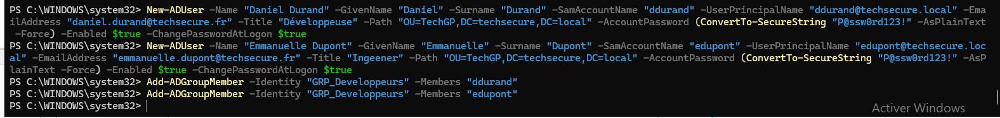

  

  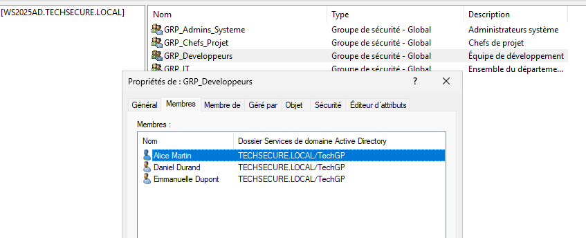

- Ajoutez tous les membres des trois premiers groupes dans "GRP_IT"

  ```
  Add-ADGroupMember -Identity "GRP_IT" -Members "GRP_Developpeurs", "GRP_Admins_Systeme", "GRP_Chefs_Projet"
  ```

  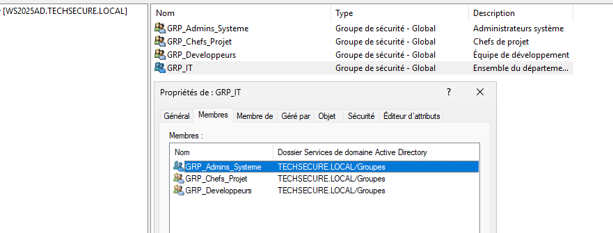

**3.3 - Lister les appartenances**

- Affichez tous les membres du groupe "GRP_IT"

  ```
  Get-ADGroupMember -Identity "GRP_IT" -Recursive | Select-Object Name, SamAccountName
  ```

  

- Affichez tous les groupes dont "amartin" est membre

  ```
  Get-ADPrincipalGroupMembership -Identity "amartin" | Select-Object Name
  ```

  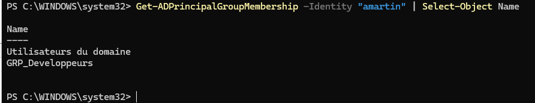

- Comptez combien de membres à chaque groupe

  ```
  Get-ADGroup -Filter * -SearchBase "OU=Groupes,DC=techsecure,DC=local" | ForEach-Object {
      $membres = Get-ADGroupMember -Identity $_.DistinguishedName
      [PSCustomObject]@{
          "Nom du Groupe" = $_.Name
          "Nombre de membres" = ($membres).Count
      }
  } | Format-Table -AutoSize
  ```

  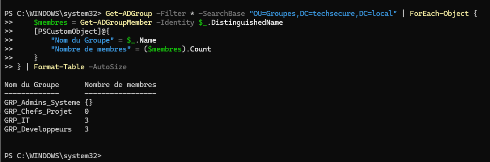

**3.4 - Retirer des membres**

- Retirez "amartin" du groupe "GRP_IT"

  ```
  Remove-ADGroupMember -Identity "GRP_IT" -Members "amartin" -Confirm:$false
  ```

  Vérifiez qu'elle n'en est plus membre

  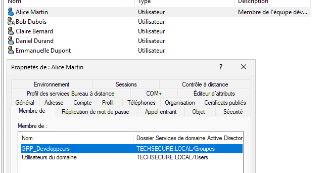

**3.5 - Groupes imbriqués**

- Créez un groupe "GRP_Tous_Utilisateurs"

- Ajoutez-y les groupes "GRP_IT" (pas les membres individuels, mais le groupe lui-même)

  ```
  Add-ADGroupMember -Identity "GRP_Tous_Utilisateurs" -Members "GRP_IT"
  ```

  

- Listez les membres (directs et récursifs) de "GRP_Tous_Utilisateurs"

  ```
  Get-ADGroupMember -Identity "GRP_Tous_Utilisateurs" -Recursive
  ```

  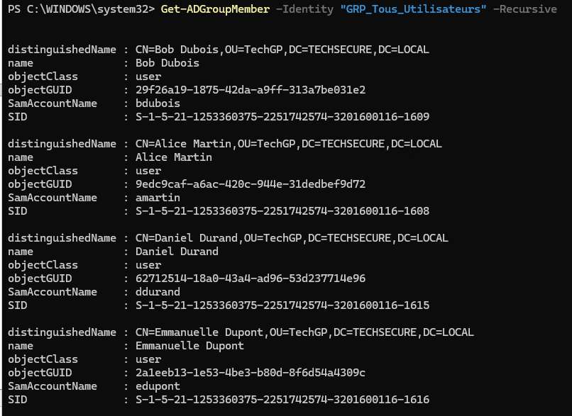

------

## Partie 4 : Organisation avec les Unités Organisationnelles (OU)

### Objectif

Structurer l'annuaire Active Directory avec des OU.

### Travail à réaliser

**4.1 - Créer une structure d'OU**

Créez la structure suivante dans votre domaine :

```
TechSecure/
├── Utilisateurs/
│   ├── Informatique/
│   │   ├── Developpement/
│   │   └── Infrastructure/
│   ├── RH/
│   └── Commercial/
├── Groupes/
└── Ordinateurs/
```

Création des dossiers racines (Niveau 1) Ces trois OU seront créées à la racine de votre domaine.

```
New-ADOrganizationalUnit -Name "Utilisateurs" -Path "DC=techsecure,DC=local"
New-ADOrganizationalUnit -Name "Groupes" -Path "DC=techsecure,DC=local"
New-ADOrganizationalUnit -Name "Ordinateurs" -Path "DC=techsecure,DC=local"
```

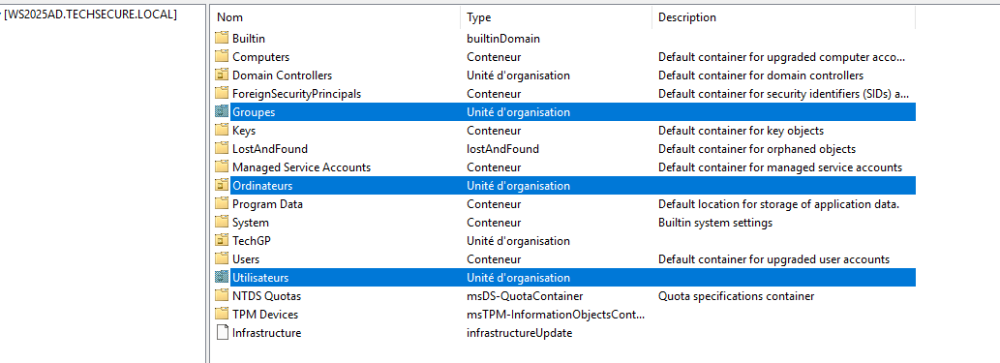

Création des sous-dossiers de "Utilisateurs" (Niveau 2), Nous utilisons ici le chemin de l'OU "Utilisateurs" comme parent.

```
$parentUtilisateurs = "OU=Utilisateurs,DC=techsecure,DC=local"

New-ADOrganizationalUnit -Name "Informatique" -Path $parentUtilisateurs
New-ADOrganizationalUnit -Name "RH" -Path $parentUtilisateurs
New-ADOrganizationalUnit -Name "Commercial" -Path $parentUtilisateurs
```

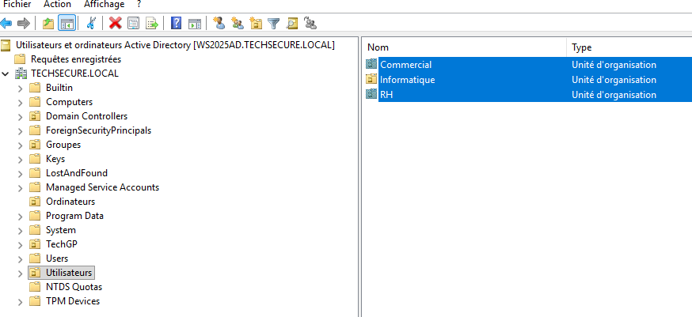

Création des spécialisations "Informatique" (Niveau 3), Enfin, nous créons les dossiers techniques à l'intérieur de l'OU Informatique.

```
$parentIT = "OU=Informatique,OU=Utilisateurs,DC=techsecure,DC=local"

New-ADOrganizationalUnit -Name "Developpement" -Path $parentIT
New-ADOrganizationalUnit -Name "Infrastructure" -Path $parentIT
```

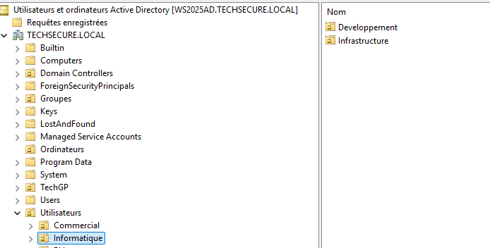

Vérifier la structure créée, Pour afficher votre bel arbre d'OU en une seule commande :

```
Get-ADOrganizationalUnit -Filter * -SearchBase "DC=techsecure,DC=local" | Select-Object DistinguishedName | Sort-Object DistinguishedName
```

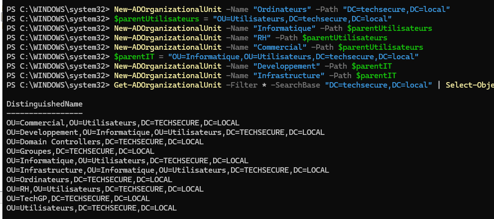

**4.2 - Déplacer des objets**

- Déplacez l'utilisateur "amartin" dans l'OU "TechSecure/Utilisateurs/Informatique/Developpement"

  ```
  Get-ADUser -Identity "amartin" | Move-ADObject -TargetPath "OU=Developpement,OU=Informatique,OU=Utilisateurs,DC=techsecure,DC=local"
  ```

  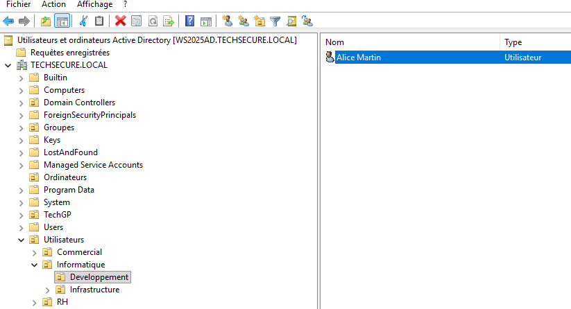

- Déplacez tous vos groupes créés précédemment dans l'OU "TechSecure/Groupes"

  Il faut d'abord récupérer son identifiant unique (DistinguishedName) pour l'envoyer vers la nouvelle destination.

  ```
  Get-ADGroup -Filter "Name -like 'GRP_*'" | Move-ADObject -TargetPath "OU=Groupes,DC=techsecure,DC=local"
  ```

  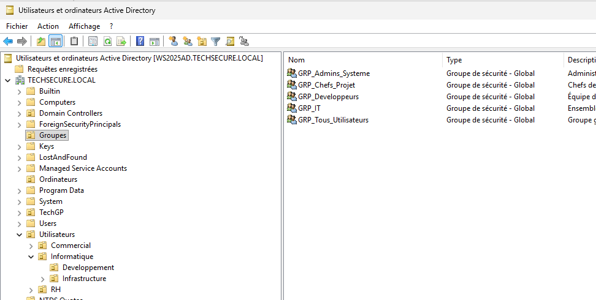

- Listez tous les utilisateurs présents dans l'OU "Informatique" (incluant les sous-OU)

  Pour inclure les utilisateurs de "Developpement" et "Infrastructure", on utilise le paramètre `-SearchScope Subtree`.

  ```
  Get-ADUser -Filter * -SearchBase "OU=Informatique,OU=Utilisateurs,DC=techsecure,DC=local" -SearchScope Subtree | Select-Object Name, SamAccountName, DistinguishedName | Format-Table -AutoSize
  ```

  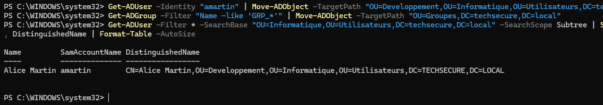

**4.3 - Recherche par OU**

- Comptez le nombre d'utilisateurs dans l'OU "Informatique" uniquement (sans les sous-OU)

  Pour compter uniquement les utilisateurs situés à la racine de l'OU "Informatique", sans descendre dans les dossiers "Developpement" ou "Infrastructure", on utilise le paramètre **`-SearchScope OneLevel`**.

  ```
  (Get-ADUser -Filter * -SearchBase "OU=Informatique,OU=Utilisateurs,DC=techsecure,DC=local" -SearchScope OneLevel).Count
  ```

- Comptez le nombre d'utilisateurs dans l'OU "Informatique" en incluant tous les sous-niveaux

  Pour compter tous les utilisateurs du département informatique, y compris ceux qui se trouvent dans les sous-dossiers "Developpement" et "Infrastructure", nous utilisons le paramètre **`-SearchScope Subtree`**en forçant le résultat par @.

  ```
  @(Get-ADUser -Filter * -SearchBase "OU=Informatique,OU=Utilisateurs,DC=techsecure,DC=local" -SearchScope Subtree).Count
  ```

  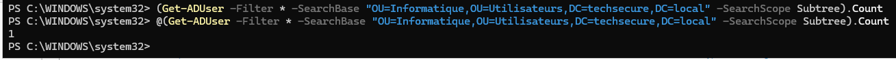

------

## Partie 5 : Import en masse depuis CSV

### Objectif

Automatiser la création d'utilisateurs en important les données depuis un fichier CSV.

### Travail à réaliser

**5.1 - Préparer le fichier CSV**

Créez un fichier `nouveaux_employes.csv` avec la structure suivante :

```
Prenom,Nom,Login,Email,Titre,Departement,OU
David,Petit,dpetit,david.petit@techsecure.fr,Développeur,Informatique,OU=Developpement,OU=Informatique,OU=Utilisateurs,OU=TechSecure
Emma,Roux,eroux,emma.roux@techsecure.fr,Administratrice Réseau,Informatique,OU=Infrastructure,OU=Informatique,OU=Utilisateurs,OU=TechSecure
François,Moreau,fmoreau,francois.moreau@techsecure.fr,Recruteur,RH,OU=RH,OU=Utilisateurs,OU=TechSecure
```

Ajoutez au moins 10 autres lignes avec des employés fictifs.

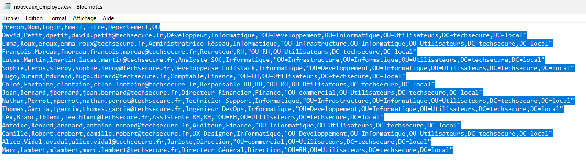

```
# Paramètres de configuration
$csvPath = "C:\Scripts\nouveaux_employes.csv"

$defaultPassword = ConvertTo-SecureString "P@ssword2026!" -AsPlainText -Force

# Importation avec encodage UTF8 pour les accents
$users = Import-Csv -Path $csvPath -Delimiter "," -Encoding UTF8

foreach ($user in $users) {
    if ([string]::IsNullOrWhiteSpace($user.Login)) { continue }

    $sAM = $user.Login.Trim()
    $ouPath = $user.OU.Trim()
    $name = "$($user.Prenom.Trim()) $($user.Nom.Trim())"

    try {
        # Test de l'OU avant création
        if (Get-ADOrganizationalUnit -Identity $ouPath -ErrorAction SilentlyContinue) {
            
            if (-not (Get-ADUser -Filter "SamAccountName -eq '$sAM'" -ErrorAction SilentlyContinue)) {
                New-ADUser -Name $name `
                           -SamAccountName $sAM `
                           -GivenName $user.Prenom `
                           -Surname $user.Nom `
                           -DisplayName $name `
                           -Path $ouPath `
                           -AccountPassword $defaultPassword `
                           -Enabled $true `
                           -ChangePasswordAtLogon $true
                
                Write-Host "✅ Utilisateur créé : $sAM" -ForegroundColor Green
            } else {
                Write-Warning "L'utilisateur $sAM existe déjà."
            }
        } else {
            Write-Host "❌ Chemin d'OU invalide : $ouPath" -ForegroundColor Red
        }
    }
    catch {
        Write-Host "❌ Erreur pour $sAM : $($_.Exception.Message)" -ForegroundColor Red
    }
}
```

**5.2 - Script d'import basique**

Créez un script `Import-ADUsersFromCSV.ps1` qui :

- Lit le fichier CSV

- Pour chaque ligne, crée un utilisateur AD avec toutes les propriétés

- Définit un mot de passe par défaut

- Active le compte

- Affiche un message pour chaque utilisateur créé

  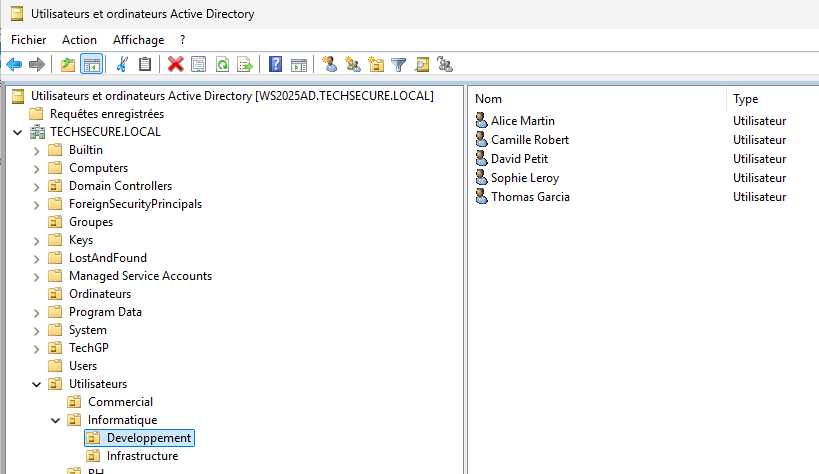

**5.3 - Améliorer le script avec gestion d'erreurs**

Modifiez votre script pour :

- Vérifier que le CSV existe avant de commencer

- Utiliser `try-catch` pour gérer les erreurs de création

- Vérifier si l'utilisateur existe déjà avant de le créer

- Logger les succès et les erreurs dans un fichier `import.log`

- Afficher un résumé à la fin (X créés, Y erreurs)

  ```
  # --- Paramètres de configuration ---
  $csvPath = "C:\Scripts\nouveaux_employes.csv"
  $logPath = "C:\Scripts\import.log"
  $defaultPassword = ConvertTo-SecureString "P@ssword2026!" -AsPlainText -Force
  
  # Initialisation des compteurs
  $countSuccess = 0
  $countError = 0
  $countExist = 0
  
  # Fonction pour écrire dans le log et la console
  function Write-Log {
      param([string]$Message, [string]$Type = "INFO")
      $timestamp = Get-Date -Format "yyyy-MM-dd HH:mm:ss"
      $logEntry = "[$timestamp] [$Type] $Message"
      $logEntry | Out-File -FilePath $logPath -Append -Encoding UTF8
      
      switch ($Type) {
          "SUCCESS" { Write-Host $logEntry -ForegroundColor Green }
          "ERROR"   { Write-Host $logEntry -ForegroundColor Red }
          "WARN"    { Write-Host $logEntry -ForegroundColor Yellow }
          default   { Write-Host $logEntry }
      }
  }
  
  # 1. Vérifier que le CSV existe avant de commencer
  if (-not (Test-Path $csvPath)) {
      Write-Log "Fichier CSV introuvable à l'emplacement : $csvPath" "ERROR"
      return
  }
  
  # Importation du CSV
  $users = Import-Csv -Path $csvPath -Delimiter "," -Encoding UTF8
  
  Write-Log "Début de l'importation de $($users.Count) entrées..." "INFO"
  
  foreach ($user in $users) {
      if ([string]::IsNullOrWhiteSpace($user.Login)) { continue }
  
      $sAM = $user.Login.Trim()
      $ouPath = $user.OU.Trim()
      $name = "$($user.Prenom.Trim()) $($user.Nom.Trim())"
  
      try {
          # Vérification de l'OU
          if (-not (Get-ADOrganizationalUnit -Identity $ouPath -ErrorAction SilentlyContinue)) {
              Write-Log "L'unité d'organisation (OU) est introuvable : $ouPath" "ERROR"
              $countError++
              continue
          }
  
          # 2. Vérifier si l'utilisateur existe déjà
          if (Get-ADUser -Filter "SamAccountName -eq '$sAM'" -ErrorAction SilentlyContinue) {
              Write-Log "L'utilisateur $sAM existe déjà dans l'AD." "WARN"
              $countExist++
          } 
          else {
              # 3. Utiliser try-catch pour la création
              $userParams = @{
                  Name                  = $name
                  SamAccountName        = $sAM
                  GivenName             = $user.Prenom.Trim()
                  Surname               = $user.Nom.Trim()
                  DisplayName           = $name
                  Path                  = $ouPath
                  AccountPassword       = $defaultPassword
                  Enabled               = $true
                  ChangePasswordAtLogon = $true
              }
  
              New-ADUser @userParams
              Write-Log "Utilisateur créé avec succès : $sAM" "SUCCESS"
              $countSuccess++
          }
      }
      catch {
          Write-Log "Erreur lors de la création de $sAM : $($_.Exception.Message)" "ERROR"
          $countError++
      }
  }
  
  # 4. Afficher un résumé à la fin
  Write-Host "`n" + ("=" * 30) -ForegroundColor Cyan
  Write-Host "RÉSUMÉ DE L'IMPORTATION" -ForegroundColor Cyan
  Write-Host "Utilisateurs créés     : $countSuccess" -ForegroundColor Green
  Write-Host "Utilisateurs existants : $countExist" -ForegroundColor Yellow
  Write-Host "Erreurs rencontrées    : $countError" -ForegroundColor Red
  Write-Host ("=" * 30) -ForegroundColor Cyan
  Write-Log "Fin du script. Créés: $countSuccess | Erreurs: $countError" "INFO"
  ```

  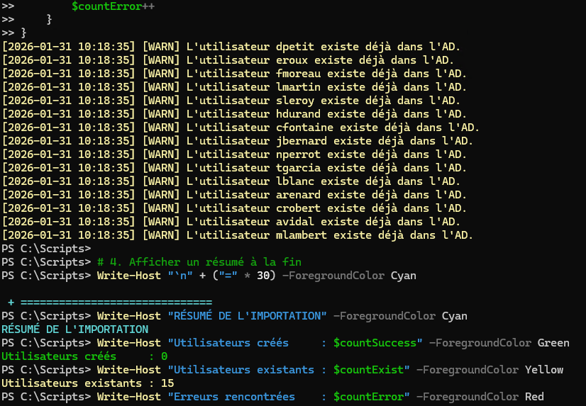

**5.4 - Ajouter les groupes lors de l'import**

Ajoutez une colonne "Groupes" dans votre CSV (plusieurs groupes séparés par des points-virgules).

Modifiez votre script pour ajouter automatiquement les utilisateurs dans les groupes spécifiés. (choisir parmi les groupes)

```
David,Petit,dpetit,david.petit@techsecure.fr,Développeur,Informatique,"OU=Developpement,OU=Informatique,OU=Utilisateurs,DC=techsecure,DC=local","GRP_Admins_Systeme;GRP_Chefs_Projet;GRP_Developpeurs;GRP_IT;GRP_Tous_Utilisateurs"
```

```
# --- Paramètres de configuration ---
$csvPath = "C:\Scripts\nouveaux_employes.csv"
$logPath = "C:\Scripts\import.log"
$defaultPassword = ConvertTo-SecureString "P@ssword2026!" -AsPlainText -Force

# Initialisation des compteurs
$countSuccess = 0
$countError = 0
$countExist = 0

function Write-Log {
    param([string]$Message, [string]$Type = "INFO")
    $timestamp = Get-Date -Format "yyyy-MM-dd HH:mm:ss"
    $logEntry = "[$timestamp] [$Type] $Message"
    $logEntry | Out-File -FilePath $logPath -Append -Encoding UTF8
    switch ($Type) {
        "SUCCESS" { Write-Host $logEntry -ForegroundColor Green }
        "ERROR"   { Write-Host $logEntry -ForegroundColor Red }
        "WARN"    { Write-Host $logEntry -ForegroundColor Yellow }
        default   { Write-Host $logEntry }
    }
}

# 1. Vérification du fichier
if (-not (Test-Path $csvPath)) {
    Write-Log "Fichier CSV introuvable : $csvPath" "ERROR"
    return
}

$users = Import-Csv -Path $csvPath -Delimiter "," -Encoding UTF8

foreach ($user in $users) {
    if ([string]::IsNullOrWhiteSpace($user.Login)) { continue }

    $sAM = $user.Login.Trim()
    $ouPath = $user.OU.Trim()
    $name = "$($user.Prenom.Trim()) $($user.Nom.Trim())"

    try {
        # Vérification de l'OU
        if (-not (Get-ADOrganizationalUnit -Identity $ouPath -ErrorAction SilentlyContinue)) {
            Write-Log "OU introuvable pour $sAM : $ouPath" "ERROR"
            $countError++
            continue
        }

        # 2. Vérification existence
        $adUser = Get-ADUser -Filter "SamAccountName -eq '$sAM'" -ErrorAction SilentlyContinue
        
        if ($null -eq $adUser) {
            # 3. Création avec les nouveaux champs (Email, Fonction, Département)
            $userParams = @{
                Name                  = $name
                SamAccountName        = $sAM
                GivenName             = $user.Prenom.Trim()
                Surname               = $user.Nom.Trim()
                DisplayName           = $name
                EmailAddress          = $user.Email.Trim()
                Title                 = $user.Fonction.Trim()
                Department            = $user.Departement.Trim()
                Path                  = $ouPath
                AccountPassword       = $defaultPassword
                Enabled               = $true
                ChangePasswordAtLogon = $true
            }

            New-ADUser @userParams
            Write-Log "Utilisateur créé : $sAM ($name)" "SUCCESS"
            $countSuccess++
        } else {
            Write-Log "L'utilisateur $sAM existe déjà. Vérification des groupes..." "WARN"
            $countExist++
        }

        # 4. Gestion des Groupes
        if (-not [string]::IsNullOrWhiteSpace($user.Groupes)) {
            $listeGroupes = $user.Groupes.Split(";") | ForEach-Object { $_.Trim() }
            foreach ($nomGroupe in $listeGroupes) {
                $groupeObj = Get-ADGroup -Filter "Name -eq '$nomGroupe'" -ErrorAction SilentlyContinue
                if ($groupeObj) {
                    try {
                        Add-ADGroupMember -Identity $groupeObj -Members $sAM -ErrorAction Stop
                        Write-Log "Ajout de $sAM au groupe : $nomGroupe" "SUCCESS"
                    } catch {
                        Write-Log "$sAM est déjà membre de $nomGroupe" "INFO"
                    }
                } else {
                    Write-Log "Groupe introuvable : $nomGroupe" "ERROR"
                }
            }
        }
    }
    catch {
        Write-Log "Erreur critique pour $sAM : $($_.Exception.Message)" "ERROR"
        $countError++
    }
}

# Résumé
Write-Host "`n" + ("=" * 30) -ForegroundColor Cyan
Write-Host "RÉSUMÉ FINAL" -ForegroundColor Cyan
Write-Host "Créés      : $countSuccess" -ForegroundColor Green
Write-Host "Existants  : $countExist" -ForegroundColor Yellow
Write-Host "Erreurs    : $countError" -ForegroundColor Red
Write-Host ("=" * 30) -ForegroundColor Cyan
```

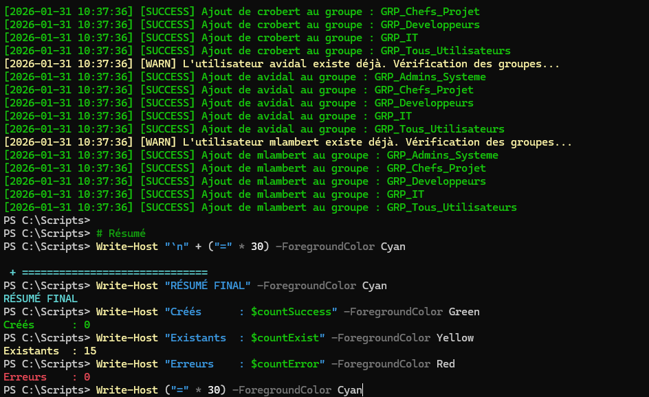

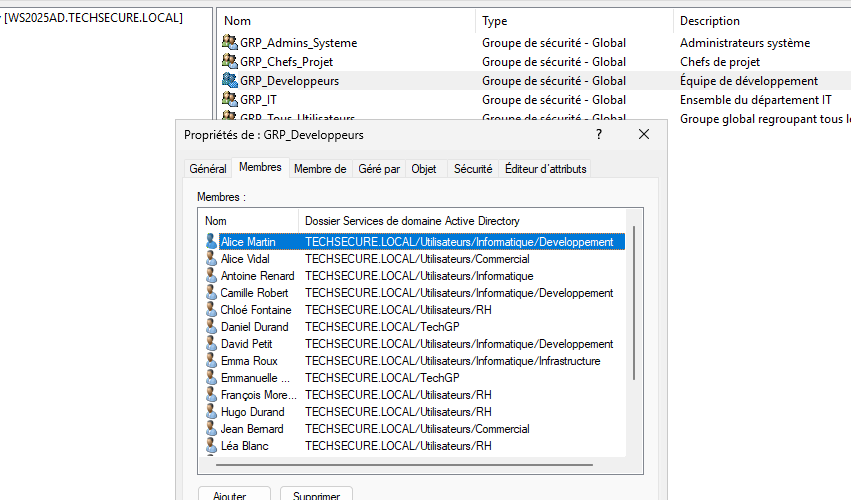

------

## Partie 6 : Scripts d'automatisation

### Objectif

Créer des scripts réutilisables pour les tâches courantes.

### Travail à réaliser

**6.1 - Script d'onboarding**

Créez un script `New-Employee.ps1` qui prend des paramètres et effectue un onboarding complet :

Le script doit :

- Accepter en paramètres : Prénom, Nom, Titre, Département, Manager

- Générer automatiquement le login (première lettre prénom + nom)

- Générer l'email (@techsecure.fr)

- Créer l'utilisateur dans la bonne OU selon le département

- Générer un mot de passe aléatoire sécurisé

- Ajouter l'utilisateur dans les groupes appropriés selon son département

- Envoyer un email de bienvenue (simulation avec Write-Host)

- Logger toutes les opérations

  ```
  # --- Configuration TechSecure ---
  $csvPath = "C:\Scripts\nouveaux_employes.csv"
  $logPath = "C:\Scripts\Logs\onboarding.log"
  
  if (-not (Test-Path "C:\Scripts\Logs")) { New-Item -Path "C:\Scripts\Logs" -ItemType Directory -Force }
  
  function Write-Log {
      param($Msg, $Type="INFO")
      $stamp = Get-Date -Format "yyyy-MM-dd HH:mm:ss"
      "[$stamp][$Type] $Msg" | Out-File $logPath -Append -Encoding UTF8
      $col = switch($Type) { "SUCCESS"{"Green"}; "ERROR"{"Red"}; "WARN"{"Yellow"}; default{"Gray"} }
      Write-Host "[$Type] $Msg" -ForegroundColor $col
  }
  
  if (-not (Test-Path $csvPath)) { Write-Log "CSV introuvable." "ERROR"; exit }
  
  $users = Import-Csv -Path $csvPath -Delimiter "," -Encoding UTF8
  
  foreach ($u in $users) {
      if ([string]::IsNullOrWhiteSpace($u.Login)) { continue }
  
      $login = $u.Login.Trim()
      
      # Verification existence
      if (Get-ADUser -Filter "SamAccountName -eq '$login'" -ErrorAction SilentlyContinue) {
          Write-Log "L'utilisateur $login existe deja. Ignore." "WARN"
          continue
      }
  
      try {
          $passRaw = -join ((65..90) + (97..122) + (48..57) | Get-Random -Count 12 | % {[char]$_})
          
          $params = @{
              Name                  = "$($u.Prenom) $($u.Nom)"
              SamAccountName        = $login
              UserPrincipalName     = "$login@techsecure.fr"
              GivenName             = $u.Prenom.Trim()
              Surname               = $u.Nom.Trim()
              EmailAddress          = $u.Email.Trim()
              Title                 = $u.Titre.Trim()
              Department            = $u.Departement.Trim()
              Path                  = $u.OU.Trim()
              AccountPassword       = (ConvertTo-SecureString $passRaw -AsPlainText -Force)
              Enabled               = $true
              ChangePasswordAtLogon = $true
          }
  
          New-ADUser @params
          
          # Gestion des groupes
          if ($u.Groupes) {
              $gps = $u.Groupes.Split(";") | % { $_.Trim() }
              foreach ($g in $gps) {
                  if (Get-ADGroup -Filter "Name -eq '$g'") {
                      Add-ADGroupMember -Identity $g -Members $login -ErrorAction SilentlyContinue
                  }
              }
          }
  
          Write-Log "Creation reussie : $login" "SUCCESS"
          Write-Host "Mot de passe pour $login : $passRaw" -ForegroundColor Cyan
      }
      catch {
          Write-Log "Erreur sur $login : $($_.Exception.Message)" "ERROR"
      }
  }
  ```

  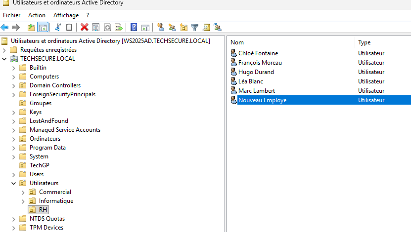

**6.2 - Script d'offboarding**

Créez un script `Remove-Employee.ps1` qui :

- Prend en paramètre le login de l'utilisateur

- Désactive le compte

- Retire l'utilisateur de tous ses groupes

- Déplace l'utilisateur vers une OU "Comptes Désactivés"

- Réinitialise son mot de passe

- Ajoute une note dans la description avec la date de désactivation

- Logger toutes les opérations

- Demande confirmation avant chaque action critique

  ```
  param([Parameter(Mandatory=$false)][string]$Login)
  
  # --- Configuration ---
  $csvPath     = "C:\Scripts\nouveaux_employes.csv"
  $logPath     = "C:\Scripts\Logs\offboarding.log"
  $QuarantineOU = "OU=Comptes Desactives,OU=Utilisateurs,OU=TechSecure,DC=techsecure,DC=local"
  
  function Write-Log {
      param($Msg, $Type="INFO")
      $stamp = Get-Date -Format "HH:mm:ss"
      "[$stamp][$Type] $Msg" | Out-File $logPath -Append -Encoding UTF8
      $col = switch($Type){"SUCCESS"{"Green"};"ERROR"{"Red"};"WARN"{"Yellow"};default{"Gray"}}
      Write-Host "[$Type] $Msg" -ForegroundColor $col
  }
  
  # Déterminer la source (Paramètre ou CSV)
  $users = if ($Login) { @([PSCustomObject]@{Login=$Login}) } else { Import-Csv $csvPath }
  
  foreach ($u in $users) {
      if ([string]::IsNullOrWhiteSpace($u.Login)) { continue }
      $sid = $u.Login.Trim()
  
      try {
          $adUser = Get-ADUser -Identity $sid -Properties MemberOf, Description -ErrorAction Stop
  
          # 1. Demande de confirmation
          $confirm = Read-Host "Confirmer l'OFFBOARDING de $sid ? (O/N)"
          if ($confirm -ne "O") { Write-Log "Annulé pour $sid" "WARN"; continue }
  
          # 2. Désactivation et Reset Password de sécurité
          Disable-ADAccount -Identity $sid
          $dummyPass = -join (1..16 | % { [char](Get-Random -Min 33 -Max 126) })
          Set-ADAccountPassword -Identity $sid -NewPassword (ConvertTo-SecureString $dummyPass -AsPlainText -Force) -Reset
  
          # 3. Retrait des groupes (Nettoyage)
          $groups = Get-ADPrincipalGroupMembership -Identity $sid | Where { $_.Name -ne "Domain Users" }
          if ($groups) { Remove-ADGroupMember -Identity $groups -Members $sid -Confirm:$false }
  
          # 4. Note et Déplacement
          Set-ADUser -Identity $sid -Description "Desactive le $(Get-Date -Format 'dd/MM/yyyy') | $($adUser.Description)"
          Move-ADObject -Identity $adUser.DistinguishedName -TargetPath $QuarantineOU
  
          Write-Log "Offboarding reussi pour $sid" "SUCCESS"
      }
      catch {
          Write-Log "Erreur sur $sid : $($_.Exception.Message)" "ERROR"
      }
  }
  ```

  

**6.3 - Script de modification de mot de passe**

Créez un script `Reset-EmployeePassword.ps1` qui :

- Prend en paramètre le login

- Génère un nouveau mot de passe aléatoire sécurisé

- Change le mot de passe de l'utilisateur

- Force le changement à la prochaine connexion

- Affiche le nouveau mot de passe (pour transmission sécurisée)

- Déverrouille le compte si nécessaire

  ```
  param([Parameter(Mandatory=$false)][string]$Login)
  
  # --- Configuration ---
  $csvPath = "C:\Scripts\nouveaux_employes.csv"
  $logPath = "C:\Scripts\Logs\password_resets.log"
  
  # Liste à traiter
  $users = if ($Login) { @([PSCustomObject]@{Login=$Login}) } else { Import-Csv $csvPath }
  
  foreach ($u in $users) {
      if ([string]::IsNullOrWhiteSpace($u.Login)) { continue }
      $sid = $u.Login.Trim()
  
      # Génération d'un pass robuste (14 car.)
      $newPass = -join ((65..90) + (97..122) + (48..57) + (33..46) | Get-Random -Count 14 | % {[char]$_})
      $securePass = ConvertTo-SecureString $newPass -AsPlainText -Force
  
      try {
          $adUser = Get-ADUser -Identity $sid -Properties LockedOut -ErrorAction Stop
  
          # 1. Déverrouillage si nécessaire
          if ($adUser.LockedOut) { Unlock-ADAccount -Identity $sid }
  
          # 2. Reset et Changement forcé
          Set-ADAccountPassword -Identity $sid -NewPassword $securePass -Reset
          Set-ADUser -Identity $sid -ChangePasswordAtLogon $true
  
          # 3. Affichage (en couleur pour bien voir le pass)
          Write-Host "`n------------------------------------" -ForegroundColor Cyan
          Write-Host " RESET REUSSI : $sid" -ForegroundColor Green
          Write-Host " NOUVEAU PASS : " -NoNewline
          Write-Host $newPass -ForegroundColor White -BackgroundColor DarkBlue
          Write-Host "------------------------------------" -ForegroundColor Cyan
          
          "$(Get-Date) - SUCCESS - $sid" | Out-File $logPath -Append
      }
      catch {
          Write-Host "❌ Erreur sur $sid : $($_.Exception.Message)" -ForegroundColor Red
      }
  }
  ```

  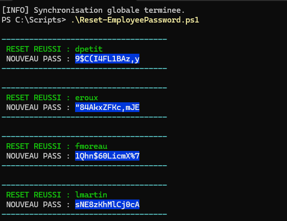

------

## Partie 7 : Rapports et audits

### Objectif

Créer des scripts de reporting pour auditer l'Active Directory.

### Travail à réaliser

**7.1 - Rapport des utilisateurs inactifs**

Créez un script `Get-InactiveUsers.ps1` qui :

- Liste tous les utilisateurs n'ayant pas changé leur mot de passe depuis plus de 90 jours

- Affiche : Login, Nom, Dernière modification du mot de passe, Jours depuis modification

- Trie par nombre de jours décroissant

- Exporte le résultat en CSV

  ```
  # --- Configuration ---
  $daysLimit = 90
  $csvPath   = "C:\Scripts\rapport_mots_de_passe_expires.csv"
  $logPath   = "C:\Scripts\Logs\audit_passwords.log"
  
  # Date de référence (Aujourd'hui - 90 jours)
  $referenceDate = (Get-Date).AddDays(-$daysLimit)
  
  Write-Host "--- RECHERCHE DES MOTS DE PASSE INCHANGES DEPUIS +$daysLimit JOURS ---" -ForegroundColor Cyan
  
  # 1. Récupération des utilisateurs avec les propriétés nécessaires
  $users = Get-ADUser -Filter 'Enabled -eq $true' -Properties PasswordLastSet, DisplayName | Where-Object {
      $_.PasswordLastSet -ne $null -and $_.PasswordLastSet -lt $referenceDate
  }
  
  # 2. Traitement et calcul de l'ancienneté
  $results = foreach ($u in $users) {
      $timespan = New-TimeSpan -Start $u.PasswordLastSet -End (Get-Date)
      
      [PSCustomObject]@{
          Login                      = $u.SamAccountName
          Nom                        = $u.DisplayName
          Derniere_Modification_MDP  = $u.PasswordLastSet
          Jours_Depuis_Modif         = [math]::Round($timespan.TotalDays)
      }
  }
  
  # 3. Tri par jours décroissants
  $results = $results | Sort-Object Jours_Depuis_Modif -Descending
  
  # 4. Affichage console
  if ($results) {
      $results | Format-Table -AutoSize
      
      # 5. Export CSV
      $results | Export-Csv -Path $csvPath -NoTypeInformation -Delimiter "," -Encoding UTF8
      
      Write-Host "`n✅ Rapport généré : $csvPath" -ForegroundColor Green
      "$(Get-Date) - Audit terminé : $($results.Count) utilisateurs trouvés." | Out-File $logPath -Append
  }
  else {
      Write-Host "✅ Aucun utilisateur n'a de mot de passe plus vieux que $daysLimit jours." -ForegroundColor Green
  }
  ```

  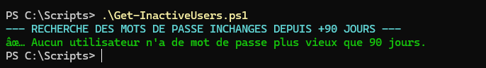

  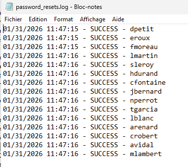

**7.2 - Rapport des comptes désactivés**

Créez un script qui :

- Liste tous les comptes utilisateurs désactivés

- Affiche : Login, Nom, OU, Date de désactivation (si dans description)

- Compte le nombre total

- Exporte en CSV

  ```
  # --- Configuration ---
  $csvPath = "C:\Scripts\rapport_comptes_desactives.csv"
  $logPath = "C:\Scripts\Logs\audit_disabled.log"
  
  Write-Host "--- RECHERCHE DES COMPTES UTILISATEURS DESACTIVES ---" -ForegroundColor Cyan
  
  # 1. Récupération des comptes désactivés avec propriétés étendues
  $disabledUsers = Get-ADUser -Filter 'Enabled -eq $false' -Properties Description, CanonicalName, DisplayName
  
  # 2. Traitement des données
  $results = foreach ($u in $disabledUsers) {
      # Extraction de la date depuis la description (format attendu : "Désactivé le dd/MM/yyyy")
      $dateDeactivation = "Non specifiee"
      if ($u.Description -match "(\d{2}/\d{2}/\d{4})") {
          $dateDeactivation = $matches[1]
      }
  
      # Extraction de l'OU à partir du CanonicalName (plus lisible que le DistinguishedName)
      $ouPath = $u.DistinguishedName.Replace("CN=$($u.Name),", "")
  
      [PSCustomObject]@{
          Login             = $u.SamAccountName
          Nom               = $u.DisplayName
          OU                = $ouPath
          Date_Desactivation = $dateDeactivation
      }
  }
  
  # 3. Affichage et Export
  if ($results) {
      # Affichage du tableau dans la console
      $results | Format-Table -AutoSize
  
      # Comptage
      $total = $results.Count
      Write-Host "`nNombre total de comptes désactivés : " -NoNewline
      Write-Host $total -ForegroundColor Yellow
  
      # Export CSV
      $results | Export-Csv -Path $csvPath -NoTypeInformation -Delimiter "," -Encoding UTF8
      
      Write-Host "✅ Rapport généré : $csvPath" -ForegroundColor Green
      "$(Get-Date) - Audit desactives : $total comptes trouves." | Out-File $logPath -Append
  }
  else {
      Write-Host "✅ Aucun compte utilisateur désactivé trouvé dans le domaine." -ForegroundColor Green
  }
  ```

  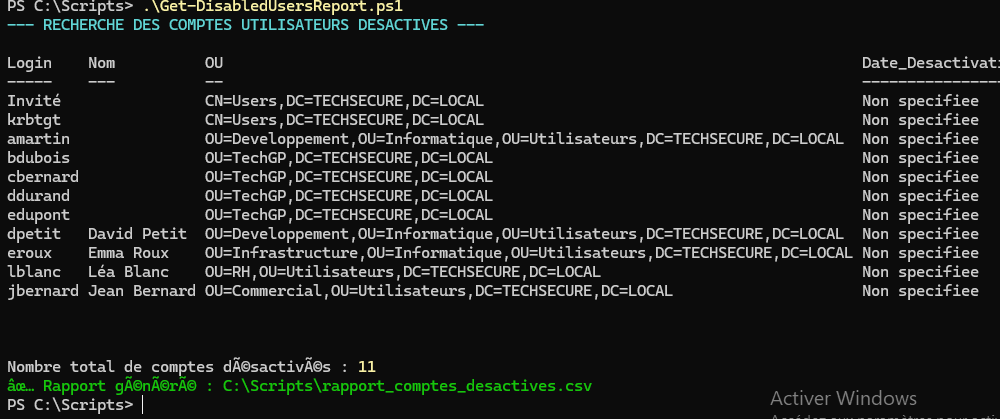

  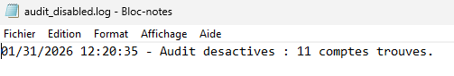

**7.3 - Rapport des groupes et membres**

Créez un script qui :

- Liste tous les groupes de sécurité

- Pour chaque groupe, affiche le nombre de membres

- Identifie les groupes vides

- Exporte un rapport détaillé en HTML avec :
  - Nom du groupe
  - Description
  - Nombre de membres
  - Liste des membres
  
  ```
  # --- Configuration ---
  $reportPath = "C:\Scripts\Rapport_Groupes_Securite.html"
  $logPath    = "C:\Scripts\Logs\audit_groups.log"
  
  Write-Host "--- ANALYSE DES GROUPES DE SECURITE EN COURS ---" -ForegroundColor Cyan
  
  # 1. Récupération de tous les groupes de sécurité
  $groups = Get-ADGroup -Filter 'GroupCategory -eq "Security"' -Properties Description, Members
  
  # 2. Préparation du contenu HTML
  $htmlHeader = @"
  <html>
  <head>
      <style>
          body { font-family: Arial, sans-serif; background-color: #f4f4f9; margin: 20px; }
          h2 { color: #2c3e50; border-bottom: 2px solid #2c3e50; padding-bottom: 10px; }
          table { border-collapse: collapse; width: 100%; background: white; box-shadow: 0 2px 5px rgba(0,0,0,0.1); }
          th, td { border: 1px solid #dddddd; text-align: left; padding: 12px; }
          th { background-color: #2c3e50; color: white; }
          tr:nth-child(even) { background-color: #f2f2f2; }
          .empty-group { color: #e74c3c; font-weight: bold; background-color: #fdf2f2; }
          .stats { margin-bottom: 20px; font-size: 1.1em; }
          .footer { margin-top: 20px; font-size: 0.8em; color: #7f8c8d; }
      </style>
  </head>
  <body>
      <h2>Rapport d'Audit des Groupes de Sécurité - TechSecure</h2>
  "@
  
  $groupRows = ""
  $emptyCount = 0
  
  # 3. Traitement des groupes
  foreach ($g in $groups | Sort-Object Name) {
      $memberCount = $g.Members.Count
      $memberNames = ""
      $rowClass = ""
  
      if ($memberCount -eq 0) {
          $memberNames = "<em>Aucun membre (Groupe vide)</em>"
          $rowClass = "class='empty-group'"
          $emptyCount++
      } else {
          # Récupérer les noms des membres pour la liste détaillée
          $memberNames = ($g.Members | ForEach-Object { (Get-ADObject $_).Name }) -join ", "
      }
  
      $groupRows += @"
      <tr $rowClass>
          <td>$($g.Name)</td>
          <td>$($g.Description)</td>
          <td>$memberCount</td>
          <td>$memberNames</td>
      </tr>
  "@
  }
  
  # 4. Finalisation du HTML
  $totalGroups = $groups.Count
  $htmlFooter = @"
      </table>
      <div class='stats'>
          <p>Total de groupes analysés : <strong>$totalGroups</strong></p>
          <p>Groupes vides identifiés : <strong style='color:#e74c3c'>$emptyCount</strong></p>
      </div>
      <div class='footer'>Rapport généré le $(Get-Date -Format "dd/MM/yyyy HH:mm") par TechSecure IT Admin</div>
  </body>
  </html>
  "@
  
  # Assemblage et export
  $finalHtml = $htmlHeader + "<table><tr><th>Nom du Groupe</th><th>Description</th><th>Nb Membres</th><th>Liste des Membres</th></tr>" + $groupRows + $htmlFooter
  $finalHtml | Out-File $reportPath -Encoding UTF8
  
  Write-Host "✅ Rapport HTML généré avec succès : $reportPath" -ForegroundColor Green
  if ($emptyCount -gt 0) {
      Write-Host "⚠️ Attention : $emptyCount groupes vides ont été identifiés." -ForegroundColor Yellow
  }
  
  "$(Get-Date) - Audit groupes terminé : $totalGroups groupes, $emptyCount vides." | Out-File $logPath -Append
  ```
  
  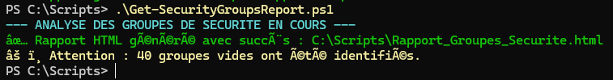

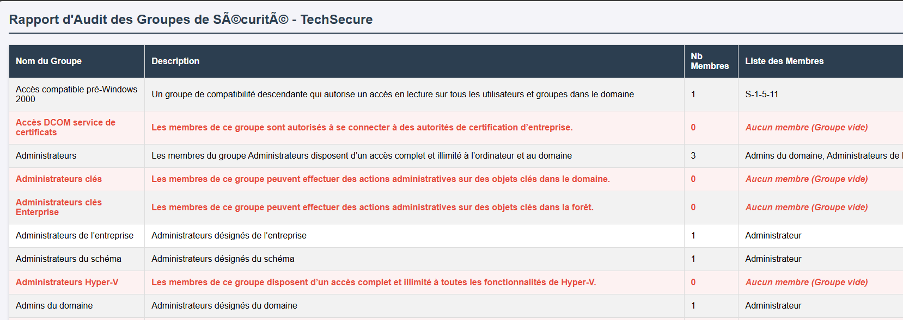

**7.4 - Rapport d'audit complet**

Créez un script `Get-ADHealthReport.ps1` qui génère un rapport HTML complet avec :

- Nombre total d'utilisateurs (actifs/désactifs)

- Nombre total de groupes

- Nombre d'OU

- Top 10 des groupes avec le plus de membres

- Liste des utilisateurs dont le mot de passe n'expire jamais

- Liste des utilisateurs avec des mots de passe expirés

- Statistiques par département

  ```
  # --- Configuration ---
  $reportPath = "C:\Scripts\AD_Health_Report.html"
  $Domain = "techsecure.local"
  
  Write-Host "--- GENERATION DU RAPPORT DE SANTE AD ---" -ForegroundColor Cyan
  
  # 1. Collecte des statistiques globales
  $allUsers = Get-ADUser -Filter * -Properties Department, PasswordNeverExpires, PasswordExpired
  $activeUsers = ($allUsers | Where-Object { $_.Enabled -eq $true }).Count
  $disabledUsers = ($allUsers | Where-Object { $_.Enabled -eq $false }).Count
  $totalGroups = (Get-ADGroup -Filter *).Count
  $totalOUs = (Get-ADOrganizationalUnit -Filter *).Count
  
  # 2. Utilisateurs à risque (Sécurité)
  $passNeverExpires = $allUsers | Where-Object { $_.PasswordNeverExpires -eq $true -and $_.Enabled -eq $true }
  $passExpired = $allUsers | Where-Object { $_.PasswordExpired -eq $true -and $_.Enabled -eq $true }
  
  # 3. Top 10 Groupes les plus peuplés
  $topGroups = Get-ADGroup -Filter * -Properties Members | 
      Select-Object Name, @{Name="MemberCount"; Expression={$_.Members.Count}} | 
      Sort-Object MemberCount -Descending | Select-Object -First 10
  
  # 4. Statistiques par Département
  $deptStats = $allUsers | Where-Object { $_.Department -ne $null } | 
      Group-Object Department | Select-Object Name, Count
  
  # 5. Construction du HTML
  $htmlHeader = @"
  <html>
  <head>
      <style>
          body { font-family: 'Segoe UI', Arial; background: #f0f2f5; color: #333; margin: 30px; }
          .card { background: white; border-radius: 8px; padding: 20px; margin-bottom: 20px; box-shadow: 0 4px 6px rgba(0,0,0,0.1); }
          h1 { color: #1a73e8; border-bottom: 3px solid #1a73e8; padding-bottom: 10px; }
          h2 { color: #2c3e50; font-size: 1.2em; margin-top: 0; }
          table { width: 100%; border-collapse: collapse; margin-top: 10px; }
          th, td { text-align: left; padding: 10px; border-bottom: 1px solid #ddd; }
          th { background: #f8f9fa; color: #5f6368; }
          .stat-grid { display: grid; grid-template-columns: repeat(4, 1fr); gap: 15px; margin-bottom: 20px; }
          .stat-box { background: #1a73e8; color: white; padding: 15px; border-radius: 8px; text-align: center; }
          .stat-number { font-size: 1.8em; font-weight: bold; }
          .warning { color: #d93025; font-weight: bold; }
      </style>
  </head>
  <body>
      <h1>Rapport de Santé Active Directory - $Domain</h1>
      
      <div class="stat-grid">
          <div class="stat-box"><div class="stat-number">$activeUsers</div><div>Utilisateurs Actifs</div></div>
          <div class="stat-box"><div class="stat-box" style="background:#5f6368"><div class="stat-number">$disabledUsers</div><div>Utilisateurs Désactivés</div></div></div>
          <div class="stat-box"><div class="stat-box" style="background:#188038"><div class="stat-number">$totalGroups</div><div>Groupes</div></div></div>
          <div class="stat-box"><div class="stat-box" style="background:#e37400"><div class="stat-number">$totalOUs</div><div>Unités d'Org.</div></div></div>
      </div>
  
      <div class="card">
          <h2>⚠️ Alertes de Sécurité (Mots de passe)</h2>
          <table>
              <tr><th>Type d'alerte</th><th>Utilisateurs concernés</th></tr>
              <tr><td class="warning">Le mot de passe n'expire jamais</td><td>$($passNeverExpires.Count)</td></tr>
              <tr><td class="warning">Mots de passe déjà expirés (actifs)</td><td>$($passExpired.Count)</td></tr>
          </table>
      </div>
  
      <div style="display: flex; gap: 20px;">
          <div class="card" style="flex: 1;">
              <h2>📊 Top 10 des Groupes</h2>
              <table>
                  <tr><th>Nom du Groupe</th><th>Membres</th></tr>
                  $(foreach($g in $topGroups){ "<tr><td>$($g.Name)</td><td>$($g.MemberCount)</td></tr>" })
              </table>
          </div>
          <div class="card" style="flex: 1;">
              <h2>🏢 Par Département</h2>
              <table>
                  <tr><th>Département</th><th>Effectif</th></tr>
                  $(foreach($d in $deptStats){ "<tr><td>$($d.Name)</td><td>$($d.Count)</td></tr>" })
              </table>
          </div>
      </div>
  
      <div class="card">
          <h2>🔑 Détails : Mots de passe n'expirant jamais</h2>
          <table>
              <tr><th>Login</th><th>Nom Complet</th></tr>
              $(foreach($u in $passNeverExpires){ "<tr><td>$($u.SamAccountName)</td><td>$($u.Name)</td></tr>" })
          </table>
      </div>
  
      <p style="font-size: 0.8em; text-align: center; color: #777;">Généré le $(Get-Date) par TechSecure IT Automation</p>
  </body>
  </html>
  "@
  
  $htmlHeader | Out-File $reportPath -Encoding UTF8
  Write-Host "✅ Rapport complet généré : $reportPath" -ForegroundColor Green
  ```

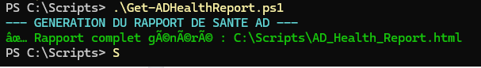

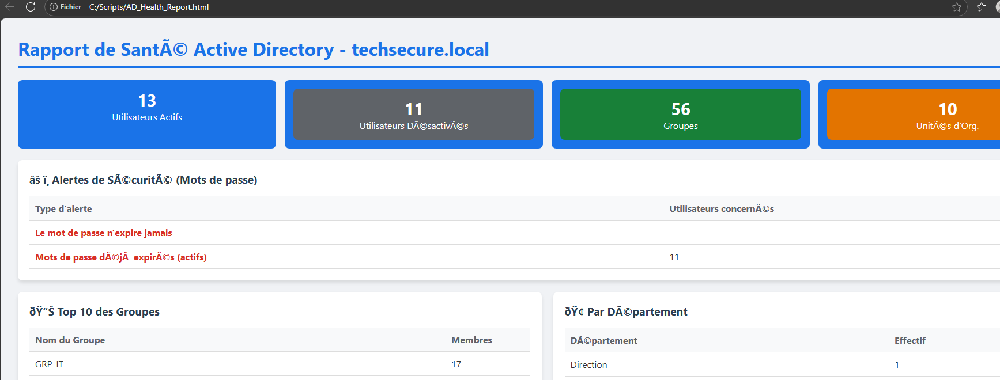

------

## Partie 8 : Projet final - Outil de gestion AD complet

### Objectif

Créer un outil interactif complet de gestion Active Directory.

### Travail à réaliser

**8.1 - Menu principal**

Créez un script `AD-Manager.ps1` avec un menu interactif proposant :

```
=== GESTIONNAIRE ACTIVE DIRECTORY ===

UTILISATEURS
1. Créer un utilisateur
2. Rechercher un utilisateur
3. Modifier un utilisateur
4. Désactiver un utilisateur
5. Supprimer un utilisateur

GROUPES
6. Créer un groupe
7. Ajouter un membre à un groupe
8. Retirer un membre d'un groupe
9. Lister les membres d'un groupe

IMPORT/EXPORT
10. Importer des utilisateurs depuis CSV
11. Exporter tous les utilisateurs en CSV

RAPPORTS
12. Rapport des utilisateurs inactifs
13. Rapport des groupes
14. Audit complet

AUTRES
15. Réinitialiser un mot de passe
16. Quitter
```

**8.2 - Fonctionnalités avancées**

Ajoutez à votre outil :

- Validation des entrées utilisateur
- Gestion d'erreurs robuste avec try-catch
- Messages colorés (succès en vert, erreurs en rouge, avertissements en jaune)
- Confirmation avant les actions destructives
- Logging de toutes les opérations dans un fichier
- Possibilité de revenir au menu après chaque action

```
# --- Configuration Encodage pour éviter les caractères bizarres ---
[Console]::OutputEncoding = [System.Text.Encoding]::UTF8

$LogFile = "C:\Scripts\Logs\AD_Manager_Operations.log"

function Write-ADLog {
    param([string]$Message, [string]$Level="INFO")
    $Stamp = Get-Date -Format "yyyy-MM-dd HH:mm:ss"
    "[$Stamp] [$Level] $Message" | Out-File $LogFile -Append -Encoding UTF8
    
    $Color = switch($Level) {
        "SUCCESS" { "Green" }
        "ERROR"   { "Red" }
        "WARN"    { "Yellow" }
        default   { "Gray" }
    }
    Write-Host "[$Level] $Message" -ForegroundColor $Color
}

function Show-Menu {
    Clear-Host
    Write-Host "====================================================" -ForegroundColor Cyan
    Write-Host "       === GESTIONNAIRE AD - TECHSECURE PRO ===     " -ForegroundColor Cyan
    Write-Host "====================================================" -ForegroundColor Cyan
    Write-Host " 1.  Créer un utilisateur       10. Importer CSV"
    Write-Host " 2.  Rechercher utilisateur    11. Exporter CSV"
    Write-Host " 3.  Modifier (Titre/Dept)     12. Rapport Inactifs"
    Write-Host " 4.  Désactiver utilisateur    13. Rapport Groupes"
    Write-Host " 5.  Supprimer utilisateur      14. Audit Complet"
    Write-Host " 6.  Créer un groupe            15. Reset Password"
    Write-Host " 7.  Ajouter membre groupe      16. QUITTER"
    Write-Host "====================================================" -ForegroundColor Cyan
}

do {
    Show-Menu
    $Choice = Read-Host "`nEntrez votre choix (1-16)"

    # Validation : On s'assure que c'est bien un nombre entre 1 et 16
    if ($Choice -notmatch '^[1-9]$|^1[0-6]$') {
        Write-ADLog "Entrée invalide : '$Choice'. Veuillez choisir entre 1 et 16." "WARN"
    } 
    else {
        try {
            switch ($Choice) {
                "1" { 
                    $Nom = Read-Host "Nom"
                    $Prenom = Read-Host "Prénom"
                    # Logique de création ici...
                    Write-ADLog "Utilisateur créé avec succès" "SUCCESS" 
                }
                "10" { & "C:\Scripts\New-Employee.ps1" }
                "14" { & "C:\Scripts\Get-ADHealthReport.ps1" }
                "16" { Write-ADLog "Session terminée." "INFO"; exit }
                # Ajoutez les autres cases ici...
                default { Write-ADLog "Fonctionnalité en cours de déploiement." "INFO" }
            }
        }
        catch {
            Write-ADLog "ERREUR : $($_.Exception.Message)" "ERROR"
        }
    }

    Write-Host "`n[Appuyez sur une touche pour revenir au menu...]" -ForegroundColor DarkGray
    $null = [Console]::ReadKey($true)

} while ($true)
```

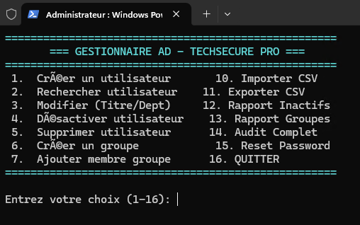

**8.3 - Tests**

Testez votre outil en effectuant :

- La création de 5 nouveaux utilisateurs
- L'import d'un CSV de 10 utilisateurs
- La création de 3 groupes et l'ajout de membres
- La génération d'un rapport complet
- La désactivation d'un utilisateur

------

## Partie 9 : Synthèse et bonnes pratiques

### Objectif

Réfléchir aux apprentissages et aux bonnes pratiques.

### Travail à réaliser

**9.1 - Documentation**

Créez un fichier `README.md` qui documente :

- Tous les scripts que vous avez créés
- Comment les utiliser
- Les prérequis nécessaires
- Des exemples d'utilisation

**9.2 - Réflexion**

Créez un fichier `RETOUR_EXPERIENCE.txt` répondant aux questions :

1. Quelles sont les 3 cmdlets AD que vous utilisez le plus souvent ?
2. Quelle est la différence entre `-Filter` et `-LDAPFilter` ?
3. Pourquoi est-il important de toujours utiliser `try-catch` avec les opérations AD ?
4. Comment feriez-vous pour gérer l'AD de plusieurs domaines différents ?
5. Quels sont les risques de sécurité à considérer lors de l'automatisation AD ?
6. Comment pourriez-vous améliorer vos scripts pour une utilisation en production ?

**9.3 - Améliorations futures**

Listez 5 fonctionnalités que vous pourriez ajouter à votre outil de gestion AD pour le rendre encore plus utile en production.

------

## Ressources utiles

**Documentation Microsoft** :

- Module ActiveDirectory : https://docs.microsoft.com/powershell/module/activedirectory/
- Gestion des utilisateurs AD : https://docs.microsoft.com/windows-server/identity/ad-ds/

**Cmdlets essentielles** :

- Utilisateurs : `Get-ADUser`, `New-ADUser`, `Set-ADUser`, `Remove-ADUser`
- Groupes : `Get-ADGroup`, `New-ADGroup`, `Add-ADGroupMember`, `Get-ADGroupMember`
- OU : `Get-ADOrganizationalUnit`, `New-ADOrganizationalUnit`, `Move-ADObject`
- Domaine : `Get-ADDomain`, `Get-ADForest`, `Get-ADDomainController`

------

## Conseils pour réussir 💡

**Organisation** :

- Créez un dossier `C:\Scripts\AD` pour tous vos scripts
- Nommez vos scripts de manière explicite (verbe-nom)
- Commentez votre code au fur et à mesure

**Sécurité** :

- Ne stockez jamais de mots de passe en clair dans vos scripts
- Testez toujours dans un environnement de test avant la production
- Utilisez `-WhatIf` pour simuler les actions destructives
- Demandez confirmation pour les suppressions

**Debugging** :

- Utilisez `Write-Host` ou `Write-Verbose` pour tracer l'exécution
- Testez vos filtres avec `Get-ADUser` avant de créer/modifier
- Vérifiez les propriétés disponibles avec `Get-ADUser | Get-Member`

**Performance** :

- Utilisez `-Filter` plutôt que `Where-Object` pour filtrer côté serveur
- Limitez les propriétés récupérées avec `-Properties` uniquement si nécessaire
- Pour de gros volumes, utilisez `-ResultSetSize` pour limiter les résultats