# Atelier Samba

#### Étape 1 : VM Debian

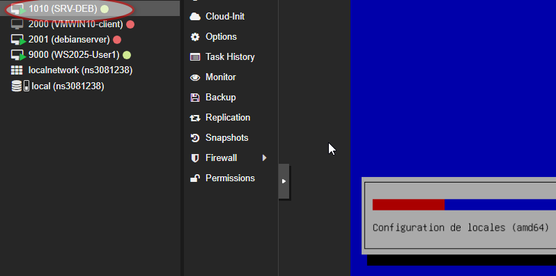

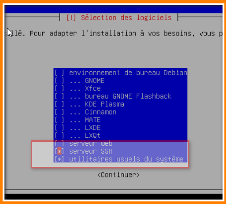

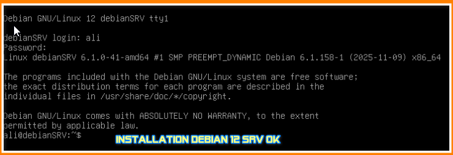

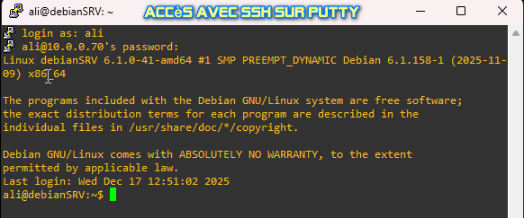

### Configuration réseau

```
alow-hotplug ens18
iface ens18 inet static
  address 10.0.0.10
  netmask 255.255.0.0
  network 10.0.0.0
  broadcast 10.0.255.255
  gateway 10.0.0.1
  dns-nameservers 8.8.8.8
  dns-search OCLOCK.LAN
```

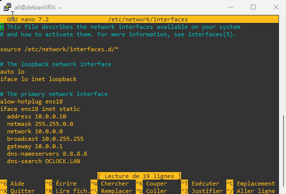

```
# commentez la ligne suivante : dans /etc/hosts
#127.0.1.1	debianSRV.OCLOCK.LAN debianSRV
10.0.0.10	debianSRV.OCLOCK.LAN
```

et dans : /etc/hostname

```
# remplacez debianSRV par :
debianSRV.OCLOCK.LAN
```

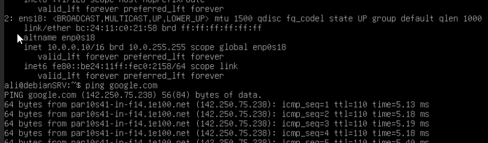

## Étape 2 : Samba

### Installation :

```
sudo apt install build-essential libacl1-dev libattr1-dev libblkid-dev libgnutls28-dev libreadline-dev gdb pkg-config libpopt-dev libldap2-dev dnsutils libbsd-dev attr acl krb5-user docbook-xsl libcups2-dev libpam0g-dev ntpdate ntp
```

```
sudo apt install python3-dev liblmdb-dev flex bison libgpgme11-dev libparse-yapp-perl libjansson-dev libarchive-dev libdbus-1-dev python3-pyasn1 python3-markdown python3-dnspython libjson-perl python3-iso8601
```

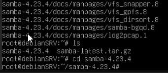


```
wget http://ftp.samba.org/pub/samba/samba-latest.tar.gz
tar zxvf samba-latest.tar.gz
cd samba-4.23.4
./configure --enable-debug --enable-selftest
```


```
make
sudo make install
```

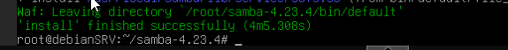

### Contrôleur de domaine

```
sudo /usr/local/samba/bin/samba-tool domain provision
```

### Premier démarrage et test

```
sudo /usr/local/samba/sbin/samba
```

```
sudo /usr/local/samba/sbin/samba -V
sudo /usr/local/samba/bin/smbclient -V
```

Résultat attendu, même version :

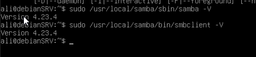

Vérifiez aussi que les partages de base `netlogon` et `sysvol` sont bien présents :

```
sudo /usr/local/samba/bin/smbclient -L localhost -U%
```

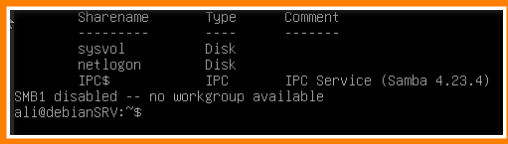

**test de connexion :**

```
/usr/local/samba/bin/smbclient //localhost/netlogon -UAdministrator
```

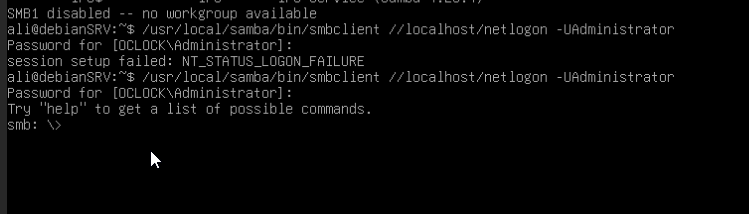

## Étape 3 : configuration dns

```
sudo nano /etc/resolv.conf
```

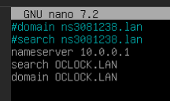

Vérifiez que le DNS Forwarder est actif en consultant le contenu du fichier `smb.conf` :

```
sudo nano /usr/local/samba/etc/smb.conf
```

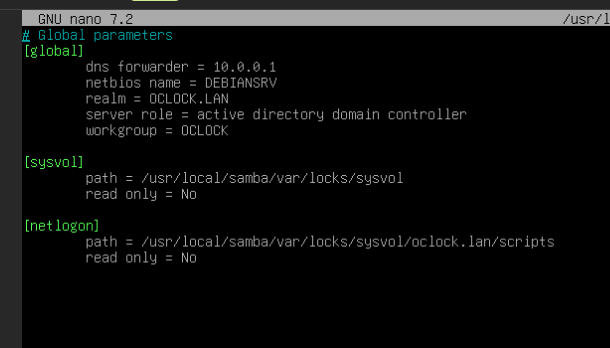

Modifiez le fichier `krb5.conf` :

```
sudo nano /usr/local/samba/share/setup/krb5.conf
```

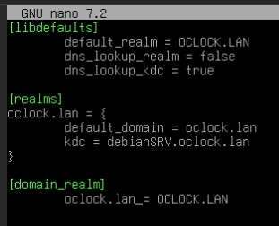

On fait un lien symbolique depuis cette config vers `/etc` :

```
sudo ln -sf /usr/local/samba/share/setup/krb5.conf /etc/krb5.conf
```

On reboot la vm et on relance le processus samba :

```
sudo /usr/local/samba/sbin/samba
```

Tester la connexion : 

```
kinit administrator@OCLOCK.LAN
```

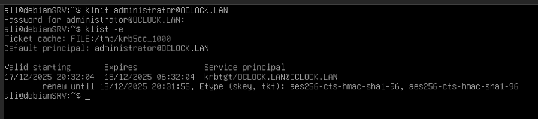

## Étape 4 : clients Windows

Une nouvelle vm win 10 est créée, elle a rejoint le domaine avec le nouveau utilisateur administrator

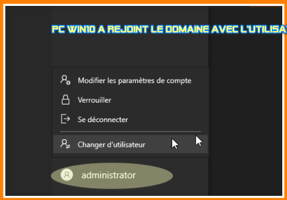

Ajout de RSAT dans win 10 fonctionnalités facultatives

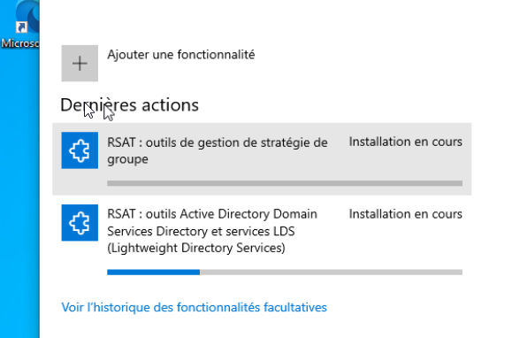

###### PARTAGE SIMBA

```
sudo nano /usr/local/samba/etc/smb.conf
```

```
[public]
	path = /home/shares/public
	guest ok = no
	guest only = yes
	writeable = yes
	force create mode = 0666
	force directory mode = 0777
	browseable = yes
```

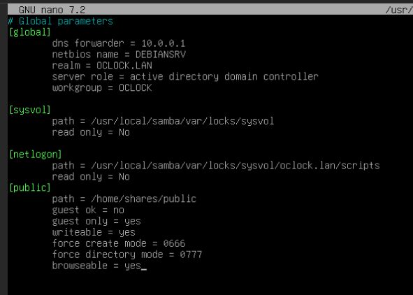

On arrête et on demarre samba : kill -9 4209
sudo /usr/local/samba/sbin/samba

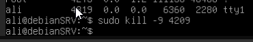

Création du dossier de partage :

```
sudo mkdir -p /home/shares/public
sudo chmod 777 /home/shares/public
```

Test accès au dossier public sur la win 10 :

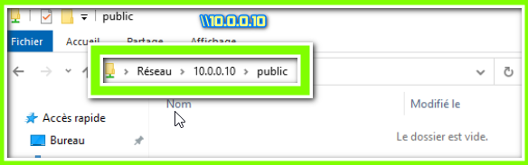

Création d'une nouvelle OU, mettre l'utilisateur dedans et installer une GPO lecteur mappé

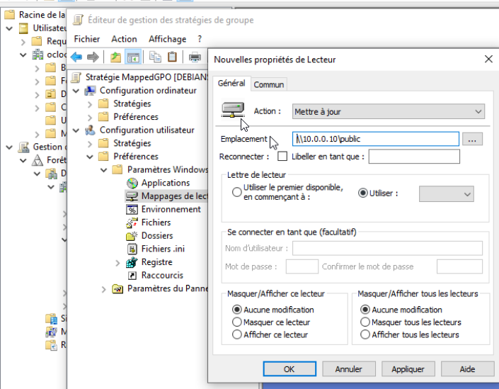

Après reconnexion avec le nouvel utilisateur, le partage est affiché.

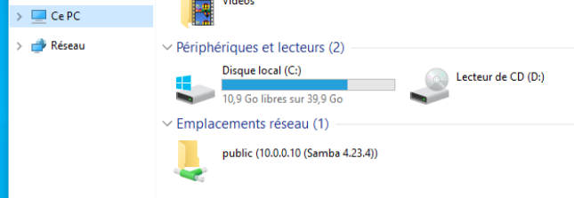