#### S05-E05-Atelier-LAMP

###### Étape 1 : VM Debian : Création de la VM sur Virtual Box

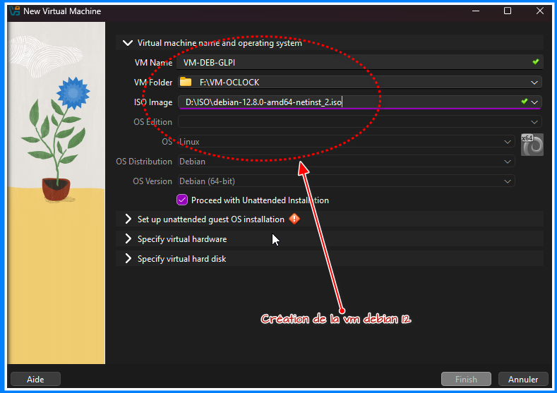

Démarrage de la VM et installation de Debian :

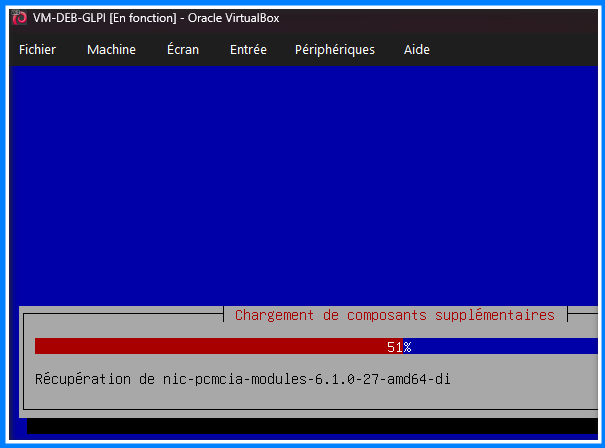

Désactivation de l'environnement de bureau Debian` et `GNOME. Serveur SSH activé pour s'y connecter avec le protocole SSH.

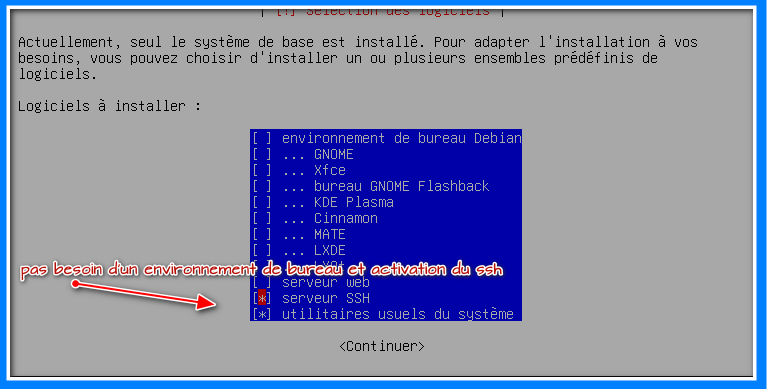

Fin de l'installation de debian 12 vm:

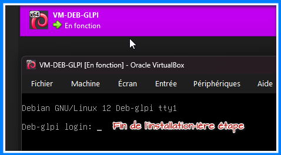

###### Étape 2 : sudo>>>

```
su -
apt update
apt install sudo
usermod -aG sudo wall
```

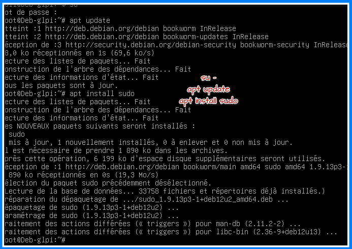

Après la déconnexion, utilise la commande >>> sudo nano /etc/network/interfaces

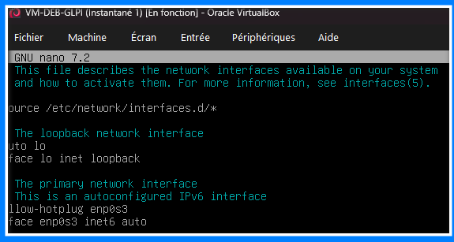

###### Étape 3 : Guest Additions

Installons les `Guest Additions` de Virtual Box

```
sudo apt update
sudo apt install build-essential dkms linux-headers-$(uname -r)
```

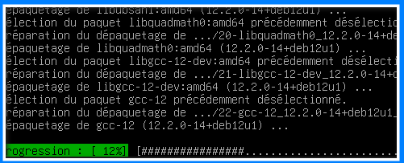

Ensuite après l'installation du paquet, je lance les commandes :

```
sudo mount /dev/cdrom /mnt >>> monter le cdrom pour le rendre accessible dans le système
cd /mnt >>> le dossier où le contenu du CD/DVD sera accessible
sudo ./VBoxLinuxAdditions.run >>> Exécution du script d'install VbLadditions
```

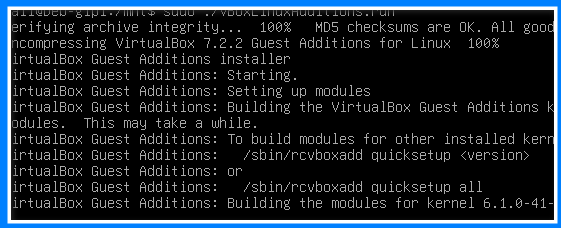

Vérification du module du noyau s'il est chargé avec la commande :

```
lsmod | grep vbox
```

> > > 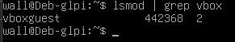

###### Étape 4 : Apache

```
sudo apt install apache2
```

```
sudo systemctl restart networking >>>Pour que notre Debian récupère une nouvelle adresse IP grâce au serveur DHCP de votre box
```

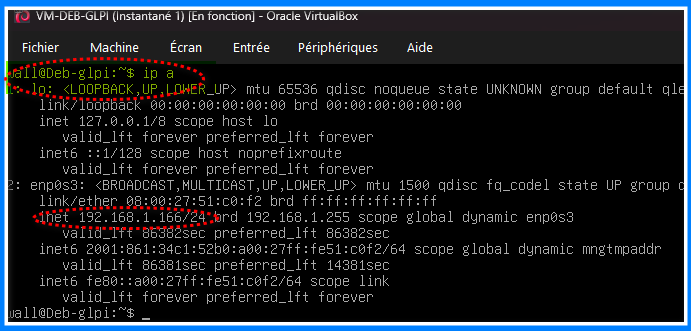

Le serveur Apache installé :

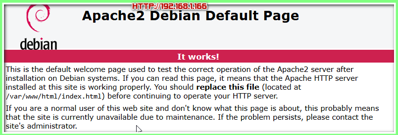

Et activé : sudo systemctl status apache2

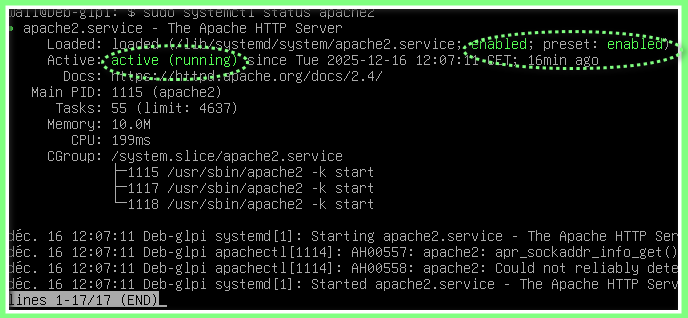

###### Étape 5 : MariaDB ( **serveur de bases de données**)

- Installation de mariaDB >> sudo apt install mariadb-server

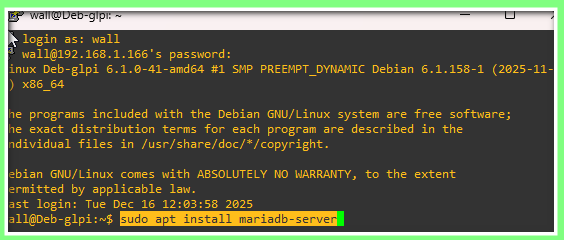

configuration initiale de MariaDB avec la commande : >>> sudo mysql_secure_installation

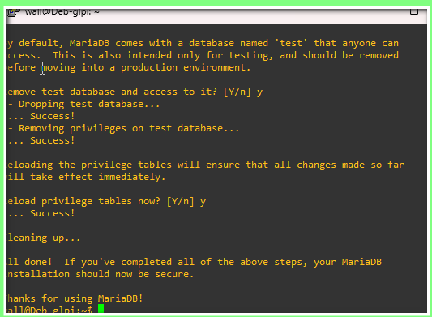

On se connecte ensuite au serveur de base de données pour accéder au shell Mysql : 

```
mysql -u root -p
```

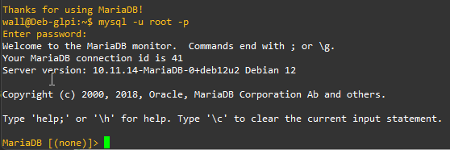

```
CREATE USER 'dbuser'@'localhost' IDENTIFIED BY 'rocknroll';
GRANT ALL PRIVILEGES ON *.* TO 'dbuser'@'localhost' WITH GRANT OPTION;
FLUSH PRIVILEGES;
exit
```

Vérifier si le service est actif et fonctionnel : systemctl status mariadb

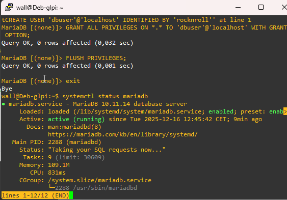

###### Étape 6 : PHP

```
sudo apt install php libapache2-mod-php
```

L'installation de GLPI comme application web nécessite le langage PHP pour fonctionner. On va également installer plusieurs modules de PHP, souvent utiles (certains sont indispensables, comme le module `php-mysql`)

```
sudo apt install php-{curl,gd,intl,memcache,xml,zip,mbstring,json,mysql,bz2,ldap}
```

Une fois l'installation terminée, on redémarre le service apache2 >>> sudo systemctl restart apache2

Le dossier par défaut de PHP est présent avec les fichiers index.html et info.php

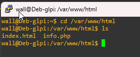

Depuis le navigateur, je rentre l'adresse du serveur (http://192.168.1.166/info.php) :


###### Étape 7 : Connexion SSH

Déjà fait avec putty :

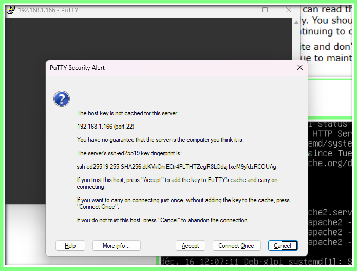

###### Étape 8 : GLPI

Je télécharge GLPI avec l'utilitaire `wget` : cd ~ pour me déplacer dans mon dossier homme et wget pour installer depuis internet.

```
cd ~
wget https://github.com/glpi-project/glpi/releases/download/11.0.4/glpi-11.0.4.tgz
```

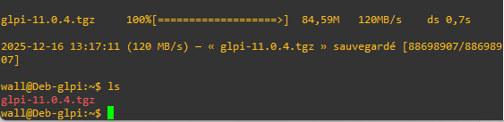

Le fichier est bien téléchargé, il faut le décompresser et le placer dans le répertoire /var/www/html avec la commande :

```
sudo tar -xvf glpi-11.0.4.tgz -C /var/www/html
```

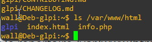

```
sudo chown -R wall:www-data /var/www/html
sudo chmod 770 -R /var/www/html
```

Depuis le navigateur web AVEC l'adresse : 192.168.1.166/glpi

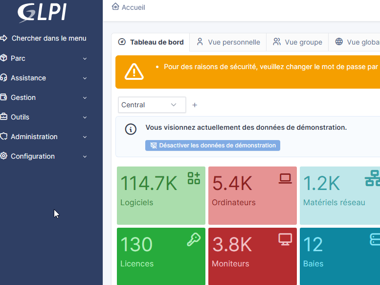

###### Bonus : PHPMyAdmin & Adminer

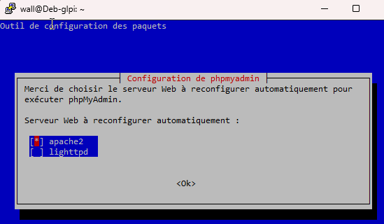

http://192.168.1.166/phpmyadmin

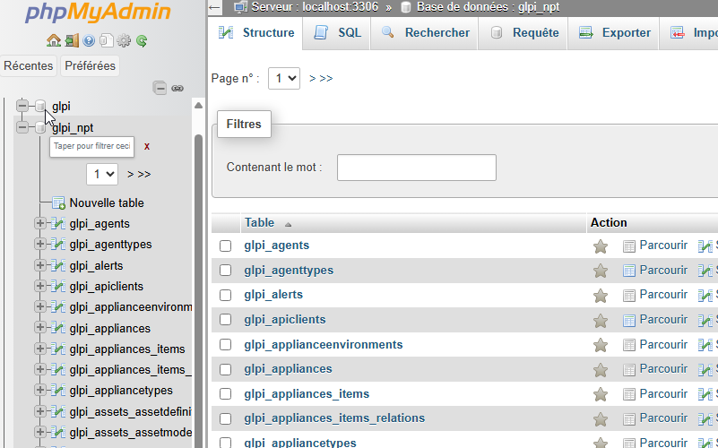

## Super-bonus : sécurité

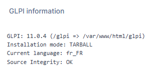

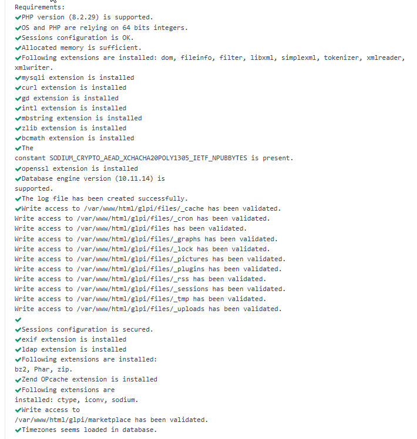

## Hyper-bonus : configuration de GLPI

A suivre...